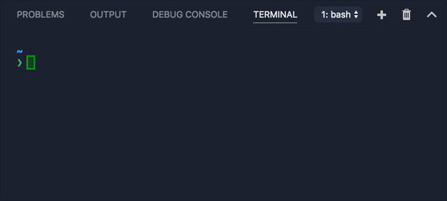
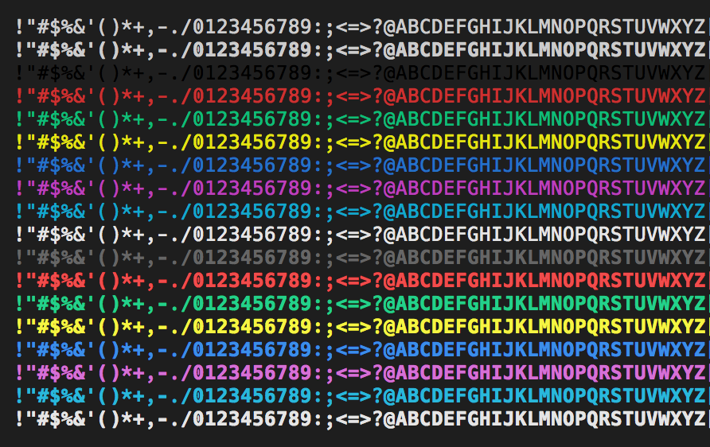
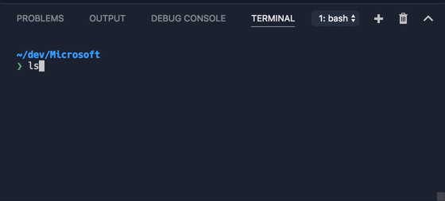

# Integrated Terminal Performance Improvements

September 28, 2017 Daniel Imms, [@Tyriar](https://twitter.com/Tyriar)

The rendering engine of the integrated terminal has been completely re-written with performance in mind in the upcoming version 1.17 of VS Code, moving away from a completely DOM-based rendering system to using canvas.

## DOM Rendering

Somewhat surprisingly, rendering an interactive terminal was totally doable in a system designed for displaying static documents. It was certainly not without its problems though. We found that in order to fix many issues, certain parts of the DOM needed to be overridden:

**Selection**: There was a lot of fighting against the DOM's selection system to cover the terminal use case. Since we always only rendered what was visible to the DOM this meant that you could not select multiple pages of content without reimplementing selection (added in [v1.14](https://code.visualstudio.com/updates/v1_14#_selection-reimplemented))

**Misaligned characters**: Due to many monospace fonts not being strictly monospace for many unicode characters, this could lead to situations like the right-side of this image:

A workaround for this would be to wrap all unicode characters in fixed width spans, however this increases rendering time.

**Excessive garbage collection**: Due to the number of elements needed to render the terminal, this lead to creating an object pool system which recycled DOM elements to try work around this problem, increasing the complexity of the terminal.

**Performance**: No matter how hard we try to work around all these issues, performance will always have a hard cap imposed by the layout engine which does a lot of stuff that is not necessary in the terminal.

## Sidestepping the Layout Engine

Composing elements and doing a layout could in some cases take longer than a frame (16.6ms) all by itself, this is unacceptable if we want to maintain a smooth 60 frames per second (FPS) in the terminal. The solution was to completely replace the rendering engine with a canvas solution.

For the uninitiated, the [`<canvas>` HTML element](https://developer.mozilla.org/en-US/docs/Web/HTML/Element/canvas) allows drawing graphics and text using a JavaScript API.

## Render Layers

A number of canvas elements known as "render layers" are used in order to simplify the rendering of different parts of the terminal. The current layers in order are:

1. Text: Background colors and foreground text, this layer is opaque
2. Selection: Selection using the mouse
3. Link: The underline when hovering over links
4. Cursor: The terminal's cursor

Separating these parts out into their own little components has vastly simplified how drawing is done.

## Only Draw What Changed

An important part of the new renderer is that it only draws what has *changed*. To do this, an internal model is kept which contains the minimal amount of information about a cell's drawn state, so it's fast to check when a cell needs to change. In the case of the "Text" layer, this model includes a reference to the character, text styles, foreground color and background color.

Compare this to before where the entire line was being removed from the DOM, reconstructed and re-added, even if nothing changed.

*The green rectangles in the image above indicate the regions that were drawn to.*

## The Texture Atlas

A texture atlas is used to boost rendering time even further. Behind the scenes, there is an [`ImageBitmap`](https://developer.mozilla.org/en-US/docs/Web/API/ImageBitmap) which contains all ascii characters laid out on a grid with the default background color, typically the most common styles of text drawn to terminals.

When drawing these styles of text, the texture atlas is used instead of a regular call to [`CanvasRenderingContext2D.fillText`](https://developer.mozilla.org/en-US/docs/Web/API/CanvasRenderingContext2D/fillText). This speeds things up considerably because the `ImageBitmap` is co-located on the GPU.

## Forced Frame Skipping

Due to the speed of rendering in the DOM, there was additional frame skipping added to ensure there was enough CPU time to continue parsing the data. This meant when the terminal streamed a lot of data, the framerate would typically not go beyond 10 FPS.

With the new renderer this restriction has been removed and you can now enjoy up to 60 FPS in the terminal.

## The Results

Our benchmarks have measured that the terminal now renders approximately **5 to 45 times faster than before**, depending on the situation. Even if you don't notice the increased responsiveness and frame rate, faster rendering also means less battery usage! We hope you enjoy the performance improvements, they are coming to v1.17 of VS Code in a few days and are available to test in the [Insiders build](https://code.visualstudio.com/insiders) right now.

You can also check out the [original pull request](https://github.com/sourcelair/xterm.js/pull/938) that added the feature on the [xterm.js GitHub repository](https://github.com/sourcelair/xterm.js/pull/938).

Happy Coding!

Daniel Imms, VS Code Team member [@Tyriar](https://twitter.com/Tyriar)
