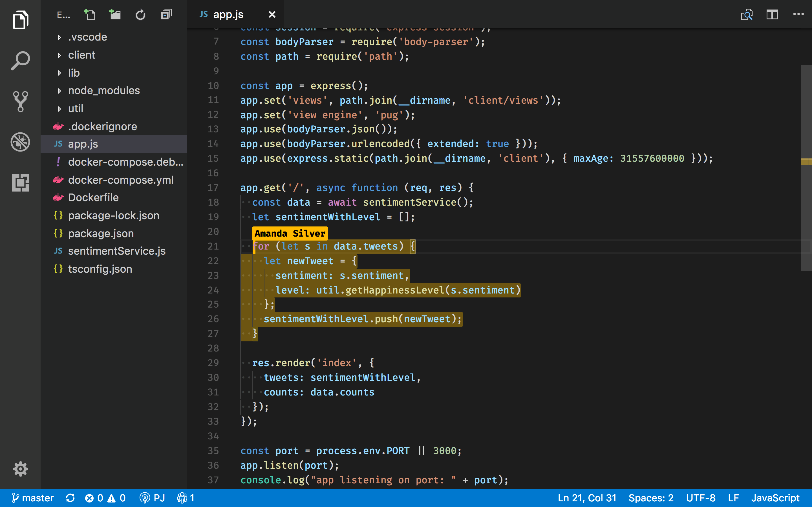
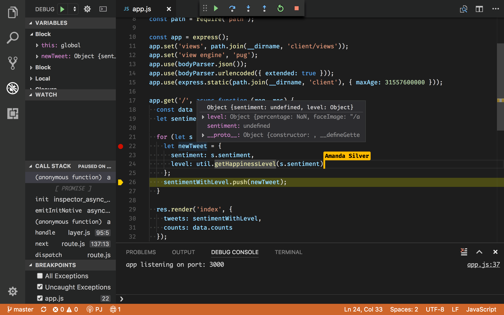

# Introducing Visual Studio Live Share

November 15, 2017 Amanda Silver, [@amandaksilver](https://twitter.com/amandaksilver)

We are excited to announce that we’re working on “Visual Studio Live Share”, which enables developers using Visual Studio 2017 or Visual Studio Code to collaborate in real-time! Learn more about Live Share and the upcoming limited private preview [here](/visual-studio-live-share).

## What is Live Share?
Live Share enables your team to quickly collaborate on the same codebase without the need to synchronize code or to configure the same development tools, settings, or environment.

When it comes to Live Share, seeing is believing.  Watch the following video to get an idea of what we are working on:

<iframe src="https://aka.ms/vsls-video" allowFullScreen frameBorder="0"></iframe>

When you share a collaborative session, your teammate sees the context of the workspace in their editor. This means your teammate can read the code you shared without having to clone a repo or install any dependencies your code relies on. They can use rich language features to navigate within the code; not only just opening other files as text but using semantic analysis-based navigation like Go to Definition or Peek.

When your teammate edits a file, they get editor enhancements like IntelliSense, statement completion, and suggestions.  Each of you can open files, navigate, edit code, highlight, or refactor - and changes are instantly reflected. As you edit you can see your teammate’s cursor, jump to the location of your teammate’s carat, or follow their actions.

Collaborative debugging goes further, allowing you and your teammate to independently inspect objects using debugging features like hovers, locals and watches, the stack trace or the debug console. You are both able to set breakpoints and advance the debug cursor to step through the session.

## Why Live Share?
While Microsoft Teams and Slack bring dynamic team collaboration into a digital form, there is more we can do to make it easier to work together in a development team.  Screen-sharing or accessing a machine remotely means that only one person is in control while the other observes. Instant messaging, email, or other tools are great for basic messages but collaborating on a body of code often requires more than a code snippet or a single file to share the necessary context. Additionally, the validity of edits can be impacted by multiple files in the workspace. If you want to replicate your teammate’s environment, it just takes a lot of time to get everything set up.

Live Share allows you to share the context of the code, so you get instant, bidirectional collaboration. Each of you can use a tool that you’ve personalized so you’re the most productive dev you can be. You can independently investigate an issue without stepping on each other, no need to hand-off control or deal with latency. Collaborate with shared focus only when you want to.

## Find out more
We are excited to give you an early glimpse into Live Share today. Although we are only sharing it as a demo today, we will be releasing a limited private preview soon. If you want to learn more and keep up with the project,  you can sign up by clicking [here](https://aka.ms/vsls-signup).

Happy Coding!

Amanda

[@amandaksilver](https://twitter.com/amandaksilver) <a href="https://twitter.com/search?f=tweets&q=%23VSLiveShare&src=typd">#VSLiveShare</a>
