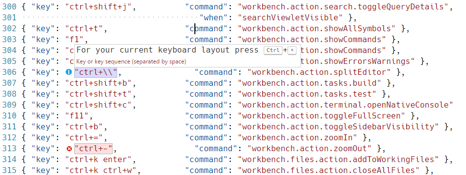
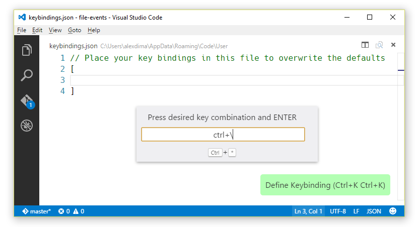
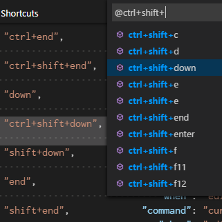

# Key Bindings for Visual Studio Code

Visual Studio Code lets you perform most tasks directly from the keyboard.  This page lists out the default bindings and describes how you can update them.

>**Note:** If you visit this page on a Mac, you will see the key bindings for the Mac.  If you visit using Windows or Linux, you will see the keys for that OS.

>**Note:** The following keys are rendered assuming a standard US keyboard layout. If you use a different keyboard layout, please [read below](/docs/customization/keybindings.md#keyboard-layouts).

## Basic Editing

Key|Command|Command id
---|-------|----------
`kb(editor.action.clipboardCutAction)`|Cut line (empty selection)|`editor.action.clipboardCutAction`
`kb(editor.action.clipboardCopyAction)`|Copy line (empty selection)|`editor.action.clipboardCopyAction`
`kb(editor.action.deleteLines)`|Delete Line|`editor.action.deleteLines`
`kb(editor.action.insertLineAfter)`|Insert Line Below|`editor.action.insertLineAfter`
`kb(editor.action.insertLineBefore)`|Insert Line Above|`editor.action.insertLineBefore`
`kb(editor.action.moveLinesDownAction)`|Move Line Down|`editor.action.moveLinesDownAction`
`kb(editor.action.moveLinesUpAction)`|Move Line Up|`editor.action.moveLinesUpAction`
`kb(editor.action.copyLinesDownAction)`|Copy Line Down|`editor.action.copyLinesDownAction`
`kb(editor.action.copyLinesUpAction)`|Copy Line Up|`editor.action.copyLinesUpAction`
`kb(editor.action.addSelectionToNextFindMatch)`|Add Selection To Next Find Match|`editor.action.addSelectionToNextFindMatch`
`kb(editor.action.moveSelectionToNextFindMatch)`|Move Last Selection To Next Find Match|`editor.action.moveSelectionToNextFindMatch`
`kb(cursorUndo)`|Undo last cursor operation|`cursorUndo`
`kb(editor.action.selectHighlights)`|Select all occurrences of current selection|`editor.action.selectHighlights`
`kb(editor.action.changeAll)`|Select all occurrences of current word|`editor.action.changeAll`
`kb(expandLineSelection)`|Select current line|`expandLineSelection`
`kb(editor.action.insertCursorBelow)`|Insert Cursor Below|`editor.action.insertCursorBelow`
`kb(editor.action.insertCursorAbove)`|Insert Cursor Above|`editor.action.insertCursorAbove`
`kb(editor.action.jumpToBracket)`|Jump to matching bracket|`editor.action.jumpToBracket`
`kb(editor.action.indentLines)`|Indent Line|`editor.action.indentLines`
`kb(editor.action.outdentLines)`|Outdent Line|`editor.action.outdentLines`
`kb(cursorHome)`|Go to Beginning of Line|`cursorHome`
`kb(cursorEnd)`|Go to End of Line|`cursorEnd`
`kb(cursorBottom)`|Go to End of File|`cursorBottom`
`kb(cursorTop)`|Go to Beginning of File|`cursorTop`
`kb(scrollLineDown)`|Scroll Line Down|`scrollLineDown`
`kb(scrollLineUp)`|Scroll Line Up|`scrollLineUp`
`kb(scrollPageDown)`|Scroll Page Down|`scrollPageDown`
`kb(scrollPageUp)`|Scroll Page Up|`scrollPageUp`
`kb(editor.fold)`|Fold (collapse) region|`editor.fold`
`kb(editor.unfold)`|Unfold (uncollapse) region|`editor.unfold`
`kb(editor.foldAll)`|Fold (collapse) all regions|`editor.foldAll`
`kb(editor.unfoldAll)`|Unfold (uncollapse) all regions|`editor.unfoldAll`
`kb(editor.action.addCommentLine)`|Add Line Comment|`editor.action.addCommentLine`
`kb(editor.action.removeCommentLine)`|Remove Line Comment|`editor.action.removeCommentLine`
`kb(editor.action.commentLine)`|Toggle Line Comment|`editor.action.commentLine`
`kb(editor.action.blockComment)`|Toggle Block Comment|`editor.action.blockComment`
`kb(actions.find)`|Find|`actions.find`
`kb(editor.action.startFindReplaceAction)`|Replace|`editor.action.startFindReplaceAction`
`kb(editor.action.nextMatchFindAction)`|Find Next|`editor.action.nextMatchFindAction`
`kb(editor.action.previousMatchFindAction)`|Find Previous|`editor.action.previousMatchFindAction`
`kb(toggleFindCaseSensitive)`|Toggle Find Case Sensitive|`toggleFindCaseSensitive`
`kb(toggleFindRegex)`|Toggle Find Regex|`toggleFindRegex`
`kb(toggleFindWholeWord)`|Toggle Find Whole Word|`toggleFindWholeWord`
`kb(editor.action.toggleTabFocusMode)`|Toggle Use of Tab Key for Setting Focus|`editor.action.toggleTabFocusMode`

## Rich Languages Editing

Key|Command|Command id
---|-------|----------
`kb(editor.action.triggerSuggest)`|Trigger Suggest|`editor.action.triggerSuggest`
`kb(editor.action.triggerParameterHints)`|Trigger Parameter Hints|`editor.action.triggerParameterHints`
`kb(editor.action.format)`|Format Code|`editor.action.format`
`kb(editor.action.goToDeclaration)`|Go to Definition|`editor.action.goToDeclaration`
`kb(editor.action.previewDeclaration)`|Peek Definition|`editor.action.previewDeclaration`
`kb(editor.action.openDeclarationToTheSide)`|Open Definition to the Side|`editor.action.openDeclarationToTheSide`
`kb(editor.action.quickFix)`|Quick Fix|`editor.action.quickFix`
`kb(editor.action.referenceSearch.trigger)`|Show References|`editor.action.referenceSearch.trigger`
`kb(editor.action.rename)`|Rename Symbol|`editor.action.rename`
`kb(editor.action.inPlaceReplace.down)`|Replace with Next Value|`editor.action.inPlaceReplace.down`
`kb(editor.action.inPlaceReplace.up)`|Replace with Previous Value|`editor.action.inPlaceReplace.up`
`kb(editor.action.smartSelect.grow)`|Expand AST Select|`editor.action.smartSelect.grow`
`kb(editor.action.smartSelect.shrink)`|Shrink AST Select|`editor.action.smartSelect.shrink`
`kb(editor.action.trimTrailingWhitespace)`|Trim Trailing Whitespace|`editor.action.trimTrailingWhitespace`
`kb(workbench.action.editor.changeLanguageMode)`|Change Language Mode|`workbench.action.editor.changeLanguageMode`

## Navigation

Key|Command|Command id
---|-------|----------
`kb(workbench.action.showAllSymbols)`|Show All Symbols|`workbench.action.showAllSymbols`
`kb(workbench.action.gotoLine)`|Go to Line...|`workbench.action.gotoLine`
`kb(workbench.action.quickOpen)`|Go to File...|`workbench.action.quickOpen`
`kb(workbench.action.gotoSymbol)`|Go to Symbol...|`workbench.action.gotoSymbol`
`kb(workbench.action.showErrorsWarnings)`|Show Errors and Warnings|`workbench.action.showErrorsWarnings`
`kb(editor.action.marker.next)`|Go to Next Error or Warning|`editor.action.marker.next`
`kb(editor.action.marker.prev)`|Go to Previous Error or Warning|`editor.action.marker.prev`
`kb(workbench.action.showCommands)`|Show All Commands|`workbench.action.showCommands`
`kb(workbench.action.openPreviousEditor)`|Navigate History|`workbench.action.openPreviousEditor`
`kb(workbench.action.navigateBack)`|Go Back|`workbench.action.navigateBack`
`kb(workbench.action.navigateForward)`|Go Forward|`workbench.action.navigateForward`

## Editor/Window Management

Key|Command|Command id
---|-------|----------
`kb(workbench.action.newWindow)`|New Window|`workbench.action.newWindow`
`kb(workbench.action.closeWindow)`|Close Window|`workbench.action.closeWindow`
`kb(workbench.action.closeActiveEditor)`|Close Editor|`workbench.action.closeActiveEditor`
`kb(workbench.action.closeFolder)`|Close Folder|`workbench.action.closeFolder`
`kb(workbench.action.cycleEditor)`|Cycle Between Opened Editors|`workbench.action.cycleEditor`
`kb(workbench.action.splitEditor)`|Split Editor|`workbench.action.splitEditor`
`kb(workbench.action.focusFirstEditor)`|Focus into Left Hand Editor|`workbench.action.focusFirstEditor`
`kb(workbench.action.focusSecondEditor)`|Focus into Side Editor|`workbench.action.focusSecondEditor`
`kb(workbench.action.focusThirdEditor)`|Focus into Right Hand Editor|`workbench.action.focusThirdEditor`
`kb(workbench.action.focusLeftEditor)`|Focus into Next Editor on the Left|`workbench.action.focusLeftEditor`
`kb(workbench.action.focusRightEditor)`|Focus into Next Editor on the Right|`workbench.action.focusRightEditor`
`kb(workbench.action.moveActiveEditorLeft)`|Move Active Editor Left|`workbench.action.moveActiveEditorLeft`
`kb(workbench.action.moveActiveEditorRight)`|Move Active Editor Right|`workbench.action.moveActiveEditorRight`

## File Management

Key|Command|Command id
---|-------|----------
`kb(workbench.action.files.newUntitledFile)`|New File|`workbench.action.files.newUntitledFile`
`kb(workbench.action.files.openFile)`|Open File...|`workbench.action.files.openFile`
`kb(workbench.action.files.save)`|Save|`workbench.action.files.save`
`kb(workbench.action.files.saveAll)`|Save All|`workbench.action.files.saveAll`
`kb(workbench.action.files.saveAs)`|Save As...|`workbench.action.files.saveAs`
`kb(workbench.files.action.closeFile)`|Close File|`workbench.files.action.closeFile`
`kb(workbench.files.action.closeAllFiles)`|Close All Files|`workbench.files.action.closeAllFiles`
`kb(workbench.files.action.closeOtherFiles)`|Close Other Files|`workbench.files.action.closeOtherFiles`
`kb(workbench.files.action.addToWorkingFiles)`|Add to Working Files|`workbench.files.action.addToWorkingFiles`
`kb(workbench.files.action.openNextWorkingFile)`|Open Next Working File|`workbench.files.action.openNextWorkingFile`
`kb(workbench.files.action.openPreviousWorkingFile)`|Open Previous Working File|`workbench.files.action.openPreviousWorkingFile`
`kb(workbench.action.files.copyPathOfActiveFile)`|Copy Path of Active File|`workbench.action.files.copyPathOfActiveFile`
`kb(workbench.action.files.revealActiveFileInWindows)`|Reveal Active File in Windows|`workbench.action.files.revealActiveFileInWindows`
`kb(workbench.action.files.showOpenedFileInNewWindow)`|Show Opened File in New Window|`workbench.action.files.showOpenedFileInNewWindow`

## Display

Key|Command|Command id
---|-------|----------
`kb(workbench.action.toggleFullScreen)`|Toggle Full Screen|`workbench.action.toggleFullScreen`
`kb(workbench.action.zoomIn)`|Zoom in|`workbench.action.zoomIn`
`kb(workbench.action.zoomOut)`|Zoom out|`workbench.action.zoomOut`
`kb(workbench.action.toggleSidebarVisibility)`|Toggle Sidebar Visibility|`workbench.action.toggleSidebarVisibility`
`kb(workbench.view.debug)`|Show Debug|`workbench.view.debug`
`kb(workbench.view.explorer)`|Show Explorer|`workbench.view.explorer`
`kb(workbench.view.git)`|Show Git|`workbench.view.git` 
`kb(workbench.view.search)`|Show Search|`workbench.view.search`
`kb(workbench.action.search.toggleQueryDetails)`|Toggle Search Details|`workbench.action.search.toggleQueryDetails`
`kb(workbench.action.terminal.openNativeConsole)`|Open New Command Prompt|`workbench.action.terminal.openNativeConsole`
`kb(workbench.action.output.toggleOutput)`|Show Output|`workbench.action.output.toggleOutput`
`kb(workbench.action.markdown.togglePreview)`|Toggle Markdown Preview|`workbench.action.markdown.togglePreview`
`kb(workbench.action.markdown.openPreviewSideBySide)`|Open Preview to the Side|`workbench.action.markdown.openPreviewSideBySide`

## Preferences

Key|Command|Command id
---|-------|----------
`kb(workbench.action.openGlobalSettings)`|Open User Settings|`workbench.action.openGlobalSettings`
`kb(workbench.action.openWorkspaceSettings)`|Open Workspace Settings|`workbench.action.openWorkspaceSettings`
`kb(workbench.action.openGlobalKeybindings)`|Open Keyboard Shortcuts|`workbench.action.openGlobalKeybindings`
`kb(workbench.action.openSnippets)`|Open User Snippets|`workbench.action.openSnippets`
`kb(workbench.action.selectTheme)`|Select Color Theme|`workbench.action.selectTheme`

## Debug

Key|Command|Command id
---|-------|----------
`kb(editor.debug.action.toggleBreakpoint)`|Toggle Breakpoint|`editor.debug.action.toggleBreakpoint`
`kb(workbench.action.debug.continue)`|Continue|`workbench.action.debug.continue`
`kb(workbench.action.debug.start)`|Pause|`workbench.action.debug.start`
`kb(workbench.action.debug.stepInto)`|Step Into|`workbench.action.debug.stepInto`
`kb(workbench.action.debug.stepOut)`|Step Out|`workbench.action.debug.stepOut`
`kb(workbench.action.debug.stepOver)`|Step Over|`workbench.action.debug.stepOver`
`kb(workbench.action.debug.stop)`|Stop|`workbench.action.debug.stop`
`kb(editor.action.showHover)`|Show Hover|`editor.action.showHover`

## Tasks

Key|Command|Command id
---|-------|----------
`kb(workbench.action.tasks.build)`|Run Build Task|`workbench.action.tasks.build`
`kb(workbench.action.tasks.test)`|Run Test Task|`workbench.action.tasks.test`

## Extensions

Key|Command|Command id
---|-------|----------
`kb(workbench.extensions.action.installExtension)`|Install Extension|`workbench.extensions.action.installExtension`
`kb(workbench.extensions.action.listExtensions)`|Show Installed Extensions|`workbench.extensions.action.listExtensions`
`kb(workbench.extensions.action.listOutdatedExtensions)`|Show Outdated Extensions|`workbench.extensions.action.listOutdatedExtensions`
`kb(workbench.extensions.action.listSuggestedExtensions)`|Show Suggested Extensions|`workbench.extensions.action.listSuggestedExtensions`

## Customizing Shortcuts

All keyboard shortcuts in VS Code can be customized via the `User/keybindings.json` file.

* To configure keyboard shortcuts the way you want, go to the menu under `File | Preferences | Keyboard Shortcuts`.
* This will open the Default Keyboard Shortcuts on the left and your `User/keybindings.json` file where you can overwrite the default bindings on the right.

## Keyboard Rules

The keyboard shortcuts dispatching is done by analyzing a list of rules that are expressed in JSON. Here are some examples:

```json
// Keybindings that are active when the focus is in the editor
{ "key": "home",       "when": "editorTextFocus", "command": "cursorHome" },
{ "key": "shift+home", "when": "editorTextFocus", "command": "cursorHomeSelect" },

// Keybindings that are complementary
{ "key": "f5",         "when": "inDebugMode",     "command": "workbench.action.debug.continue" },
{ "key": "f5",         "when": "!inDebugMode",    "command": "workbench.action.debug.start" }

// Global keybindings
{ "key": "ctrl+f",                                "command": "actions.find" },
{ "key": "alt+left",                              "command": "workbench.action.navigateBack" },
{ "key": "alt+right",                             "command": "workbench.action.navigateForward" },

// Global keybindings using chords
{ "key": "ctrl+k enter",                          "command": "workbench.files.action.addToWorkingFiles" },
{ "key": "ctrl+k ctrl+w",                         "command": "workbench.files.action.closeAllFiles" },
```

Each rule consists of:

* a **required** `key` that describes the pressed keys.
* an **optional** `when` containing a boolean expression that will be evaluated depending on the current **context**.
* an **optional** `command` containing the identifier of the command to execute.

When a key is pressed:

* the rules are evaluated from **bottom** to **top**.
* the first rule that matches, both the `key` and in terms of `when`, is accepted.
* no more rules are processed.
* if a rule is found and has a `command` set, the `command` is executed.

The additional `User/keybindings.json` rules are appended at runtime to the bottom of the default rules, thus allowing them to overwrite the default rules. The `User/keybindings.json` file is watched by VS Code so editing it while VS Code is running will update the rules at runtime.

## Accepted keys

The `key` is made up of modifiers and the key itself.

The following modifiers are accepted:

OS|Modifiers
--|---------
OS X|`kbstyle(ctrl+)`, `kbstyle(shift+)`, `kbstyle(alt+)`, `kbstyle(cmd+)`
Windows|`kbstyle(ctrl+)`, `kbstyle(shift+)`, `kbstyle(alt+)`, `kbstyle(win+)`
Linux|`kbstyle(ctrl+)`, `kbstyle(shift+)`, `kbstyle(alt+)`, `kbstyle(meta+)`

The following keys are accepted:

* `kbstyle(f1-f19)`, `kbstyle(a-z)`, `kbstyle(0-9)`
* ``kbstyle(`)``, `kbstyle(-)`, `kbstyle(=)`, `kbstyle([)`, `kbstyle(])`, `kbstyle(\)`, `kbstyle(;)`, `kbstyle(')`, `kbstyle(,)`, `kbstyle(.)`, `kbstyle(/)`
* `kbstyle(left)`, `kbstyle(up)`, `kbstyle(right)`, `kbstyle(down)`, `kbstyle(pageup)`, `kbstyle(pagedown)`, `kbstyle(end)`, `kbstyle(home)`
* `kbstyle(tab)`, `kbstyle(enter)`, `kbstyle(escape)`, `kbstyle(space)`, `kbstyle(backspace)`, `kbstyle(delete)`
* `kbstyle(pausebreak)`, `kbstyle(capslock)`, `kbstyle(insert)`
* `kbstyle(numpad0-numpad9)`, `kbstyle(numpad_multiply)`, `kbstyle(numpad_add)`, `kbstyle(numpad_separator)`
* `kbstyle(numpad_subtract)`, `kbstyle(numpad_decimal)`, `kbstyle(numpad_divide)`

Chords are described by separating the two keypresses with a space. E.g.: `kbstyle(ctrl+k ctrl+c)`.

## Keyboard layouts

>**Note:** This section relates only to key bindings, not to typing in the editor.

The keys above are string representations for virtual keys and do not necessarily relate to the produced character when they are pressed. More precisely:

* Reference: https://msdn.microsoft.com/en-us/library/windows/desktop/dd375731(v=vs.85)
* `kbstyle(tab)` for `VK_TAB` (`0x09`)
* `kbstyle(;)` for `VK_OEM_1` (`0xBA`)
* `kbstyle(=)` for `VK_OEM_PLUS` (`0xBB`)
* `kbstyle(,)` for `VK_OEM_COMMA` (`0xBC`)
* `kbstyle(-)` for `VK_OEM_MINUS` (`0xBD`)
* `kbstyle(.)` for `VK_OEM_PERIOD` (`0xBE`)
* `kbstyle(/)` for `VK_OEM_2` (`0xBF`)
* ``kbstyle(`)`` for `VK_OEM_3` (`0xC0`)
* `kbstyle([)` for `VK_OEM_4` (`0xDB`)
* `kbstyle(\)` for `VK_OEM_5` (`0xDC`)
* `kbstyle(])` for `VK_OEM_6` (`0xDD`)
* `kbstyle(')` for `VK_OEM_7` (`0xDE`)
* etc.

Different keyboard layouts usually reposition the above virtual keys or change the characters produced when they are pressed. When using a different keyboard layout than the standard US, Visual Studio Code does the following:

All the key bindings are rendered in the UI using the current system's keyboard layout. For example, `Split Editor` when using a French (France) keyboard layout is now rendered as `kbstyle(Ctrl+*)`:


When editing `keybindings.json`, VS Code highlights misleading key bindings - those that are represented in the file with the character produced under the standard US keyboard layout, but which need pressing keys with different labels under the current system's keyboard layout. For example, here is how the `Default keybindings` rules look like when using a French (France) keyboard layout:



There is also a widget that helps input the key binding rule when editing `keybindings.json`. To launch the **Define Keybinding** widget, press `kb(editor.action.defineKeybinding)`. The widget listens for key presses and renders the serialized JSON representation in the text box and below it, the keys that VS Code has detected under your current keyboard layout. Once you've typed the key combination you want, you can press `kbstyle(Enter)` and a rule snippet will be inserted.



>**Note:** Visual Studio Code detects your current keyboard layout on start-up and then caches this information. For a good experience, we recommend restarting VS Code if you change your keyboard layout.

## Next Steps

Now that you know about our Key binding support, what's next...

* [Customization](/docs/customization/overview.md) - Configure Code the way you want - Themes, Settings and more
* [Language Support](/docs/languages/overview.md) - Our Good, Better, Best language grid to see what you can expect
* [Debugging](/docs/editor/debugging.md) - This is where VS Code really shines
* [Node.js](/docs/runtimes/nodejs.md) - End to end Node.js scenario with a sample app


## Common Questions

**Q: How to find out what command is bound to a specific key?**

**A:** In the Default Keyboard Shortcuts, open `Quick Outline` by pressing `kb(workbench.action.gotoSymbol)`



**Q: How to add a key binding to an action? E.g. Add Ctrl+D to Delete Lines**

**A:** Find a rule that triggers the action in the Default Keyboard Shortcuts and write a modified version of it in your `User/keybindings.json` file:

```json
// Original, in Default Keyboard Shortcuts
{ "key": "ctrl+shift+k",          "command": "editor.action.deleteLines",
                                     "when": "editorTextFocus" },
// Modified, in User/keybindings.json, Ctrl+D now will also trigger this action
{ "key": "ctrl+d",                "command": "editor.action.deleteLines",
                                     "when": "editorTextFocus" },
```

**Q: How to remove a key binding from an action? E.g. Remove Ctrl+Shift+K from Delete Lines**

**A:** Find a rule that triggers the action in the Default Keyboard Shortcuts and write a modified version of it in your `User/keybindings.json` file:

```json
// Original, in Default Keyboard Shortcuts
{ "key": "ctrl+shift+k",          "command": "editor.action.deleteLines",
                                     "when": "editorTextFocus" },
// Modified, in User/keybindings.json, Ctrl+Shift+K won't do anything anymore since command is empty
{ "key": "ctrl+shift+k",             "when": "editorTextFocus" },
```

**Q: How can I add a key binding for only certain file types?**

**A:** Use the `editorLangId` context key in your `when` clause:

```json
{ "key": "shift+alt+a",           "command": "editor.action.blockComment",
                                     "when": "editorTextFocus && editorLangId == 'csharp'" },
```

**Q: I have modified my key bindings in `User/keybindings.json`, why don't they work?**

**A:** The most common problem is a syntax error in the file. Otherwise, try removing the `when` clause or picking a different `key`. Unfortunately, at this point, it is a trial and error process.

