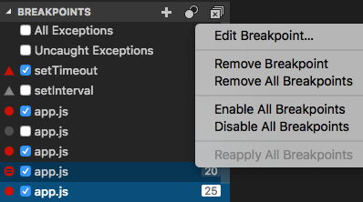
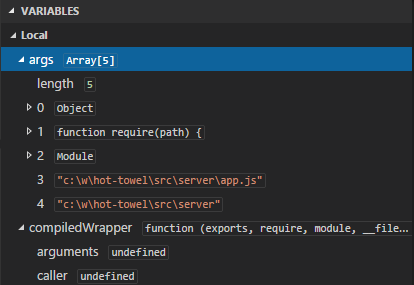

# Debugging

One of the key features of Visual Studio Code is its great debugging support. VS Code's built-in debugger helps accelerate your edit, compile and debug loop.


Today we have good debugging support for **Node.js** (JavaScript and TypeScript) on all platforms and experimental support for **Mono** (C# and F#) on OS X and Linux.
At //build we highlighted the support we are adding for ASP.NET 5 and we plan to add more.

It is helpful to first create a sample Node.js application before reading about debugging. Follow this guide to do a run-through with Node.js:

* [Node.js Applications](/docs/runtimes/nodejs.md)

Once you are all set up this page will take you through the debugging scenarios we support.

## Debug View

To bring up the Debug view, click on the Debugging icon in the View Bar on the side of VS Code.


The Debug view displays all information pertaining to debugging and has a top bar with debugging commands and configuration settings.

## Launch Configurations

To debug your app in VS Code, you'll first need to setup your debugging launch configuration file - **launch.json**.
Click on the Configure gear icon on the Debug view top bar, choose your debug environment and VS Code will generate a launch.json.
Here is the one generated for Node.js debugging:

```json
{
	"version": "0.2.0",
	"configurations": [
		{
			"name": "Launch",
			"type": "node",
			"request": "launch",
			"program": "app.js",
			"stopOnEntry": false,
			"args": [],
			"cwd": ".",
			"runtimeExecutable": null,
			"runtimeArgs": [
				"--nolazy"
			],
			"env": {
				"NODE_ENV": "development"
			},
			"externalConsole": false,
			"sourceMaps": false,
			"outDir": null
		},
		{
			"name": "Attach",
			"type": "node",
			"request": "attach",
			"port": 5858
		}
	]
}
```
In VS Code we support launching your app in debug mode or attaching to an already running app. Depending on the request (attach or launch) different attributes are required and our launch.json validation and suggestions should help with that.

Review the generated values and make sure that they make sense for your project and debugging environment.

Select the configuration named `Launch` using the **Configuration dropdown** in the Debug view. Once you have your launch configuration set, start your debug session with `kb(workbench.action.debug.start)`.

You can add additional configurations to the launch.json (use hover and code assist to help).

## Breakpoints

Breakpoints can be toggled by clicking on the **editor margin**.
Finer breakpoint control (enable/disable/reapply) can be done in the Debug view **BREAKPOINTS** section.



The `Reapply All Breakpoints` command sets all breakpoints again to their original location.
This is helpful if your debug environment is "lazy" and "misplaces" breakpoints in code that has not yet been executed.
(For details see below under __Node Debugging: Breakpoint Validation__)

## Data inspection

Variables can be inspected in the **VARIABLES** section of the Debug view or by hovering over their source in the editor.



Variables and expressions can also be evaluated and watched in the Debug view **WATCH** section.


## Debug Console

Expressions can be evaluated in the **Debug Console**. To open the Debug Console use the `Open Console` action at the top of the Debug pane or using the Command Palette.


## Debug actions

Once a debug session starts, the **Debug actions pane** will appear on the top of the editor.


* Continue / Pause `kb(workbench.action.debug.continue)`
* Step Over `kb(workbench.action.debug.stepOver)`
* Step Into `kb(workbench.action.debug.stepInto)`
* Step Out `kb(workbench.action.debug.stepOut)`
* Restart `kb(workbench.action.debug.restart)`
* Stop `kb(workbench.action.debug.stop)`

## Node Debugging

### Node Console

By default node debug sessions launch the target in the internal VS Code Debug Console.
Since the Debug Console does not support programs that need to read input from the console,
you can enable an external, native console by setting the attribute **externalConsole** to `true` in your launch configuration.

### Breakpoint Validation

For performance reasons Node.js parses the functions inside JavaScript files lazily on first access.
As a consequence, breakpoints don't work in source code areas that haven't been seen (parsed) by Node.js.

Since this behavior is not ideal for debugging, VS Code passes the `--nolazy` option to Node.js automatically.
This prevents the delayed parsing and ensures that breakpoints can be validated before running the code (so they no longer "jump").

Since the `--nolazy` option might increase the start-up time of the debug target significantly, you can easily opt out
by passing a `--lazy` as a **runtimeArgs** attribute.

When doing so you will find that some of your breakpoints don't "stick" to the line requested but instead "jump"
for the next possible line in already-parsed code. To avoid confusion, VS Code always shows
breakpoints at the location where Node.js thinks the breakpoint is. In the breakpoint section, these breakpoints are
shown with an arrow between requested and actual line number:


This breakpoint validation occurs when a session starts and the breakpoints are registered with Node.js, or when a
session is already running and a new breakpoint is set. In this case, the breakpoint may "jump" to a different
location. After Node.js has parsed all the code (e.g. by running through it), breakpoints can be easily re-applied
to the requested locations with the Reapply button in the breakpoint section header. This should make the breakpoints
"jump back" to the requested location.


### JavaScript Source Maps

The Node.js debugger of VS Code supports JavaScript Source Maps which help debugging of transpiled languages,
e.g. TypeScript or minified/uglified JavaScript.
With source maps it is possible to single step through or set breakpoints in the original source.
The source map feature is enabled by setting the **sourceMaps** attribute to `true` in the launch configuration.
In addition, you can specify a source file (e.g. app.ts) with the **program** attribute.
If the generated (transpiled) JavaScript files do not live next to their source but in a separate directory,
you can help the VS Code debugger locate them by setting the **outDir** attribute.
Whenever you set a breakpoint in the original source, VS Code tries to find the generated source,
and the associated source map, in the **outDir** directory.

Since source maps are not automatically created, you must configure the TypeScript compiler to create them:
```
tsc --sourceMap --outDir bin app.ts
```
This is the corresponding launch configuration for a TypeScript program:
```json
{
	"version": "0.2.0",
	"configurations": [
		{
			"name": "Launch TypeScript",
			"type": "node",
			"request": "attach",
			"program": "app.ts",
			"sourceMaps": true,
			"outDir": "bin"
		}
	]
}
```
Source maps can be generated with two kinds of inlining:

* **Inlined source maps**: the generated JavaScript file contains the source map as a data URI at the end (instead of referencing the source map through a file URI).
* **Inlined source**: the source map contains the original source (instead of referencing the source through a path).

VS Code supports **inlined source maps** but not **inlined source**.

### Attaching VS Code to Node

If you want to attach the VS Code debugger to a Node.js program, launch Node.js as follows:
```
node --debug program.js
node --debug-brk program.js
```
With the **--debug-brk** option Node.js stops on the first line of the program.
The corresponding launch configuration looks like this:
```json
{
	"version": "0.2.0",
	"configurations": [
		{
			"name": "Attach to Node",
			"type": "node",
			"request": "attach",
			"port": 5858
		}
	]
}
```

## Mono Debugging

On Linux or OS X the Mono debugging support of VS Code requires Mono version 3.12 or later.
If you intend to build ASP.NET 5 applications with Visual Studio Code, we recommend you first follow the steps
**Installing ASP.NET 5 and DNX** in [ASP.NET 5 Applications](/docs/runtimes/ASPnet5.md) which will install a version of Mono
that supports debugging.

If you just want to try VS Code Mono debugging, you can either download the latest Mono version
for Linux or OS X at http://www.mono-project.com/download/ or you can use your package manager.

* On OS X: `brew install mono`
* On Linux: `sudo apt-get install mono-complete`

To enable debugging of Mono based C# (and F#) programs, you have to pass the **-debug** option to the compiler:
```
mcs -debug Program.cs
```
If you want to attach the VS Code debugger to a Mono program, pass these additional arguments to the Mono runtime:
```
mono --debug --debugger-agent=transport=dt_socket,server=y,address=127.0.0.1:55555 Program.exe
```
The corresponding launch configuration looks like this:
```json
{
	"version": "0.2.0",
	"configurations": [
		{
			"name": "Attach to Mono",
			"request": "attach",
			"type": "mono",
			"address": "localhost",
			"port": 55555
		}
	]
}
```

## Next Steps

In case, you didn't already read the Node.js section, take a look at:

* [Node.js](/docs/runtimes/nodejs.md) - End to end Node scenario with a sample application

To learn about VS Code's task running support, go to:

* [Tasks](/docs/editor/tasks.md) - Running tasks with Gulp, Grunt and Jake.  Showing Errors and Warnings


## Common Questions

**Q: What are the supported debugging scenarios?**

**A:** Debugging of Node.js based applications is supported on Linux, OS X, and Windows. Debugging of C# applications running on Mono is supported on Linux and OS X.

Currently ASP.NET 5 debugging is not supported on any platform, including running ASP.NET 5 on Mono on OS X and Linux. ASP.NET 5 applications are compiled using the Roslyn compiler, not the Mono compiler, and no debug information is being emitted. We hope to provide support for this scenario in an upcoming release.

**Q: Why can’t I remote debug my app?**

**A:** Currently we support local debugging only. This is a known limitation. If that’s something you care about, please [let us know](http://visualstudio.uservoice.com/forums/293070-visual-studio-code/suggestions/7872216-remote-debugging)!

**Q: I do not see any launch configurations in the debug view drop down, what is wrong?**

**A:** The most common problem is that you did not set up launch.json yet or there is a syntax error in the launch.json file.

**Q: What Node.js version is required for Node.js debugging?**

**A:** Version 0.12.x is recommended, though most functionality is supported in 0.10.x as well (except break on unhandled exceptions).

**Q: Is Mono debugging supported on Windows?**

**A:** No. Currently Mono debugging is only supported on Mac and Linux.
