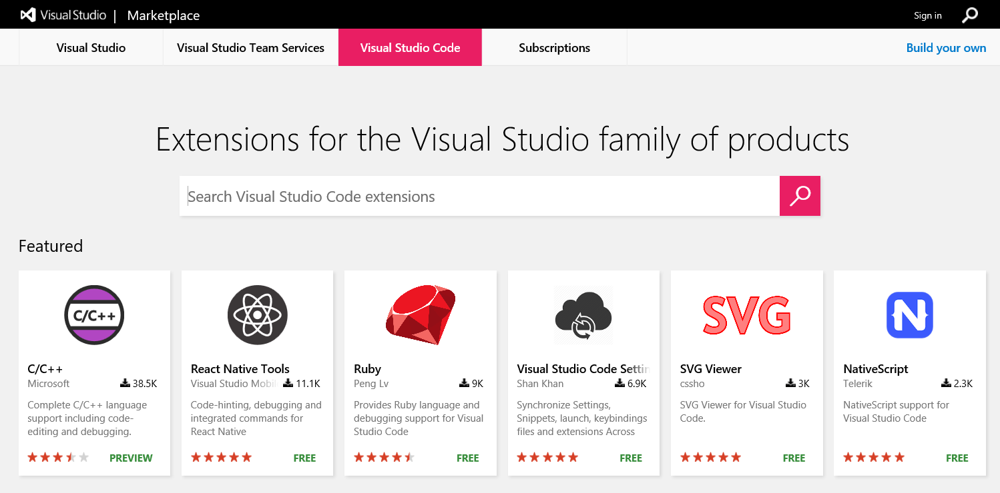

# VS Code Extension Gallery

## Browse and Install Extensions in VS Code

You can browse and install extensions from within VS Code. Press `kb(workbench.action.showCommands)` and narrow down the list commands by typing `extension`:

Pick `Extensions: Install Extension`.

> **Tip:** As an alternative, press `kb(workbench.action.quickOpen)` (**Quick Open**) and type `ext install ` with a trailing space. Not sure what to install? Visit [VS Code Marketplace](https://marketplace.visualstudio.com/VSCode).

You'll see a list of extensions on the gallery along with the publisher, published date and a brief description.  You can click the `README` button to go to the extension's [VS Code Marketplace](https://marketplace.visualstudio.com/VSCode) page where you can learn more.

## Install an Extension

Simply pick the extension from the list. After a successful install, you'll get the following notification:

## List Installed Extensions

You can also browse installed extensions with the `Extensions: Show Installed Extensions` command or by typing `kb(workbench.action.quickOpen)` and `ext ` with a trailing space.

## Uninstall an Extension

To uninstall an extension, bring up the `Extensions: Show Installed Extensions` dropdown and click the `x` button in the lower right of the extension entry. This will uninstall the extension and prompt you to restart VS Code.

## Update an Extension

You can quickly look for extension updates by using the `Extensions: Show Outdated Extensions` dropdown.  This will display any available updates for your currently installed extensions. Simply click the Update Extension button in the lower right for the outdated extension and the update will be installed and you'll be prompted to restart VS Code.

## Browse Extensions

Additionally, you can browse the VS Code Extension Gallery through the [VS Code Marketplace](https://marketplace.visualstudio.com/VSCode).

## Next Steps

Here are a few topics you may find interesting...

* [Publishing to the Gallery](/docs/tools/vscecli.md) - Publish your own customization or extension to the VS Code Gallery
* [Customization](/docs/customization/overview.md) - Learn how to integrate TextMate themes, colorizers and snippets into Visual Studio Code.
* [Yo Code](/docs/tools/yocode.md) - Learn how the Yo Code extension generator can scaffold out new extensions and package existing TextMate files.
* [Extending Visual Studio Code](/docs/extensions/overview.md) - Start learning about VS Code extensibility
* [Your First Extension](/docs/extensions/example-hello-world.md) - Try creating a simple Hello World extension

## Common Questions

**Q: The `Extensions: Install Extension` command just hangs and never shows a dropdown listing available extensions?**

**A:** This could be due to an incomplete uninstall of an extension which left some extension files under [your `.vscode/extensions` folder](/docs/extensions/install-extension.md#your-extensions-folder).  Navigate to `.vscode/extensions` and see if there is an extension folder (named for the publisher and extension as `publisher.extension`) for a recently deleted extension.  Delete that folder and restart VS Code.

**Q: Can VS Code read TextMate bundles directly?**

**A**: No, VS Code can read some TextMate files such as .tmTheme and .tmLanguage but can not install full TextMate bundles. Also in order to use TextMate theme and syntax files, VS Code needs extra metadata for integration.  The [Yo Code](/docs/tools/yocode.md) extension generator makes it easy to package these files for use in VS Code.

**Q: Can I install Visual Studio Community extensions (shipped in .vsix) in Visual Studio Code?**

**A:** No, Visual Studio Code's extensibility points are different from Visual Studio Community.  The two use different extension Galleries and the Visual Studio Community extension installer will not recognize Visual Studio Code.

