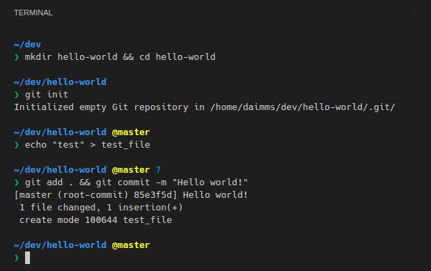

# Integrated Terminal

In Visual Studio Code, you can open an integrated terminal, initially scoped to the workspace you are working in. This can be very convenient as you don't have to switch windows or alter the state of an existing terminal to perform a quick command line task.

To open the terminal:

* Use the `kb(workbench.action.terminal.toggleTerminal)` keyboard shortcut.
* From the **View** | **Toggle Integrated Terminal** menu.
* From the **Command Palette** (`kb(workbench.action.showCommands)`), with the **View** > **Toggle Integrated Terminal** command.

## Configuration

The shell used defaults to `$SHELL` on Linux and OS X, and `%COMSPEC%` on Windows. These can be overridden manually by setting `terminal.integrated.shell.*` in [settings](/docs/customization/userandworkspace.md).

## Key Bindings

The **Toggle Integrated Terminal** command is bound to `kb(workbench.action.terminal.toggleTerminal)` to quickly toggle the integrated terminal panel in and out of view.

>**Note:** The **Toggle Integrated Terminal** key binding `kb(workbench.action.terminal.toggleTerminal)` had previously been bound to the **Cycle Between Open Editors** command. You can [customize](https://code.visualstudio.com/docs/customization/keybindings#_customizing-shortcuts) the key bindings and change the behavior back if desired.

## Managing Multiple Terminals

Multiple terminals are coming soon and you can start using them today with the [Insiders](/insiders) build.  The UI is under development but you can easily create and navigate between multiple terminals scoped to different locations.

Along with multiple terminals, new settings (e.g. shell argument lists) and key bindings are also coming in the next release.
