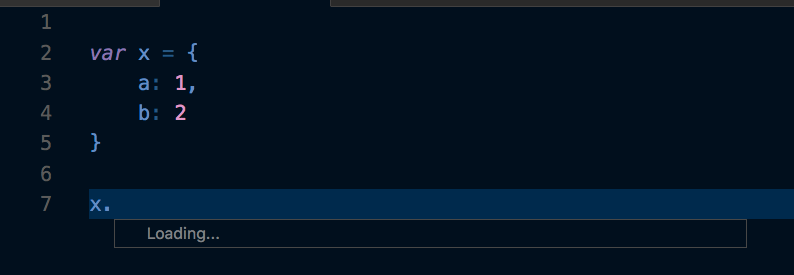
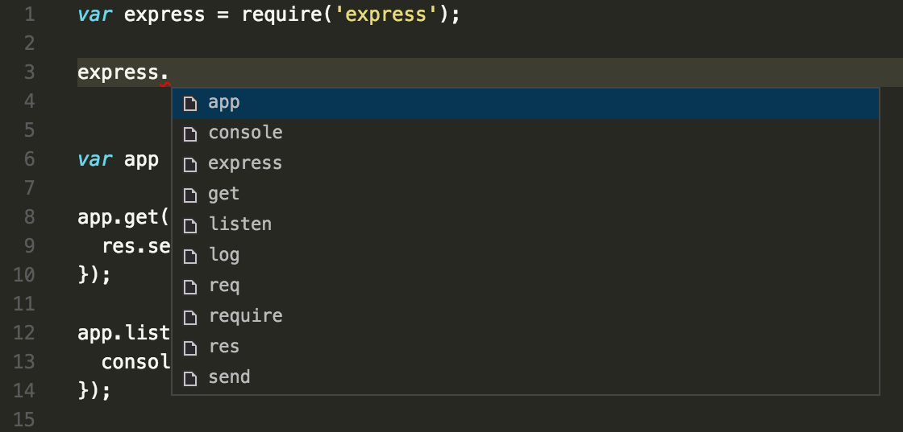

# IntelliSense

IntelliSense is a core feature of Visual Studio Code. When you first download VS Code you will see syntax highlighting for nearly every language, and IntelliSense for JavaScript and TypeScript. 


## Language Extensions

IntelliSense for JavaScript and TypeScript is provided out of the box through the [TypeScript](https://github.com/Microsoft/TypeScript/wiki/Salsa) language service. For other languages you will need to [install a language extension](/docs/editor/extension-gallery). 

> Tip: For configuring and troubleshooting JavaScript IntelliSense see [here](/docs/languages/javascript#configuring-intellisense).

Below are the most popular language extensions in the [Marketplace](https://marketplace.visualstudio.com/vscode)Click on an extension tile above to read the description and reviews to decide which extension is best for you. 

<div class="marketplace-extensions-languages"></div>

## What is IntelliSense?

IntelliSense is a general term for a variety of code editing features, including: code completion, parameter info, quick info, and list members. 

IntelliSense has been described in a number of ways. 

* IntelliSense is intelligent code completion.
* IntelliSense is docs at your finger tips
* IntelliSense provides instant context-aware help. 

In other tools, IntelliSense goes by the terms "code completion", "auto code completion", "content assist", or "code hinting." The IntelliSense experience in VS Code is best-in-class, providing the most intelligent, context-aware suggestions possible. 

## Using IntelliSense

IntelliSense is easy to use. Simply begin typing. While you type the language service will provide code completion and on certain characters (for example `.`) method suggestions will appear. 

> Tip: You can trigger IntelliSense in any editor window by typing <kbd>ctrl+space</kbd>.

In addition, you can see the short documentation (commonly called **quick outline**) for each method (as provided by the language service). 


After choosing a method you are provided with **parameter info**. 


## Suggestion Priority

IntelliSense is context aware and will provide you with the best suggestions possible. The order and the icon to the left of the word indicate the priority of each suggestion. 

> **Higher suggestion priority = higher order and a more detailed icon**

This image shows the result of triggering IntelliSense on `express` a popular [Node.js module](https://expressjs.com/). 


Methods, variables, and objects tend to have high priority. Simple word completion, tends to be lower priority. When the priority level is equivalent, ordering is done alphabetically. 

|       |         |
| ----- | ------- |
|  | Method or Function |
|  | Variable | 
|  | Object |
|  | Word Completion |
|  | String completion |

## Customize IntelliSense

You can customize your IntelliSense experience in settings. 

> Tip: The settings shown below are the default settings. You can change these settings in your settings.json file as described [here](/docs/customization/userandworkspace.md). 

```json
{

    // Controls if quick suggestions should show up while typing
    "editor.quickSuggestions": true,

    // Controls if suggestions should be accepted with "Enter" - in addition to "Tab". Helps to avoid ambiguity between inserting new lines and accepting suggestions. 
    "editor.acceptSuggestionOnEnter": true,

    // Controls the delay in ms after which quick suggestions will show up. 
    "editor.quickSuggestionsDelay": 10
}
```

## How does IntelliSense work? 

Each language service runs in our shared [extension host process](https://code.visualstudio.com/docs/extensions/our-approach#_stability-extension-isolation). This process is separate from the main execution process, keeping VS Code fast and responsive. The language service interacts with VS Code's main process through the extension API. 

From here the details become language dependent. The TypeScript language service, which powers both JavaScript and TypeScript, uses static analysis and will provide suggestions based on type inference, JS Docs and TypeScript definition files (you can read more about the TypeScript language service's IntelliSense strategy [here](https://github.com/Microsoft/TypeScript/wiki/Salsa#features)). Other language may implement a different strategy, including using an "execution based" model. 

## Next Steps

IntelliSense is straight forward enough. Let's keep going. 

* [JavaScript](/docs/languages/javascript.md) - Get the most out of your JavaScript development, including configuring IntelliSense.
* [Node.js](https://code.visualstudio.com/docs/runtimes/nodejs#_intellisense-and-typings) - See an example of IntelliSense in action in the Node.js walkthrough. 
* [Debugging](/docs/editor/debugging.md) - Learn how to setup debugging for your application. 

## Common Questions

* Why am I not getting any suggestions? (see image below)



This issue can be caused by a variety of reasons. For JavaScript specific troubleshooting, please navigate to the [JavaScript language document](/docs/languages/javascript). For other languages you will need to consult the extension's documentation. 

* Why am I not seeing method and variable suggestions?



This issue is caused by missing typings files in JavaScript. You can learn how to solve this issue in the [JavaScript language document](/docs/languages/javascript). For other languages, please consult the extension's documentation. 

