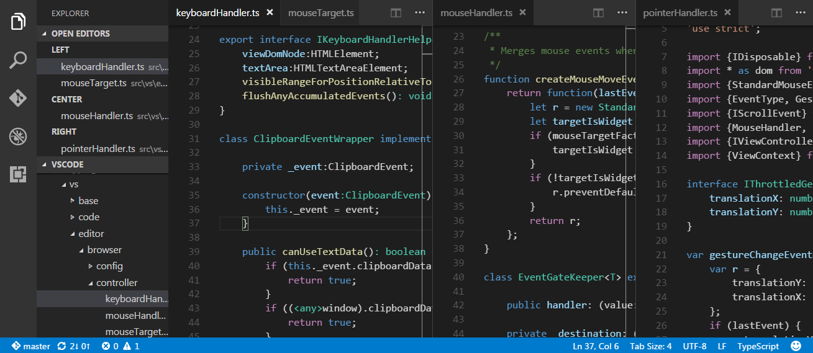

# Tabs

Visual Studio Code shows open items with Tabs (tabbed headings) in the title area above the editor.

When you open a file, a new Tab is added for that file.


Tabs let you quickly navigate between items and you can Drag and Drop Tabs to reorder them.

When you have more open items than can fit in the title area, you can use the **Show Opened Editors** command (available through the `...` More button) to display a dropdown of tabbed items.

If you don't want to use Tabs, you can disable the feature by setting the `workbench.editor.showTabs` [setting](/docs/customization/userandworkspace.md) to false:

```json
    "workbench.editor.showTabs": false
```

See the section below to optimize VS Code when [working without Tabs](/docs/editor/tabs.md#working-without-tabs).

## Tab ordering

By default, new Tabs are added to the right of the existing Tabs but you can control where you'd like new Tabs to appear with the `workbench.editor.openPositioning` setting.

For example, you might like new tabbed items to appear on the left:

```json
    "workbench.editor.openPositioning": "left"
```

## Preview mode

When you simply single-click or select a file in the Explorer, it is shown in a preview mode and reuses an existing Tab. This is useful if you are quickly browsing files and don't want every visited file to have its own Tab. When you start editing the file or use double-click to open the file from the Explorer, a new Tab is dedicated to that file.

Preview mode is indicated by italics in the Tab heading:


If you'd prefer to not use preview mode and always create a new Tab, you can control the behavior with these settings:

* `workbench.editor.enablePreview` to globally enable or disable preview editors
* `workbench.editor.enablePreviewFromQuickOpen` to enable or disable preview editors when opened from **Quick Open**

## Editor Groups

When you split an editor (using the **Split Editor** or **Open to the Side** commands), a new editor region is created which can hold a group of items.  VS Code allows up to three editor groups which are designed **LEFT**, **CENTER**, and **RIGHT**.

You can see these clearly in the **OPEN EDITORS** section at the top of the Explorer view:



You can Drag and Drop editor groups on the workbench, move individual Tabs between groups and quickly close entire groups (**Close All**).

>**Note:** VS Code uses editor groups whether or not you have enabled Tabs.  Without Tabs, editor groups are simply a stack of your open items with the most recently selected item visible in the editor pane.

## Keyboard Shortcuts

Here are some handy keyboard shortcuts to quickly navigate between editors and editor groups.

>If you'd like to modify the default keyboard shortcuts, see [Key Bindings](/docs/customization/keybindings.md) for details.

* `kb(workbench.action.nextEditor)` go to the right editor.
* `kb(workbench.action.previousEditor)` go to the left editor.
* `kb(workbench.action.openNextRecentlyUsedEditorInGroup)` open the next editor in the editor group MRU list.
* `kb(workbench.action.openPreviousRecentlyUsedEditorInGroup)` open the previous editor in the editor group MRU list.
* `kb(workbench.action.focusFirstEditorGroup)` go to the leftmost editor group.
* `kb(workbench.action.focusSecondEditorGroup)` go to the center editor group.
* `kb(workbench.action.focusThirdEditorGroup)` go to the rightmost editor group.
* `kb(workbench.action.focusPreviousGroup)` go the previous editor group.
* `kb(workbench.action.focusNextGroup)` go to the next editor group.
* `kb(workbench.action.closeActiveEditor)` close the active editor.
* `kb(workbench.action.closeEditorsInGroup)` close all editors in the editor group.
* `kb(workbench.action.closeAllEditors)` close all editors.

## Working without Tabs

If you prefer not to use Tabs as in earlier releases of VS Code, you can use the following configurations.

As mentioned above, you can disable Tabs (tabbed headings) entirely by setting `workbench.editor.showTabs` to false.

### Disable Preview mode

Without Tabs, the **OPEN EDITORS** section of the File Explorer is a quick way to do file navigation.  With [preview editor mode](/docs/editor/tabs.md#preview-mode), files are not added to the **OPEN EDITOR** list nor editor group on single-click open. You can disable this feature through the `workbench.editor.enablePreview` and `workbench.editor.enablePreviewFromQuickOpen` settings.

### Ctrl+Tab to navigate in entire editor history

You can change keybindings for `kbstyle(Ctrl+Tab)` to show you a list of all opened editors from the history independent from the active editor group.

Edit your [keybindings](/docs/customization/keybindings.md) and add the following:

```json
{ "key": "ctrl+tab", "command": "workbench.action.openPreviousEditorFromHistory" },
{ "key": "ctrl+tab", "command": "workbench.action.quickOpenNavigateNext", "when": "inQuickOpen" },
```

### Close an entire group instead of a single editor

If you liked the behavior of VS Code closing an entire group when closing one editor, you can bind the following in your [keybindings](/docs/customization/keybindings.md).

Mac:

```json
{ "key": "cmd+w", "command": "workbench.action.closeEditorsInGroup" }
```

Windows/Linux:

```json
{ "key": "ctrl+w", "command": "workbench.action.closeEditorsInGroup" }
```