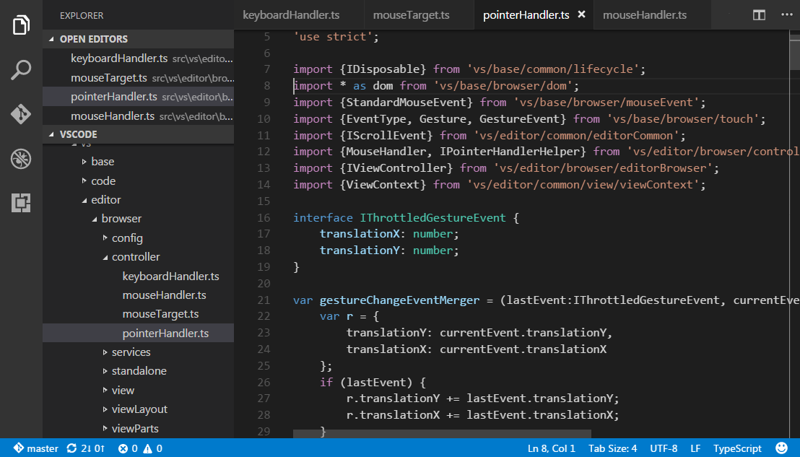

# Tabs

Visual Studio Code has support for showing open items with Tabs (tabbed headings) in the title area above the editor.

>**Note:** Tabs and the features discussed here are currently only supported on the prerelease [Insiders](/insiders) build. We invite you to install the Insiders build and give Tabs a try today.

To enable Tabs, use the `workbench.editor.showTabs` [setting](/docs/customization/userandworkspace.md):

```json
    "workbench.editor.showTabs": true
```



When you open a file, a new Tab will be added for that file. Tabs let you quick navigate between items and you can Drag and Drop Tabs to reorder them.  When you have more open items than can fit in the title area, an overflow icon will be enabled to display a dropdown of tabbed items.


## Tab order

By default, new Tabs are added to the right of the existing Tabs but you can control where you'd like new Tabs to appear with the `workbench.editor.openPositioning` setting.

For example, you might like new tabbed items to appear on the left:

```json
    "workbench.editor.openPositioning": "left"
```

## Preview mode

When you simply single-click or select a file in the Explorer, it is shown in a preview mode and reuses an existing Tab. This is useful if you are quickly browsing files and don't want every visited file to have its own Tab. When you start editing the file or double-click when you open the file in the Explorer, a new Tab is dedicated to that file.

Preview mode is indicated by italics in the Tab heading:


If you'd prefer to not use preview mode and always create a new Tab, you can control the behavior with these settings:

* `workbench.editor.enablePreview` to globally enable or disable preview editors
* `workbench.editor.enablePreviewFromQuickOpen` to enable or disable preview editors when opened from **Quick Open**

## Editor Groups

When you split an editor (using the **Split Editor** or **Open to the Side** commands), a new editor region is created which can hold a group of items.  VS Code allows up to three editor groups which are designed **LEFT**, **CENTER**, and **RIGHT**.

You can see these clearly in the **OPEN EDITORS** section at the top of the Explorer view:


You can Drag and Drop editor groups on the workbench, move individual Tabs between groups and quickly close entire groups (**Close All**).

>**Note:** VS Code uses editor groups whether or not you have enabled Tabs.  Without Tabs, editor groups are simply a stack of your open items with the most recently selected item visible in the editor pane.
