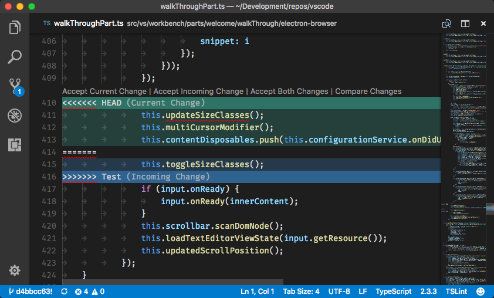
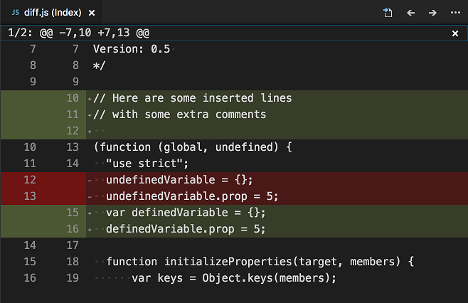
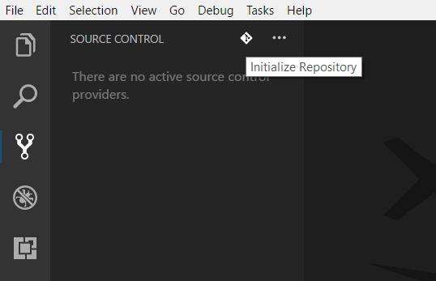

# Using Version Control in VS Code

Visual Studio Code has integrated source control and includes [Git](https://git-scm.com/) support in-the-box. Many other source control providers are available through [extensions](/docs/editor/extension-gallery.md) on the VS Code Marketplace.

<div class="marketplace-extensions-scm-curated"></div>

> **Tip:** Click on an extension tile to read the description and reviews in the Marketplace.

## SCM Providers

VS Code has support for handling multiple Source Control providers simultaneously. For example, you can open multiple Git repositories alongside your TFS local workspace and seamlessly work across your projects. The **SOURCE CONTROL PROVIDERS** list of the **Source Control** view (`kb(workbench.view.scm)`) shows the detected providers and repositories and you can scope the display of your changes by selecting a specific provider.


If you would like to install an additional SCM provider, the **Install Additional SCM Providers...** command in the **Source Control** view **More** (...) dropdown will show a list of available SCM provider extensions.


## Git support

VS Code ships with a Git source control manager (SCM) extension. Most of the source control UI and work flows are common across other SCM extensions so reading about the Git support will help you understand how to use another provider.

>**Note:** If you are new to Git, the [git-scm](https://git-scm.com/documentation) website is a good place to start with a popular online [book](https://git-scm.com/book), Getting Started [videos](https://git-scm.com/video/what-is-git) and [cheat sheets](https://services.github.com/on-demand/downloads/github-git-cheat-sheet.pdf). The VS Code documentation assumes you are already familiar with Git.


>**Note:** VS Code will leverage your machine's Git installation, so you need to [install Git](https://git-scm.com/download) first before you get these features. Make sure you install at least version `2.0.0`.

>**Tip:** VS Code will work with any Git repository.  If you don't already have a private hosted Git provider, [Visual Studio Team Services](https://www.visualstudio.com/products/visual-studio-team-services-vs) is a great free option. [Click here to sign-up](https://go.microsoft.com/fwlink/?LinkID=307137&campaign=o~msft~code~vc).

The Source Control icon on the left will always indicate an **overview of how many changes** you currently have in your repository. Clicking it will show you the details of your current repository changes: **CHANGES**, **STAGED CHANGES** and **MERGE CHANGES**.

Clicking each item will show you in detail **the textual changes within each file**. Note that for unstaged changes, the editor on the right still lets you edit the file: feel free to use it!

You can also find indicators of the **status of your repository** in the bottom left corner of VS Code: the **current branch**, **dirty indicators** and the number of **incoming and outgoing commits** of the current branch. You can **checkout** any branch in your repository by clicking that status indicator and selecting the Git reference from the list.

> **Tip:** You can open VS Code in a sub-directory of a Git repository. VS Code's Git services will still work as usual, showing all changes within the repository, but file changes outside of the scoped directory are shaded with a tool tip indicating they are located outside the current workspace.

## Git Status Bar Actions

There is a **Synchronize Changes** action in the Status Bar, next to the branch indicator, when the current checked out branch has an upstream branch configured. **Synchronize Changes** will pull remote changes down to your local repository and then push local commits to the upstream branch.


If there is no upstream branch configured and the Git repository has remotes set up, the **Publish** action is enabled. This will let you publish the current branch to a remote.


## Commit

**Staging** and **unstaging** can be done via contextual actions in the files or by drag-and-drop.

You can type a commit message above the changes and press `kbstyle(Ctrl+Enter)` (Mac: `kbstyle(⌘+Enter)`) to commit them. If there are any staged changes, only those will be committed, otherwise all changes will be committed.

We've found this to be a great workflow. For example, in the previous screenshot, only the `config.js` file will be included in the commit. A consecutive commit action would commit both `vinyl-zip.js` and `tests.js` in a separate commit.

More specific **commit actions** can be found in the `...` menu on the top of the Git view.

## Cloning a repository

You can clone a Git repository with the **Git: Clone** command in the **Command Palette** (`kb(workbench.action.showCommands)`). You will be asked for the URL of the remote repository and the parent directory under which to put the local repository.

## Branches and Tags

You can create and checkout branches directly within VS code through the **Git: Create Branch...** and **Git: Checkout to..** commands in the **Command Palette** (`kb(workbench.action.showCommands)`).

If you run **Git: Checkout to...**, you will see a dropdown containing all of the branches or tags in the current repository.


The **Git: Create Branch...** command lets you quickly create a new branch.  Just provide the name of your new branch and VS Code will create the branch and switch to it.

## Remotes

Given that your repository is connected to some remote and that your checked out branch has an [upstream link](https://git-scm.com/book/ch3-5.html) to a branch in that remote, VS Code offers you useful actions to **push**, **pull** and **sync** that branch (the latter will run a **pull** command followed by a **push** command). You can find these actions in the `...` menu.

>**Tip:** You should [set up a credential helper](https://help.github.com/articles/caching-your-github-password-in-git/) to avoid getting asked for credentials every time VS Code talks to your Git remotes.  If you don't do this, you may want to consider disabling automatic fetching via the `git.autofetch` [setting](/docs/getstarted/settings.md) to reduce the number of prompts you get.

## Gutter indicators

If you open a folder that is a Git repository and begin making changes, VS Code will add useful annotations to the gutter and to the overview ruler.

* A red triangle indicates where lines have been deleted
* A green bar indicates new added lines
* A blue bar indicates modified lines


## Merge Conflicts



Merge conflicts are recognized by VS Code. Differences are highlighted and there are inline actions to accept either or both changes. Once the conflicts are resolved, stage the conflicting file so you can commit those changes.

## Viewing Diffs

Our Git tooling supports viewing of diffs within VS Code.


>**Tip:** You can diff any two files by first right clicking on a file in the Explorer or **OPEN EDITORS** list and selecting **Select for Compare** and then right-click on the second file to compare with and select **Compare with 'file_name_you_chose'**.   Alternatively from the keyboard hit `kb(workbench.action.showCommands)` and select **File: Compare Active File With...** and you will be presented with a list of recent files.

### Diff editor review pane

There is a review pane in the Diff editor which presents changes in a unified patch format. You can navigate between changes with **Go to Next Difference** (`kb(editor.action.diffReview.next)`) and **Go to Previous Difference** (`kb(editor.action.diffReview.prev)`). Lines can be navigated with arrow keys and pressing `kbstyle(Enter)` will jump back in the Diff editor and the selected line.



**Note:** This experience is especially helpful for screen reader users.

## Git Output Window

You can always peek under the hood to see the Git commands we are using.  This is helpful if something strange is happening or if you are just curious. :)

To open the Git output window, run **View** > **Output** and select **Git** from the dropdown.

## Initialize a Repository

If your workspace isn't under Git source control, you can easily create a Git repository with the **Initialize Git Repository** command.  When VS Code doesn't detect an existing Git repository, you will see a **This workspace isn't yet under git source control.** message in the Git View and the **Initialize Git Repository** command will be available.



Running **Initialize Git Repository** will create the necessary Git repository metadata files and show your workspace files as unstaged changes.

## Git patch/diff mode

When you launch VS Code from the command line, you can pass the `--wait` argument to make the launch command wait until you have closed the new VS Code instance. This can be useful when you configure VS Code as your Git external editor so Git will wait until you close the launched VS Code instance.

Here are the steps to do so:

1. Make sure you can run `code --help` from the command line and you get help.
    * if you do not see help, please follow these steps:
        * Mac: Select **Shell Command: Install 'Code' command in path** from the **Command Palette**.
        * Windows: Make sure you selected **Add to PATH** during the installation.
        * Linux: Make sure you installed Code via our new .deb or .rpm packages.
2. From the command line, run `git config --global core.editor "code --wait"`

Now you can run `git config --global -e` and use VS Code as editor for configuring Git.


Add the following to your Git configurations to use VS Code as the diff tool:

```bash
[diff]
    tool = default-difftool
[difftool "default-difftool"]
    cmd = code --wait --diff $LOCAL $REMOTE
```

This leverages the `--diff` option you can pass to VS Code to compare 2 files side by side.

To summarize, here are some examples of where you can use VS Code as the editor:

* `git rebase HEAD~3 -i` do interactive rebase using VS Code
* `git commit` use VS Code for the commit message
* `git add -p` followed by `kbstyle(e)` for interactive add
* `git difftool <commit>^ <commit>` use VS Code as the diff editor for changes

## Next Steps

* [Intro Video - Git Version Control](/docs/introvideos/versioncontrol.md) - An introductory video providing an overview of VS Code Git support.
* [Basic Editing](/docs/editor/codebasics.md) - Learn about the powerful VS Code editor.
* [Code Navigation](/docs/editor/editingevolved.md) - Move quickly through your source code.
* [Debugging](/docs/editor/debugging.md) - This is where VS Code really shines
* [Tasks](/docs/editor/tasks.md) - Running tasks with Gulp, Grunt and Jake.  Showing Errors and Warnings
* [SCM API](/docs/extensionAPI/api-scm.md) - If you want to integrate another Source Control provider into VS Code, see our SCM API.

## Common Questions

**Q: Hey, I initialized my repo but the actions in the `...` menu are all grayed out. What gives?**

**A:** To **push, pull and sync** you need to have a Git origin set up.  You can get the required URL from the repo host.  Once you have that URL, you need to add it to the Git settings by running a couple of command line actions. For example, for Visual Studio Team Services:

```bash
> git remote add origin https://<AccountName>.visualstudio.com/DefaultCollection/_git/<RepoName>
> git push -u origin master
```

**Q: My team is using Team Foundation version control (TFVC) instead of Git. What should I do?**

**A:** Use the [Visual Studio Team Services Extension](https://marketplace.visualstudio.com/items?itemName=ms-vsts.team) and this will light up TFVC support.

**Q: Why do the Pull, Push and Sync actions never finish?**

This usually means there is no credential management configured in Git and you're not getting credential prompts for some reason.

You can always set up a [credential helper](https://help.github.com/articles/caching-your-github-password-in-git/) in order to pull and push from a remote server without having VS Code prompt for your credentials each time.

**Q: How can I sign into Git with my Team Services account which requires multi-factor authentication?**

**A:** There are now [Git credential helpers](https://blogs.msdn.com/b/visualstudioalm/archive/2015/11/18/visual-studio-team-services-git-credential-manager-for-mac-and-linux.aspx) that assist with multi-factor authentication. You can download these from [Git Credential Manager for Mac and Linux](https://github.com/Microsoft/Git-Credential-Manager-for-Mac-and-Linux) and [Git Credential Manager for Windows](https://github.com/Microsoft/Git-Credential-Manager-for-Windows).

**Q: Using Visual Studio Code, I accidentally initialized a Git repo on a folder with a massive number of files, like my entire hard drive. Now VS Code is too slow to use or hangs. What do I do?**

**A:** First, to get VS Code running again, exit VS Code, then open a command prompt and run

```bash
code -n
```

which opens VS Code in a new window.

Next, assuming you want to remove the unintended repo initialization, look for the `.git` sub-folder in the large folder where you unintentionally initialized the repo, and then delete it. Note that `.git` is a hidden folder, so you might need to show hidden folders to see it. For example, at a command prompt in Windows you can run `dir .git /ah` to see hidden folders named `.git` in a specific folder. If you are not sure where you created the initial folder, run `dir .git /ah /s` at the root folder to see hidden `.git` folders, including sub-folders.

**Q: I have GitHub Desktop installed on my computer but VS Code ignores it.**

**A:** VS Code expects `git.exe` to be on the operating system's `PATH` (`$PATH` on Mac or Linux).  **GitHub Desktop** installs isolated git binaries and does not automatically add `git.exe` to `PATH`.

You can either:

* Add the location of `git.exe` to `PATH` and restart VS Code.
* Set the `git.path` [setting](/docs/getstarted/settings.md) to the location of `git.exe`.

On a **GitHub Desktop** Windows installation, `git.exe` is usually under `C:\Users\USERNAME\AppData\Local\GitHub\PortableGit_COMMITID\ming32\bin`.  Searching for `git.exe` under AppData\Local\GitHub should find the binary.

You can also install Git from [git-scm](https://git-scm.com/) and this will not interfere with **GitHub Desktop**.

**Q: I keep getting Git authentication dialogs whenever VS Code is running.**

**A:** VS Code automatically fetches changes from the server in order to present you with a summary of incoming changes. The Git authentication dialog is independent from VS Code itself and is a part of your current Git credential helper.

One way to avoid these prompts is to set up a [credential helper](https://help.github.com/articles/caching-your-github-password-in-git/) which remembers your credentials.

Another option is to disable the auto fetch feature by changing the following setting: `"git.autofetch": false`.
