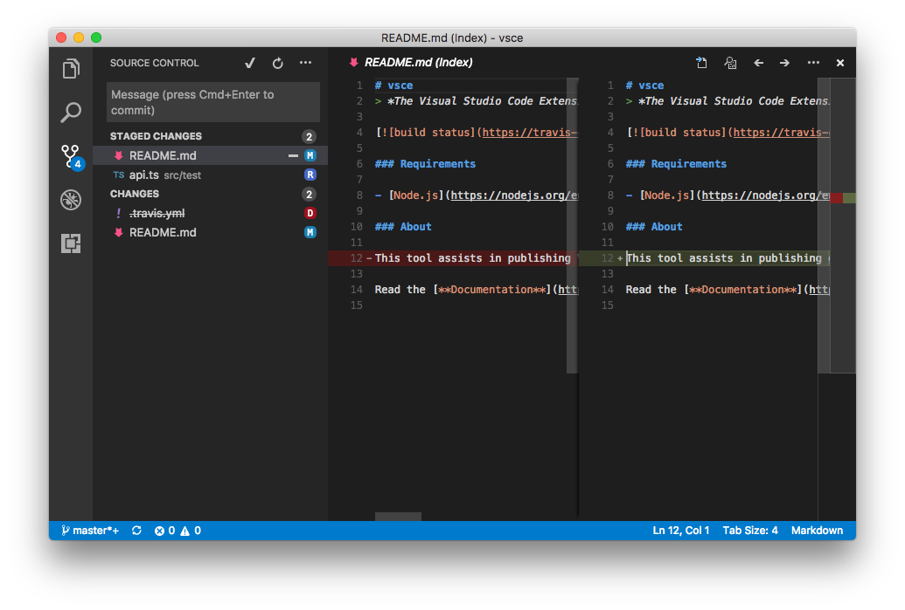

# Source Control in VS Code

Visual Studio Code allows extension authors to define Source Control Management (SCM) features its extension API. There is a slim, yet powerful API surface which allows many different SCM systems to be integrated in Visual Studio Code, while having a common user interface in all of them.



**SCM providers** are the key component to the SCM extensibility story. Code itself ships with one: the Git SCM provider. If you want to integrate another SCM system, you'll want to start by implementing an SCM provider. Let's start with this.

Note that you can always refer to the [`vscode` namespace API reference](http://code.visualstudio.com/docs/extensionAPI/vscode-api#_scm) in our docs.

## SCM Model

An SCM provider is the entity resposible for populating the SCM model with **resources**. SCM resources are themselves organized in **resource groups**. An SCM provider should return a sorted collection of resource groups.

You can register a new SCM provider with `vscode.scm.registerSCMProvider`.

In order to understand those concepts, let's take the Git provider as an example as well as the following result of a `git status` call:

```
vsce master* → git status
On branch master
Your branch is up-to-date with 'origin/master'.
Changes to be committed:
  (use "git reset HEAD <file>..." to unstage)

        modified:   README.md
        renamed:    src/api.ts -> src/test/api.ts

Changes not staged for commit:
  (use "git add/rm <file>..." to update what will be committed)
  (use "git checkout -- <file>..." to discard changes in working directory)

        deleted:    .travis.yml
        modified:   README.md
```

There are many things going on in this workspace. First, the `README.md` file has been modified, staged and then modified once again. The `src/api.ts` file has been moved to `src/test/api.ts` and that move was staged. Finally, the `.travis.yml` file has been deleted.

For this workspace, Git defines two SCM resource groups: the **working tree** and the **index**. Each _file change_ within that group is an SCM resource:

- **Index** resource group (2 resources)
  - `README.md`, modified
  - `src/test/api.ts`, renamed from `src/api.ts`
- **Working Tree** resource group (2 resources)
  - `.travis.yml`, deleted
  - `README.md`, modified

Note how the same file, `README.md`, can be contained within two different SCM resources.

Here's how a provider is able to return this model:

```ts
export interface SCMProvider {
  // ...
  resources: SCMResourceGroup[];
  onDidChange?: Event<SCMProvider>;
  ///
}
```

The `resources` field is a pointer to the model at any given point in time. A provider is able to let Code know that this model has changed by firing the `onDidChange` event.

## SCM View

By providing SCM resources, the SCM provider populates the SCM view in Code.

### SCM Input Box

## Quick Diff

## Misc

`activeProvider`

## Next Steps

To learn more about VS Code extensibility model, try these topics:

* [Example Debuggers](/docs/extensions/example-debuggers.md) - See a working 'mock' debugger example
* [Extension API Overview](/docs/extensionAPI/overview.md) - Learn about the full VS Code extensibility model.
* [Extension Manifest File](/docs/extensionAPI/extension-manifest.md) - VS Code package.json extension manifest file reference
* [Contribution Points](/docs/extensionAPI/extension-points.md) - VS Code contribution points reference
