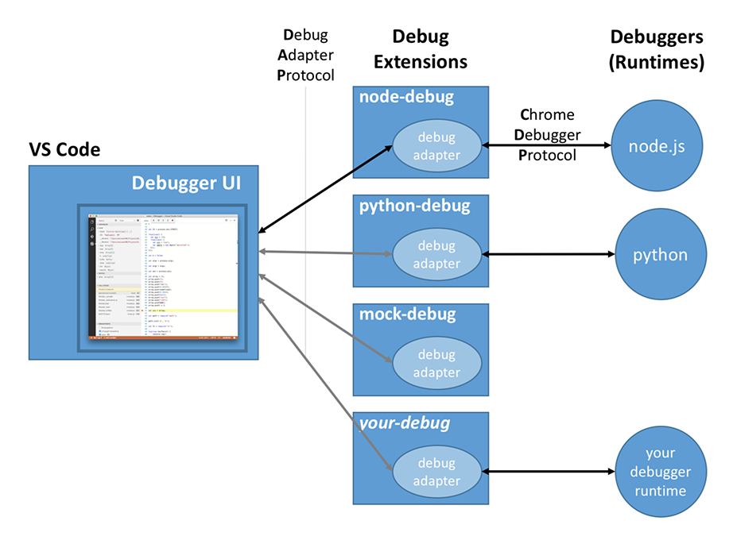
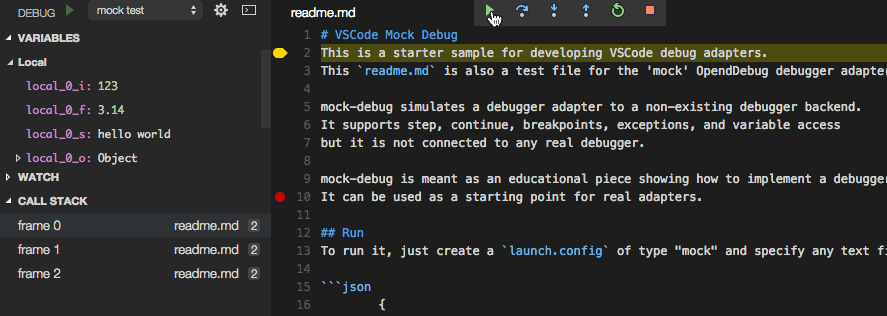
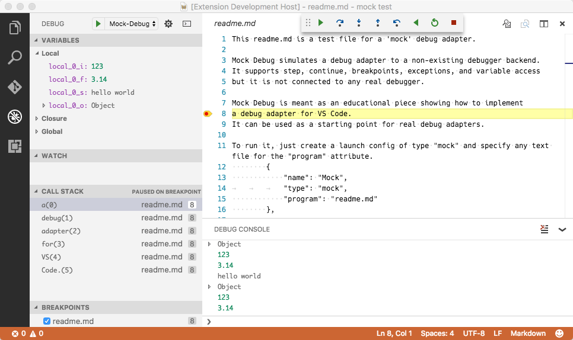
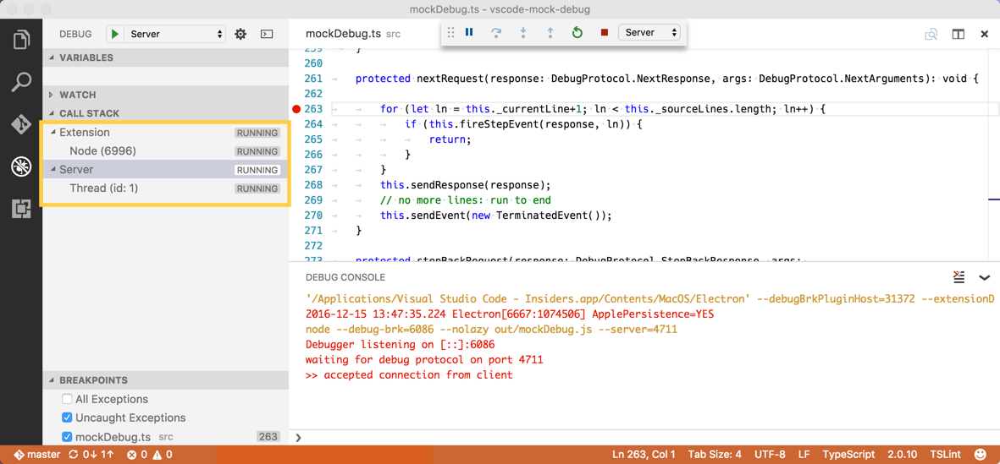

# Example - Debuggers

Since Visual Studio Code implements a generic (language agnostic) debug UI, it cannot talk to real debuggers directly but instead relies
on debug extensions for implementing the debugger or runtime specific functionality.

These debug extensions differ from other extensions in that their implementation is not running in the extension host, but as a separate standalone program, a so-called _debug adapter_. We call these programs adapters because they "adapt" the API or protocol of a concrete debugger or runtime to the _VS Code Debug Protocol_ used by VS Code.



The reasons for implementing the debug adapters as standalone excutables are twofold: first, it makes it possible to implement the adapter in the language most suitable for the given debugger or runtime. Second, a standalone program can more easily run in elevated mode if this is required by the underlying debugger or runtime.

In order to avoid problems with local firewalls, VS Code communicates with the adapter through stdin/stdout instead of using a more sophisticated mechanism (e.g. sockets).

Every debug extension defines a debug `type` which is referenced from a VS Code launch configuration.
When a debug session is started, VS Code looks up the debug extension based on the debug type and launches the extension's debug adapter executable as a separate process. When the debug session ends, the adapter is stopped.

Visual Studio Code ships with two debug extensions for Node.js: `node-debug` uses the (deprecated) v8 Debugger Protocol for node versions < 6.3 and `node-debug2` uses the Chrome Debugger Protocol (CDP) supported by node versions >= 6.3. Many more debugger extensions are available from the [VS Code Marketplace](https://marketplace.visualstudio.com/vscode/Debuggers) or you can create a debugger extension yourself.

The rest of this document shows how to create a debugger extension.

## The Mock Debug Extension

Since creating a debug adapter from scratch is a bit heavy for this tutorial, we will start with a simple debug adapter which we have created as an educational debug adapter 'starter kit'. It is called _Mock Debug_ because it does not talk to a real debugger but it 'mocks' one. So Mock Debug simulates a debugger and supports step, continue, breakpoints, exceptions, and variable access but it is not connected to any real debugger.

Before delving into the development setup for mock-debug, let's first install a [pre-built version](https://marketplace.visualstudio.com/items/andreweinand.mock-debug)
from the VS Code Marketplace and play with it:

* switch to the Extensions viewlet and type 'mock' to search for the Mock Debug extension,
* 'Install' and 'Reload' the extension.

To try Mock Debug:

* Create a new empty folder `mock test` and open it in VS Code.
* Create a file `readme.md` and enter several lines of arbitrary text.
* Switch to the Debug view and press the gear icon.
* VS Code will let you select an 'environment' in order to create a default launch configuration. Pick "Mock Debug".
* Press the green Start button and then Enter to confirm the suggested file 'readme.md'.

A debug session starts and you can 'step' through the readme file, set and hit breakpoints, and run into exceptions (if the word `exception` appears in a line).



Before using Mock Debug as a starting point for your own development, we recommend to uninstall the pre-built version first:

* switch to the Extensions viewlet and click on the gear icon of the Mock Debug extension,
* run the 'uninstall' action and then 'Reload' the window.

## Development Setup for mock-debug

Now let's get the source for Mock Debug and start development on it within VS Code:

```
git clone https://github.com/Microsoft/vscode-mock-debug.git
cd vscode-mock-debug
npm install
```

Open the project folder `vscode-mock-debug` in VS Code.

What's in the package?

* `package.json` is the manifest for the mock-debug extension:
  - it lists the contributions of the mock-debug extension,
  - the `compile` and `watch` scripts are used to transpile the TypeScript source into the `out` folder and watch for subsequent source modifications,
  - the dependencies `vscode-debugprotocol`, `vscode-debugadapter`, and `vscode-debugadapter-testsupport` are NPM modules that simplify the development of node-based debug adapters.
* the implementation of the debug adapter of the extension lives in `src/mockDebug.ts`. Here you find the handlers for the various requests of the VS Code debug protocol.
* since the implementation of debug extension lives in the debug adapter, there is no need to have extension code at all (i.e. code that runs in the extension host process). However, Mock Debug has a small `src/extension.ts` because it illustrates what can be done in the extension code of a debug extension.

Now build and launch the mode-debug extension by selecting the `Extension` launch configuration and hitting `F5`.
Initially this will do a full transpile of the TypeScript sources into the `out` folder.
After the full build, a 'watcher task' is started that incrementally transpiles any changes you make.

After transpiling the source, a new VS Code window ('[Extenson Development Host]') appears with the mock-debug extension now running in debug mode. From that window open your `mock test` project with the `readme.md` file, start a debug session with 'F5', and then step through it:



Since you are running the extension in debug mode, you could now set and hit breakpoints in `src/extension.ts` but as I've mentioned above, there is not much interesting code executing in the extension. The interesting code runs in the debug adapter which is a separate process.

In order to debug the debug adapter itself, we have to run it in debug mode. This is most easily achieved by running the debug adapter in 'server mode' and configure VS Code to connect to it. In your VS Code vscode-mock-debug project select the launch configuration 'server' from the drop down menu and press the green Start button.

Since we already had an active debug session for the extension the VS Code debugger UI now enters 'multi session' mode which is indicated by seeing the names of the two debug sessions **Extension** and **Server** showing up in the CALL STACK view:



Now we are able to debug both the extension and the debug adapter simultanously.
A faster way to arrive here is by using the **Extension + Server** launch configuration which launches both sessions automatically.

Set a breakpoint at the beginning of method `launchRequest(...)` in file `src/mockDebug.ts` and as a last step configure the mock debugger to connect to the debug adapter server by adding a `debugServer` attribute for port `4711` to your mock test launch config:

```json
{
    "version": "0.2.0",
    "configurations": [
        {
            "type": "mock",
            "request": "launch",
            "name": "mock test",
            "program": "${workspaceRoot}/readme.md",
            "stopOnEntry": true,
            "debugServer": 4711
        }
    ]
}
```

If you now launch this debug configuration, VS Code does not start the mock debug adapter as a separate process but directly connects to local port 4711 of the already running server and you should hit the breakpoint in `launchRequest`.

With this setup you can now easily edit, transpile, and debug Mock Debug.

Now the real work begins: you will have to replace the 'mock' implementation by some 'real' code that talks to your debugger or runtime.

## Anatomy of the Debug Adapter package.json

Let's have a closer look at the debug adapter contribution of an VS Code extension.
Like every VS Code extension, a debug adapter extension has a `package.json` file that declares the fundamental properties **name**, **publisher**,
and **version** of the extension. Use the **categories** field to make the extension easier to find in the VS Code Extension Marketplace.

```json
{
    "name": "mock-debug",
    "version": "0.17.0",
    "publisher": "andreweinand",
    "description": "Starter extension for developing debug adapters for VS Code.",
    "engines": {
        "vscode": "^1.1.0",
        "node": "^6.5.0"
    },
    "categories": [ "Debuggers" ],

    "contributes": {
        "breakpoints": [
            {
                "language": "markdown"
            }
        ],
        "debuggers": [{
            "type": "mock",
            "label": "Mock Debug",

            "program": "./out/mockDebug.js",
            "runtime": "node",

            "configurationAttributes": {
                "launch": {
                    "required": ["program"],
                    "properties": {
                        "program": {
                            "type": "string",
                            "description": "Absolute path to a text file.",
                            "default": "${workspaceRoot}/readme.md"
                        },
                        "stopOnEntry": {
                            "type": "boolean",
                            "description": "Automatically stop after launch.",
                            "default": true
                        }
                    }
                }
            },

            "initialConfigurations": [
                {
                    "type": "mock",
                    "name": "Mock-Debug",
                    "request": "launch",
                    "program": "readme.md",
                    "stopOnEntry": true
                }
            ]
        }]
    }
}
```

Take a look at the **contributes** section. First we use the **breakpoints** contribution point to list the languages for which setting breakpoints will be enabled.

Next is the **debuggers** section. Here one debug adapter is introduced under a (unique) debug **type** `mock`. The user can reference this type in his launch configurations. The optional attribute **label** can be used to give the debug type a nicer name when showing it in the UI.

Since a debug adapter is a standalone application, a path to that application is specified under the **program** attribute.
In order to make the extension self-contained the application must live inside the extension folder.
By convention we keep this applications inside a folder named `out` or `bin` but you are free to use a different name.

Since VS Code runs on different platforms, we have to make sure that the debug adapter program supports the different platforms as well.
For this we have the following options:

1. If the program is implemented in a platform independent way, e.g. as program that runs on a runtime that is available on all supported platforms, you can specify this runtime via the **runtime** attribute. As of today, VS Code supports `node` and `mono` runtimes. Our Mock Debug adapter from above uses this approach.

1. If your debug adapter implementation needs different executables on different platforms, the **program** attribute can be qualified for specific platforms like this:

    ```json
    "debuggers": [{
        "type": "gdb",
        "windows": {
            "program": "./bin/gdbDebug.exe",
        },
        "osx": {
            "program": "./bin/gdbDebug.sh",
        },
        "linux": {
            "program": "./bin/gdbDebug.sh",
        }
    }]
    ```

1. A combination of both approaches is possible too. The following example is from the Mono Debug adapter which is implemented as a mono application that needs a runtime on OS X and Linux but not on Windows:

    ```json
    "debuggers": [{
        "type": "mono",
        "program": "./bin/monoDebug.exe",
        "osx": {
            "runtime": "mono"
        },
        "linux": {
            "runtime": "mono"
        }
    }]
    ```

**configurationAttributes** represent attributes that are specific for your debugger and are used for validation and suggestion of values in 'launch.json'.

**initialConfigurations** is used when VS Code generates the 'launch.json'. This should be a default launch configuration that covers configuration attributes of your adapter.


## Publishing your Debug Adapter

Once you have created your debug adapter you can publish it to the Marketplace:

* update the attributes in the `package.json` to reflect the naming and purpose of your debug adapter.
* upload to the Marketplace as described in [Share an Extension](/docs/tools/vscecli.md) section.