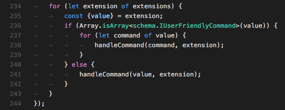
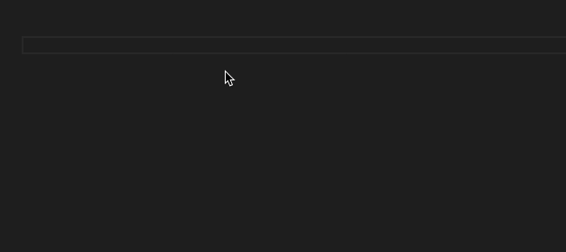
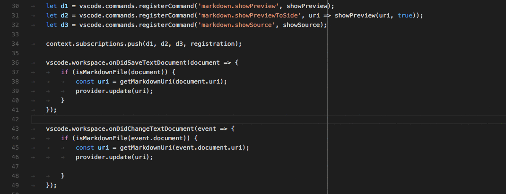
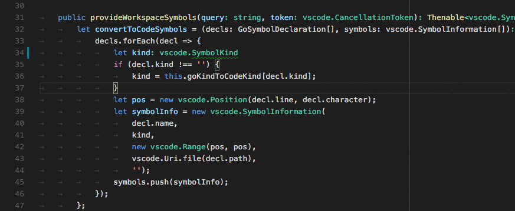
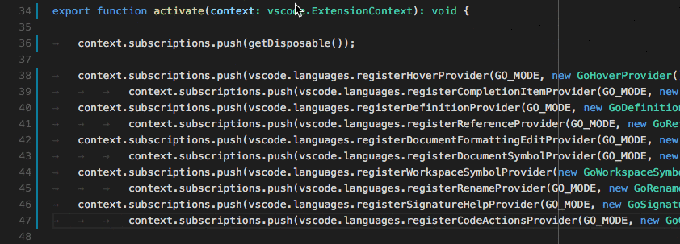

# VS Code Language Extensions
When you hear about a language being supported in VS Code, you
usually think first of syntax highlighting, code completion, and if applicable
debugging support. This is a good start, but language extensions can do a lot more.

By providing configuration files, an extension can support syntax highlighting,
snippets, and some smart editing features. For more advanced features your extension needs to
do real work. We recommend that you implement a language server your extension talks to.

A language server is a stand-alone server that speaks the
[language server protocol](https://github.com/Microsoft/language-server-protocol/blob/master/protocol.md).
You can implement the server in the language that is best suited for the task. For example,
if there are good libraries written in Python for the language you want to support, you
might want to consider implementing your language server in Python. If you choose to implement your
language server in JavaScript or TypeScript you can build on top of our
[npm modules](https://github.com/Microsoft/vscode-languageserver-node).

Besides the implementation language, you have flexibility in deciding which parts of the
[language server protocol](https://github.com/Microsoft/language-server-protocol/blob/master/protocol.md)
your language server implements. The only thing you have to make sure is that your server
correctly announces its capabilities in response to the `initialize` method.

However, the language server architecture is not the only possible way to implement your
extension. You can also implement the various language support features directly in your extension.

In order to make it easier for you to decide what to implement first and what to improve later on
we list the various support features below with examples of how they are exposed to users and to which
classes and methods or language server protocol messages they map to.

After that we'll list some methods that are available to manager the state in your extension.


## Syntax Highlighting



In order to support syntax highlighting your extension needs to registers a TextMate grammar for its
language in its `package.json` file.
```json
"contributes": {
	"languages": [
		{
			"id": "markdown",
			...
		}
	],
	"grammars": [
		{
			"language": "markdown",
			"scopeName": "text.html.markdown",
			"path": "./syntaxes/markdown.tmLanguage"
		}
	], ...
}
```

#### Basic
 Start with a simple grammar that supports colorization of strings, comments, keywords, etc.

#### Advanced
Provide a grammar that understands terms and expressions and thus supports colorization of variables and function references etc.


## Provide Out-Of-The-Box Code Snippets



With snippets you can provide useful code template with placeholders. You need to register a file that contains the
snippets for your language in your extension's `package.json` file.

```json
"snippets": [
	{
		"language": "javascript",
		"path": "./snippets/javascript.json"
	}, ...
]
```

#### Basic
Provide snippets with placeholders such as this example for `markdown`:

```json
"Insert ordered list": {
	"prefix": "ordered list",
	"body": [
		"1. ${first}",
		"2. ${second}",
		"3. ${third}",
		"$0"
	],
	"description": "Insert ordered list"
}
```

#### Advanced
Provide snippets that use explicit tab stops to guide the user and use nested placeholders such
as this example for `groovy`

```json
"key: \"value\" (Hash Pair)": {
		"prefix": "key",
		"body": "${1:key}: ${2:\"${3:value}\"}"
	}
```


## Support Smart Editing


You can provide a language configuration in your extension's `package.json` file.

```json
"contributes": {
	"languages": [
		{
			"id": "typescript",
			...
			"configuration": "./language-configuration.json"
		}, ...
	]
	...
}
```

#### Basic
None

#### Advanced
Here is an example from `TypeScript`:

```json
{
	"comments": {
		"lineComment": "//",
		"blockComment": [ "/*", "*/" ]
	},
	"brackets": [
		["{", "}"],
		["[", "]"],
		["(", ")"],
		["<", ">"]
	],
	"autoClosingPairs": [
		{ "open": "{", "close": "}" },
		{ "open": "[", "close": "]" },
		{ "open": "(", "close": ")" },
		{ "open": "'", "close": "'", "notIn": ["string", "comment"] },
		{ "open": "\"", "close": "\"", "notIn": ["string"] },
		{ "open": "`", "close": "`", "notIn": ["string", "comment"] },
		{ "open": "/**", "close": " */", "notIn": ["string"] }
	],
	"surroundingPairs": [
		["{", "}"],
		["[", "]"],
		["(", ")"],
		["<", ">"],
		["'", "'"],
		["\"", "\""],
		["`", "`"]
	]
}
```


## Show Hovers
Hovers show information about the symbol/object that's below the mouse cursor. This usually is
the type of the symbol including some documentation.


#### Language Server Protocol
In its response to the `initialize` method your language server needs to announce that it provides hovers.

```json
{
	...
	"capabilities" : {
		"hoverProvider" : "true",
		...
	}
}
```

In addition, your language server needs to respond to `textDocument/hover`.

#### Direct Implementation
```ts
class GoHoverProvider implements HoverProvider {
 public provideHover(document: TextDocument, position: Position, token: CancellationToken): Thenable<Hover> {
  ...
 }
}

export function activate(ctx: vscode.ExtensionContext): void {
 ...
 ctx.subscriptions.push(vscode.languages.registerHoverProvider(GO_MODE, new GoHoverProvider()));
 ...
}
```

#### Basic
Show type information and include document if available.

#### Advanced
Colorize method signatures in the same style you colorize the code.


## Show Code Completion Proposals
Code completion provide context sensitive suggestions to users.


#### Language Server Protocol
In its response to the `initialize` method your language server needs to announce
that it provides completions and whether or not it supports the `completionItem\resolve`
method to provide additional information for the computed completion items.

```json
{
	...
	"capabilities" : {
		"completionProvider" : {
			"resolveProvider": "true",
			"triggerCharacters": [ '.' ]
		}
		...
	}
}
```

#### Direct Implementation
```ts
class GoCompletionItemProvider implements vscode.CompletionItemProvider {
 public provideCompletionItems(document: vscode.TextDocument, position: vscode.Position, token: vscode.CancellationToken): Thenable<vscode.CompletionItem[]> {
  ...
 }
}

export function activate(ctx: vscode.ExtensionContext): void {
 ...
 ctx.subscriptions.push(getDisposable());
 ctx.subscriptions.push(vscode.languages.registerCompletionItemProvider(GO_MODE, new GoCompletionItemProvider(), '.', '\"'));
 ...
}
```

#### Basic
You don't support resolve providers. Completions are computed based on the state saved on disk.

#### Advanced
Completion items are computed based on the un-saved contents of current open editors. You support resolve
providers that compute additional information for completion proposal the user selects, This information is
being displayed along-side with the selected item.


## Provide Diagnostics
Diagnostics are a way to indicate issues with the code.


#### Language Server Protocol

Your language server send the `textDocument/publishDiagnostics` message to the
language client. The message carries an array of diagnostic items for a resource URI.

**Note**: The client is not asking the server for diagnostics. The server pushes
the diagnostic information to the client.

#### Direct Implementation
```ts
let diagnosticCollection: vscode.DiagnosticCollection;

export function activate(ctx: vscode.ExtensionContext): void {
 ...
 ctx.subscriptions.push(getDisposable());
 diagnosticCollection = vscode.languages.createDiagnosticCollection('go');
 ctx.subscriptions.push(diagnosticCollection);
 ...
}

function onChange() {
 let uri = document.uri;
 check(uri.fsPath, goConfig).then(errors => {
  diagnosticCollection.clear();
  let diagnosticMap: Map<string, vscode.Diagnostic[]> = new Map();
  errors.forEach(error => {
   let canonicalFile = vscode.Uri.file(error.file).toString();
   let range = new vscode.Range(error.line - 1, error.startColumn, error.line - 1, error.endColumn);
   let diagnostics = diagnosticMap.get(canonicalFile);
   if (!diagnostics) { diagnostics = []; }
   diagnostics.push(new vscode.Diagnostic(range, error.msg, error.severity));
   diagnosticMap.set(canonicalFile, diagnostics);
  });
  diagnosticMap.forEach((diags, file) => {
   diagnosticCollection.set(vscode.Uri.parse(file), diags);
  });
 })
}
```

#### Basic
Report diagnostics for open editors. Minimally, this needs to happen on every
save. Better, diagnostics should be computed based on the un-saved contents of
the editor.

#### Advanced
Report diagnostics not only for the open editors but for all resources in the
open folder, no matter whether they have ever been opened in an editor or not.


## Help With Function and Method Signatures
When the user enters a function or method call your extension can help with
information about the function/method that is being called.


#### Language Server Protocol
In its response to the `initialize` method your language server needs to announce
that it provides signature help.

```json
{
	...
	"capabilities" : {
		"signatureHelpProvider" : {
			"triggerCharacters": [ '(' ]
		}
		...
	}
}
```
In addition, your language server needs to respond to `textDocument/signatureHelp`.


#### Direct Implementation
```ts
class GoSignatureHelpProvider implements SignatureHelpProvider {
 public provideSignatureHelp(document: TextDocument, position: Position, token: CancellationToken): Promise<SignatureHelp> {
 ...
 }
}

export function activate(ctx: vscode.ExtensionContext): void {
 ...
 ctx.subscriptions.push(vscode.languages.registerSignatureHelpProvider(GO_MODE, new GoSignatureHelpProvider(), '(', ','));
}
```

#### Basic
Ensure that the signature help contains the documentation of the parameters
of the function or method.

#### Advanced
Nothing additional.


## Show Definitions of a Symbol
Allow users to see the definition of variables/functions/methods right where the variables/functions/methods are being used.



#### Language Server Protocol
In its response to the `initialize` method your language server needs to announce
that it provides goto-definition locations.

```json
{
	...
	"capabilities" : {
		"definitionProvider" : "true"
		...
	}
}
```
In addition, your language server needs to respond to `textDocument/definition`.

#### Direct Implementation
```ts
class GoDefinitionProvider implements vscode.DefinitionProvider {
 public provideDefinition(document: vscode.TextDocument, position: vscode.Position, token: vscode.CancellationToken): Thenable<vscode.Location> {
  ...
 }
}

export function activate(ctx: vscode.ExtensionContext): void {
 ...
 ctx.subscriptions.push(vscode.languages.registerDefinitionProvider(GO_MODE, new GoDefinitionProvider()));
}
```

#### Basic
If a symbol is ambivalent, you can show multiple definitions.

#### Advanced
Nothing additional.


## Find All References to a Symbol
Allow users to see all the places where a certain
variable/function/method/symbol is being used.


#### Language Server Protocol
In its response to the `initialize` method your language server needs to announce
that it provides symbol reference locations.

```json
{
	...
	"capabilities" : {
		"referencesProvider" : "true"
		...
	}
}
```
In addition, your language server needs to respond to `textDocument/references`.


#### Direct Implementation
```ts
class GoReferenceProvider implements vscode.ReferenceProvider {
 public provideReferences(document: vscode.TextDocument, position: vscode.Position, options: { includeDeclaration: boolean }, token: vscode.CancellationToken): Thenable<vscode.Location[]> {
  ...
 }
}

export function activate(ctx: vscode.ExtensionContext): void {
 ...
 ctx.subscriptions.push(vscode.languages.registerReferenceProvider(GO_MODE, new GoReferenceProvider()));
}
```

#### Basic
Return the location (resource URI and range) for all references.

#### Advanced
Nothing additional.


#### Highlight All Occurrences of a Symbol in a Document
Allow users to see all occurrences of a symbol in the open editor.


#### Language Server Protocol
In its response to the `initialize` method your language server needs to announce
that it provides symbol document locations.

```json
{
	...
	"capabilities" : {
		"documentHighlightProvider" : "true"
		...
	}
}
```
In addition, your language server needs to respond to `textDocument/documentHighlight`.

#### Direct Implementation
```ts
class GoDocumentHighlightProvider implements vscode.DocumentHighlightProvider {
 public provideDocumentHighlights(document: vscode.TextDocument, position: vscode.Position, token: vscode.CancellationToken): vscode.DocumentHighlight[] | Thenable<vscode.DocumentHighlight[]>;
  ...
 }
}

export function activate(ctx: vscode.ExtensionContext): void {
 ...
 ctx.subscriptions.push(vscode.languages.registerDocumentHighlightProvider(GO_MODE, new GoDocumentHighlightProvider()));
}
```

#### Basic
You return the ranges in the editor's document where the
references are being found.

#### Advanced
Nothing additional.


## Show all Symbol Definitions Within a Document
Allow users to quickly navigate to any symbol definition in the open editor.


#### Language Server Protocol
In its response to the `initialize` method your language server needs to announce
that it provides symbol document locations.

```json
{
	...
	"capabilities" : {
		"documentSymbolProvider" : "true"
		...
	}
}
```
In addition, your language server needs to respond to `textDocument/documentSymbol`.

#### Direct Implementation
```ts
class GoDocumentSymbolProvider implements vscode.DocumentSymbolProvider {
 public provideDocumentSymbols(document: vscode.TextDocument, token: vscode.CancellationToken): Thenable<vscode.SymbolInformation[]> {
  ...
 }
}

export function activate(ctx: vscode.ExtensionContext): void {
 ...
 ctx.subscriptions.push(vscode.languages.registerDocumentSymbolProvider(GO_MODE, new GoDocumentSymbolProvider()));
}
```

#### Basic
Return all symbols in the document. Define the kinds of symbols such as variables,
functions, classes, methods, etc.

#### Advanced
Nothing additional.


## Show all All Symbol Definitions in Folder
Allow users to quickly navigate to any symbol definition anywhere in the folder being opened in VS Code.


#### Language Server Protocol
In its response to the `initialize` method your language server needs to announce
that it provides global symbol locations.

```json
{
	...
	"capabilities" : {
		"workspaceSymbolProvider" : "true"
		...
	}
}
```
In addition, your language server needs to respond to `workspace/symbol`.

#### Direct Implementation
```ts
class GoWorkspaceSymbolProvider implements vscode.WorkspaceSymbolProvider {
 public provideWorkspaceSymbols(query: string, token: vscode.CancellationToken): Thenable<vscode.SymbolInformation[]> {
  ...
 }
}

export function activate(ctx: vscode.ExtensionContext): void {
 ...
 ctx.subscriptions.push(vscode.languages.registerWorkspaceSymbolProvider(new GoWorkspaceSymbolProvider()));
}
```

#### Basic
Return all symbols define by the code within the folder opened in VS Code. Define the kinds of symbols such as variables,
functions, classes, methods, etc.

#### Advanced
Nothing additional.


## Possible Actions on Errors or Warnings
Provide users with possible actions right next to an error or warning. If actions are available for
a light bulb appears next to the error or warning. When the user clicks the light bulb
a list of available code actions is presented.



#### Language Server Protocol
In its response to the `initialize` method your language server needs to announce
that it provides code actions.

```json
{
	...
	"capabilities" : {
		"codeActionProvider" : "true"
		...
	}
}
```
In addition, your language server needs to respond to `textDocument/codeAction`.

#### Direct Implementation
```ts
class GoCodeActionProvider implements vscode.CodeActionProvider {
	public provideCodeActions(document: vscode.TextDocument, range: vscode.Range, context: vscode.CodeActionContext, token: vscode.CancellationToken): Thenable<vscode.Command[]> {
  ...
 }
}

export function activate(ctx: vscode.ExtensionContext): void {
 ...
 ctx.subscriptions.push(vscode.languages.registerCodeActionsProvider(GO_MODE, new GoCodeActionProvider()));
}
```

#### Basic
Provide code actions for error/warning correcting actions.

#### Advanced
In addition, provide code manipulation actions such as refactoring. For example, `Extract Method`.


## Code Lens - Show Actionable Context Information Within Code
Provide users with actionable, contextual information that is displayed interspersed with the code.


#### Language Server Protocol
In its response to the `initialize` method your language server needs to announce
that it provides code lenses and whether it supports the `codeLens\resolve`
method to bind the code lense to its command.

```json
{
	...
	"capabilities" : {
		"codeLensProvider" : {
    		"resolveProvider": "true"
		}
		...
	}
}
```
In addition, your language server needs to respond to `textDocument/codeLens`.

#### Direct Implementation


#### Basic
Don't provide code lenses.

#### Advanced
Define the code lenses that are available for a document. Bind the code lens to
its command by responding to `codeLens/resolve`.


## Rename Symbols
Allow your users to rename a symbol and update all references to the symbol.


#### Language Server Protocol
In its response to the `initialize` method your language server needs to announce
that it provides code actions.

```json
{
	...
	"capabilities" : {
		"renameProvider" : "true"
		...
	}
}
```
In addition, your language server needs to respond to `textDocument/rename`.

#### Direct Implementation
```ts
class GoRenameProvider implements vscode.RenameProvider {
 public provideRenameEdits(document: vscode.TextDocument, position: vscode.Position, newName: string, token: vscode.CancellationToken): Thenable<vscode.WorkspaceEdit> {
  ...
 }
}

export function activate(ctx: vscode.ExtensionContext): void {
 ...
 context.subscriptions.push(vscode.languages.registerRenameProvider(GO_MODE, new GoRenameProvider()));
}
```

#### Basic
Don't provide rename support.

#### Advanced
Return the list of all workspace edits that need to be performed,
i.e. all edits across all files that contain references to the symbol.


## Format the Code in an Editor
Provide users with support for formatting whole documents.


#### Language Server Protocol
In its response to the `initialize` method your language server needs to announce
that it provides document formatting.

```json
{
	...
	"capabilities" : {
		"documentFormattingProvider" : "true"
		...
	}
}
```
In addition, your language server needs to respond to `textDocument/formatting`.

#### Direct Implementation
```ts
class GoDocumentFormatter implements vscode.DocumentFormattingEditProvider {
 public formatDocument(document: vscode.TextDocument): Thenable<vscode.TextEdit[]> {
  ...
 }
}

export function activate(ctx: vscode.ExtensionContext): void {
 ...
 context.subscriptions.push(vscode.languages.registerDocumentFormattingEditProvider(GO_MODE, new GoDocumentFormatter()));
}
```

#### Basic
Don't provide formatting support.

#### Advanced
You should always return the smallest possible text edits that result
in the code being formatted. This is crucial to ensure that markers such as diagnostic results etc.
are adjusted corrected and are not being lost.


## Format the Selected Lines in an Editor
Provide users with support for formatting a selected range of lines in a document.



#### Language Server Protocol
In its response to the `initialize` method your language server needs to announce
that it provides formatting support for ranges of lines.

```json
{
	...
	"capabilities" : {
		"documentRangeFormattingProvider" : "true"
		...
	}
}
```
In addition, your language server needs to respond to `textDocument/rangeFormatting`.

#### Direct Implementation
```ts
class GoDocumentRangeFormatter implements vscode.DocumentRangeFormattingEditProvider{
 public provideDocumentRangeFormattingEdits(document: vscode.TextDocument, range: vscode.Range, options: vscode.FormattingOptions, token: vscode.CancellationToken): Thenable<vscode.TextEdit[]>;
  ...
 }
}

export function activate(ctx: vscode.ExtensionContext): void {
 ...
 context.subscriptions.push(vscode.languages.registerDocumentRangeFormattingEditProvider(GO_MODE, new GoDocumentRangeFormatter()));
}
```

#### Basic
Don't provide formatting support.

#### Advanced
You should always return the smallest possible text edits that result
in the code being formatted. This is crucial to ensure that markers such as diagnostic results etc.
are adjusted corrected and are not being lost.


#### Incrementally Format Code as the User Types
Provide users with support for formatting text as the user types.
**Notes**: The user setting `editor.formatOnType` controls whether code gets formatted or not as the user types.


#### Language Server Protocol
In its response to the `initialize` method your language server needs to announce
that it provides formatting as the user types. It also needs to tell the client
on which characters formatting should be triggered. `moreTriggerCharacters` is optional.

```json
{
	...
	"capabilities" : {
		"documentOnTypeFormattingProvider" : {
			"firstTriggerCharacter": "}",
    		"moreTriggerCharacter": [";", ","]
		}
		...
	}
}
```
In addition, your language server needs to respond to `textDocument/onTypeFormatting`.

#### Direct Implementation
```ts
class GoOnTypingFormatter implements vscode.OnTypeFormattingEditProvider{
 public provideOnTypeFormattingEdits(document: vscode.TextDocument, position: vscode.Position, ch: string, options: vscode.FormattingOptions, token: vscode.CancellationToken): Thenable<vscode.TextEdit[]>;
  ...
 }
}

export function activate(ctx: vscode.ExtensionContext): void {
 ...
 context.subscriptions.push(vscode.languages.registerOnTypeFormattingEditProvider(GO_MODE, new GoOnTypingFormatter()));
}
```

#### Basic
Don't provide formatting support.

#### Advanced
You should always return the smallest possible text edits that result
in the code being formatted. This is crucial to ensure that markers such as diagnostic results etc.
are adjusted corrected and are not being lost.


