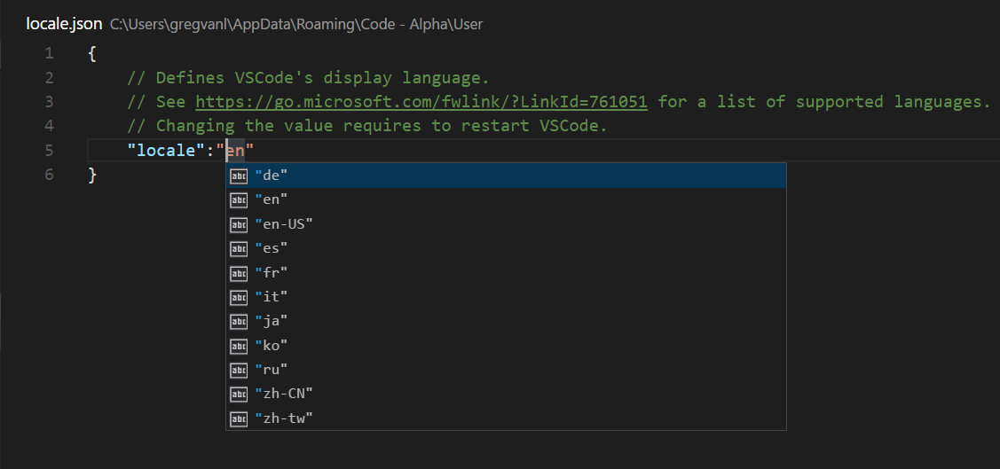

# Display Language

Visual Studio Code ships with 10 available display languages (locales): English (US), Simplified Chinese, Traditional Chinese, French, German, Italian, Japanese, Korean, Russian and Spanish.  Localized display text for all 10 languages is included in the main VS Code download and as such, doesn't require a secondary install.

By default, VS Code picks up the operating system's display language, falling back to English (US) if the locale is not supported.

## Available Locales

Display Language | Locale
-----------------|-------
English (US) | `en`
Simplified Chinese | `zh-CN`
Traditional Chinese | `zh-TW`
French | `fr`
German | `de`
Italian | `it`
Spanish | `es`
Japanese | `ja`
Korean | `ko`
Russian | `ru`
Bulgarian | `bg`
Hungarian | `hu`
Portuguese (Brazil) | `pt-br`
Turkish | `trk`

## Setting the Language

If you want to configure a specific language, you can either use the command line switch `--locale` to specify a locale when you launch a VS Code session or use the **Configure Language** command to persist the display language to use when VS Code is started.

Below is an example of using the `--locale` command line switch to set the VS Code display language to French:

```bash
code . --locale=fr
```

## Configure Language command

The **Configure Language** command creates a `locale.json` file in your user VS Code folder.  Set the `locale` attribute to your preferred locale.

Press `kb(workbench.action.showCommands)` to bring up the **Command Palette** then start typing "config" to filter and display the **Configure Language** command.


Press `kbstyle(Enter)` and a `locale.json` file is created with the default value set to your operating system language. You can use IntelliSense (`kb(editor.action.triggerSuggest)`) to select a different supported language locale.



Save `locale.json` and restart VS Code to use the new display language.

The example below sets VS Code to display Simplified Chinese `zh-CN`:

```json
{
    // Defines VS Code's display language.
    "locale":"zh-CN"
}
```

You can rerun the **Configure Language** command to review and change your `locale.json` file.

>**Note:** Changing the `locale` value requires a restart of VS Code.
