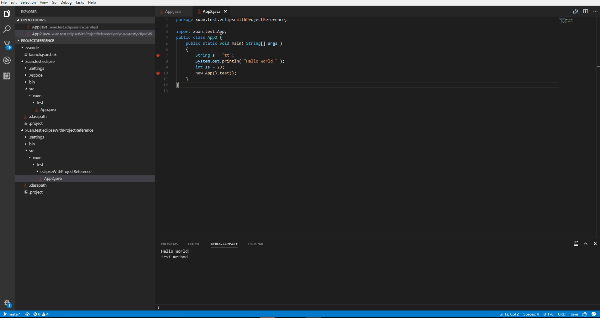
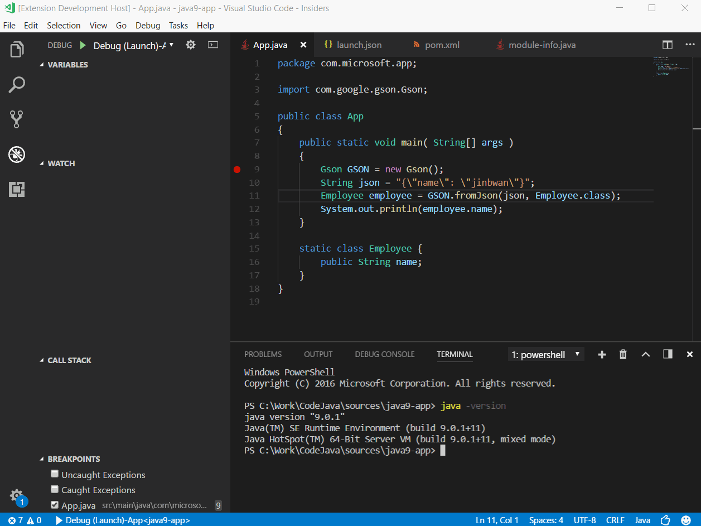
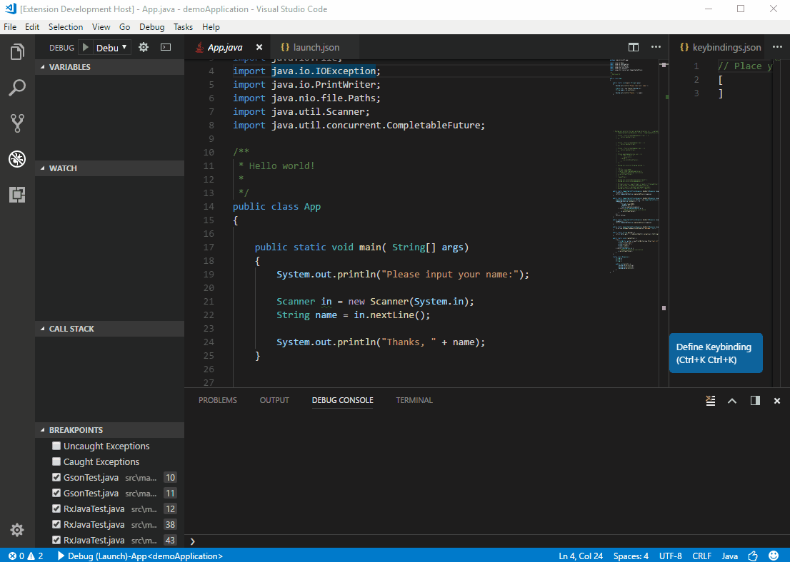
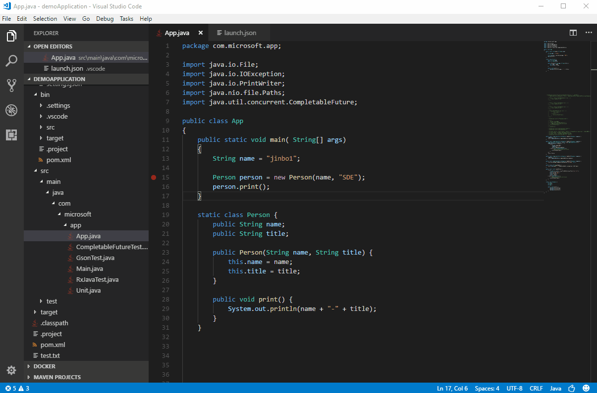
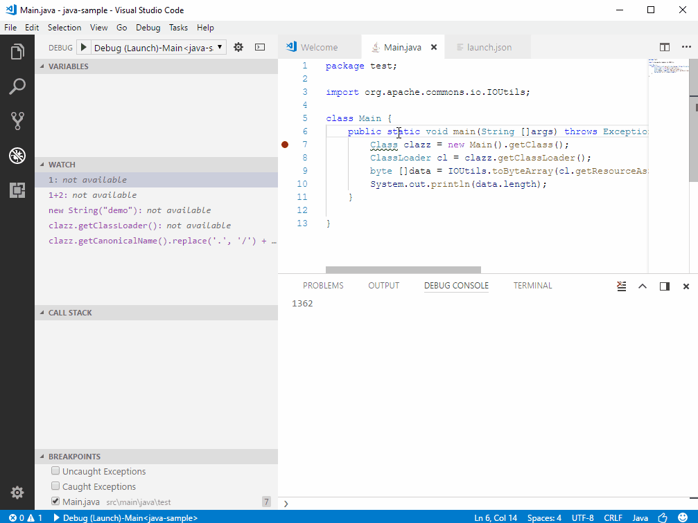
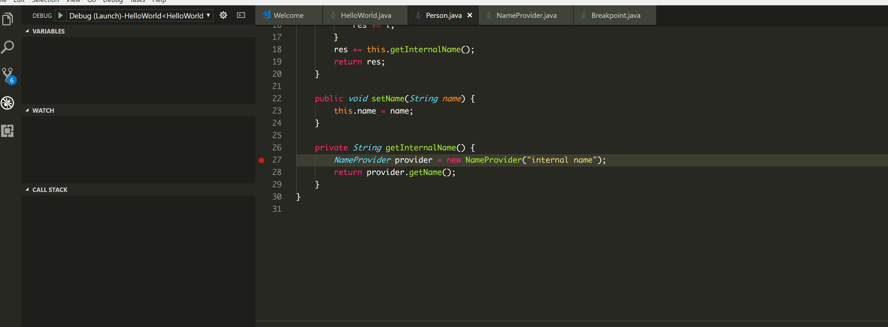
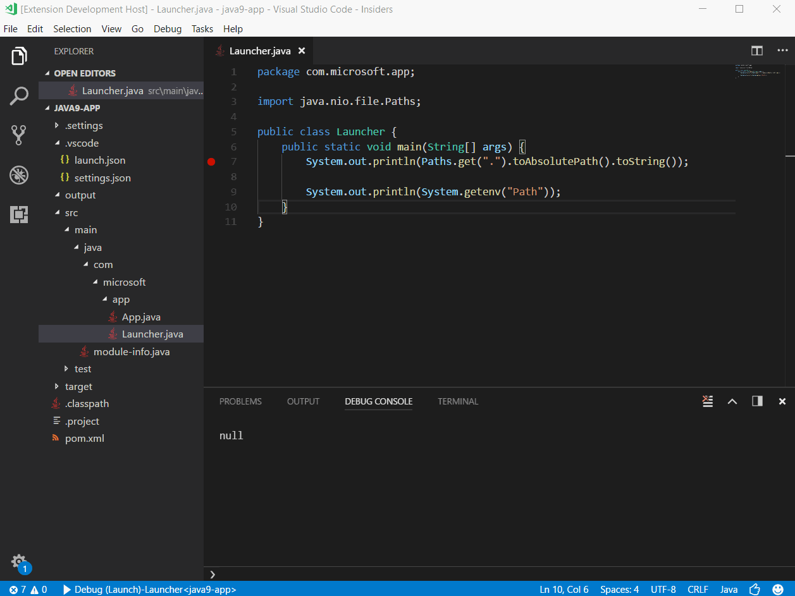
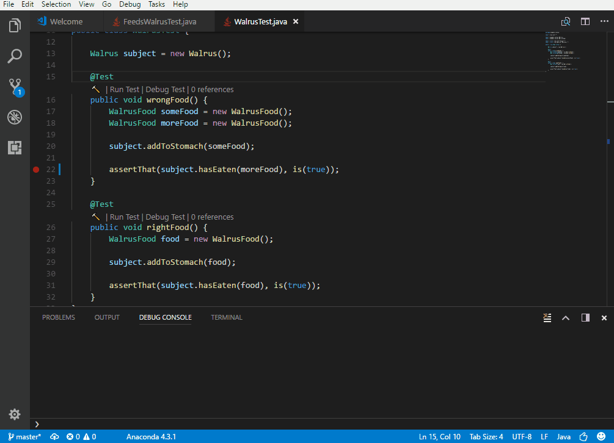
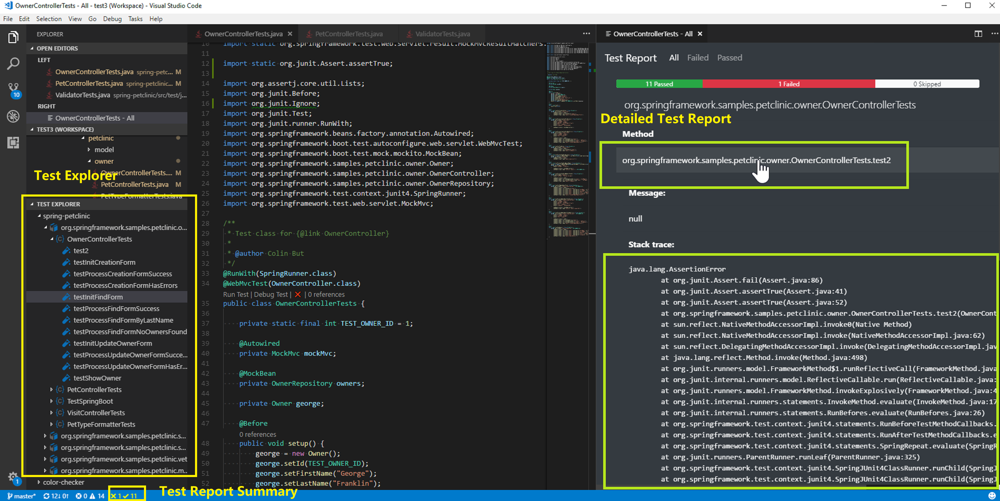

# Debugging Java in VS Code

## Overview

To enable debugging Java source code using Visual Studio Code, users need to install the [Debugger for Java](https://marketplace.visualstudio.com/items?itemName=vscjava.vscode-java-debug) extension.

It's a lightweight Java Debugger based on [Java Debug Server](https://github.com/Microsoft/java-debug) which extends the [Language Support for Java by Red Hat](https://marketplace.visualstudio.com/items?itemName=redhat.java).

Here's a list of supported debugging features:

- Launch/Attach
- Breakpoints
- Exceptions
- Pause & Continue
- Step In/Out/Over
- Variables
- Callstacks
- Threads
- Debug console

Just like VS Code, the debugger is an open source project which welcomes contributors to collaborate with us through our GitHub repositories:

- [Debugger for Java Extension](https://github.com/Microsoft/vscode-java-debug)
- [Java Debugger Server for Visual Studio Code](https://github.com/Microsoft/java-debug)

To run and debug JUnit test, you can install [Java Test Runner](https://marketplace.visualstudio.com/items?itemName=vscjava.vscode-java-test), which is another lightweight extension you can use to manage tests in your projects.

## Install

For the debugger to work, you also need to have the [Language Support for Java(TM) by Red Hat](https://marketplace.visualstudio.com/items?itemName=redhat.java) with your VS Code installed. To make it easier, we provide a [Java Extension Pack](https://marketplace.visualstudio.com/items?itemName=vscjava.vscode-java-pack) which bundles  the [Language Support for Java(TM) by Red Hat](https://marketplace.visualstudio.com/items?itemName=redhat.java), the [Debugger for Java](https://marketplace.visualstudio.com/items?itemName=vscjava.vscode-java-debug) and several other popular Java [extensions](/docs/java/extensions.md).

You can manually install the extension pack from the Extension view (`kb(workbench.view.extensions)`) by typing `vscode-java-pack` in the search box. You will also be prompted to install the Java Extension Pack when you edit a Java file in VS Code for the first time.

## Use

It's very easy to run and debug your Java application:

- Launch VS Code.
- Open a Java project (Maven/Gradle/Eclipse).
- Open a Java file to activate the extensions.
- (Optional) Add debug configurations and edit the `launch.json` configuration file.
- Press `kb(workbench.action.debug.start)`.

If there's no debug configuration file `launch.json` in your project, the debugger will automatically find the main class and generate the configuration for you to launch your application.

You can also configure the `launch.json` by yourself to set your customized settings or attach to another Java process.

Even if there's just a single Java file without any project, you can use VS Code to run and debug the file.

The Java debugger also supports external source files. This lets you debug third party classes when they are inside a JAR or a source attachment. Set your breakpoints in those classes before you start debugging. Java 9 is supported with VS Code as well.

The default Debug Console in VS Code doesn't support inputs. In case your program need inputs from terminal, you can use Integrated Terminal within VS Code or external terminal to launch it.

Step filter is supported by the extension to filter out types that you do not wish to see or step through while debugging. With this feature, you can configure the packages to filter within your `launch.json` so they could be skipped when you step through.

The debugger also lets you evaluate expressions in the **WATCH** window as well as the Debug Console> You can also use this feature for conditional breakpoint setting.

Another advanced feature the debugger supports is hot code replacement. Hot code replacement (HCR) is a debugging technique whereby the Java debugger transmits new class files over the debugging channel to another JVM. HCR facilitates experimental development and fosters iterative trial-and-error coding. With this new feature, you can start a debugging session and change a Java file in your development environment, and the debugger will replace the code in the running JVM. No restart is required, which is why it’s called "hot". Below is an illustration of how you can use HCR with Debugger for Java in VS Code.

There're a lot of different [options and settings](#_options) available with this Debugger. For example, configuring the current working directory (cwd) and environment variables could be easily done with launch options.

Please also check the documentation of [Language Support for Java by Red Hat](https://marketplace.visualstudio.com/items?itemName=redhat.java) if you have trouble setting up your project.

## Options

### Launch

- `mainClass` (required) - The main class of the program (fully qualified name, e.g. [mymodule/]com.xyz.MainClass).
- `args` - The command line arguments passed to the program.
- `sourcePaths` - The extra source directories of the program. The debugger looks for source code from project settings by default. This option allows the debugger to look for source code in extra directories.
- `modulePaths` - The modulepaths for launching the JVM. If not specified, the debugger will automatically resolve from current project.
- `classPaths` - The classpaths for launching the JVM. If not specified, the debugger will automatically resolve from current project.
- `encoding` - The `file.encoding` setting for the JVM. If not specified, 'UTF-8' will be used. Possible values can be found in http://docs.oracle.com/javase/8/docs/technotes/guides/intl/encoding.doc.html.
- `vmArgs` - The extra options and system properties for the JVM (e.g. -Xms\<size\> -Xmx\<size\> -D\<name\>=\<value\>).
- `projectName` - The preferred project in which the debugger searches for classes. There could be duplicated class names in different projects. This setting also works when the debugger looks for the specified main class when launching a program. It is required for expression evaluation.
- `cwd` - The working directory of the program.
- `env` - The extra environment variables for the program.
- `stopOnEntry` - Automatically pause the program after launching.
- `console` - The specified console to launch the program. Defaults to `internalConsole`.
  - `internalConsole` - VS Code Debug Console (input stream not supported).
  - `integratedTerminal` - VS Code Integrated Terminal.
  - `externalTerminal` - External terminal that can be configured in user settings.
- `stepFilters` - Skip specified classes or methods when stepping.
  - `classNameFilters` - Skip the specified classes when stepping. Class names should be fully qualified. Wildcard is supported.
  - `skipSynthetics` - Skip synthetic methods when stepping.
  - `skipStaticInitializers` - Skip static initializer methods when stepping.
  - `skipConstructors` - Skip constructor methods when stepping.

### Attach

- `hostName` (required) - The host name or IP address of remote debuggee.
- `port` (required) - The debug port of remote debuggee.
- `timeout` - Timeout value before reconnecting, in milliseconds (default to 30000ms).
- `sourcePaths` - The extra source directories of the program. The debugger looks for source code from project settings by default. This option allows the debugger to look for source code in extra directories.
- `projectName` - The preferred project in which the debugger searches for classes. There could be duplicated class names in different projects. This setting also works when the debugger looks for the specified main class when launching a program.
- `stepFilters` - Skip specified classes or methods when stepping.
  - `classNameFilters` - Skip the specified classes when stepping. Class names should be fully qualified. Wildcard is supported.
  - `skipSynthetics` - Skip synthetic methods when stepping.
  - `skipStaticInitializers` - Skip static initializer methods when stepping.
  - `skipConstructors` - Skip constructor methods when stepping.

### User Settings

- `java.debug.logLevel` - Minimum level of debugger logs that are sent to VS Code, defaults to `warn`.
- `java.debug.settings.showHex` - Show numbers in hex format in in the **VARIABLES** view, defaults to `false`.
- `java.debug.settings.showStaticVariables` - Show static variables in in the **VARIABLES** view, defaults to `true`.
- `java.debug.settings.showQualifiedNames` - Show fully qualified class names in in the **VARIABLES** view, defaults to `false`.
- `java.debug.settings.maxStringLength` - Maximum length of strings displayed in the **VARIABLES** view or Debug Console. Strings longer than this length will be trimmed. Default is `0` which means no trim is performed.
- `java.debug.settings.enableHotCodeReplace` - Enable hot code replacement for Java code. Make sure the auto build is not disabled for [VSCode Java](https://github.com/redhat-developer/vscode-java). See the [wiki page](https://github.com/Microsoft/vscode-java-debug/wiki/Hot-Code-Replace) for more information about usages and limitations.

## Feedback and Questions

You can find the full list of issues at [Issue Tracker](https://github.com/Microsoft/vscode-java-debug/issues). You can submit a [bug or feature suggestion](https://github.com/Microsoft/vscode-java-debug/issues/new), and participate in the community driven [Gitter](https://gitter.im/Microsoft/vscode-java-debug) channel.

## Run JUnit Tests

[Java Test Runner](https://marketplace.visualstudio.com/items?itemName=vscjava.vscode-java-test) allows you to run and debug your test cases.

You can also manage your test cases with **TEST EXPLORER**.

## Next Steps

Read on to find out about:

* [Debugging](/docs/editor/debugging.md) - Find out how to use the debugger with your project for any language.
