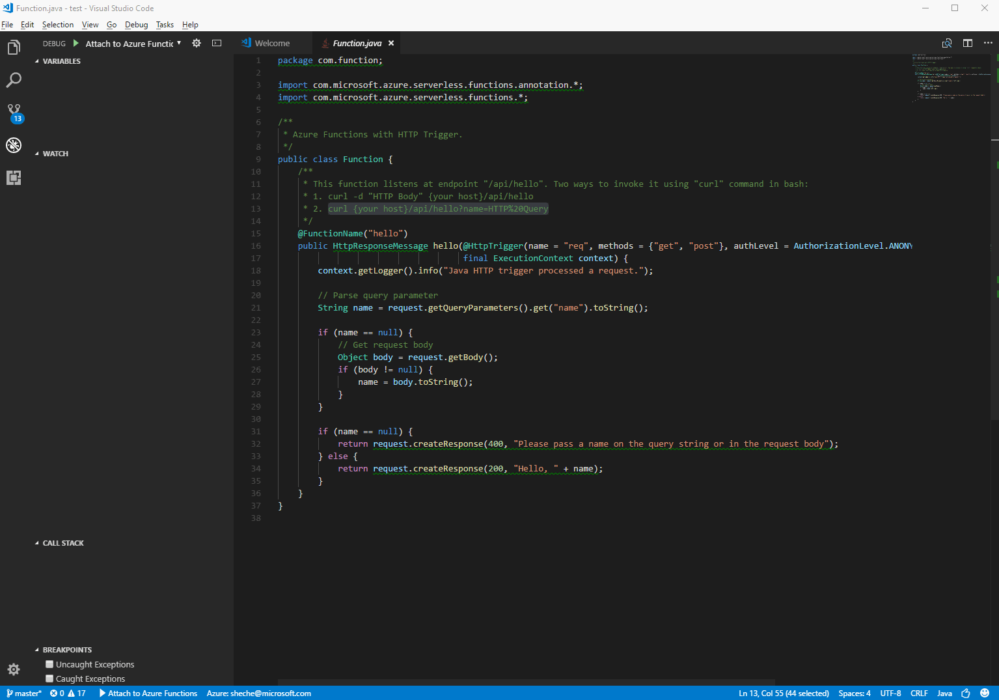
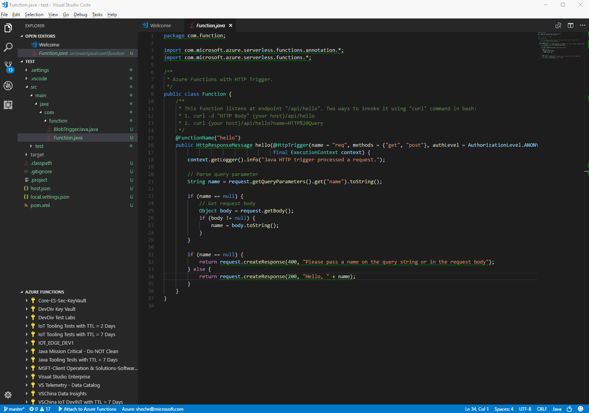

# Serverless Java Apps with VS Code

Serverless, as indicated by its name, allows you to execute your code in an environment without having to first create a VM or publish a web application.

This tutorial guides you through creating a [serverless](https://azure.microsoft.com/overview/serverless-computing/) function project and deploy to [Azure](https://azure.microsoft.com) with Visual Studio Code and the [Azure Functions](https://marketplace.visualstudio.com/items?itemName=ms-azuretools.vscode-azurefunctions) extension. You be able to test it locally and deploy it to [Azure Functions](TBD). When you're done, you'll have a HTTP-triggered function app running in Azure.

## Prerequisites

To develop Azure Functions with Java, you'll need the following tools installed:

- [Java Developer Kit](https://www.azul.com/downloads/zulu/) (JDK), version 1.8.
- [Apache Maven](https://maven.apache.org), version 3.0 or above.

>**Important**: The `JAVA_HOME` environment variable must be set to the install location of the JDK to complete this tutorial.

## Install the Azure Functions extension

The [Azure Functions](https://marketplace.visualstudio.com/items?itemName=ms-azuretools.vscode-azurefunctions) extension provides an easy way for you to manage your serverless functions with Azure. It supports both Java and JavaScript Functions with features including:

- Create new project.
- Create new Function from template.
- Debug Function projects locally.
- View Azure Function Apps.
- Create, delete, start, stop and restart Azure Function Apps.
- JSON Intellisense for `function.json`, `host.json` and `proxies.json` files.

In this tutorial, we will leverage this extension to create the serverless function. For a more command line Maven-centric experience, you can also check out the [Maven Functions Tutorial](https://docs.microsoft.com/en-gb/azure/azure-functions/functions-create-first-java-maven). The Java support of this extension leverages a lot from the [Maven Plugin for Azure Functions](https://github.com/Microsoft/azure-maven-plugins/tree/master/azure-functions-maven-plugin).

To install the Azure Functions extension, open the Extensions view (`kb(workbench.view.extensions)`) and search for `azure functions` to filter the results. Select the Microsoft [Azure Functions](https://marketplace.visualstudio.com/items?itemName=ms-azuretools.vscode-azurefunctions) extension.

## Generate a new Functions project

Once you've installed the Azure Functions extension, you can easily create a new project by:

1. Click **Create New Project** button on the **AZURE FUNCTIONS** Explorer view.
2. Select target folder.
3. Select Java the target language.
4. Fill in the parameters.

The extension use [Maven archetype](https://maven.apache.org/guides/introduction/introduction-to-archetypes.html) to create the function project in the folder you specified.

 (TBD stale?)

Within the created project, there's a simple HTTP triggered 'Hello World' Function which reads the input from HTTP query string or body and returns it back immediately.

```java
/**
 * Azure Functions with HTTP Trigger.
 */
public class Function {
    @FunctionName("hello")
    public HttpResponseMessage<String> httpHandler(
            @HttpTrigger(name = "req", methods = {"get", "post"}, authLevel = AuthorizationLevel.ANONYMOUS) HttpRequestMessage<Optional<String>> request,
            final ExecutionContext context
    ) {
        context.getLogger().info("Java HTTP trigger processed a request.");

        String query = request.getQueryParameters().get("name");
        String name = request.getBody().orElse(query);

        if (name == null) {
            return request.createResponse(400, "Please pass a name on the query string or in the request body");
        } else {
            return request.createResponse(200, "Hello, " + name);
        }
    }
}
```

## Install the Azure Functions Core Tools

**Note**: This step is optional and only required to locally run and debug your Java Functions source code.

The [Azure Functions Core Tools 2.0](https://www.npmjs.com/package/azure-functions-core-tools) provides a local development environment for writing, running, and debugging Azure Functions. The installation package for v2 is a self-contained cross-platform package

### Windows

```bash
npm i -g azure-functions-core-tools@core --unsafe-perm true
```

### macOS

**Homebew**:

```bash
brew tap azure/functions
brew install azure-functions-core-tools
```

### Linux

**Ubuntu/Debian**

1. Register the Microsoft Product key as trusted.

```bash
curl https://packages.microsoft.com/keys/microsoft.asc | gpg --dearmor > microsoft.gpg
sudo mv microsoft.gpg /etc/apt/trusted.gpg.d/microsoft.gpg
```

2. Add source

**Ubuntu 16.04 / Linux Mint 18**

```bash
sudo sh -c 'echo "deb [arch=amd64] https://packages.microsoft.com/repos/microsoft-ubuntu-xenial-prod xenial main" > /etc/apt/sources.list.d/dotnetdev.list'
sudo apt-get update
```

3. Install

```bash
sudo apt install azure-functions-core-tools
```

[Code and test Azure Functions locally](https://docs.microsoft.com/azure/azure-functions/functions-run-local)

**NOTE**: [npm](https://www.npmjs.com/) can be used on all platforms. On Unix platforms, you may need to specify `--unsafe-perm` if you are running `npm` with sudo. This is necessary due to npm's post install script behavior.

**NOTE**: If you're running the v2 on Windows, Linux, or macOS, make sure to [enable the `preview` runtime](https://docs.microsoft.com/azure/azure-functions/functions-versions) in function app settings, otherwise you may not see the same results as running locally.

## Run and debug the function locally

Once the function is created, press `kb(workbench.action.debug.start)` to start the function. Behind the scene, we've configured the `launch.json` debugger configuration file (created under the project `.vscode` folder) to build the functions project and then start the local runtime provided by [Azure Functions Core Tools 2.0](https://www.npmjs.com/package/azure-functions-core-tools).  If you would like to debug your function, set a break point (`kb(editor.debug.action.toggleBreakpoint)`) and then send a request to trigger the HTTP function.

```bash
curl -w '\n' -d LocalFunction http://localhost:7071/api/hello
```

You should see:

```bash
Hello LocalFunction!
```



Use `kbstyle(Ctrl+C)` in the terminal to stop the function code.

## Deploy the function to Azure

If you don't have an Azure subscription, you can sign up for a [free Azure account](https://azure.microsoft.com/pricing/free-trial/
).

<a class="tutorial-next-btn" href="https://azure.microsoft.com/pricing/free-trial/" target="_blank" style="background-color:#68217A">Create your free Azure account</a>

The deploy process leverages the [Azure Account](https://marketplace.visualstudio.com/items?itemName=ms-vscode.azure-account) extension (installed along with the Azure Functions extension as an dependency) and you need to sign in with your Azure subscription. If you do not have an Azure subscription, [sign up today](https://azure.microsoft.com//free/?b=16.48) for a free 30 day account and get $200 in Azure Credits to try out any combination of Azure services.

To log into Azure, run **Azure: Sign In** from the **Command Palette** (`kb(workbench.action.showCommands)`). You can then sign into your account using the **Device Login** flow. Click on **Copy & Open** to open your default browser.

 (TBD stale or poor images)

Paste in the access code and continue the sign in process.


After signing in, click **Deploy to Function App** button, select the folder of the project you would like to deploy from, and follow the prompts to configure your function project.



Once the function is deployed, test the function app running on Azure using curl:

```bash
curl -w '\n' https://fabrikam-function-20170920120101928.azurewebsites.net/api/hello -d AzureFunctions
```

You should see:

```bash
Hello AzureFunctions!
```

## Add additional functions to the project

The extension also supports adding new functions to the existing project:

1. Click **Add Function** button on the **AZURE FUNCTIONS** Explorer bar.
2. Select project folder.
3. Select function type.
4. Fill in the parameters for this function type.

 (TBD stale)

## Remote debugging

Although the local core tool from Azure Functions is running the same code as in the cloud, sometimes environment differences may cause your function to behave differently. Using remote debugging, you can troubleshoot those issues.

There is a special [Remote Debugging Tool](https://www.npmjs.com/package/cloud-debug-tools) to help you set up the remote debugging session which you can install it via [npm](TBD):

```bash
npm install -g cloud-debug-tools
```

Once it's installed, run the tool to attach to the running Function on Azure

```bash
dbgproxy fabrikam-function-20170920120101928.azurewebsites.net
```

The tool depends on the [Azure CLI](https://docs.microsoft.com/cli/azure) to fetch your credentials so make sure you've logged in with the same account.

```bash
az login
```

The tool will then figure out the rest for you. Once it's connected to the running Function, add a new debugging configuration to attach to the local port opened by it.

```bash
{
    "name": "Attach to Azure Functions on Cloud",
    "type": "java",
    "request": "attach",
    "hostName": "localhost",
    "port": 8898
}
```

Now you can set a break point and attach to your cloud function using VS Code. When you launch a debug session with the above configuration, you can step through it just like you did locally. It's also useful if you don't have .Net Core (TBD is this needed?) and the Azure Functions CLI core tool installed on your local environment and you want to jump start within the cloud directly.

## Next steps

You have created a Java function app with a simple HTTP trigger and deployed it to Azure Functions.

- Review the [Java Functions developer guide](https://docs.microsoft.com/azure/azure-functions/functions-reference-java) for more information on developing Java functions.
- To learn more about Java Debugging features, see [Java Debugging Tutorial](/docs/java/java-debugging.md)
