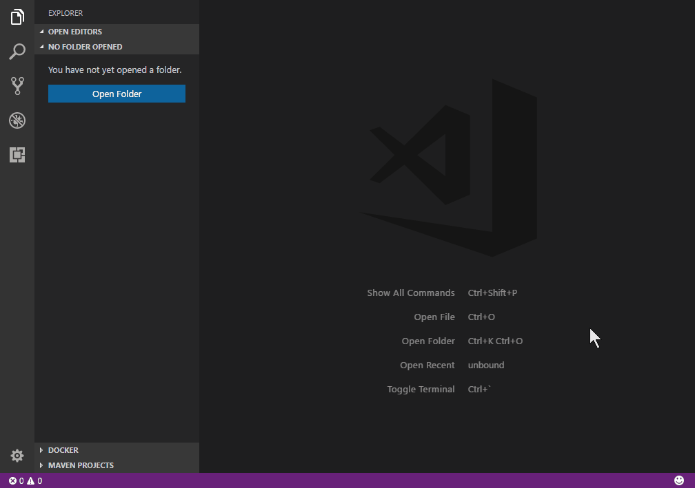

# Build Spring Boot Apps with VS Code

Visual Studio Code is an ideal lightweight development environment for Spring Boot developers using extensions including
* [Spring Boot Support](https://marketplace.visualstudio.com/items?itemName=Pivotal.vscode-spring-boot)
* [Spring Initializr](https://marketplace.visualstudio.com/items?itemName=vscjava.vscode-spring-initializr)

## Create Project
[Spring Initializr](https://marketplace.visualstudio.com/items?itemName=vscjava.vscode-spring-initializr) allows you to search for dependencies and generate Spring Boot project.

To install, just open VS Code and press `F1` or `Ctrl + Shift + P` to open command palette, select **Install Extension** and type `vscode-spring-initializr`.

Once you have the extension installed, you just need to press `Ctrl + Shift + P` to open command palette, type `Spring Initializr` to start generating a Maven or Gradle project and then follow the wizard.

## Develop Application
[Spring Boot Support](https://marketplace.visualstudio.com/items?itemName=Pivotal.vscode-spring-boot) extension including language server provides support for working with Spring Boot `application.properties`, `application.yml` and `.java` files.

The extension supports quick-navigate the source code, quick-access for running apps, show live application information and smart code completion. Similiar completion and validation features are also available for `.properties` and `.yml` files.

## Debug Application
You can simply press `F5` to run your application. After setting breakpoint in your source code, just refresh your browser to hit the breakpoint. Details about debugging could be found in [Java Debugging](/docs/java/java-debugging.md)

## Next steps

* If you'd like to learn how to deploy your web application, checkout out the [Deploy a Java Application to Azure Web App](/docs/java/java-webapp.md) tutorial where we show how to run your web app in the cloud.
* To see how you can containerize the web app and deploy to the cloud as a Docker container, check out [Java Container Tutorial](/docs/java/java-container.md)
* To learn more about Java Debugging features, see [Java Debugging Tutorial](/docs/java/java-debugging.md)
