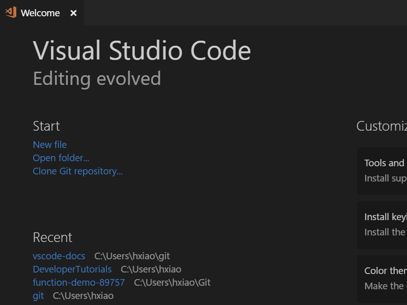
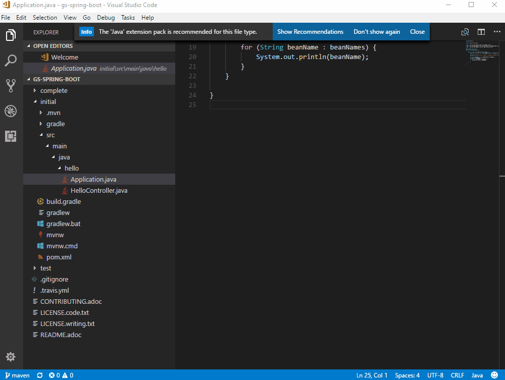

# Build a Java web app in VS Code

This 5 minutes tutorial shows you how to create a simple Java web application with Visual Studio Code. You'll learn how to run and debug it locally, and prepare for running it in the Cloud.

## Scenario

A simple Spring Boot Getting Started web app

## Before you begin

Before running and deploying this sample, you must have JDK and Maven on your local development environment. If not, please install them.

Download and install the Java SE Development Kit (JDK):

<a class="tutorial-next-btn" href="http://www.oracle.com/technetwork/java/javase/downloads/index.html" target="_blank" style="background-color:#68217A">Download JDK</a>

Download Apache Maven version 3 or greater:

<a class="tutorial-next-btn" href="https://maven.apache.org/download.cgi" target="_blank" style="background-color:#68217A">Download Apache Maven</a>

Install Apache Maven for your local development environment:

<a class="tutorial-next-btn" href="https://maven.apache.org/install" target="_blank" style="background-color:#68217A">Install Apache Maven</a>

## Download and test the Spring Boot app

Clone the [Spring Boot Getting Started](https://github.com/spring-guides/gs-spring-boot) sample project to your local machine. You can clone a Git repository with the **Git: Clone** command in the **Command Palette** (`kb(workbench.action.showCommands)`). Paste `https://github.com/microsoft/gs-spring-boot.git` as the URL of the remote repository and then decide the parent directory under which to put the local repository. After that, you can open the cloned repository in VS Code.

Open any of the Java files in the repository. If you haven't got the Java related extensions installed with your VS Code, you would be recommended to install the Java extension pack. Just follow the instruction and install the Java Extension Pack from Microsoft.

Once you have the Extension Pack installed, it will automatically build the project for you, and then you can run it within VS Code. VS Code will generate the correct `launch.json` debugging configuration file for you automatically as well.

Test the web app by browsing to `http://localhost:8080` using a web browser. You should see the following message displayed: "Greetings from Spring Boot!".

## Make a change

Let's now edit `HelloController.java` to change "Greetings from Spring Boot!" to something else like "Hello World". VS Code provide a great editing experience for Java, check out [Editing and Navigating Code](/docs/languages/java.md#editing-and-navigating-code) to learn about VS Code's editing and code navigation features.

Simply click the Restart button on the top of the editor to reload the app and see result by reloading the browser.

## Debug the application

Set a breakpoint in the application source code, and reload your browser to hit the breakpoint.

If you would like to learn more about debugging Java with VS Code, please read [Java Debugging](/docs/java/java-debugging.md).

Congratulations, now you have your first Spring Boot web app running locally! Now let's try host it on Cloud.

## Next steps

* If you'd like to learn how to deploy your web application, checkout out the [Deploy a Java Application to Azure Web App](/docs/java/java-webapp.md) tutorial where we show how to run your web app in the Cloud.
* To see how you can containerize the web app and deploy to the Cloud as a container, check out [Java Container Tutorial](/docs/java/java-container.md)
* To learn more about Java Debugging features, see [Java Debugging Tutorial](/docs/java/java-debugging.md)
