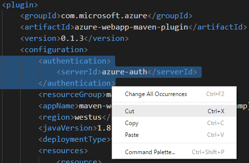

# Deploy Java Web Apps to the cloud

In our [first tutorial](/docs/java/java-tutorial.md), we built a Java web app running locally. This tutorial will show you how to run it in the cloud.

## Prepare your Azure account

Before running this sample on [Azure](http://www.azure.com), you need to have an Azure subscription and the command line tools.

If you don't have an Azure subscription, you can sign up for a [free Azure account](https://azure.microsoft.com/pricing/free-trial/):

<a class="tutorial-next-btn" href="https://azure.microsoft.com/pricing/free-trial/" target="_blank" style="background-color:#68217A">Create your free Azure account</a>

The [Azure Command-Line Interface (CLI)](https://docs.microsoft.com/cli/azure/overview):

<a class="tutorial-next-btn" href="https://docs.microsoft.com/cli/azure/install-azure-cli" target="_blank" style="background-color:#68217A">Install Azure CLI 2.0</a>

## Login with Azure CLI

We'll use the [Integrated Terminal](/docs/editor/integrated-terminal.md) in VS Code. To open the terminal you can either:

* Use the `kb(workbench.action.terminal.toggleTerminal)` keyboard shortcut with the backtick character.
* Use the **View** | **Integrated Terminal** menu command.
* From the **Command Palette** (`kb(workbench.action.showCommands)`), use the **View:Toggle Integrated Terminal** command.

> **Note:** You can still open an external shell with the Explorer **Open in Command Prompt** command (**Open in Terminal** on Mac or Linux) if you prefer to work outside VS Code.

Sign into your Azure account by using the Azure CLI:

```bash
az login
```

Follow the instructions to complete the sign-in process.

## Update your project to use Azure CLI for authentication

Open your `pom.xml` file in your project folder (complete). Find and remove the snippet below in azure-webapp-maven-plugin `configuration` section so we will authenticate with Azure using Azure CLI, which we've already logged in with.



>**Note**: This specific configuration will instead using Service Principal for authentication. More details could be found at [Configure Maven to use your Azure Service Principal](https://docs.microsoft.com/en-us/azure/app-service/app-service-web-deploy-spring-boot-app-with-maven-plugin#configure-maven-to-use-your-azure-service-principal)

## Build and deploy your web app to Azure

From the command prompt or terminal window that you were using earlier, rebuild the JAR file using Maven if you made any changes to the `pom.xml` file; for example:

```bash
mvn clean package
```

> **Note:** You need to be in the `complete` directory when making commands on the terminal.

Deploy your web app to Azure by using Maven; for example:

```bash
mvn azure-webapp:deploy
```

Maven will deploy your web app to Azure; if the web app does not already exist, it will be created.

When your web has been deployed, you will see a success message from command Line


by pasting the URL to browser, you will see the sample web app running on Azure!


You will also be able to manage it by using the [Azure portal](https://portal.azure.com/).

Your web app will be listed in **App Services**:


And the URL for your web app will be listed in the **Overview** for your web app:


You have successfully built a Java web application running in the cloud!


## Next steps

* To see how you can containerize the app and deploy to the cloud, check out [Java Container Tutorial](/docs/java/java-container.md)
* To learn more about Java Debugging features, see [Java Debugging Tutorial](/docs/java/java-debugging.md)
