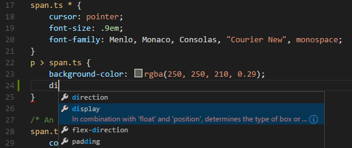
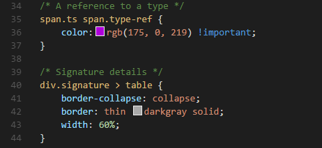

# CSS, Sass and Less

Visual Studio Code has built-in support for editing style sheets in CSS `.css`, Sass `.scss` and Less `.less`.  In addition, you can install an extension for greater functionality. 

<div class="marketplace-extensions-css"></div>

> Tip: The extensions shown above are dynamically queried. Click on an extension tile above to read the description and reviews to decide which extension is best for you. See more in the [Marketplace](https://marketplace.visualstudio.com).

## IntelliSense

We have support for selectors, properties and values. Use `kb(editor.action.triggerSuggest)` to get a list of context specific options.



Proposals contain extensive documentation, including a list of browsers that support the property. To see the full description text of the selected entry, use `kb(toggleSuggestionDetails)`.

## Emmet snippets

Press `kb(editor.emmet.action.expandAbbreviation)` to expand the current abbreviation.

>**Tip:** See the CSS section of the [Emmet cheat sheet](http://docs.emmet.io/cheat-sheet) for valid abbreviations.

We also support [User Defined Snippets](/docs/customization/userdefinedsnippets.md).

## Syntax coloring & Color preview

As you type, we provide syntax highlighting as well as in context preview of colors.



## Syntax Verification & Linting

We support CSS version <= 2.1, Sass version <= 3.2 and Less version <= 1.7.

>**Note:** You can disable VS Code's default CSS, Sass or Less validation by setting the corresponding `.validate` User or Workspace [setting](/docs/customization/userandworkspace.md) to false.
>```json
>    "css.validate": false
>```

## Goto symbol in file

Simply press `kb(workbench.action.gotoSymbol)`.

## Hovers

Hovering over a selector or property will provide an HTML snippet that is matched by the CSS rule.


## Goto Declaration and Find References

This is supported for Sass and Less variables in the same file. [CSS variables](https://developer.mozilla.org/en-US/docs/Web/CSS/Using_CSS_variables) per the [draft standards proposal](https://drafts.csswg.org/css-variables/) are also supported.

>**Note:** Cross file references ('imports') are not resolved.

## Transpiling Sass and Less into CSS

VS Code can integrate with Sass and Less transpilers through our integrated [task runner](/docs/editor/tasks.md).  We can use this to transpile `.scss` or `.less` files into `.css` files.  Let's walk through transpiling a simple Sass/Less file.

### Step 1: Install a Sass or Less transpiler

For this walkthrough, let's use either the [node-sass](https://www.npmjs.com/package/node-sass) or [less](https://www.npmjs.com/package/less) Node.js module.

>**Note:** If you don't have [Node.js](https://nodejs.org) and the [NPM](https://www.npmjs.com/) package manager already installed, you'll need to do so for this walkthrough. [Install Node.js for your platform](https://nodejs.org/en/download/). The Node Package Manager (NPM) is included in the Node.js distribution. You'll need to open a new terminal (command prompt) for `npm` to be on your PATH.

```
npm install -g node-sass less
```

### Step 2: Create a simple Sass or Less file

Open VS Code on an empty folder and create a `styles.scss` or `styles.less` file.  Place the following code in that file:

```scss
$padding: 6px;

nav {
  ul {
    margin: 0;
    padding: $padding;
    list-style: none;
  }

  li { display: inline-block; }

  a {
    display: block;
    padding: $padding 12px;
    text-decoration: none;
  }
}
```

For the Less version of the above file, just change `$padding` to `@padding`.

>**Note:** This is a very simple example, which is why the source code is almost identical between both file types.  In more advanced scenarios, the syntaxes and constructs will be much different.

### Step 3: Create tasks.json

The next step is to set up the task configuration.  To do this open the **Command Palette** with `kb(workbench.action.showCommands)` and type in **Configure Task Runner**, press `kbstyle(Enter)` to select it. In the selection dialog that shows up, select `Others`.

This will create a sample `tasks.json` file in the workspace `.vscode` folder.  The initial version of file has an example to run an arbitrary command. We will simply modify that configuration for transpiling Less/Sass instead:

```json
// Sass configuration
{
    "version": "0.1.0",
    "command": "node-sass",
    "isShellCommand": true,
    "args": ["styles.scss", "styles.css"]
}
```

```json
// Less configuration
{
    "version": "0.1.0",
    "command": "lessc",
    "isShellCommand": true,
    "args": ["styles.less", "styles.css"]
}
```

VS Code interprets `node-sass` or `lessc` as an external task runner exposing exactly one task: the transpiling of Sass/Less files into CSS files. The command we run is `node-sass styles.scss styles.css` or `lessc styles.less styles.css`.

### Step 4: Run the Build Task

As this is the only task in the file, you can execute it by simply pressing `kb(workbench.action.tasks.build)` (**Run Build Task**).  The sample Sass/Less file should not have any compile problems, so by running the task all that happens is a corresponding `styles.css` file is created.

>**Note:** If your build fails or you see an error message such as "An output directory must be specified when compiling a directory", be sure the filenames in your `tasks.json` match the filenames on disk. You can always test your build by running `node-sass styles.scss styles.css` from the command line.

## Automating Sass/Less compilation

Let's take things a little further and automate Sass/Less compilation with VS Code.  We can do so with the same task runner integration as before, but with a few modifications.

### Step 1: Install Gulp and some plug-ins

We will use [Gulp](http://gulpjs.com/) to create a task that will automate Sass/Less compilation.  We will also use the [gulp-sass](https://www.npmjs.com/package/gulp-sass) plug-in to make things a little easier.  The Less plug-in is [gulp-less](https://www.npmjs.com/package/gulp-less).

We need to install `gulp` locally (no `-g` switch):

```
npm install gulp gulp-sass gulp-less
```

> **Note:** `gulp-sass` and `gulp-less` are Gulp plug-ins for the `node-sass` and `lessc` modules we were using before.  There are many other Gulp Sass and Less plug-ins you can use, as well as plug-ins for Grunt.

### Step 2: Create a simple Gulp task

Open VS Code on the same folder from before (contains `styles.scss`/`styles.less` and `tasks.json` under the `.vscode` folder), and create `gulpfile.js` at the root.

Place the following code in the `gulpfile.js` file:

```javascript
// Sass configuration
var gulp = require('gulp');
var sass = require('gulp-sass');

gulp.task('sass', function() {
    gulp.src('*.scss')
        .pipe(sass())
        .pipe(gulp.dest(function(f) {
            return f.base;
        }))
});

gulp.task('default', ['sass'], function() {
    gulp.watch('*.scss', ['sass']);
})
```

```javascript
// Less configuration
var gulp = require('gulp');
var less = require('gulp-less');

gulp.task('less', function() {
    gulp.src('*.less')
        .pipe(less())
        .pipe(gulp.dest(function(f) {
            return f.base;
        }))
});

gulp.task('default', ['less'], function() {
    gulp.watch('*.less', ['less']);
})
```

What is happening here?

1. Our `default` gulp task first runs the `sass` or `less` task once when it starts up.
2. It then watches for changes to any Sass/Less file at the root of our workspace, for example the current folder open in VS Code.
3. It takes the set of Sass/Less files that have changed and runs them through our respective compiler, for example `gulp-sass`, `gulp-less`.
4. We now have a set of CSS files, each named respectively after their original Sass/Less file.  We then put these files in the same directory.

### Step 3: Modify the configuration in tasks.json for watching

To complete the tasks integration with VS Code, we will need to modify the task configuration from before, to set a watch on the default Gulp task we just created.  Your tasks configuration should now look like this:

```json
{
    "version": "0.1.0",
    "command": "gulp",
    "isShellCommand": true,
    "tasks": [
        {
            "taskName": "default",
            "isBuildCommand": true,
            "showOutput": "always",
            "isWatching": true
        }
    ]
}
```

### Step 4: Run the Build Task

Again, as this is the only task in the file you can execute it by simply pressing `kb(workbench.action.tasks.build)` (**Run Build Task**).  But this time, we've set a watch so the Status Bar should indicate that on the left-hand side.


At this point, if you create and/or modify other Less/Sass files, you will see the respective CSS files generated and/or changes reflected on save.  You can also enable [Auto Save](/docs/editor/codebasics.md#saveauto-save) to make things even more streamlined.

If you want to stop the watch, you can press `kb(workbench.action.tasks.build)` again and click **Terminate Running Task** in the message box. Or you can use the **Command Palette** with `kb(workbench.action.showCommands)` and find the terminate command there.

## Customizing CSS, Sass and Less Settings

You can configure the following lint warnings as [User and Workspace Settings](/docs/customization/userandworkspace.md).

The `validate` setting allows you turn off the built-in validation. You would do this if you rather use a different linter.

Id|Description|Default
---|------------|----
css.validate | Enables or disables all css validations | true
less.validate | Enables or disables all less validations | true
scss.validate | Enables or disables all scss validations | true

To configure an option for CSS, use `css.lint.` as the prefix to the id; for Sass and Less, use `less.lint.` and `scss.lint.`.

>**Note:** In VS Code 1.2 (May 2016) and earlier the Sass settings were prefixed with `sass`. If you have customized settings, rename the prefix from `sass` to `scss` to have
them working again.

Set a setting to `warning` or `error` if you want to enable lint checking, use `ignore` to disable it. Lint checks are performed as you type.

Id|Description|Default
---|------------|----
validate | Enables or disables all validations | true
compatibleVendorPrefixes | When using a property with a vendor-specific prefix (for example `-webkit-transition`), make sure to also include all other vendor-specific properties eg. `-moz-transition`, `-ms-transition` and `-o-transition` | ignore
vendorPrefix | When using a property with a vendor-specific prefix for example `-webkit-transition`, make sure to also include the standard property if it exists eg. `transition` | warning
duplicateProperties | Warn about duplicate properties in the same ruleset | ignore
emptyRules | Warn about empty rulesets | warning
importStatement | Warn about using an `import` statement as import statements are loaded sequentially which has a negative impact on web page performance | ignore
boxModel | Do not use `width` or `height` when using `padding` or `border` | ignore
universalSelector | Warn when using the universal selector `*` as it is known to be slow and should be avoided | ignore
zeroUnits | Warn when having zero with a unit e.g. `0em` as zero does not need a unit.  | ignore
fontFaceProperties | Warn when using `@font-face` rule without defining a `src` and `font-family` property | warning
hexColorLength | Warn when using hex numbers that don't consist of three or six hex numbers | error
argumentsInColorFunction | Warn when an invalid number of parameters in color functions e.g. `rgb` | error
unknownProperties | Warn when using an unknown property | warning
ieHack | Warn when using an IE hack `*propertyName` or `_propertyName` | ignore
unknownVendorSpecificProperties | Warn when using an unknown vendor-specific property | ignore
propertyIgnoredDueToDisplay | Warn when using a property that is ignored due to the display. For example with `display: inline`, the `width`, `height`, `margin-top`, `margin-bottom`, and `float` properties have no effect. | warning
important | Warn when using `!important` as it is an indication that the specificity of the entire CSS has gotten out of control and needs to be refactored. | ignore
float | Warn when using `float` as floats lead to fragile CSS that is easy to break if one aspect of the layout changes. | ignore
idSelector | Warn when using selectors for an id `#id` as selectors should not contain IDs because these rules are too tightly coupled with the HTML. | ignore

## Next Steps

Read on to find out about:

* [Configure Tasks](/docs/editor/tasks.md) - Dig into Tasks to help you transpile your Sass and Less to CSS.
* [Editing Evolved](/docs/editor/editingevolved.md) - Find out about the rich set of features the editor offers for languages such as CSS.
* [HTML](/docs/languages/html.md) - CSS is just the start, HTML is also very well supported in VS Code.

## Common Questions

**Q: Do you provide a color selector?**

**A:** No, this is currently not supported.

**Q: Do you support the indentation based Sass syntax (.sass) ?**

**A:** No, but there are several extensions in the Marketplace supporting the indented flavor of Sass.