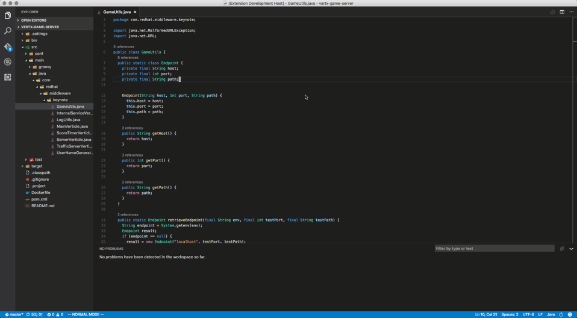
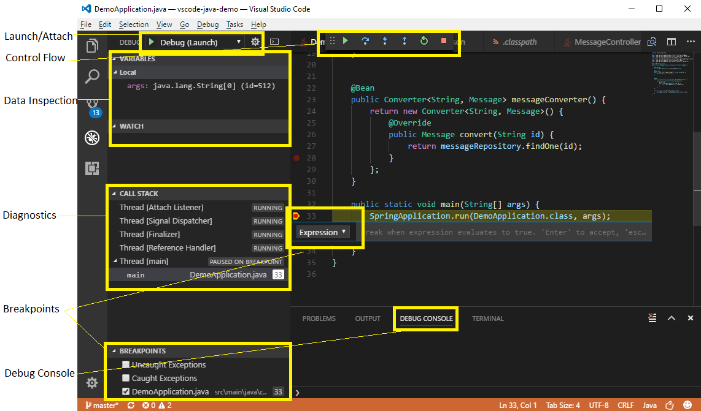
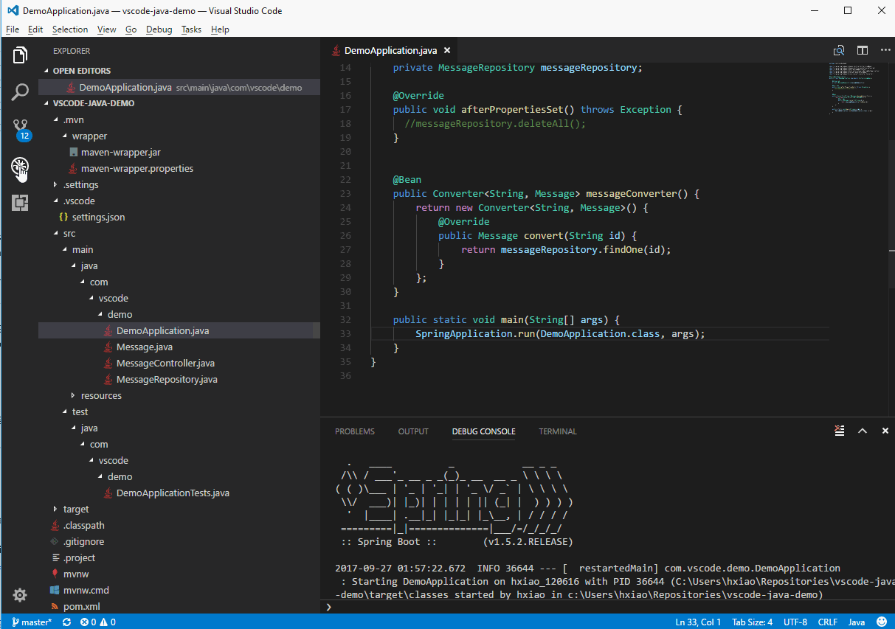

# Java in VS Code

The Java support in VS Code is provided through [extensions](/docs/editor/extension-gallery.md) and optimized for lightweight Java projects with a simple, modern workflow. Popular extensions in the [Marketplace](https://marketplace.visualstudio.com) provide project support, code completion, linting, debugging, testing, code formatting, snippets, and more.

> [Download VS Code](/download) - If you haven't downloaded VS Code yet, quickly install for your platform (Windows, Mac, Linux).

## Install Java Extensions

VS Code is a fast editor and ships with only the basic features. Add Java language support to VS Code by installing the popular Java extensions.

1. In Visual Studio Code, go to the **Extensions** view (`kb(workbench.view.extensions)`).
2. Filter the extensions list by typing "java".

To help set up Java on VS Code, there is a [Java Extension Pack](https://marketplace.visualstudio.com/items?itemName=vscjava.vscode-java-pack) which contains two popular extensions:

1. [Language Support for Java(TM) by Red Hat](https://marketplace.visualstudio.com/items?itemName=redhat.java)
2. [Debugger for Java](https://marketplace.visualstudio.com/items?itemName=vscjava.vscode-java-debug)

<a class="tutorial-install-extension-btn" href="vscode:extension/vscjava.vscode-java-pack">Install the Java Extension Pack</a>

There's also a [Java Test Runner](https://marketplace.visualstudio.com/items?itemName=vscjava.vscode-java-test), which runs JUnit tests for your Java code.

This document describes the features included in those Java extensions.

## Java Project Support

Maven, Eclipse and Gradle Java project are supported through [Language Support for Java(TM) by Red Hat](https://marketplace.visualstudio.com/items?itemName=redhat.java), by utilizing [M2Eclipse](http://www.eclipse.org/m2e/) which provides Maven support and [Buildship](https://github.com/eclipse/buildship) which provides Gradle support through the [Eclipse JDT Language Server](https://github.com/eclipse/eclipse.jdt.ls).

Please note that [Gradle-based Android projects are not supported](https://github.com/redhat-developer/vscode-java/issues/10#issuecomment-268834749).

## Editing and Navigating Code

### Linting

A [linter](https://en.wikipedia.org/wiki/Lint_%28software%29) is a tool that provides warnings for suspicious looking code. [Language Support for Java(TM) by Red Hat](https://marketplace.visualstudio.com/items?itemName=redhat.java) provides this feature to report parsing and compilation errors as you type, so you can fix them inside VS Code.

### Intellisense

VS Code also supports code completion and Intellisense for Java through [Language Support for Java(TM) by Red Hat](https://marketplace.visualstudio.com/items?itemName=redhat.java). [Intellisense](/docs/editor/intellisense.md) is a general term for a number of features, including intelligent code completion (in-context method and variable suggestions) across all your files and for built-in and thirty-party modules.

### Search for symbols

You can search for symbols in the current file or workspace to navigate your code more quickly.

To search for a symbol in the current file, use __Quick Open__ (`kb(workbench.action.quickOpen)`) then enter the '@' command, then enter the name of the symbol you're looking for. A list of potential matches will appear and be filtered as you type. Choose from the list of matches to navigate to its location.

To search for a symbol in the current workspace, start by pressing `kb(workbench.action.showAllSymbols)`, then enter the name of the symbol. A list of potential matches will appear as before. If you choose a match that was found in a file that's not already open, the file will be opened before navigating to the match's location. Alternatively, you can also use  __Quick Open__ (`kb(workbench.action.quickOpen)`) then enter the '#' command to search the current workspace. `kb(workbench.action.showAllSymbols)` is just the shortcut for the '#' commands, respectively, so everything works the same.

### Peek Definition

You can take a quick look at how a symbol was defined by using the Peek Definition feature. This feature displays a few lines of code near the definition inside a peek window so you can take a look without navigating away from your current location.

To peek at a symbol's definition, place your cursor on the symbol anywhere it's used in your source code and then press `kb(editor.action.previewDeclaration)`. Alternatively, you can choose __Peek Definition__ from the context menu (right-click, then choose __Peek Definition__).

### Go to Definition

You can also quickly navigate to where a symbol is defined by using the Go to Definition feature.

To go to a symbol's definition, place your cursor on the symbol anywhere its used in your code and then press `kb(editor.action.goToDeclaration)`. Alternatively, you can choose __Go to Definition__ from the context menu (right-click, then choose __Go to Definition__). When there's only one definition of the symbol, you'll navigate directly to its location, otherwise the competing definitions are displayed in a peek window as described in the previous section and you have to choose the definition that you want to go to.

Other code editing features include:

- Code formatting
- Code snippets
- Code outline
- Code lens (references)
- Javadoc hovers
- Rename
- Highlights

## Debugging

[Debugger for Java](https://marketplace.visualstudio.com/items?itemName=vscjava.vscode-java-debug) is a lightweight Java Debugger based on [Java Debug Server](https://github.com/Microsoft/java-debug). It works with [Language Support for Java by Red Hat](https://marketplace.visualstudio.com/items?itemName=redhat.java) to allow users debugging Java code using Visual Studio Code (VS Code).

The Java Debugger supports following features:

- **Launch/Attach** - You can either launch the Java project within VS Code or attach to any running JVM process in debug mode, locally or remotely.
- **Breakpoints** - Conditional breakpoints by Hit Count is supported and can easily be set using the inline breakpoint settings window. This allows you to conveniently add conditional breakpoints to your code, directly in the source viewer, without requiring a modal window. Break on exceptions is also supported.
- **Control flow** - Including **Pause**, **Continue** `F5`, **Step over** `F10`, **Step into** `F11`, **Step out** `Shift+F11`
- **Data inspection** - When you're stopped at a breakpoint, the debugger has access to the variable names and values that are currently stored in memory. Inspect/Watch/Set Variables are supported.
- **Diagnostics** - The **CALL STACK** panel shows the call stack of your program and allows you to navigate through the call path of each captured allocation. Multi-threaded debugging is supported by parallel stacks.
- **Debug Console** - The Debug Console lets you see information from both stdout and stderr.

You can launch the debugger following steps below:

1. Switch to the **Debug** view (`kb(workbench.view.debug)`).
2. Open `launch.json` to add a debug configuration for Java
3. Fill in the `mainClass` for `Launch` setting or `hostName` and `port` for `Attach`.
4. Click **Start** button or press `F5` to start debugging.

## Next Steps

Learn more about Java in VS Code

* [Java Tutorial with VS Code](/docs/java/java-tutorial.md)
* [Java Debugging](/docs/java/java-debugging.md)

Read on to find out about:

* [Basic Editing](/docs/editor/codebasics.md) - Learn about the powerful VS Code editor.
* [Code Navigation](/docs/editor/editingevolved.md) - Move quickly through your source code.
* [Tasks](/docs/editor/tasks.md) - use tasks to build your project and more
* [Debugging](/docs/editor/debugging.md) - find out how to use the debugger with your project
