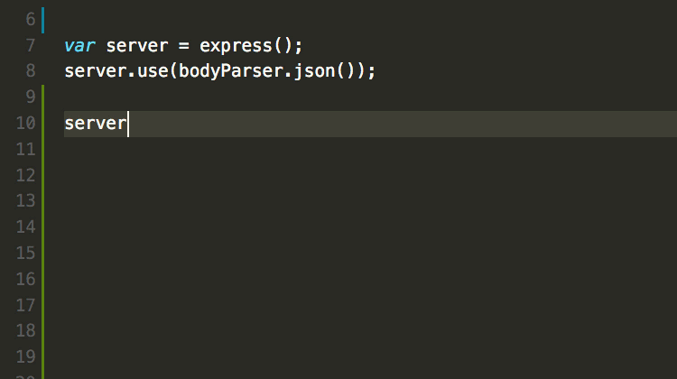
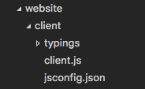
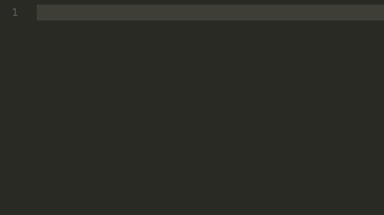
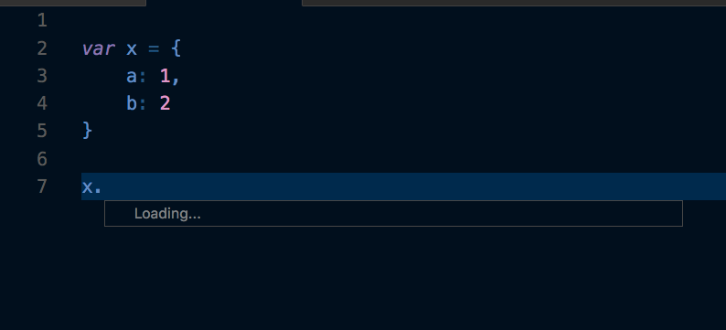
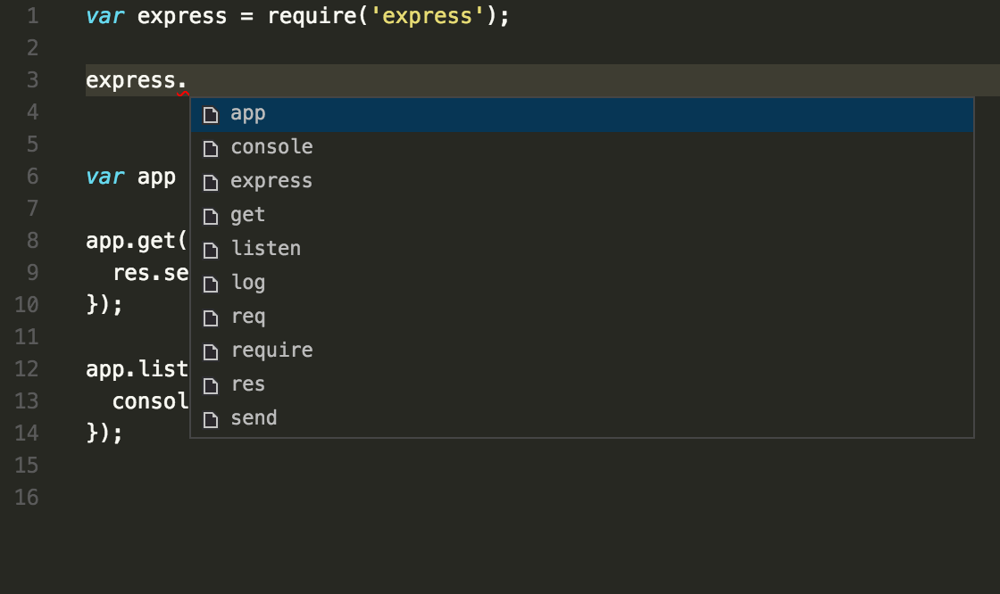

# JavaScript in VS Code

Visual Studio Code provides IntelliSense, debugging, and powerful editor features for JavaScript. VS Code uses the [JavaScript language service](https://github.com/Microsoft/TypeScript/wiki/Salsa) to make authoring JavaScript easy. In addition to syntactical features like format, format on type and outlining, you also get language service features such as **Peek**, **Go to Definition**, **Find all References**, and **Rename Symbol**.


## IntelliSense

VS Code [IntelliSense](/docs/editor/intellisense.md) is intelligent code completion, parameter info, and member lists. JavaScript IntelliSense will work for single files immediately.

If you use the CommonJS module system that is used by Node.js, then you get IntelliSense across your modules immediately.

There are two more steps to configure IntelliSense across all the files in your workspace and external modules:

1. Create a `jsconfig.json` file to indicate a [JavaScript project](/docs/languages/javascript.md#javascript-project-jsconfigjson).
2. Install [TypeScript Definition files (typings)](/docs/languages/javascript.md#typescript-definition-files-typings) for external libraries.



For the details of how JavaScript IntelliSense works, including being based on type inference, JsDoc annotations, TypeScript declarations, and mixing JavaScript and TypeScript projects, see the [JavaScript language service documentation](https://github.com/Microsoft/TypeScript/wiki/Salsa). Where type inference does not provide the desired information, type information may be provided explicitly with JSDoc annotations. This document describes the [JSDoc annotations](https://github.com/Microsoft/TypeScript/wiki/JsDoc-support-in-JavaScript) currently supported.

## JavaScript Project (jsconfig.json)

The presence of [jsconfig.json](/docs/languages/jsconfig.md) file in a directory indicates that the directory is the root of a JavaScript project. `jsconfig.json` specifies the root files and the options for the language features provided by the [JavaScript language service](https://github.com/Microsoft/TypeScript/wiki/Salsa).

### Location of jsconfig.json

To define our code as a JavaScript project, create `jsconfig.json` at the root of your JavaScript code as shown below. A JavaScript project is the source files of the project and should not include the derived or packaged files (such as a `dist` directory).



In more complex projects, you may have more than one `jsconfig.json` file defined inside a workspace. You will want to do this so that the source code in one project does not appear in the IntelliSense of another project.

Illustrated below is a project with a `client` and `server` folder, showing two separate JavaScript projects:


### Writing jsconfig.json

When VS Code detects that you are working on a JavaScript file, it looks to see if you have a JavaScript configuration file `jsconfig.json` in your workspace. If it doesn't find one, you will see a green lightbulb on the Status Bar prompting you to create one. Click the green lightbulb and accept the prompt to create a `jsconfig.json` file.

Below is a simple template for `jsconfig.json` file which defines the JavaScript `target` to be `ES6` and the `exclude` attribute excludes the `node_modules` folder. You can copy and paste this code into your `jsconfig.json` file.

```json
{
    "compilerOptions": {
        "target": "ES6"
    },
    "exclude": [
        "node_modules"
    ]
}
```

The `exclude` attribute tells the language service which files are and are not part of your source code. If IntelliSense is slow, add folders to your `exclude` list (VS Code will prompt you to do this if it detects slow completions). You will want to `exclude` files generated by a build process (such as a `dist` directory). These files will cause suggestions to show up twice and will slow down IntelliSense.

Alternatively, you can explicitly set the files in your project using the `files` attribute. If no `files` attribute is present, then this defaults to including all files in the containing directory and subdirectories. When a `files` attribute is specified, only those files are included.

Here is an example with an explicit `files` attribute:

```json
{
    "compilerOptions": {
        "target": "ES6"
    },
    "files": [
        "src/app.js"
    ]
}
```

The `files` attribute cannot be used with the `exclude` attribute. If both are specified, the `files` attribute will take precedence.

> **Tip:** The file paths in `excludes` and `files` are relative to the location of `jsconfig.json`.

See [here](/docs/languages/jsconfig.md) for the full documentation of `jsconfig.json`.

> **Note:** `jsconfig.json` is the same as a `tsconfig.json` file, only with `allowJS` set to true. See [the documentation for `tsconfig.json`](https://www.typescriptlang.org/docs/handbook/tsconfig-json.html) here to see other available options.

## TypeScript Definition Files (Typings)

You get VS Code IntelliSense for third-party libraries and modules with type definition `*.d.ts` files. TypeScript definition files are written in TypeScript so they can express the data types of parameters and functions, allowing VS Code to provide a rich IntelliSense experience.

In this image you can see IntelliSense, including the method signature, parameter info, and the method's documentation, for a popular library called [lodash](https://lodash.com/).


### Using Typings

First, install [Typings](https://www.npmjs.com/package/typings), the TypeScript Definition Manager, using the [NPM](https://www.npmjs.com/) JavaScript package manager.

> **Tip:** The `--global` flag is optional, but recommended so the Typings utility can be used in any of your projects.

```bash
npm install typings --global
```

Next find the typings file for the module you need.

```bash
# Replace lodash with the name of your framework.
typings search lodash
```

Install the typings at the same location as `jsconfig.json` (the root of your JavaScript project).

```bash
typings install lodash --save
```

You can learn more in the documentation for [typings](https://www.npmjs.com/package/typings) and at [DefinitelyTyped](https://github.com/DefinitelyTyped/DefinitelyTyped), which is a repository of typings files for many major JavaScript libraries and environments.

## Debugging

VS Code comes with great debugging support for JavaScript. Set breakpoints, inspect objects, navigate the call stack, and execute code in the Debug Console. See more about debugging [here](/docs/editor/debugging.md).

### Debug Client Side

You can debug your client side code using a browser debugger such as [Debugger for Chrome](https://marketplace.visualstudio.com/items?itemName=msjsdiag.debugger-for-chrome) or [Debugger for Edge](https://marketplace.visualstudio.com/items?itemName=msjsdiag.debugger-for-edge).

### Debug Server Side

Debug Node.js in VS Code using the built-in debugger. Setup is easy and you can read a walk-through for Node.js debugging [here](/docs/runtimes/nodejs.md#debugging-your-express-application).


## Linters

A [linter](https://en.wikipedia.org/wiki/Lint_%28software%29) is a tool that provides warnings for suspicious looking code. VS Code supports linters through [extensions](/docs/editor/extension-gallery.md). Linters provide warnings, errors, and light bulb actions.

VS Code provides support for JavaScript linters, including [ESLint](http://eslint.org/), [JSHint](http://jshint.com/) and [StandardJS](http://standardjs.com/).  If enabled, the JavaScript code is validated as you type and you can navigate to reported problems and fix them inside VS Code.

 

> **Tip:** In the above example, the error comes from `eslint`. Error messages will be prefixed (see above `[eslint]`) by the originator of the message. Error messages from the JavaScript language service are prefixed `js`.

<div class="marketplace-extensions-javascript-linters"></div>

> **Tip:** This list is dynamically queried from the [VS Code Marketplace](https://marketplace.visualstudio.com). Read the description and reviews to decide if the extension is right for you.

A linter extension may require an external tool. The steps below show how to setup ESLint. The process is similar for other linters.

1. Install the linter globally or inside the workspace folder that contains the JavaScript code to be validated. For example, using `npm install -g eslint`.
2. Install the [ESLint](https://marketplace.visualstudio.com/items/dbaeumer.vscode-eslint) extension.
3. Create a `.eslintrc.json` file in the root of your workspace to configure the linter. You can use `eslint --init` to create an initial version of the `.eslintrc.json` file.

>**Tip:** You get IntelliSense and hovering inside the `.eslintrc.json` file.

>**Tip:** The linter is enabled after installation. You can disable a linter with the corresponding `.enable` [setting](/docs/customization/userandworkspace.md). For ESLint, this would be setting `"eslint.enable" : false`.

It is recommended that you enable the linter rules that warn about undefined and unused variables. To do this, put the following options in your `.eslintrc.json` file.

```json
"no-undef": 1,
"no-unused-vars": 1,
```

Here are a few useful resources when using ESLint.

* [Complete list of ESLint Rules](http://eslint.org/docs/rules/)
* [Configuring ESLint](http://eslint.org/docs/user-guide/configuring)
* [Getting Started with ESLint](http://eslint.org/docs/user-guide/getting-started)

## Snippets

VS Code has several built-in snippets that will come up as you type or you can press `kb(editor.action.triggerSuggest)` (**Trigger Suggest**) and you will see a context specific list of suggestions.



> **Tip:** You can add in your own snippets for JavaScript. See [User Defined Snippets](/docs/customization/userdefinedsnippets.md) to find out how.

You may not want to show snippets. You can disable them by setting `editor.snippetSuggestions` to `"none"` in your [settings](/docs/customization/userandworkspace.md) file. If you'd like to see snippets, you can specify the order relative to suggestions; at the top (`"top"`), at the bottom (`"bottom"`), or inlined ordered alphabetically (`"inline"`). The default is `"inline"`.

You can enable tab completions with `editor.tabCompletion` setting. After typing the prefix of a snippet, press `kbstyle(Tab)` to insert it.

## Use Next Generation JavaScript

### Run Babel inside VS Code

The [Babel](https://babeljs.io) transpiler turns ES6 files into readable ES5 JavaScript with Source Maps. You can easily integrate **Babel** into your workflow by adding the configuration below to your `tasks.json` file (located under the workspace's `.vscode` folder). The `isBuildCommand` switch makes this task the **Task: Run Build Task** gesture.  `isWatching` tells VS Code not to wait for this task to finish. To learn more, go to [Tasks](/docs/editor/tasks.md).

```json
{
    "version": "0.1.0",
    "command": "${workspaceRoot}/node_modules/.bin/babel",
    "isShellCommand": true,
    "tasks": [
        {
            "args": ["src", "--out-dir", "lib", "-w", "--source-maps"],
            "taskName": "watch",
            "suppressTaskName": true,
            "isBuildCommand": true,
            "isWatching": true
        }
    ]
}
```

Once you have added this, you can start **Babel** with the `kb(workbench.action.tasks.build)` (**Run Build Task**) command and it will compile all files from the `src` directory into the `lib` directory.

### Use the TypeScript Compiler

One of the key features TypeScript provides is the ability to use the latest JavaScript language features, and emit code that can execute in JavaScript runtimes that don't yet understand those newer features. With JavaScript using the same language service, it too can now take advantage of this same feature.

The TypeScript compiler `tsc` can down-level compile JavaScript files from ES6 to another language level. Configure the `jsconfig.json` with the desired options and then use the –p argument to make `tsc` use your `jsconfig.json` file, e.g. `tsc -p jsconfig.json` to down-level compile.

Read more about the compiler options for down level compilation [here](/docs/languages/jsconfig.md#down-level-compilation-with-typescript-compiler).

## Formatting

VS Code provides several formatting settings for JavaScript. They can all be found in the `javascript.format` [settings](/docs/customization/userandworkspace.md) namespace.

```typescript
// Defines space handling after a comma delimiter
"javascript.format.insertSpaceAfterCommaDelimiter": boolean,

// Defines space handling after a semicolon in a for statement
"javascript.format.insertSpaceAfterSemicolonInForStatements": boolean,

// Defines space handling after a binary operator
"javascript.format.insertSpaceBeforeAndAfterBinaryOperators": boolean,

// Defines space handling after keywords in control flow statement
"javascript.format.insertSpaceAfterKeywordsInControlFlowStatements": boolean,

// Defines space handling after function keyword for anonymous functions
"javascript.format.insertSpaceAfterFunctionKeywordForAnonymousFunctions": boolean,

// Defines space handling after opening and before closing non empty parenthesis
"javascript.format.insertSpaceAfterOpeningAndBeforeClosingNonemptyParenthesis": boolean,

// Defines space handling after opening and before closing non empty brackets
"javascript.format.insertSpaceAfterOpeningAndBeforeClosingNonemptyBrackets": boolean,

// Defines whether an open brace is put onto a new line for functions or not
"javascript.format.placeOpenBraceOnNewLineForFunctions": boolean,

// Defines whether an open brace is put onto a new line for control blocks or not
"javascript.format.placeOpenBraceOnNewLineForControlBlocks": boolean,
```

## Popular Extensions

VS Code ships with excellent support for JavaScript but you can additionally install debuggers, snippets, linters, and other JavaScript tools through [extensions](/docs/editor/extension-gallery.md).

<div class="marketplace-extensions-javascript"></div>

## Next Steps

Read on to find out about:

* [jsconfig.json](/docs/languages/jsconfig.md) - Detailed description of the `jsconfig.json` project file.
* [IntelliSense](/docs/editor/intellisense.md) - Learn more about IntelliSense and how to use it effectively for your language.
* [Debugging](/docs/editor/debugging.md) - Learn how to set up debugging for your application.
* [Node.js](/docs/runtimes/nodejs.md) - A walkthrough to create an Express Node.js application.
* [TypeScript](/docs/languages/typescript.md) - VS Code has great support for TypeScript which brings structure and strong typing to your JavaScript code.

Watch these introductory videos:

* [IntelliSense](/docs/introvideos/intellisense.md) - Tutorial on IntelliSense with JavaScript.
* [Debugging](/docs/introvideos/debugging.md) - Learn how to debug a Node.js application.

## Troubleshooting IntelliSense

**IntelliSense is not working in my file.**



IntelliSense slows when there are too many files. Add more files to the `excludes` property of [`jsconfig.json`](/docs/languages/jsconfig.md) and move your `jsconfig.json` file closer to your JavaScript sources. If the problem persists, open an [issue](https://github.com/Microsoft/vscode/issues/new).

> **Tip:** You can set `"typescript.tsserver.trace": "verbose"` in your settings to see the output of `tsserver`.

**IntelliSense is not working for other files in my workspace.**

You must have your `jsconfig.json` at the root of your JavaScript project and not at the root of your workspace. In addition, check that you have the `exclude` and `files` attributes set correctly. Read more about `jsconfig.json` [above](/docs/languages/javascript.md#javascript-project-jsconfigjson).

**IntelliSense is not working for external libraries I installed with npm.**



You need to install the typings files for each library in the root of your JavaScript project. This is described [above](/docs/languages/javascript.md#typescript-definition-files-typings).

**ES6 Style imports are not working.**

When you want to use ES6 style imports but the typings do not yet use ES6 style exports, then set the [TypeScript compiler option](https://www.typescriptlang.org/docs/handbook/compiler-options.html) `allowSyntheticDefaultImports` to true.

```javascript
{
  "compilerOptions": {
    "target": "ES6",
    "module": "commonjs",
    // This is the line you want to add
    "allowSyntheticDefaultImports": true
  },
  "exclude": [
    "node_modules"
  ]
}
```

## Common Questions

**Q: Why aren't my JavaScript methods getting syntax highlighting?**


**A:** This is a known [issue](https://github.com/Microsoft/TypeScript-TmLanguage/issues/149). You can install [an extension](https://marketplace.visualstudio.com/items?itemName=ms-vscode.js-atom-grammar) based on Atom's JavaScript grammar package to improve the colorization.

**Q: Can I debug minified/uglified JavaScript?**

**A:** Yes, you can. You can see this working using JavaScript source maps in the Node.js section of the [Debugging](/docs/editor/debugging.md#node-debugging) topic.

**Q: Does VS Code support JSX and React Native?**

**A:** VS Code supports **JSX** and **React Native**. To get IntelliSense for **React/JSX**, install the typings for `react` by running `typings install dt~react --global` from the terminal. To get IntelliSense for **React Native**, run `typings install dt~react-native --global`. Additionally, you can install the popular [React Native extension](https://marketplace.visualstudio.com/items?itemName=vsmobile.vscode-react-native) from  the Marketplace.

**React Native** examples often use the experimental **Object Rest/Spread** operator. This is not yet supported by VS Code. If you want to use it, it is recommended that you disable the built-in syntax checking (see below).

To enable ES6 import statements for **React Native**, you need to set the `allowSyntheticDefaultImports` compiler option to `true`. This tells the compiler to create synthetic default members and you get IntelliSense. **React Native** uses **Babel** behind the scenes to create the proper run-time code with default members. If you also want to do debugging of **React Native** code then you can install the [React Native Extension](https://marketplace.visualstudio.com/items?itemName=vsmobile.vscode-react-native).

**Q: How do I disable Syntax Validation when using non ES6 constructs?**

**A:** Some users want to use syntax constructs like the proposed Object Rest/Spread Properties. However, these are currently not supported by VS Code's JavaScript language service and are flagged as errors. For users who still want to use these future features, we provide the `javascript.validate.enable` [setting](/docs/customization/userandworkspace.md).

With `javascript.validate.enable: false`, you disable all built-in syntax checking. If you do this, we recommend that you use a linter like [ESLint](http://eslint.org) to validate your source code. Since VS Code's JavaScript support doesn't understand ES7 constructs, features like IntelliSense might not be fully accurate.

**Q: Why do I see "No ESLint Configuration found" message repeatedly?**


**A:** This message indicates that you need an `.eslintrc.json` file. You can resolve this by creating `.eslintrc.json` file in your workspace (read [here](http://eslint.org/docs/user-guide/configuring) for the ESLint user guide). The message showing repeatedly is a known [issue](https://github.com/Microsoft/vscode-eslint/issues/107).

**Q: Why can't I install node typings? I ran `typings install node`.**

**A:** One reason may be that the `node` typings were not available in the default `npm` registry.

You should see the solution in the error message:

```
typings ERR! message Unable to find "node" ("npm") in the registry.
typings ERR! message However, we found "node" for 2 other sources: "dt" and "env"
```

You can install `node` from one of the other registries, `dt` or `env`.

Run one of the following commands which includes the registry prefix:

```bash
# Install from dt registery
typings install dt~node --global

# Install from env registry
typings install env~node --global
```

>**Tip:** Use the `--global` flag or you will see another error.