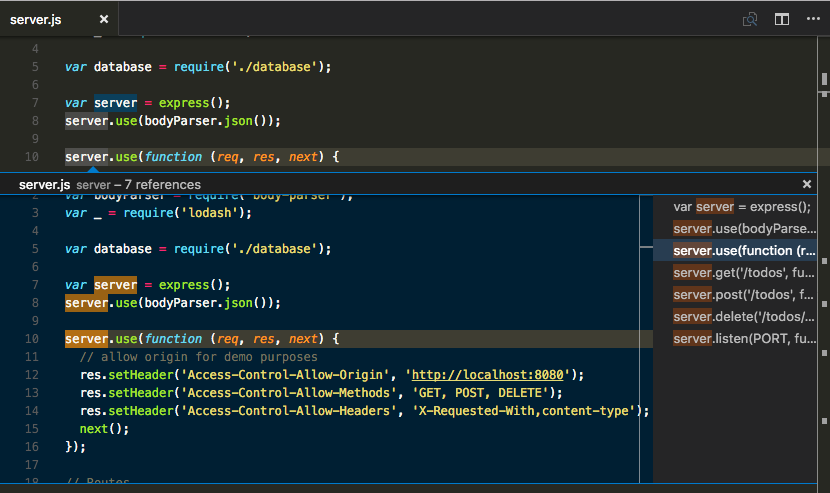
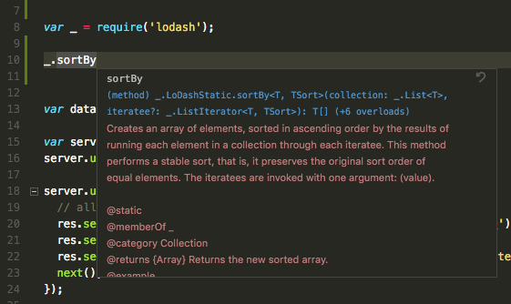
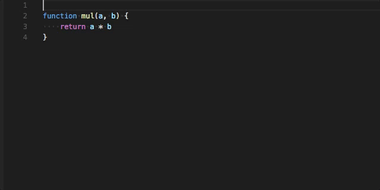
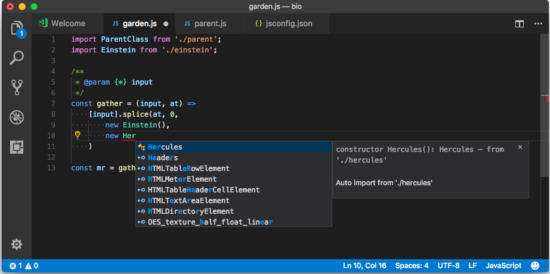
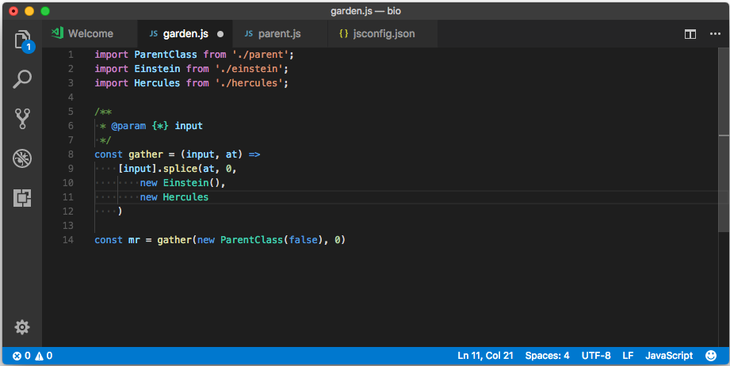
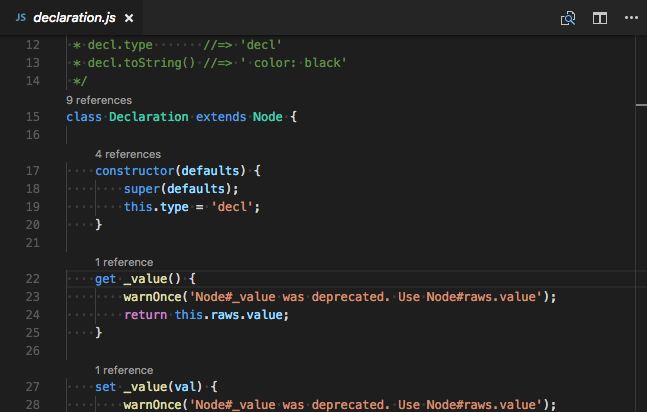
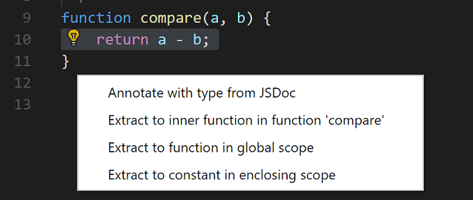
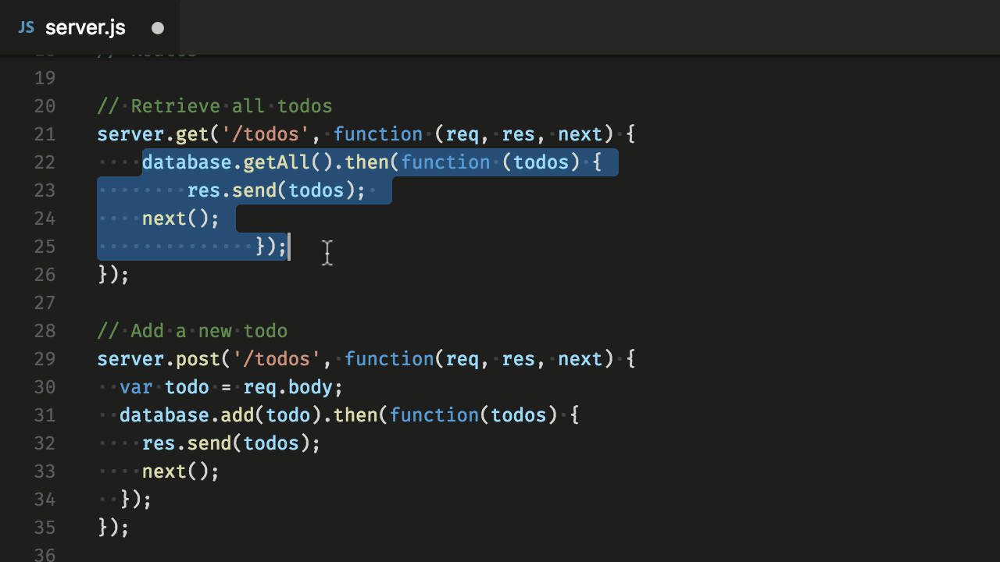
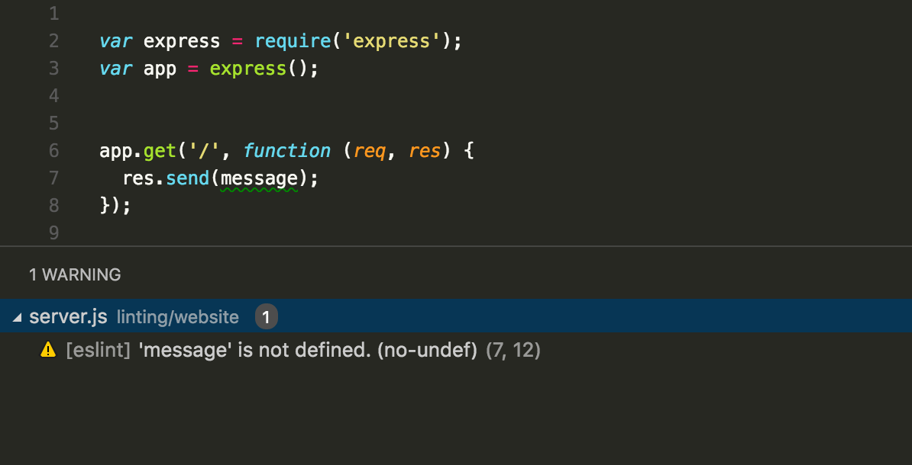
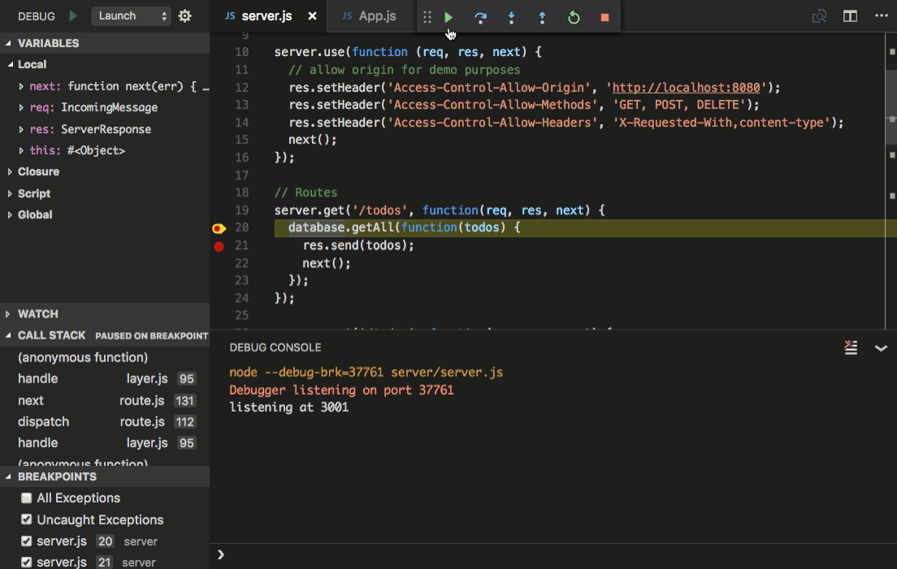

# JavaScript in VS Code

Visual Studio Code provides IntelliSense, debugging, and powerful editor features for JavaScript. VS Code uses the [JavaScript language service](https://github.com/Microsoft/TypeScript/wiki/JavaScript-Language-Service-in-Visual-Studio) to make authoring JavaScript easy. In addition to syntactical features like format, format on type and outlining, you also get language service features such as **Peek Definition**, **Go to Definition**, **Find all References**, and **Rename Symbol**.



## IntelliSense

VS Code [IntelliSense](/docs/editor/intellisense.md) is intelligent code completion, parameter info, and member lists. VS Code provides IntelliSense using TypeScript type declaration (typings) files (for example, `node.d.ts`) to provide metadata about the JavaScript based frameworks you are consuming in your application. Type declaration files are written in TypeScript so they can express the data types of parameters and functions, allowing VS Code to provide a rich IntelliSense experience.

Thanks to a feature called `Automatic Type Acquisition` you as a user do not have to worry about these type declaration files. VS Code will install them automatically for you.


For the details of how JavaScript IntelliSense works, including being based on type inference, JSDoc annotations, TypeScript declarations, and mixing JavaScript and TypeScript projects, see the [JavaScript language service documentation](https://github.com/Microsoft/TypeScript/wiki/JavaScript-Language-Service-in-Visual-Studio).

When type inference does not provide the desired information, type information may be provided explicitly with JSDoc annotations. This document describes the [JSDoc annotations](https://github.com/Microsoft/TypeScript/wiki/JsDoc-support-in-JavaScript) currently supported. In addition to objects, methods, and properties, the JavaScript IntelliSense window also provides basic word completion for the symbols in your file.

VS Code ships with the most stable version of the JavaScript language service. The same language service powers both JavaScript and TypeScript, so if you want to use a newer version, you can define the `typescript.tsdk` [setting](/docs/getstarted/settings.md) to point to a directory containing the TypeScript `tsserver.js` file. See more details [here](/docs/languages/typescript.md#using-newer-typescript-versions).

### Automatic Type Acquisition

VS Code JavaScript IntelliSense for third-party libraries and modules is powered by `*.d.ts` type declaration (typings) files coming from the [npmjs](https://www.npmjs.com) type declaration file repository and requires **npm**, the Node.js package manager, included with the [Node.js](https://nodejs.org) runtime.

In this image you can see IntelliSense, including the method signature, parameter info, and the method's documentation, for a popular library called [lodash](https://lodash.com/).



Type declaration files are automatically downloaded and managed by Visual Studio Code for packages listed in your project's `package.json`.

```json
    "dependencies": {
        "lodash": "^4.17.0"
    }
```

If you are using Visual Studio Code 1.8+, you can alternately explicitly list packages to acquire type declaration files for in your `jsconfig.json`.

```json
    "typeAcquisition": {
        "include": [
            "lodash"
        ]
    }
```

Now when you `require` or `import` **lodash**, VS Code will use the automatically downloaded type declaration files for the library to provide rich Intellisense. Most common JavaScript libraries have type declaration files available. You can search for a library's type declaration file package using the [TypeSearch](https://microsoft.github.io/TypeSearch) site.

### Fixing NPM not installed warning for Automatic Type Acquisition

[Automatic Type Acquisition](/docs/languages/javascript.md#automatic-type-acquisition) (ATA) uses [npm](https://www.npmjs.com), the Node.js package manager, to install and manage Type Declaration (typings) files. To ensure that Automatic Type Acquisition works properly, first ensure that you have npm installed on your machine.

A quick check that npm is installed and available is to run `npm --version` from a terminal or command prompt.

npm is installed with the Node.js runtime, which is available for download from [Nodejs.org](https://nodejs.org). Install the current LTS (Long Term Support) version and the npm executable will be added by default to your system path.

If you have npm installed but still see a warning message, you can explicitly tell VS Code where npm is installed with the `typescript.npm` [setting](/docs/getstarted/settings.md). This should be set to the full path of the npm executable on your machine, and this does not have to match the version of npm you are using to manage packages in your workspace. `typescript.npm` requires TypeScript 2.3.4+.

For example on Windows, you would add a path like this to your `settings.json` file:

```json
  "typescript.npm": "C:\\Program Files\\nodejs\\npm.cmd"
```

## JavaScript projects (jsconfig.json)

The presence of a [jsconfig.json](/docs/languages/jsconfig.md) file in a directory indicates that the directory is the root of a JavaScript project. `jsconfig.json` specifies the root files and the options for the language features provided by the [JavaScript language service](https://github.com/Microsoft/TypeScript/wiki/JavaScript-Language-Service-in-Visual-Studio). For common setups a `jsconfig.json` file is not required, however, there are situations when you will want to add a `jsconfig.json`.

- Not all files should be in your JavaScript project (for example, you want to exclude some files from showing IntelliSense). This situation is common with front-end and back-end code.
- Your workspace contains more than one project context. In this situation, you should add a `jsconfig.json` file at the root folder for each project.
- You are using the TypeScript compiler to down-level compile JavaScript source code.

### Location of jsconfig.json

To define our code as a JavaScript project, create `jsconfig.json` at the root of your JavaScript code as shown below. A JavaScript project is the source files of the project and should not include the derived or packaged files (such as a `dist` directory).


In more complex projects, you may have more than one `jsconfig.json` file defined inside a workspace. You will want to do this so that the source code in one project does not appear in the IntelliSense of another project.

Illustrated below is a project with a `client` and `server` folder, showing two separate JavaScript projects:


### Writing jsconfig.json

Below is a simple template for `jsconfig.json` file which defines the JavaScript `target` to be `ES6` and the `exclude` attribute excludes the `node_modules` folder. You can copy and paste this code into your `jsconfig.json` file.

```json
{
    "compilerOptions": {
        "target": "ES6"
    },
    "exclude": [
        "node_modules",
        "**/node_modules/*"
    ]
}
```

The `exclude` attribute tells the language service which files are and are not part of your source code. If IntelliSense is slow, add folders to your `exclude` list (VS Code will prompt you to do this if it detects slow completions). You will want to `exclude` files generated by a build process (such as a `dist` directory). These files will cause suggestions to show up twice and will slow down IntelliSense.

You can explicitly set the files in your project using the `include` attribute. If no `include` attribute is present, then this defaults to including all files in the containing directory and subdirectories. When a `include` attribute is specified, only those files are included.

Here is an example with an explicit `include` attribute:

```json
{
    "compilerOptions": {
        "target": "ES6"
    },
    "include": [
        "src/**/*"
    ]
}
```

The best practice, and least error prone route, is to use the `include` attribute with a single `src` folder. Note that the file paths in `exclude` and `include` are relative to the location of `jsconfig.json`.

See [here](/docs/languages/jsconfig.md) for the full documentation of `jsconfig.json`.

### Migrating to TypeScript

It is possible to have mixed TypeScript and JavaScript projects. To start migrating to TypeScript, rename your `jsconfig.json` file to `tsconfig.json` and set the `allowJs` property to `true`. For more details, see [Migrating from JavaScript](https://www.typescriptlang.org/docs/handbook/migrating-from-javascript.html).

> **Note:** `jsconfig.json` is the same as a `tsconfig.json` file, only with `allowJS` set to true. See [the documentation for `tsconfig.json`](https://www.typescriptlang.org/docs/handbook/tsconfig-json.html) here to see other available options.

## Snippets

VS Code has several built-in snippets that will come up as you type or you can press `kb(editor.action.triggerSuggest)` (**Trigger Suggest**) and you will see a context specific list of suggestions.


> **Tip:** You can add in your own snippets for JavaScript. See [User Defined Snippets](/docs/editor/userdefinedsnippets.md) to find out how.

You may not want to show snippets. You can disable them by setting `editor.snippetSuggestions` to `"none"` in your [settings](/docs/getstarted/settings.md) file. If you'd like to see snippets, you can specify the order relative to suggestions; at the top (`"top"`), at the bottom (`"bottom"`), or inlined ordered alphabetically (`"inline"`). The default is `"inline"`.

You can enable tab completions with `editor.tabCompletion` setting. After typing the prefix of a snippet, press `kbstyle(Tab)` to insert it.

## JSDoc support

VS Code provides a [JSDoc](http://usejsdoc.org) comment template for JavaScript functions when you type `/**`:



You can turn off this auto-generation with the setting `"jsDocComplettion.enabled": false`.

## Auto imports

Automatic imports speed up coding by helping you find available symbols and automatically adding imports for them.

Just start typing to see [suggestions](#intellisense) for all available JavaScript symbols in your current project.



If you choose one of the suggestion from another file or module, VS Code will automatically add an import for it. In this example, VS Code adds an import for `Hercules` to the top of the file:



Auto imports requires TypeScript 2.6+ and are enabled by default. You can disable auto imports by setting `"typescript.autoImportSuggestions.enabled": false`.

## References CodeLens

The JavaScript references CodeLens displays an inline count of reference for classes, methods, properties, and exported objects:



You can enable this by setting `"javascript.referencesCodeLens.enabled": true`.

Click on the reference count to quickly browse a list of references:


## Refactoring

The JavaScript language service supports handy refactorings such as **Extract Method** and **Extract Constant**. Select the source code you'd like to extract and then click on the lightbulb in the gutter or press (`kb(editor.action.quickFix)`) to see available refactorings.



## Formatting

As with other languages, you can format your JavaScript code in VS Code.



VS Code provides several formatting settings for JavaScript. They can all be found in the `javascript.format` [settings](/docs/getstarted/settings.md) namespace.

```typescript
// Defines space handling after a comma delimiter
"javascript.format.insertSpaceAfterCommaDelimiter": boolean,

// Defines space handling after a semicolon in a for statement
"javascript.format.insertSpaceAfterSemicolonInForStatements": boolean,

// Defines space handling after a binary operator
"javascript.format.insertSpaceBeforeAndAfterBinaryOperators": boolean,

// Defines space handling after keywords in control flow statement
"javascript.format.insertSpaceAfterKeywordsInControlFlowStatements": boolean,

// Defines space handling after function keyword for anonymous functions
"javascript.format.insertSpaceAfterFunctionKeywordForAnonymousFunctions": boolean,

// Defines space handling after opening and before closing non-empty parenthesis
"javascript.format.insertSpaceAfterOpeningAndBeforeClosingNonemptyParenthesis": boolean,

// Defines space handling after opening and before closing non-empty brackets
"javascript.format.insertSpaceAfterOpeningAndBeforeClosingNonemptyBrackets": boolean,

// Defines whether an open brace is put onto a new line for functions or not
"javascript.format.placeOpenBraceOnNewLineForFunctions": boolean,

// Defines whether an open brace is put onto a new line for control blocks or not
"javascript.format.placeOpenBraceOnNewLineForControlBlocks": boolean,
```

## Linters

A [linter](https://en.wikipedia.org/wiki/Lint_%28software%29) is a tool that provides warnings for suspicious looking code. VS Code supports linters through [extensions](/docs/editor/extension-gallery.md). Linters provide warnings, errors, and light bulb actions.

VS Code provides support for JavaScript linters, including [ESLint](http://eslint.org/), [JSHint](http://jshint.com/) and [StandardJS](https://standardjs.com/).  If enabled, the JavaScript code is validated as you type and you can navigate to reported problems and fix them inside VS Code.

 

> **Tip:** In the above example, the error comes from `eslint`. Error messages will be prefixed (see above `[eslint]`) by the originator of the message. Error messages from the JavaScript language service are prefixed `js`.

> **Tip** You can disable default JavaScript validation by setting `"javascript.validate.enable": false` in your [settings](/docs/getstarted/settings.md).

<div class="marketplace-extensions-javascript-linters-curated"></div>

> **Tip:** This list is dynamically queried from the [VS Code Marketplace](https://marketplace.visualstudio.com). Read the description and reviews to decide if the extension is right for you.

A linter extension may require an external tool. The steps below show how to setup ESLint. The process is similar for other linters.

1. Install the linter globally or inside the workspace folder that contains the JavaScript code to be validated. For example, using `npm install -g eslint`.
2. Install the [ESLint](https://marketplace.visualstudio.com/items/dbaeumer.vscode-eslint) extension.
3. Create a `.eslintrc.json` file in the root of your workspace to configure the linter. You can use `eslint --init` to create an initial version of the `.eslintrc.json` file.

>**Tip:** You get IntelliSense and hovering inside the `.eslintrc.json` file.

>**Tip:** The linter is enabled after installation. You can disable a linter with the corresponding `.enable` [setting](/docs/getstarted/settings.md). For ESLint, this would be setting `"eslint.enable" : false`.

It is recommended that you enable the linter rules that warn about undefined and unused variables. To do this, put the following options in your `.eslintrc.json` file.

```json
"no-undef": 1,
"no-unused-vars": 1,
```

You can also control when a linter runs with the linter `.run` setting. The two options are the default `onType` after each key stroke and `onSave` after you save your file.

Here are a few useful resources when using ESLint.

* [Complete list of ESLint Rules](http://eslint.org/docs/rules/)
* [Configuring ESLint](http://eslint.org/docs/user-guide/configuring)
* [Getting Started with ESLint](http://eslint.org/docs/user-guide/getting-started)

## Type checking

VS Code allows you to leverage some of TypeScript's advanced type checking and error reporting functionality in regular JavaScript files. This is a great way to catch common programming mistakes. These type checks also enable some exciting Quick Fixes for JavaScript, including **Add missing import** and **Add missing property**.


TypeScript can infer types in `.js` files same as in `.ts` files. When types cannot be inferred, they can be specified using JSDoc comments. You can read more about how TypeScript uses JSDocs for JavaScript type checking [here](https://github.com/Microsoft/TypeScript/wiki/Type-Checking-JavaScript-Files).

Type checking of JavaScript is optional and opt-in. Existing JavaScript validation tools such as ESLint can be used alongside the new built-in type checking functionality.

You can get started with type checking a few different ways depending on your needs.

**Per file**

The easiest way to enable type checking in a JavaScript file is by adding `// @ts-check` to the top of a file.

```js
// @ts-check
let easy = 'abc'
easy = 123 // Error: Type '123' is not assignable to type 'string'
```

Using `// @ts-check` is a good approach if you just want to try type checking in a few files but not yet enable it for an entire codebase.

**Using a setting**

To enable type checking for all JavaScript files without changing any code, just add `"javascript.implicitProjectConfig.checkJs": true` to your workspace or user settings. This enables type checking for any JavaScript file that is not part of a `jsconfig.json` or `tsconfig.json` project.

You can opt individual files out of type checking with a `// @ts-nocheck` comment at the top of the file:

```js
// @ts-nocheck
let easy = 'abc'
easy = 123 // no error
```

You can also disable individual errors in a JavaScript file using a `// @ts-ignore` comment on the line before the error:

```js
let easy = 'abc'
// @ts-ignore
easy = 123 // no error
```

**Using jsconfig or tsconfig**

To enable type checking for JavaScript files that are part of a `jsconfig.json` or `tsconfig.json`, add `"checkJs": true` to the project's compiler options:

`jsconfig.json`:

```json
{
    "compilerOptions": {
        "checkJs": true
    },
    "exclude": [
        "node_modules",
        "**/node_modules/*"
    ]
}
```

`tsconfig.json`:

```json
{
    "compilerOptions": {
        "allowJs": true,
        "checkJs": true
    },
    "exclude": [
        "node_modules",
        "**/node_modules/*"
    ]
}
```

This enables type checking for all JavaScript files in the project. You can use `// @ts-nocheck` to disable type checking per file.

JavaScript type checking requires TypeScript 2.3. If you are unsure what version of TypeScript is currently active in your workspace, run the **TypeScript: Select TypeScript Version** command to check. You must have a `.js/.ts` file open in the editor to run this command. If you open a TypeScript file, the version appears in the lower right corner.

### Global variables and type checking

Let's say that you are working in legacy JavaScript code that uses global variables or non-standard DOM APIs:

```ts
window.onload = function() {
    if (window.webkitNotifications.requestPermission() === CAN_NOTIFY) {
        window.webkitNotifications.createNotification(null, 'Woof!', '🐶').show()
    } else {
        alert('Could not notify')
    }
}
```

If you try to use `// @ts-check` with the above code, you'll see a number of errors about the use of global variables:

1. `Line 2` - `Property 'webkitNotifications' does not exist on type 'Window'.`
2. `Line 2` - `Cannot find name 'CAN_NOTIFY'.`
3. `Line 3` - `Property 'webkitNotifications' does not exist on type 'Window'.`

If you want to continue using `// @ts-check` but are confident that these are not actual issues with your application, you have to let TypeScript know about these global variables.

To start, [create a `jsconfig.json`](#javascript-project-jsconfigjson) at the root of your project:

```json
{
    "compilerOptions": { },
    "exclude": [
        "node_modules",
        "**/node_modules/*"
    ]
}
```

Then reload VS Code to make sure the change is applied. The presence of a `jsconfig.json` lets TypeScript know that your Javascript files are part of a larger project.

Now create a `globals.d.ts` file somewhere your workspace:

```ts
interface Window {
    webkitNotifications: any;
}

declare var CAN_NOTIFY: number;
```

`d.ts` files are type declarations. In this case, `globals.d.ts` lets TypeScript know that a global `CAN_NOTIFY` exists and that a `webkitNotifications` property exists on `window`. You can read more about writing `d.ts` [here](https://www.typescriptlang.org/docs/handbook/declaration-files/introduction.html). `d.ts` files do not change how JavaScript is evaluated, they are used only for providing better JavaScript language support.

## Next generation JavaScript

### Run Babel inside VS Code

The [Babel](https://babeljs.io) transpiler turns ES6 files into readable ES5 JavaScript with Source Maps. You can easily integrate **Babel** into your workflow by adding the configuration below to your `tasks.json` file (located under the workspace's `.vscode` folder). The `group` setting makes this task the default **Task: Run Build Task** gesture.  `isBackground` tells VS Code to keep running this task in the background. To learn more, go to [Tasks](/docs/editor/tasks.md).

```json
{
    "version": "2.0.0",
    "tasks": [
        {
            "label": "watch",
            "command": "${workspaceFolder}/node_modules/.bin/babel",
            "args": ["src", "--out-dir", "lib", "-w", "--source-maps"],
            "type": "shell",
            "group": { "kind": "build", "isDefault": true },
            "isBackground": true
        }
    ]
}
```

Once you have added this, you can start **Babel** with the `kb(workbench.action.tasks.build)` (**Run Build Task**) command and it will compile all files from the `src` directory into the `lib` directory.

> **Tip:** For help with Babel CLI see the instructions [here](https://babeljs.io/docs/setup/#installation). The example above uses the CLI option.

### Use the TypeScript compiler

One of the key features TypeScript provides is the ability to use the latest JavaScript language features, and emit code that can execute in JavaScript runtimes that don't yet understand those newer features. With JavaScript using the same language service, it too can now take advantage of this same feature.

The TypeScript compiler `tsc` can down-level compile JavaScript files from ES6 to another language level. Configure the `jsconfig.json` with the desired options and then use the –p argument to make `tsc` use your `jsconfig.json` file, e.g. `tsc -p jsconfig.json` to down-level compile.

Read more about the compiler options for down level compilation [here](/docs/languages/jsconfig.md#down-level-compilation-with-typescript-compiler).

## Debugging

VS Code comes with great debugging support for JavaScript. Set breakpoints, inspect objects, navigate the call stack, and execute code in the Debug Console. See more about debugging [here](/docs/editor/debugging.md).

### Debug client side

You can debug your client side code using a browser debugger such as [Debugger for Chrome](https://marketplace.visualstudio.com/items?itemName=msjsdiag.debugger-for-chrome), [Debugger for Edge](https://marketplace.visualstudio.com/items?itemName=msjsdiag.debugger-for-edge) or [Debugger for Firefox](https://marketplace.visualstudio.com/items?itemName=hbenl.vscode-firefox-debug).

### Debug server side

Debug Node.js in VS Code using the built-in debugger. Setup is easy and you can read a tutorial for Node.js debugging [here](/docs/nodejs/nodejs-tutorial.md#debugging-your-express-application).



## Popular extensions

VS Code ships with excellent support for JavaScript but you can additionally install debuggers, snippets, linters, and other JavaScript tools through [extensions](/docs/editor/extension-gallery.md).

<div class="marketplace-extensions-javascript"></div>

> **Tip:** The extensions shown above are dynamically queried. Click on an extension tile above to read the description and reviews to decide which extension is best for you. See more in the [Marketplace](https://marketplace.visualstudio.com).

## Next steps

Read on to find out about:

* [jsconfig.json](/docs/languages/jsconfig.md) - Detailed description of the `jsconfig.json` project file.
* [IntelliSense](/docs/editor/intellisense.md) - Learn more about IntelliSense and how to use it effectively for your language.
* [Debugging](/docs/editor/debugging.md) - Learn how to set up debugging for your application.
* [Node.js](/docs/nodejs/nodejs-tutorial.md) - A walkthrough to create an Express Node.js application.
* [TypeScript](/docs/languages/typescript.md) - VS Code has great support for TypeScript which brings structure and strong typing to your JavaScript code.

Watch these introductory videos:

* [Quick Tour using JavaScript](/docs/introvideos/quicktour.md) - See a three-minute overview of using JavaScript in VS Code.
* [IntelliSense](/docs/introvideos/intellisense.md) - Tutorial on IntelliSense with JavaScript.
* [Debugging](/docs/introvideos/debugging.md) - Learn how to debug a Node.js application.

## Common questions

**Q: Does VS Code support JSX and React Native?**

**A:** VS Code supports **JSX** and **React Native**. You will get IntelliSense for **React/JSX** and **React Native** from automatically downloaded type declaration (typings) files from the [npmjs](https://www.npmjs.com) type declaration file repository. Additionally, you can install the popular [React Native extension](https://marketplace.visualstudio.com/items?itemName=vsmobile.vscode-react-native) from  the Marketplace.

To enable ES6 import statements for **React Native**, you need to set the `allowSyntheticDefaultImports` compiler option to `true`. This tells the compiler to create synthetic default members and you get IntelliSense. **React Native** uses **Babel** behind the scenes to create the proper run-time code with default members. If you also want to do debugging of **React Native** code then you can install the [React Native Extension](https://marketplace.visualstudio.com/items?itemName=vsmobile.vscode-react-native).

**Q: IntelliSense is not working for external libraries.**

**A:** `Automatic Type Acquisition` works for dependencies downloaded by npm (specified in `package.json`), Bower (specified in `bower.json`), and for many of the most common libraries listed in your folder structure (i.e. `jquery-3.1.1.min.js`).

**ES6 Style imports are not working.**

When you want to use ES6 style imports but some type declaration (typings) files do not yet use ES6 style exports, then set the [TypeScript compiler option](https://www.typescriptlang.org/docs/handbook/compiler-options.html) `allowSyntheticDefaultImports` to true.

```javascript
{
  "compilerOptions": {
    "target": "ES6",
    "module": "commonjs",
    // This is the line you want to add
    "allowSyntheticDefaultImports": true
  },
  "exclude": [
    "node_modules",
    "**/node_modules/*"
  ]
}
```

**Q: Can I debug minified/uglified JavaScript?**

**A:** Yes, you can. You can see this working using JavaScript source maps in the [Node.js Debugging](/docs/nodejs/nodejs-debugging.md) topic.

**Q: How do I disable Syntax Validation when using non ES6 constructs?**

**A:** Some users want to use syntax constructs like the proposed pipeline (`|>`) operator. However, these are currently not supported by VS Code's JavaScript language service and are flagged as errors. For users who still want to use these future features, we provide the `javascript.validate.enable` [setting](/docs/getstarted/settings.md).

With `javascript.validate.enable: false`, you disable all built-in syntax checking. If you do this, we recommend that you use a linter like [ESLint](http://eslint.org) to validate your source code. Since VS Code's JavaScript support doesn't understand ES7 constructs, features like IntelliSense might not be fully accurate.
