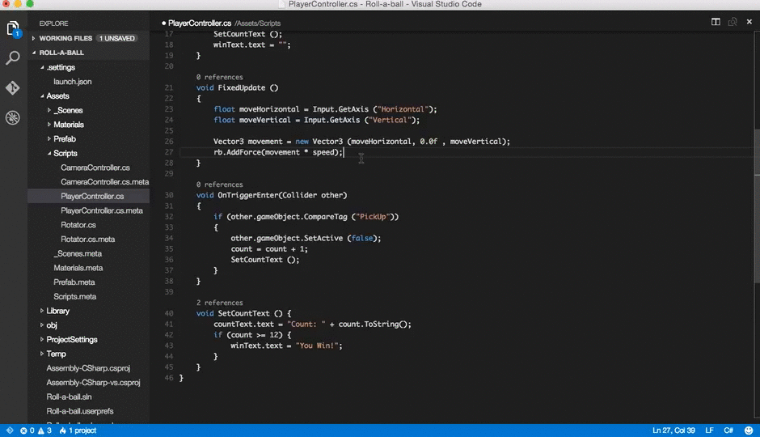
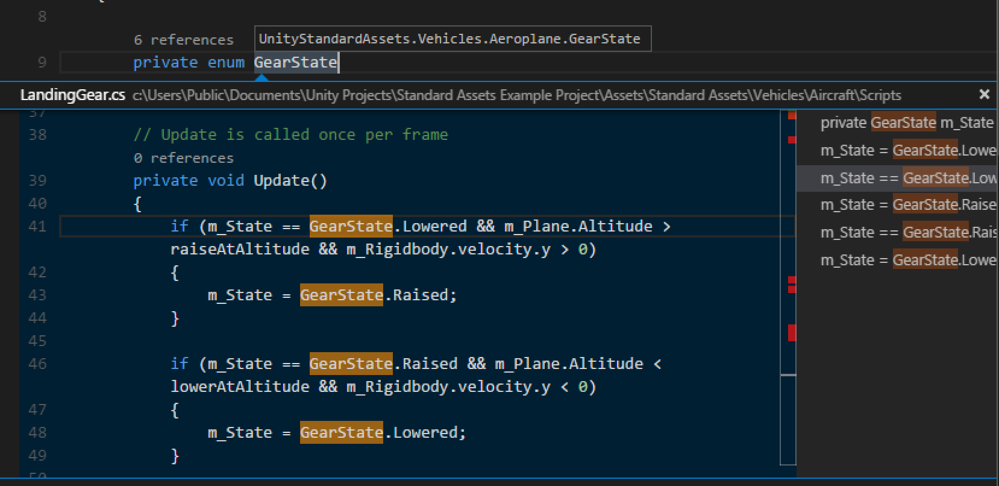
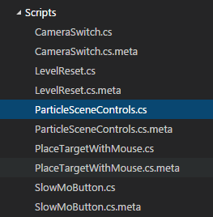
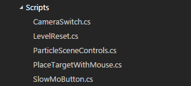

# Unity Development with VS Code

Visual Studio Code can be a great companion to Unity for editing and debugging C# files.  All of the [C#](/docs/languages/csharp.md) features are supported and more.  In the screen below you can see code colorization, bracket matching, IntelliSense, CodeLens and that's just the start.



Read on to find out how to configure Unity and your project to get the best possible experience.

## Connecting Unity and VS Code

The easiest way to get going is to leverage a [Unity plug-in](https://github.com/dotBunny/VSCode/) maintained by [@Reapazor](https://twitter.com/reapazor).  This plug-in streamlines the integration process significantly by performing the following tasks:

1. Sets VS Code as the default editor - opening a script now opens it in VS Code
2. Configures Unity to pass file and line numbers and reuse the existing window - so VS Code opens in the correct context
3. Scrubs the Unity project file to ensure that OmniSharp can work with it - to get the best editing experience
4. Configures VS Code to ignore certain Unity file types - removing clutter from the VS Code file explorer
5. Configures a `launch.json` file with the correct debug port - to enable debugging. However, installing the [Debugger for Unity](https://marketplace.visualstudio.com/items/Unity.unity-debug) is recommended to get debugging support.

### Step 1: Download the plug-in code

Open up a console and do a clone of the repo to get the plug-in source code.

```
git clone https://github.com/dotBunny/VSCode.git
```

### Step 2: Add the plug-in to your project

Go to the folder where you downloaded the plug-in source code and copy the `Plugins\Editor\dotBunny` folder to your Unity project.

>**Tip:** You may need to create a `Plugins` folder. Typically this should be stored under `Assets`.

To turn on the use of the provided integration, you will need to go to `Unity Preferences` and select the newly created `VSCode` tab.


Toggle on `Enable Integration` and you are ready to get going.

Additionally, you can toggle `Output Messages To Console` which will echo output to the Unity console e.g. whether the debug port was found.  This is useful for debugging any issues with the integration.

Clicking the `Write Workspace Settings` button will configure the workspace settings to filter out non-code assets created by Unity e.g. `.meta` files.

### Step 3: Open the Project

Now available in the `Assets` menu is `Open C# Project In Code`. This will open the project in VS Code in the context of the root folder of your project.  This enables VS Code to find your Unity project's solution file.


>**Tip:**  You probably want to leave a VS Code window open with the project context established.  That way when you open a file from Unity it will have all the required context.

## Editing Evolved

With the solution file selected, you are now ready to start editing with VS Code. Here is a list of some of the things you can expect:

* Syntax Highlighting
* Bracket matching
* IntelliSense
* Snippets
* CodeLens
* Peek
* Go-to Definition
* Code Actions/Lightbulbs
* Go to symbol
* Hover

Two topics that will help you are [Editing Evolved](/docs/editor/editingevolved.md) and [C#](/docs/languages/csharp.md).  In the image below, you can see VS Code showing hover context, peeking references and more.



## Unity Extensions

The community is continually developing more and more valuable extensions for Unity. Here are some popular extensions that you might find useful. You can find more extensions in the VS Code [Extension Marketplace](https://marketplace.visualstudio.com/VSCode).

<div class="marketplace-extensions-unity"></div>

> Tip: The extensions shown above are dynamically queried. Click on an extension tile above to read the description and reviews to decide which extension is best for you. See more in the [Marketplace](https://marketplace.visualstudio.com/vscode).

## Next Steps

Read on to learn more about:

* [Editing Evolved](/docs/editor/editingevolved.md) - find out more about the evolved editing features
* [Debugging](/docs/editor/debugging.md) - how to use the debugger with your project
* [C#](/docs/languages/csharp.md) - learn about the C# support in VS Code

## Common Questions

**Q: I don't have IntelliSense.**

**A:** You need to ensure that your solution is open in VS Code (not just a single file).  Open the folder with your solution and you usually will not need to do anything else.  If for some reason VS Code has not selected the right solution context, you can change the selected project by clicking on the OmniSharp flame icon on the status bar.


Choose the `-CSharp` version of the solution file and VS Code will light up.


**Q: How can I manually configure Editor Settings?**

**A:**  To set VS Code as the External Editor for Unity go to the **Edit** > **Preferences...** menu.  From there move to the **External Tools** tab where you should see a screen like the following:


 Click the browse button and set the VS Code executable (under `Program Files (x86)\Microsoft VS Code\Code.exe`) as the External Script Editor.

 This will enable Unity to launch VS Code whenever you open a script.

**Q: I want to set the command line arguments when I launch VS Code.**

**A:**  The workflow between Unity and VS Code is much smoother if you reopen an existing editor window and pass in context so that the editor lands on the exact line number and column location (for example to navigate to a compile bug).

>**Note:** This option is only available in the Windows version of Unity.  For Mac users, the Unity plug-in described above handles setting up the command line arguments.

To configure Unity to pass this data to VS Code, set the Editor Args to be `. -g "$(File):$(Line)"`.  You can see this step completed in the image above.

**Q: How can I change the file exclusions?**

**A:** Unity creates a number of additional files that can clutter your workspace in VS Code.  You can easily hide these so that you can focus on the files you actually want to edit.

To do this, add the following JSON to your [workspace settings](/docs/customization/userandworkspace.md).

```json
    // Configure glob patterns for excluding files and folders.
    "files.exclude": {
        "**/.git": true,
        "**/.DS_Store": true,
        "**/*.meta": true,
        "**/*.*.meta": true,
        "**/*.unity": true,
        "**/*.unityproj": true,
        "**/*.mat": true,
        "**/*.fbx": true,
        "**/*.FBX": true,
        "**/*.tga": true,
        "**/*.cubemap": true,
        "**/**.prefab": true,
        "**/Library": true,
        "**/ProjectSettings": true,
        "**/Temp": true
    }
```

As you can see below this will clean things up a lot...

Before|After
------|-----
|

**Q: VS Code did not go to the correct position in my file.**

**A:** For Mac, make sure you have installed the Unity plug-in described above.  For Windows, ensure you have set the additional command line arguments when you launch VS Code from Unity.

**Q: How can I debug Unity?**

**A:** Install the [Debugger for Unity](https://marketplace.visualstudio.com/items/Unity.unity-debug) extension.
