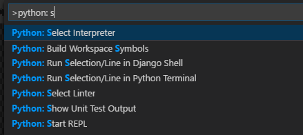
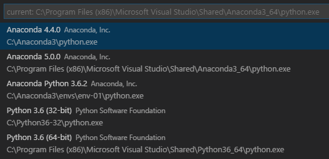

# Configuring Python Environments in VS Code

By default, the Python extension relies on the first Python interpreter it finds in the path. The extension uses that interpreter for IntelliSense, auto-completions, linting, formatting, and any other language-related feature other than debugging.

To select a specific interpreter, select the **Python: Select Workspace Interpreter** command (on the [command palette](/editor/codebasics#_command-palette)):



This command automatically looks for and displays a list of available Python interpreters.



Selecting an interpreter from the list configures the `settings.json` file accordingly.

The extension looks for interpreters in the following locations:

- Standard paths such as /usr/local/bin, /usr/sbin, /sbin, c:\\python27, c:\\python36, etc.
- Virtual environments located under the workspace (project) folder
- Conda environments

## Manually specifying an interpreter

If the interpreter you want to use is not located automatically, you can set the path to it directly in `settings.json`:

- Select the **File > Preferences > Settings ** command.
- Create or modify an entry for `python.pythonPath` with the full path to the Python executable. For example:

    Windows:
    ```json
    "python.pythonPath": "c:/python36/python.exe"
    ```

    Mac/Linux:
    ```json
    "python.pythonPath": "/home/python36/python"
    ```

## Environment variables in the interpreter path

An environment variable can be used in the path setting using the syntax `${env.VARIABLE}`. For example:

```json
{
    "python.pythonPath": "${env.PYTHONPATH}/venv/bin/python"
}
```

## Virtual environments

To use a Python interpreter that's installed in a virtual environment:

1. Edit the `python.pythonPath` setting to point to the virtual environment. For example:

    Windows:
    ```json
    {
        "python.pythonPath": "c:/dev/ala/venv/bin/python.exe"
    }
    ```

    Mac/Linux:
    ```json
    {
        "python.pythonPath": "/home/xxx/dev/ala/venv/bin/python"
    }
    ```

2. Configure the same `python.pythonPath` variable in `launch.json`.
3. Ensure that the the libraries and modules you plan on using for linting are installed within the virtual environment.
4. Restart VS Code.


## Python interpreter for debugging

By default, the debugger uses the same `python.pythonPath` setting as for other features of VS Code. Specifically, the value for `pythonPath` in the debugger settings simply refers to the main interpreter setting as follows:

```json
{
    "name": "Python",
    "type": "python",
    "request": "launch",
    "stopOnEntry": true,
    "program": "${file}",
    "pythonPath": "${config.python.pythonPath}",
    "debugOptions": [
        "WaitOnAbnormalExit",
        "WaitOnNormalExit",
        "RedirectOutput"
    ]
}
```

To use a different interpreter for debugging, specify its path directly in the `pythonPath` setting.

> **Note:** The debugger settings don't support relative paths, including when relying on the main `python.pythonPath` setting. To work around this, use an environment variable, or create a variable such as `${workspaceRoot}` that resolves to your project folder, then use that variable in the path, as in `"python.pythonPath": "${workspaceRoot}/venv/bin/python"`.

For information on general debugging configuration, see [Debugging](/docs/python/debugging.md).

## Next Steps

- [Editing Python code](/docs/python/editing.md)
- [Debugging Python](/docs/python/debugging.md)
- [Unit testing Python](/docs/python/unit-testing.md)
- [Settings reference](/docs/python/settings-reference.md)
