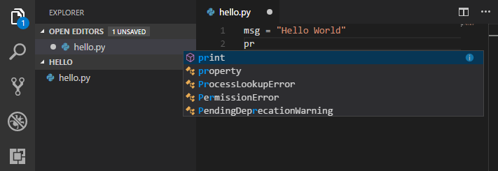
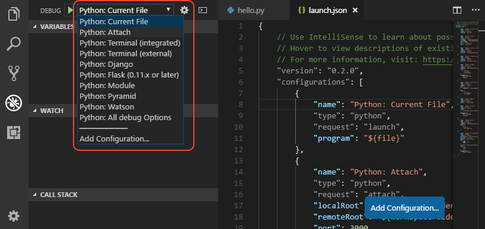
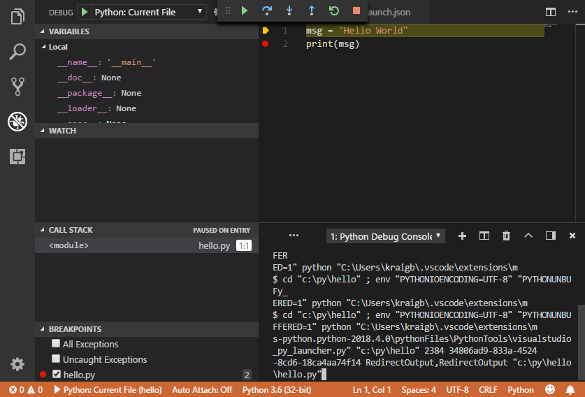
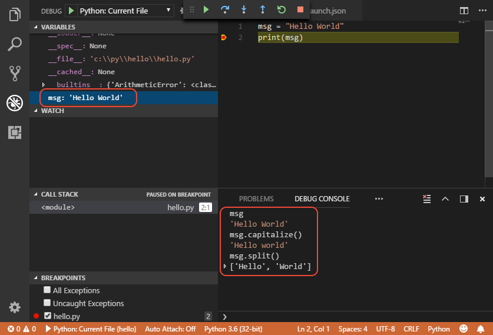
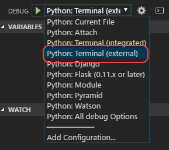
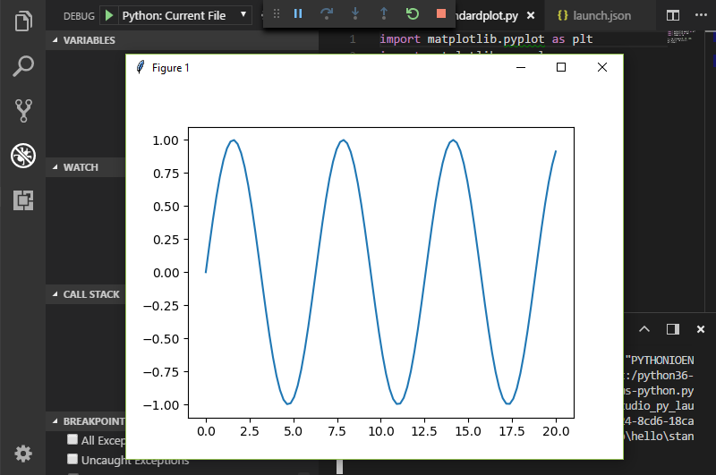

# Python Tutorial in VS Code

Let's get started by creating the simplest "Hello World" Python application.

Create an empty folder called "hello", navigate into it, and open VS Code:

```bash
mkdir hello
cd hello
code .
```

> **Tip:** You can open files or folders directly from the command line.  The period '.' refers to the current folder, therefore VS Code will start and open the `Hello` folder.

From the File Explorer toolbar, press the New File button:


Name the file `hello.py`, and it will automatically open in the editor:


By using the `.py` file extension, VS Code interprets this file as Python and evaluates the contents with the Python extension.

Next, start entering the following code:

```python
msg = "Hello World"
print(msg)
```

When you start typing `print`, notice how [IntelliSense](/docs/editor/intellisense.md) presents auto-completion options.



IntelliSense and auto-completions work for standard Python modules as well as other packages you've installed into your Python environment. It also provides completions for methods available on object types. For example, because the `msg` variable contains a string, IntelliSense provides string methods then you type `msg.`:


Feel free to experiment with IntelliSense some more, but then revert changes so you have only the `msg` variable and the `print` call, and save the file (`kb(workbench.action.files.save)`).

For full details on editing, formatting, and refactoring, see [Editing code](/docs/python/editing.md). The Python extension also has full support for [Linting](/docs/python/linting.md).

## Running Hello World

It's simple to run `hello.py` with Python. From an external terminal, just type `python3 hello.py`, and you should see "Hello World" as output (if the `python3` command is not available, try `python` or `py`).

You can also use the VS Code [integrated terminal](/docs/editor/integrated-terminal.md), opened using **View > Integrated Terminal** (`kb(workbench.action.terminal.toggleTerminal)` with the backtick character), to stay within the context of VS Code. Then you can just run `python hello.py` directly:


## Debugging Hello World

Let's now try debugging our simple Hello World application.

First, set a breakpoint in `hello.py` by placing the cursor on the `print` call and pressing `kb(editor.debug.action.toggleBreakpoint)`. Alternately, just click in the editor left gutter next to the line numbers. A red circle  appears in the gutter.


Next, select the Debug View in the sidebar:


Now you need to configure launch.json for Python by clicking the settings icon on the debug toolbar:


This command automatically creates a launch.json with a number of Python configurations, which appear in the configurations drop-down:



These different configurations are fully explained in [Debugging](/docs/python/debugging.md); for now, just select "Python," which runs the current file using the current Python environment, and automatically stops the debugger when the program starts. (See the `stopOnEntry` setting in the configuration).

Run the debugger by clicking the green arrow in the Debug toolbar or pressing `kb(workbench.action.debug.start)`. Because `stopOnEntry` is set to true in the configuration, the debugger stops on the first line of the file. If you examine the **Local** variables window at this point, you see that only automatic dunder variables are defined:



Notice also that a debug toolbar appears with commands to run, step, restart, and stop the program, and that the status bar changes to an orange color to indicate debug mode. The **Debug Console** also appears automatically.

Click the green arrow to continue running the program (`kb(workbench.action.debug.start)`), and the debugger stops on the breakpoint. The now-defined `msg` variable appears in the **Local** pane and you can work with the variable in the debug console:



Click the green arrow again to run the program to completion. "Hello World" appears in the debug console and VS Code exits debugging mode once the program is complete.

> **Tip**: Although the debug console works well for output, it presently cannot take input from a Python program through the `input` or `raw_input` functions. In those cases it's necessary to run the debugger using an external terminal. This is easily done by selecting the **External Terminal** debug configuration:
> 

For full details, see [Debugging](/docs/python/debugging.md).

## Installing packages

Let's now run code that's a little more interesting, using matplotlib and NumPy.

Return to **Explorer**, create a new file called `standardplot.py`, and paste in the following code:

```python
#%%
import matplotlib.pyplot as plt
import matplotlib as mpl
import numpy as np

x = np.linspace(0, 20, 100)
plt.plot(x, np.sin(x))
plt.show()
```

Try running the file in the debugger as described in the last section. If you run the program to completion, it may fail if matplotlib and numpy are not installed in the current environment.

This is easy to remedy. Go to the **Terminal** and enter `pip3 install matplotlib`, and VS Code installs that package into your project along with its dependencies (including NumPy).

> **Tip**: If you don't want to install matlotlib and its dependencies globally then use a [virtual environment](https://docs.python.org/3/tutorial/venv.html).

Rerun the program now and a plot window appears with the output:



You can configure VS Code to use any Python environment you have installed, including virtual environments. You can also use a separate environment for debugging. For full details, see [Environments](/docs/python/environments.md).

## Next Steps

There is much more to explore with Python in Visual Studio Code:

- [Python environments](/docs/python/environments.md)
- [Editing code](/docs/python/editing.md)
- [Linting](/docs/python/linting.md)
- [Debugging](/docs/python/debugging.md)
- [Unit testing](/docs/python/unit-testing.md)
- [Settings reference](/docs/python/settings-reference.md)
