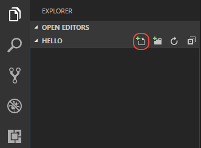
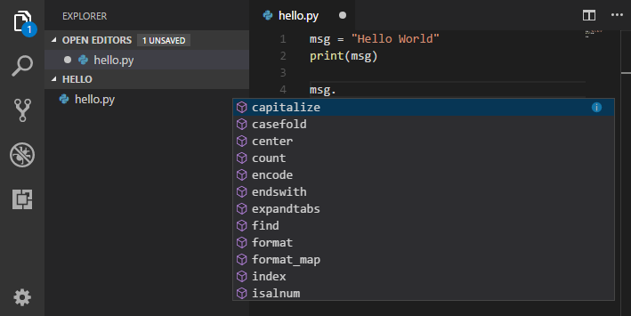
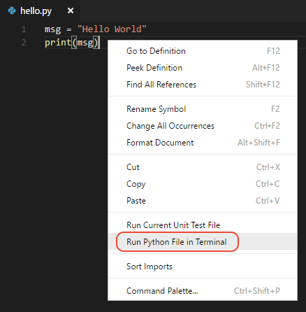

# Getting Started with Python

Let's get started by creating the simplest "Hello World" Python application.

> **Note**: This tutorial uses Python 3; if you're using Python 2, you need to make appropriate changes to the code.

## Prerequisites

To successfully complete this tutorial, you must do the following:

1. Install the [Python extension](https://marketplace.visualstudio.com/items?itemName=ms-python.python).

1. Install a version of Python 3 (for which this tutorial is written). Options include:
   - The built-in Python installation on Linux.
   - An installation through [Homebrew](https://brew.sh/) on macOS using `brew install python3` (the system install of Python on macOS is not supported).
   - A download from [python.org](https://www.python.org/downloads/).
   - A download from [Anaconda](https://www.anaconda.com/download/) (for data science purposes).

1. (Windows) Make sure the location of your Python interpreter is included in your PATH environment variable. You can check this by running `path` at the command prompt. If the Python interpreter's folder isn't included, open Settings, search for "environment", select **Edit environment variables for your account**, then edit the **Path** variable to include that folder.

1. From within VS Code, select a Python 3 interpreter using the **Python: Select Interpreter** command on the **Command Palette** (`kb(workbench.action.showCommands)`), or by using the **Select Python Environment** option on the Status Bar if available (it may already show a selected interpreter, too):

    

    The command presents a list of available interpreters that VS Code can find automatically. If you don't see the desired interpreter, see [Configuring Python environments](/docs/python/environments.md).

> **Tip**: Selecting an interpreter sets the `python.pythonPath` value in your workspace settings to the path of the interpreter. To see the setting, select **File** > **Preferences** > **Settings**, then select the **Workspace Settings** tab.

## Create a folder and source code file

Create an empty folder called "hello", navigate into it, and open VS Code (`code`) in that folder (`.`):

```
mkdir hello
cd hello
code .
```

From the File Explorer toolbar, press the New File button:



Name the file `hello.py`, and it automatically opens in the editor:


By using the `.py` file extension, VS Code interprets this file as Python and evaluates the contents with the Python extension.

Next, start entering the following source code if using Python 3:

```python
msg = "Hello World"
print(msg)
```

When you start typing `print`, notice how [IntelliSense](/docs/editor/intellisense.md) presents auto-completion options.


IntelliSense and auto-completions work for standard Python modules as well as other packages you've installed into the environment of the selected Python interpreter. It also provides completions for methods available on object types. For example, because the `msg` variable contains a string, IntelliSense provides string methods then you type `msg.`:



Feel free to experiment with IntelliSense some more, but then revert changes so you have only the `msg` variable and the `print` call, and save the file (`kb(workbench.action.files.save)`).

For full details on editing, formatting, and refactoring, see [Editing code](/docs/python/editing.md). The Python extension also has full support for [Linting](/docs/python/linting.md).

## Run Hello World

It's simple to run `hello.py` with Python. Right-click in the editor and select **Run Python File in Terminal** (which saves the file automatically):



The command opens a terminal panel in which your Python interpreter is automatically selected, then runs `python3 hello.py` (Mac/Linux) or `python hello.py`:


There are several other ways you can run Python within VS Code:

- Select one or more lines, then pressing Ctrl+Enter or right-click and select **Run Selection/Line in Python Terminal**. This command is very convenient for testing just a part of a file.
- Use the **Python: Start REPL** command to opens a REPL terminal for the currently selected Python interpreter. In the REPL you can then enter and run lines of code one at a time.

## Configure and run the debugger

Let's now try debugging our simple Hello World application.

First, set a breakpoint in `hello.py` by placing the cursor on the `print` call and pressing `kb(editor.debug.action.toggleBreakpoint)`. Alternately, just click in the editor left gutter next to the line numbers. A red circle  appears in the gutter.


Next, select the Debug View in the sidebar:


Then select the settings icon on the debug toolbar (or use the **Debug** > **Open configurations** menu command):


The command opens a menu of available debuggers, which shows **Python** and **Python Experimental**. Select **Python**. The Python extension then creates a `launch.json` file that contains number of configurations, which appear in the configurations drop-down:


(VS Code uses JSON files for all of its various configurations; `launch.json` is the standard name for a file containing debugging configurations.)

These different configurations are fully explained in [Debugging](/docs/python/debugging.md); for now, just select "Python: Current File," which is the configuration that runs the current file shown in the editor using the currently selected Python interpreter.

To automatically stop the debugger on the first line when the program starts, add a `stopOnEntry` setting to the "Python: Current File" configuration in `launch.json`, so that the whole configuration appears as follows:

```json
{
    "name": "Python: Current File",
    "type": "python",
    "request": "launch",
    "program": "${file}",
    "stopOnEntry": true
},
```

Switch to `hello.py` in the editor, then run the debugger by selecting the green arrow in the Debug toolbar or pressing `kb(workbench.action.debug.start)`. Because `stopOnEntry` is set to true, the debugger stops on the first line of the file. The current line is indicated with a yellow arrow in the left margin. If you examine the **Local** variables window at this point, you see that only automatic dunder variables are defined:


A debug toolbar appears along the top with commands to run, step, restart, and stop the program. The Status Bar also changes to an orange color to indicate debug mode. The **Python Debug Console** also appears automatically in the lower right pane to show the commands being run along with program output.

Select the green arrow on the debug toolbar to continue running the program (`kb(workbench.action.debug.start)`), and the debugger stops on the breakpoint. The now-defined `msg` variable appears in the **Local** pane and you can work with the variable in the **Debug Console** (select "Debug Console" in the lower right area of VS Code, or select it from the **...** menu if you don't see it):


Select the green arrow again to run the program to completion. "Hello World" appears in the **Python Debug Console** if you switch back to it, and VS Code exits debugging mode once the program is complete.

If you restart the debugger, remember that you set `stopOnEntry` in the configuration so that the debugger stops before running any code. To run all the way to the first breakpoint, remove that entry from the configuration.

For full details, see [Debugging](/docs/python/debugging.md).

### Troubleshooting

If for some reason VS Code doesn't generate `launch.json` for you, create a file by that name within the folder named `.vscode` folder (creating it if you need to), then paste the following contents into `launch.json`:

```json
{
    "version": "0.2.0",
    "configurations": [
        {
            "name": "Python: Current File",
            "type": "python",
            "request": "launch",
            "program": "${file}"
        }
    ]
}
```

If you see the error below, it means that you attempted to start to debugger when `launch.json` is selected in the editor rather than `hello.py`:

```output
    // Use IntelliSense to learn about possible attributes.
     ^
SyntaxError: invalid syntax
```

Select `hello.py` and try again. Alternately, create a debug configuration specifically for the `hello.py` file by adding the following lines in `launch.json` within the `configuration` array. Then select this configuration in the debugger drop-down and start the debugger again.

```json
        {
            "name": "Python: hello.py",
            "type": "python",
            "request": "launch",
            "program": "hello.py"
        },
```

## Install and use packages

Let's now run an example that's a little more interesting. In Python, packages are how you obtain any number of useful code libraries, typically from [PyPi](https://pypi.org/). For this example you use the matplotlib and numpy packages to create a graphical plot as commonly done with data science.

Return to **Explorer**, create a new file called `standardplot.py`, and paste in the following source code:

```python
import matplotlib.pyplot as plt
import matplotlib as mpl
import numpy as np

x = np.linspace(0, 20, 100)  # Create a list of evenly-spaced numbers over the range
plt.plot(x, np.sin(x))       # Plot the sine of each x point
plt.show()                   # Display the plot
```

Try running the file in the debugger as described in the last section, without any breakpoints. The message "ModuleNotFoundError: No module named 'matplotlib'" indicates that matplotlib and numpy are not installed in the current interpreter's environment, which is expected (unless you're using an Anaconda installation).

To install those packages, switch to the **Python Debug Console** that is already be open. (The Python Debug Console already has the selected interpreter's environment activated. You can also use **Python: Create Terminal** command from the command palette.) Enter `pip3 install matplotlib` (Mac/Linux) or `pip install matplotlib` (Windows) to install the matplotlib package (and its dependencies, such as numpy) into that environment.

> **Note**: On Linux, you may need to install **tkinter** by running `sudo apt-get install python3-tk`. Also note that if you don't want to install matplotlib and its dependencies globally then use a [virtual environment](https://docs.python.org/3/tutorial/venv.html).

Rerun the program now and after a few moments a plot window appears with the output:


## Next steps

You can configure VS Code to use any Python environment you have installed, including virtual and conda environments. You can also use a separate environment for debugging. For full details, see [Environments](/docs/python/environments.md).

There is then much more to explore with Python in Visual Studio Code:

- [Python environments](/docs/python/environments.md) - Control which Python interpreter is used for editing and debugging.
- [Editing code](/docs/python/editing.md) - Learn about autocomplete, IntelliSense, formatting, and refactoring for Python.
- [Linting](/docs/python/linting.md) - Enable, configure, and apply a variety of Python linters.
- [Debugging](/docs/python/debugging.md) - Learn to debug Python both locally and remotely.
- [Unit testing](/docs/python/unit-testing.md) - Configure unit test environments and discover, run, and debug tests.
- [Settings reference](/docs/python/settings-reference.md) - Explore the full range of Python-related settings in VS Code.