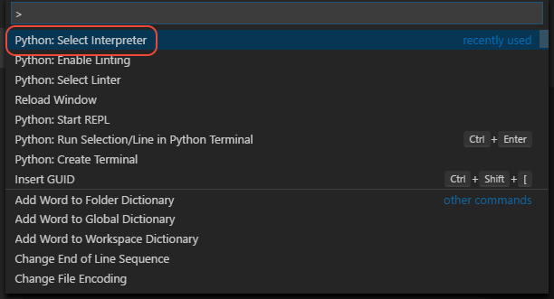
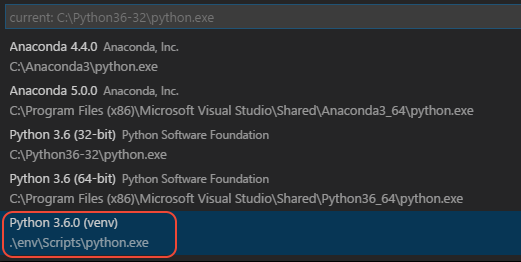
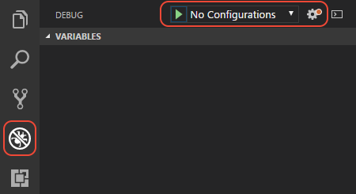

# Using Flask in Visual Studio Code

[Flask](http://flask.pocoo.org/) is a lightweight Python framework for web applications that provides the basics for URL routing and page rendering.

Flask is called a "micro" framework because it doesn't directly provide features like form validation, database abstraction, authentication, and so on. Such features are instead provided by special Python packages called Flask *extensions*. The extensions integrate seamlessly with Flask so that they appear as if they were part of Flask itself. For example, Flask itself doesn't provide a page template engine itself. However, installing Flask installs the Jinja templating engine by default.

## Create a project environment for Flask

1. On your file system, create a folder for this tutorial, then open that folder in VS Code.
1. Open the **Integrated Terminal** in VS Code by selecting the **View** > **Integrated Terminal** command (`kb(workbench.action.terminal.toggleTerminal)`)
1. In the Terminal, run the following command (as appropriate to your computer) to create a virtual environment in a folder named `env`:

    ```bash
    # Mac/Linux
    python3 -m venv env

    # Windows
    python -m venv env
    ```

    > **Note**: use a stock Python installation when running the above commands. If you use `python.exe` from an Anaconda installation, you see an error because the ensurepip module isn't available, and the environment is left in an unfinished state.

1. Activate the environment by opening the Command Palette (**View** > **Command Palette** or (`kb(workbench.action.showCommands)`)):

    

1. Select the **Python: Select Interpreter** command, and select the virtual environment (the exact details of your environment will differ depending on which interpreters you have installed):

    

1. The selected environment appears on the left side of the VS Code status bar, and notice the "(venv)" indicator that tells you that you're using a virtual environment:

    

1. Open the Command Palette again and select **Python: Create Terminal**, which creates a terminal in which the virtual environment is automatically activated by running its activate script. For example:

    ```output
    D:\py\Flask>d:/py/Flask/env/Scripts/activate.bat
    (env) D:\py\Flask>
    ```

1. Install Flask by running `pip install flask`, which installs the package into the virtual environment.

You now have an environment ready for writing Flask code.

## Create and run a minimal Flask app

1. In VS Code, create a new file in your project folder named `hello.py`.

1. Import Flask and create an instance of the Flask object, which is the app. If you type the code, you can observe VS Code's [IntelliSense and auto-completions](editing.md#autocomplete-and-intellisense):

    ```python
    from flask import Flask
    app = Flask(__name__)
    ```

1. Create a function that returns content, in this case a simple string, and use Flask's `app.route` decorator to map URL routes `/` and `/hello` to that function:

    ```python
    @app.route('/')
    @app.route('/hello')
    def hello_flask():
        # Return a simple text string with a little inline HTML
        return '<html><body>Hello, <strong>Flask</strong>!</body></html>'
    ```

    > **Note**: as shown here, you can use multiple decorators to route different URLs to the same function. You can also use a single decorator, of course.

1. Add startup code that automatically runs the app using a host and port as defined by environment variables. (Using environment variables allows you change the host and port on different computers, such as development and production servers, without changing the code):

    ```python
    if __name__ == '__main__':
    import os
    HOST = os.environ.get('SERVER_HOST', 'localhost')

    try:
        PORT = int(os.environ.get('SERVER_PORT', '5555'))
    except ValueError:
        PORT = 5555

    app.run(HOST, PORT)
    ```

1. Save the `hello.py` file.

1. Run the code by selecting **Debug** > **Start Without Debugging** (`kb(workbench.action.debug.run)`), select **Python** as the environment, and observe that a debug terminal appears showing the running development server:

    ```output
    D:\py\Flask>cd d:\py\Flask && cmd /C "set "PYTHONIOENCODING=UTF-8" && set "PYTHONUNBUFFERED=1" && d:\py\Flask\env\Scripts\python.exe C:\Users\user\.vscode\extensions\ms-python.python-2018.4.0\pythonFiles\PythonTools\visualstudio_py_launcher_nodebug.py d:\py\Flask 63253 34806ad9-833a-4524-8cd6-18ca4aa74f14 RedirectOutput,RedirectOutput d:\py\Flask\hello.py "
     * Serving Flask app "hello" (lazy loading)
     * Environment: production
       WARNING: Do not use the development server in a production environment.
       Use a production WSGI server instead.
     * Debug mode: off
     * Running on http://localhost:5555/ (Press CTRL+C to quit)
    ```

    > **Note**: You're welcome to try the **Python Experimental** debugging environment as well. For more information, see [Issue 538](https://github.com/Microsoft/vscode-python/issues/538) (GitHub).

1. Ctrl+click the `localhost:5555` URL in the terminal to open a browser to see the rendered page (you can also try the /hello relative URL to test that routing as well):

    

1. Observe that when you visit a URL, a message appears in the debug terminal showing the HTTP request:

    ```output
    127.0.0.1 - - [07/May/2018 14:40:15] "GET / HTTP/1.1" 200 -
    127.0.0.1 - - [07/May/2018 14:40:19] "GET /hello HTTP/1.1" 200 -
    ```

1. Use Ctrl+C in the debug terminal, or the **Debug** > **Stop debugging** command to stop the server.

## Run the app in the debugger

Debugging gives you the opportunity to pause a running program on a particular line of code. When a program is paused, you can examine variables, run code in the Debug Console panel, and otherwise take advantage of the features described on [Debugging](debugging.md).

1. First, modify the `hello_flask` function to contain more code you can step through in the debugger:

    ```python
    @app.route('/')
    @app.route('/hello')
    def hello_flask():
        from datetime import datetime
        now = datetime.now()
        formatted_now = now.strftime("%A, %d %B, %Y at %X")

        html_content = "<html><head><title>Hello, Flask</title></head><body>"
        html_content += "<strong>Hello, Flask!</strong> on " + formatted_now
        html_content += "</body></html>"

        return html_content;
    ```

1. Set a breakpoint at the first line of code in the function by doing one of the following:
    - With the cursor on that line, press F9.
    - With the cursor on that line, select the **Debug** > **Toggle Breakpoint** menu command.
    - Click directly in the margin to the left of the line number (a faded red dot appears when hovering there).

    The breakpoint appears as a red dot, as indicated by the yellow arrow in the image below:

    

1. Switch to the **Debug** panel in VS Code. Along the top you may see "No Configurations" and a warning dot on the gear icon. These indicate that you don't yet have a `launch.json` file containing debug configurations:

    

1. Select the gear icon and select **Python** from the list that appears. VS Code creates a `launch.json` file for you and selects the default **Python: Current File** configuration.

1. Switch back to the `hello.py` file and select the green **Start Debugging** arrow (or press F5, or select the **Debug** > **Start Debugging** menu command). Observe that the status bar changes color to indicate debugging:

    

    A debugging toolbar also appears in VS Code containing commands to Pause (or Continue, F5), Step Over (`kb(workbench.action.debug.stepOver)`), Step Into (`kb(workbench.action.debug.stepInto)`), Step Out (`kb(workbench.action.debug.stepOut)`), Restart (`kb(workbench.action.debug.restart)`), and Stop (`kb(workbench.action.debug.stop)`):

    

    See [VS Code debugging](/docs/editor/debugging.md) for a description of each command.

1. Ctrl+click the `localhost:5555` link in the debug terminal output to open a browser to that URL. The page doesn't render, however, because the program is paused in VS Code on the breakpoint. The yellow arrow indicates the next line of code to run.

    

1. Use Step Over to run the `from...import` statement and the `now = datetime.now()` statement.

1. On the left of the VS Code window you see a **Variables** pane that shows local variables, such as `now`. Below that are panes for **Watch**, **Call Stack**, and *Breakpoints** (see [VS Code debugging](/docs/editor/debugging.md) for details). In the **Locals** section, try expanding different values. You can also double-click (F2) values to modify them.

    

1. When a program is paused, the **Debug Console** panel lets you experiment with expressions and alternate code using the current state of the program. For example, you might want to try different date/time formats than the one in the code. In the editor, select the code that reads `now.strftime("%A, %d %B, %Y at %X")`, then right-click and select **Debug: Evaluate** to send that code to the debug console, where it runs:

    ```output
    now.strftime("%A, %d %B, %Y at %X")
    'Monday, 07 May, 2018 at 15:05:00'
    ```

1. Copy that line into the > prompt at the bottom of the debug console, and try changing the formatting:

    ```output
    now.strftime("%a, %d %B, %Y at %X")
    'Mon, 07 May, 2018 at 15:05:00'
    now.strftime("%a, %d %b, %Y at %X")
    'Mon, 07 May, 2018 at 15:05:00'
    now.strftime("%a, %d %b, %y at %X")
    'Mon, 07 May, 18 at 15:05:00'
    ```

    > **Note**: if you see a change you like, you can copy and paste it into the editor during a debugging session. However, those changes aren't applied until you restart the debugger.

1. Step through a few more lines of code, if you'd like, then select Continue (F5) to let the program run. The browser window shows the result:

    

1. Close the browser and stop the debugger when you're finished.

## Explore additional features

In this short tutorial you've briefly touched upon different parts of VS Code in the context of a Flask app. In addition to the features described on the [Python overview](../languages/python.md), you can explore some of the other features of VS Code:

- The **Go to Definition** command provides an easy way to jump from your code into a Python library. For example, in `hello.py`, right-click on the `Flask` class (in the line `app = Flask(__name__)`) and select **Go to Definition**, which navigates to the class definition in Flask's `app.py` file.

- The Peek Definition command, also on the right-click context menu, is similar, but displays the class definition directly in the editor:

    

    Press `kbstyle(Escape)` to close the Peek window.

- To run the Flask development server in debug mode, open the Debug panel, select the **Python: Flask** debugging environment, then select the gear icon to open `launch.json` to that configuration. In the `args` section of the configuration, remove `--no-debugger`. Then save `launch.json` and launch the debugger. You can also modify the `env` section to include `"FLASK_ENV": "development"`, which turns on Flask's debugger, activates Flask's automatic reloader, and enables debug mode on the app.

- Use templates to render a page: learn about templates in Flask on [Templates](http://flask.pocoo.org/docs/1.0/tutorial/templates/) (flask.pocoo.org).
