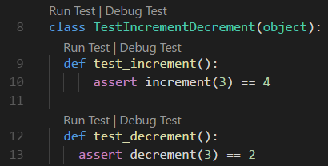
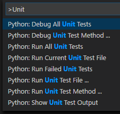

# Unit testing Python in VS Code

The Python extension supports unit testing with Python's built-in [unittest](https://docs.python.org/3/library/unittest.html) framework as well as [pytest](http://docs.pytest.org/en/latest/) and [Nose](http://nose.readthedocs.io/en/latest/). To use either pytest and Nose, they must be installed into the current Python environment (that is, the one identified in the `pythonPath` setting, see [Environments](/docs/python/environments.md)).

Unit test output is displayed in the **Python Test Log** panel, including errors caused when a test framework is not installed.

> **Tip**: a useful repository containing a variety of unit tests, applied to different sorting algorithms, is [https://github.com/gwtw/py-sorting](https://github.com/gwtw/py-sorting).

## Enabling and configuring a test framework

Unit testing is disabled by default. To enable unit testing, set one of the following settings to true:

```json
    "python.unitTest.unittestEnabled": false,
    "python.unitTest.pyTestEnabled": true,
    "python.unitTest.nosetestsEnabled": false,
```

> **Caution**: enable only one test framework at a time.

The example above enabled pytest, leaving unittest and Nose disabled.

Each framework also has specific configuration settings as described in the following sections:

### Unittest configuration settings

| Setting<br/>(python.unitTest.) | Default | Description |
| --- | --- | --- |
| unittestEnabled | `false` | Specifies whether UnitTest is enabled for unit testing. |
| unittestArgs | `["-v", "-s", ".", "-p", "*test*.py"]` | Arguments to pass to unittest, with each argument specified as an item in the array. See below for a description of the defaults. |
| cwd | null | Specifies an optional working directory for unit tests. |
| outputWindow | `"Python Test Log"` | The window to use for unit test output. |
| promptToConfigure | `true` | Specifies whether VS Code prompts to configure a test framework if potential tests are discovered. |
| debugPort | `3000` | Port number used for debugging of UnitTest tests. |

The default arguments for UnitTest are as follows:

- `-v` sets default verbosity. Remove this argument for simpler output.
- `-s .` specifies the starting directory for discovering tests. If you have tests in a "test" folder, you can change this to `-s test` (meaning `"-s", "test"` in the arguments array).
- `-p *test*.py` is the discovery pattern used to look for tests. In this case, it's any `.py` file that includes the word "test". If you name test files differently, such as appending "\_test" to every filename, then use a pattern like `*_test.py` in the appropriate argument of the array.

To stop a test run on the first failure, add the fail fast option `"-f"` to the arguments array.

See [unittest command-line interface](https://docs.python.org/3/library/unittest.html#command-line-interface) for the full set of available options.

### Pytest configuration settings

| Setting<br/>(python.unitTest.) | Default | Description |
| --- | --- | --- |
| pyTestEnabled | `false` | Specifies whether PyTest is enabled for unit testing. |
| pyTestPath | `"py.test"` | Path to PyTest. Use a full path if PyTest is located outside the current environment. |
| pyTestArgs | `[]` | Arguments to pass to PyTest, with each argument specified as an item in the array. See [PyTest command line options](https://docs.pytest.org/en/latest/customize.html#command-line-options-and-configuration-file-settings). |

You can also configure pytest using a `pytest.ini` file as described on [PyTest Configuration](https://docs.pytest.org/en/latest/customize.html).

> **Note**
> If you have the pytest-cov coverage module installed, VS Code doesn't stop at breakpoints while debugging because pytest-cov is using the same technique to access the source code being run. To prevent this behavior, include `--no-cov` in `pyTestArgs` when debugging tests. (For more information, see [Debuggers and PyCharm](http://pytest-cov.readthedocs.io/en/latest/debuggers.html) in the pytest-cov documentation.)

### Nose configuration settings

| Setting<br/>(python.unitTest.) | Default | Description |
| --- | --- | --- |
| nosetestsEnabled | `false` | Specifies whether Nose  is enabled for unit testing. |
| nosetestPath | `"nosetests"` | Path to Nose. Use a full path if Nose is located outside the current environment. |
| nosetestArgs | `[]` | Arguments to pass to Nose, with each argument specified as an item in the array. See [Nose usage options](http://nose.readthedocs.io/en/latest/usage.html#options). |

You can also configure nose with a `.noserc` or `nose.cfg` file as described on [Nose configuration](http://nose.readthedocs.io/en/latest/usage.html#configuration).

## Test discovery

VS Code uses the currently enabled unit testing framework to discover tests by applying the respective discovery patterns specified in the arguments option for that framework.

For example, the default arguments for unittest include `-s . -p *test*.py`, meaning that unittest looks recursively, starting with the project folder (`-s .`), for all files with names matching the `*test*.py` pattern (`-p *test*.py`). You can specify a different starting folder after `-s`, and/or a different pattern after `-p`.

Pytest, for its part, has an algorithm for determining its root folder and patterns, as described on [pytest Configuration](https://docs.pytest.org/en/latest/customize.html).

For nose, use the `-w=<folder>` and `-m=<regex>` switches to specify a starting folder and a regular expression for pattern matching (see [Nose options](http://nose.readthedocs.io/en/latest/usage.html#options)).

> **Tip**: Sometimes unit tests placed in subfolders aren't discovered because such test files cannot be imported. To make them importable, try placing an empty file named `__init__.py` in that folder.

## Running tests

Tests are run using any of the following actions:

- Select `Run Tests` on the Status Bar, then select one a command like `Run All Tests` or `Run Failed Unit Tests`.
- Right-click a file in Explorer and select `Run Unit Tests`, which runs the tests in that one file.
- Open a test file and select the `Run Test` Code Lens that appears above a test class or a method. This command runs only those tests in the class or runs that one test method, respectively.

    

- From the **Command Palette**, select any of the unit test commands:

    

| Command | Description |
| --- | --- |
| Run All Unit Tests | Searches for and runs all unit tests in the workspace and its subfolders. |
| Run Current Unit Test File | Runs the test in the file that's currently viewed in the editor. |
| Run Failed Unit Tests | Re-runs any tests that failed in a previous test run. Runs all test if no tests have been run yet. |
| Run Unit Test File... | Prompts for a specific test filename, then runs the test in that file. |
| Run Unit Test Method... | Prompts for the name of a test to run, providing auto-completion for test names. |
| Show Unit Test Output | Opens the Python Test Log panel with information about passing and failing tests, as well as errors and skipped tests. |

## Debugging tests

Because unit tests themselves are source code, they are prone to code defects just like the production code they test. For this reason, you may occasionally need to step through unit tests in the debugger.

The **Python: Debug All Tests** and **Python: Debug Unit Test Method...** commands (on the Command Palette and Status Bar menu) launch the debugger for all tests and a single test method, respectively.

## Next steps

- [Python environments](/docs/python/environments.md) - Control which Python interpreter is used for editing and debugging.
- [Settings reference](/docs/python/settings-reference.md) - Explore the full range of Python-related settings in VS Code.
