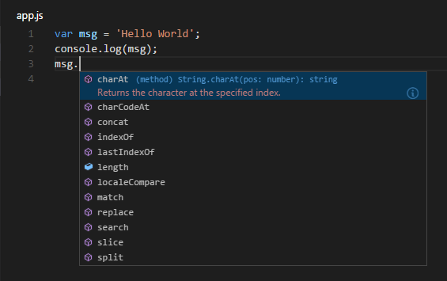
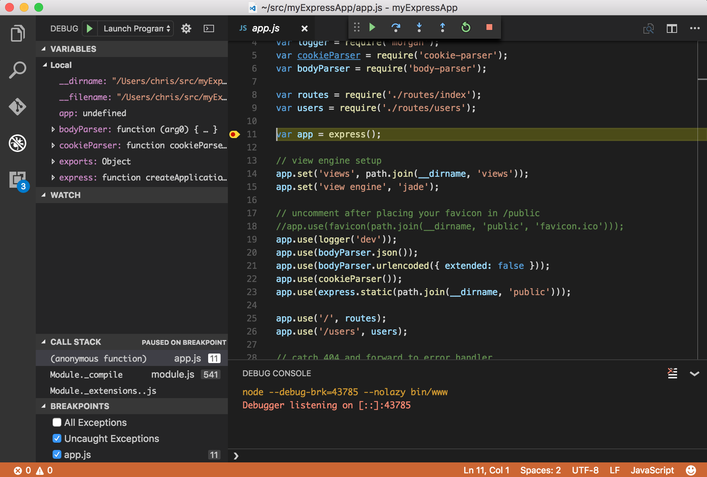

# Node.js Applications with VS Code

[Node.js](https://nodejs.org/) is a platform for building fast and scalable server applications using JavaScript. Node.js is the runtime and [NPM](https://www.npmjs.com/) is the Package Manager for Node.js modules.

To get started, [install Node.js for your platform](https://nodejs.org/en/download/). The Node Package Manager is included in the Node distribution.

> **Tip!** You can download both the TypeScript and JavaScript versions of the sample application created in this walkthrough from the [vscode-samples](https://github.com/Microsoft/vscode-samples/archive/master.zip) repository.

## Express

[Express](http://expressjs.com/) is a very popular application framework for building and running Node.js applications. You can scaffold a new Express application using the Express Generator tool, which is typically installed globally on your computer.

```bash
npm install -g express-generator
```

We can now scaffold a new Express application called `myExpressApp`.

```bash
express myExpressApp
```

This creates a new folder called `myExpressApp` with the contents of your application.  To install all of the dependencies, execute:

```bash
cd myExpressApp
npm install
```

At this point we should test that our application runs. `package.json` includes a `start` script which runs `node ./bin/www`.

From a terminal run:

```bash
npm start
```

The server will start and you can browse to `http://localhost:3000` to see the running application.


## Great Code Editing Experiences

Close the browser and from a terminal in the `myExpressApp` folder, stop the Node.js server by pressing `kbstyle(CTRL+C)`.

Now launch VS Code:

```bash
code .
```

>**Tip:** You can open files or folders directly from the command line.  The period '.' refers to the current folder, therefore VS Code will start and open the `myExpressApp` folder.

The [Node.js](https://nodejs.org/api/) and [Express](http://expressjs.com/api.html) documentation does a great job explaining how to build rich applications using the platform and framework. Visual Studio Code will make you more productive developing these types of applications by providing great code editing and navigation experiences.

VS Code uses the TypeScript compiler to drive its JavaScript language service, which means we can take advantage of what the compiler can infer about your code. For example, let's create a simple string variable in `app.js` and send the contents of the string to the console.

```javascript
var msg = 'hello world';
console.log(msg);
```

Note that when you typed `console.` IntelliSense on the `console` object was automatically presented to you. When editing JavaScript files, VS Code will automatically provide you with IntelliSense for the DOM.


Also notice that VS Code knows that `msg` is a string based on the initialization to `'hello world'`.  Type `msg.` to bring up IntelliSense and you'll see all of the string functions available on `msg`.



## Typings

VS Code can use TypeScript definition files (for example [`node.d.ts`](https://github.com/DefinitelyTyped/DefinitelyTyped/blob/master/node/node.d.ts)) to provide metadata to VS Code about the JavaScript based frameworks you are consuming in your application. Because TypeScript definition files are written in TypeScript, they can express the data types of parameters and functions, allowing VS Code to provide not only a rich IntelliSense experience, but also warnings when an API is being used incorrectly.

[Typings](https://github.com/typings/typings), the type definition manager for TypeScript, makes it easy to search for and install TypeScript definition files into your workspace. This tool can download the requested definitions from a variety of sources, including the [DefinitelyTyped repository](https://github.com/DefinitelyTyped/DefinitelyTyped). As we did with the express generator, we will install Typings globally using NPM so that you can use the tool in any application you create.

```bash
npm install -g typings
```

>**Tip:** Typings has a number of options for configuring where and how definition files are downloaded, from the terminal run `typings --help` for more information.

Start Visual Studio Code, open `app.js` and notice that if you hover over the Node.js global object `__dirname`, VS Code does not know the type and displays `any`.

Now, pull down the Node and Express definitions.

```bash
typings install node --ambient
typings install express --ambient
```

>**Tip:** You can download multiple definition files by combining them on the command line, for example `typings install node express --ambient`.

>**Important:** With the recent move to TypeScript 1.8.2, you will need to have a `jsconfig.json` in your workspace for the typings files to be picked up.
>
>Jump to the section below on [Adding a jsconfig.json Configuration File](/docs/runtimes/nodejs.md#adding-a-jsconfigjson-configuration-file) and then return to this part of the walkthrough.

Notice how VS Code now understands what `__dirname` is, based on the metadata from the `node.d.ts` file. Even more exciting, you can get full IntelliSense against the Node framework. For example, you can require `http` and get full IntelliSense against the `http` class as you type in Visual Studio Code.


If you pass an incorrect type to `createServer` VS Code will give you a warning.


>**Tip:** Press `kb(editor.action.marker.next)` to navigate errors and warnings within a file.

## Adding a jsconfig.json Configuration File

You can give even more hints to Visual Studio Code through a configuration file for the workspace (the root folder). Add a new file and name it `jsconfig.json` with the following contents:

```json
{
    "compilerOptions": {
        "target": "es5",
        "module": "commonjs"
    }
}
```

This file tells VS Code you are writing ES5 compliant code and the module system you want to use is the `commonjs` framework. With these options set, you can start to write code that references modules in other files. For example, in `app.js` we require the `./routes/index` module, which exports an `Express.Router` class. If you bring up IntelliSense on `routes`, you can see the shape of the `Router` class.


## Debugging your Node Application

In order to run and debug your Node application from within VS Code, you need to configure how the application will be started. To do this, click on the Debug icon in the View Bar on the left of Visual Studio Code.


Click on the Configure gear icon at the top of the Debug view to create a default `launch.json` file; and, select "Node.js" as the Debug Environment. This configuration file lets you specify how to start the application, what arguments to pass in, the working directory, and more. When the file is first created, VS Code will look in `package.json` for a `start` script and will use that value as the `program` (which in this case is `./bin/www`) for the `Launch` configuration. A second `Attach` configuration is also created to show you how to attach to a running Node application.


Take the defaults for everything else. If you do not have [Auto Save](/docs/editor/codebasics.md#saveauto-save) on, save the file by pressing `kb(workbench.action.files.save)`, and make sure `Launch` is selected in the configuration dropdown at the top of the Debug view. Open `app.js` and set a breakpoint on the line of code we wrote earlier `var msg = 'hello world';` by clicking in the gutter to the left of the line number. Press `kb(workbench.action.debug.start)` to start debugging the application. VS Code will start the server in a new terminal and hit the breakpoint we set. From there you can inspect variables, create watches, and step through your code.



>**Note:** VS Code only supports local debugging at this time, we are constantly working to improve our debugging support.

## Extensions

The community is continually developing more and more valuable extensions for Node.js. Here are some popular extensions that you might find useful.

* [View Node Package](https://marketplace.visualstudio.com/items?itemName=dkundel.vscode-npm-source) - Open a Node.js package repository/documentation straight from VS Code.
* [JavaScript (ES6) code snippets](https://marketplace.visualstudio.com/items?itemName=xabikos.JavaScriptSnippets) - Snippets for JavaScript in ES6 syntax.
* [ESLint](https://marketplace.visualstudio.com/items?itemName=dbaeumer.vscode-eslint) - Integrates ESLint into VS Code.
* [JSHint](https://marketplace.visualstudio.com/items?itemName=dbaeumer.jshint) - Integrates JSHint into VS Code.
* [Add JSDoc comments](https://marketplace.visualstudio.com/items?itemName=stevencl.addDocComments) - Adds JSDoc @param and @return tags for selected function signatures in JS and TS.
* [Prettify JSON](https://marketplace.visualstudio.com/items?itemName=mohsen1.prettify-json) - Prettify ugly JSON inside VS Code.
* [Beautify](https://marketplace.visualstudio.com/items?itemName=HookyQR.beautify) - This extension enables running [js-beautify](http://jsbeautifier.org/) in VS Code.

## Next Steps

There is much more to explore with Visual Studio Code, please try the following topics:

* [Debugging](/docs/editor/debugging.md) - This is where VS Code really shines
* [Editing Evolved](/docs/editor/editingevolved.md) - Lint, IntelliSense, Lightbulbs, Peek and Goto Definition and more
* [ASP.NET Core](/docs/runtimes/ASPnet5.md) - End to end sample showing off our ASP.NET Core and .NET Core support with a sample app
* [Tasks](/docs/editor/tasks.md) - Running tasks with Gulp, Grunt and Jake.  Showing Errors and Warnings

