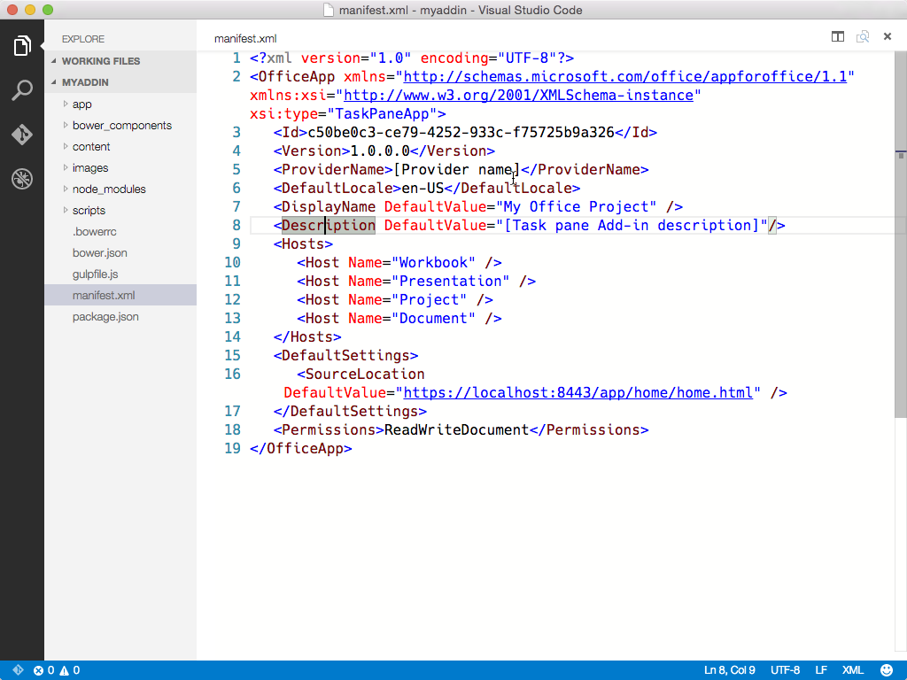
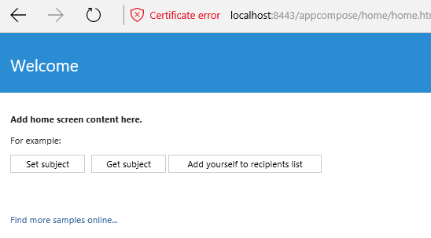
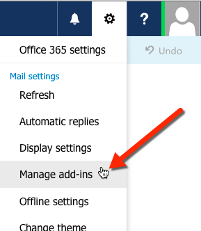
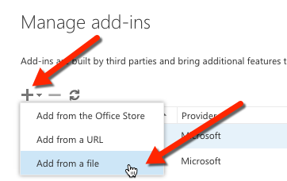
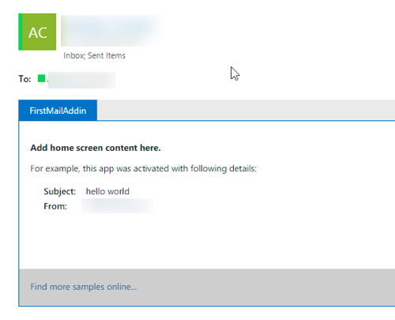
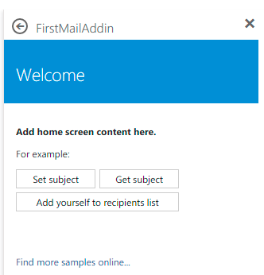
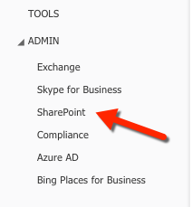
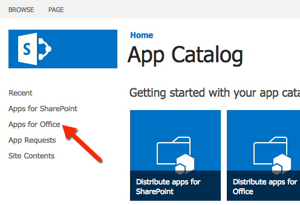
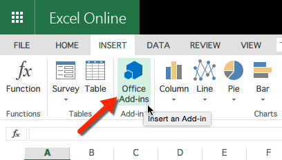

# Office Add-ins with VS Code
[Office Add-ins](https://dev.office.com/getting-started/addins) run inside an Office application and can interact with the contents of the Office document using the rich JavaScript API.


Under the hood, an Office Add-in is simply a web app that you can host anywhere. Using a `manifest.xml` file, you tell the Office application where your web app is located and how you want it to appear. The Office application takes care of hosting it within Office.


## Prerequisites
To run the Yeoman Office Add-in generator, you need a few things:

- [NPM](https://www.npmjs.com/)
- [Bower](http://bower.io)
- [Yeoman](http://yeoman.io)
- [Yeoman Office generator](https://www.npmjs.com/package/generator-office)
- [Gulp](http://gulpjs.com)
- [TSD](http://definitelytyped.org/tsd)

These should all be installed globally which you can do with a single command:

```
npm install -g bower yo generator-office gulp tsd
```

Before running the generator, we recommend you first create a subfolder and run the generator from there. Yeoman generators typically create files in the current working directory where it is run. The following command will create a new folder and navigate into it:

```
mkdir myaddin && cd $_
```


## Create an Office Add-in
Once you have a place to put your Add-in, you can now create the Add-in. Use the Yeoman generator [office](https://www.npmjs.com/package/generator-office) to create one of three Add-ins: mail, content or task pane.

The generator is designed to be run from within the directory where you want to scaffold the project so ensure you set the current directory appropriately.

To run the generator:

```
yo office
```

The generator will prompt you for the Add-in name, relative folder where the project should be created, the type of Add-in and the technology you want to use to create the Add-in.


### Update the Add-in Manifest.xml
This is done using an XML file that tells the Office application about the Add-in including details such as:

- Type of Add-in (e.g. Mail / Task Pane / Content)
- Name & description of the Add-in
- Permissions the Add-in requires
- URL of the web app hosting the Add-in

Open the project in Visual Studio Code by entering the following on the command line from within the same folder where you ran the generator:

```
code .
```



Open the `manifest.xml` file that was created by the `office` generator and locate the `SourceLocation` node. Update this URL to the URL where you will host the Add-in.

>**Tip:** If you are using an Azure Web App as the host, the URL will look something like `https://[name-of-your-web-app].azurewebsites.net/[path-to-add-in]`. If you are using the self-hosted option listed above, it will be `https://localhost:8443/[path-to-add-in]`.


## Hosting Your Office Add-in Development
Office Add-ins must be served via HTTPS; the Office application will not load a web app as an Add-in if it is HTTP. To develop, debug and host the Add-in locally, you need a way to create and serve a web app locally using HTTPS.

### Self-Hosted HTTPS Site

One option is to use the [gulp-webserver](https://npmjs.com/package/gulp-webserver) plug-in. The Office generator will add this to the `gulpfile.js` as a task named `serve-static` for the project that's generated.

Start the self-hosted webserver using the following statement:

```
gulp serve-static
```

This will start a HTTPS server at **https://localhost:8443**.

>**Tip:** You can also run the task from within VS Code by pressing `kb(workbench.action.showCommands)` and then typing `Run Task` followed by `kbstyle(Enter)` which will list all available tasks. Selecting `serve-static` and pressing `kbstyle(Enter)` will execute the task.


### Running the Add-in
At this point, you can point your browser at the Add-in URL and see it running.  Assuming you hosted it locally, just type that URL into your browser.



> **Tip**: The generated Add-in comes with a self-signed certificate and key; you will want to add these to your trusted authority list of certificates so your browser does not issue certificate warnings like you see in the image above.
>
> Refer to the [gulp-webserver](https://npmjs.com/package/gulp-webserver) documentation if you want to use your own self-signed certificates.
>
> Refer to [this KB article #PH18677](https://support.apple.com/kb/PH18677?locale=en_US) for instructions on how to trust a certificate in OS X Yosemite.

Now that you've tested your Add-in locally, let's add it into Office.


## Use VS Code to Develop Your Office Add-in!

VS Code is a great tool to help you develop your custom Office Add-ins regardless if they are for Outlook, Word, Excel, PowerPoint and run in the web clients, Windows clients, iOS clients or on OS X!

### JavaScript Project Support

The Office generator will create a `jsconfig.json` file when it creates your project.  This is the file that VS Code will use to infer all the JavaScript files within your project and save you from having to include the repetitive `/// <reference path="../App.js" />` code blocks.

> Learn more about the `jsconfig.json` file on the [JavaScript language](/docs/languages/javascript.md#javascript-projects-jsconfigjson) page.

### JavaScript IntelliSense Support

In addition, even if you are writing plain JavaScript, VS Code can use TypeScript type definition files (`*.d.ts`) to provide additional IntelliSense support. The Office generator adds a `tsd.json` file to the created files with references to all third-party libraries used by the project type you selected.

All you have to do after creating the project using the Yeoman Office generator is run the following command to download the referenced type definition files:

```
tsd install
```

> Learn more about the JavaScript IntelliSense support provided by VS Code with TypeScript on the [JavaScript language](/docs/languages/javascript.md#intellisense-support) page.

### JavaScript Peek Definition

You can also get details on objects, properties and methods you are referencing within your Office Add-in using VS Code capabilities like Peek Definition, Go to Definition and Find all References by simply right-clicking in any JavaScript file.

> Learn more about the Rich Editing Support in VS Code on the [JavaScript language](/docs/languages/javascript.md#rich-editing-support) page.

### Debugging your Office Add-in

VS Code does not currently support client-side debugging. To debug your client-side Add-in, you can use the Office web clients and open the browser's developer tools and debug the Add-in just like any other client-side JavaScript application.

If you are using Node.js or ASP.NET 5 for server-side logic that supports your Office Add-in, refer to the [Debugging](/docs/editor/debugging.md) page to configure VS Code for debugging either of these runtimes.


## Install the Add-in
Office Add-ins must be installed, or registered, with the Office application in order to load. This is done using the `manifest.xml` file you modified earlier.


### Side Loading Mail Add-ins
Mail Add-ins can be installed within the Outlook Web App. Browse to your Outlook Web App (https://mail.office365.com) and login. Once logged in, click the gear icon in the top-right section and select **Manage add-ins**:



On the **Manage add-ins** page, select the *+* icon and then select **Add from a file**.



Locate the `manifest.xml` file for your custom Add-in and install it, accepting all prompts when installing it.

Once that's done, select an existing email and you will see a horizontal bar below the email header that includes the Add-in:



Next try creating an email, click the **Add-ins** or **Apps** menu item to get the Task Pane to appear:


Select the Add-in and see it appear in the Task Pane:




### Deploying Add-ins to the Office 365 Tenancy's App Catalog
All Office Add-ins (including Mail Add-ins) can be installed from your Office 365 tenancy's App Catalog site. Log in to your [Office 365 Portal](https://portal.office365.com). In the left-hand navigation, towards the bottom, select the **Admin / SharePoint** option:



From the **SharePoint Admin Center**, select the **Apps** option in the left-hand menu and then select the **App Catalog**. On the **App Catalog** page, select the **Apps for Office** option and upload the `manifest.xml` file.



### Install Content & Task Pane Add-ins in Word / Excel / PowerPoint

Depending on the type of Add-in you created, you can add it to one of the Office applications. Task Pane and Content Add-ins can be installed in Word, Excel & PowerPoint. Mail Add-ins can be installed in Outlook.

To install an Add-in within an Office application, select the **Insert** tab and click the **Office Add-ins** button, as shown here using the Excel Web App:



Using the Office Add-ins dialog you can select Add-ins you've uploaded to your Office 365 tenancy's App Catalog (*listed under My Organization*) or acquire Add-ins from the Office Store.


## Next Steps
Check out the other pages on the VS Code site to find out how you can leverage more capabilities of the editor when creating custom Office Add-ins:

- [Language Overview](/docs/languages/overview.md) - You can write Office Add-ins in many languages. Find out what VS Code has to offer.
- [The Basics](/docs/editor/codebasics.md) - Just starting out with VS Code? This is worth reviewing.
- [Editing Evolved](/docs/editor/editingevolved.md) - Review all the ways VS Code can help you in editing.
- [Node.js](/docs/Runtimes/nodejs.md) - Find out more about our Node.js support.


## Common Questions
**Q: Can I create an Office Add-in with the generator and use VS Code regardless of the language or client-side framework?**

**A:** Yes, you can. You can use pure HTML, Angular, Ember, React, Aurelia... anything you like!

**Q: Can I use TypeScript to create my Office Add-in?**

**A:** Absolutely and VS Code has great support for [TypeScript](/docs/languages/typescript.md)!
