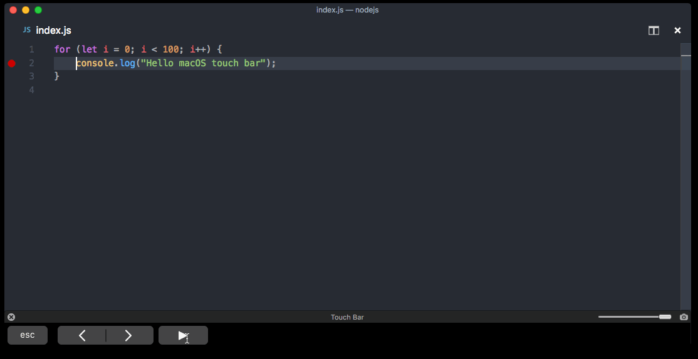

# Running VS Code on macOS

## Installation

1. [Download Visual Studio Code](https://go.microsoft.com/fwlink/?LinkID=534106) for macOS.
2. Double-click on the downloaded archive to expand the contents.
3. Drag `Visual Studio Code.app` to the `Applications` folder, making it available in the `Launchpad`.
4. Add VS Code to your Dock by right-clicking on the icon and choosing `Options`, `Keep in Dock`.

## Launching from the Command Line

You can also run VS Code from the terminal by typing 'code' after adding it to the path:

- Launch VS Code.
- Open the **Command Palette** (`kb(workbench.action.showCommands)`) and type 'shell command' to find the **Shell Command: Install 'code' command in PATH** command.


- Restart the terminal for the new `$PATH` value to take effect. You'll be able to type 'code .' in any folder to start editing files in that folder.

>**Note:** If you still have the old `code` alias in your `.bash_profile` (or equivalent) from an early VS Code version, remove it and replace it by executing the **Shell Command: Install 'code' command in PATH** command.

To manually add VS Code to your path:

```bash
cat << EOF >> ~/.bash_profile
# Add Visual Studio Code (code)
export PATH="\$PATH:/Applications/Visual Studio Code.app/Contents/Resources/app/bin"
EOF
```

## Touch Bar support

Out of the box VS Code adds actions to navigate in editor history as well as the full Debug tool bar to control the debugger on your Touch Bar:



## Updates

VS Code ships monthly [releases](/updates) and supports auto-update when a new release is available. If you're prompted by VS Code, accept the newest update and it will get installed (you won't need to do anything else to get the latest bits).

## Preferences Menu

You can configure VS Code through [settings](/docs/getstarted/settings.md), [color themes](/docs/getstarted/themes.md) and [custom keybindings](/docs/getstarted/keybindings.md) and you will often see mention in our documentation of the **File** > **Preferences** menu group.  On a macOS, the **Preferences** menu group is under **Code**, not **File**.

## Next Steps

Once you have installed VS Code, these topics will help you learn more about VS Code:

* [Additional Components](/docs/setup/additional-components.md) - Learn how to install Git, Node.js, TypeScript and tools like Yeoman.
* [User Interface](/docs/getstarted/userinterface.md) - A quick orientation around VS Code.
* [User/Workspace Settings](/docs/getstarted/settings.md) - Learn how to configure VS Code to your preferences settings.

## Common Questions

**Q. Mono and El Capitan**

**A:** Mono stopped working in Visual Studio Code after I installed OS X 10.11 El Capitan Public Beta. What do I do?

Run these commands:

```bash
brew update
brew reinstall mono
```