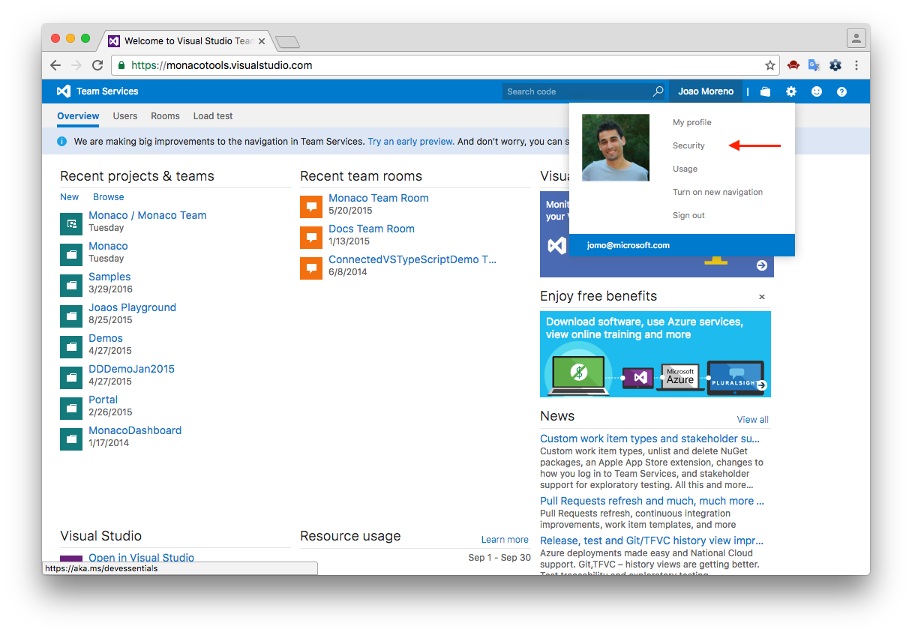
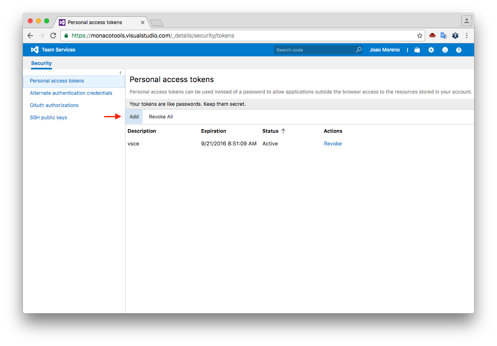
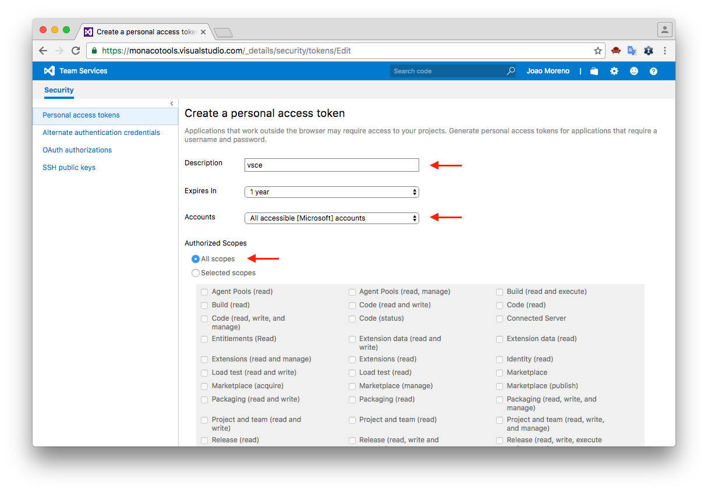

# vsce - Publishing Tool Reference

[vsce](https://github.com/Microsoft/vsce) is the command line tool you'll use to publish
extensions to the [Extension Gallery](/docs/editor/extension-gallery.md).  You can also load extensions locally and share them via email or a UNC drive.

## Installation

Make sure you have [node.js](https://nodejs.org/) installed. Then simply run:

```
npm install -g vsce
```

## Usage

You'll use the `vsce` command directly from the command line. For example, here's how you can quickly publish an extension:

```
$ vsce publish
Publishing uuid@0.0.1...
Successfully published uuid@0.0.1!
```

For a reference on all the available commands, run `vsce --help`.

## Publishing Extensions

Visual Studio Code leverages [Visual Studio Team Services](https://www.visualstudio.com/products/visual-studio-team-services-vs) for its gallery services. This means that authentication, hosting and management of extensions is provided through that service.

`vsce` can only publish extensions using [Personal Access Tokens](https://www.visualstudio.com/en-us/news/2015-jul-7-vso.aspx). You need to create at least one in order to publish an extension.

### Get a Personal Access Token

First, login to or sign up for [Visual Studio Team Services](https://www.visualstudio.com/en-us/get-started/setup/sign-up-for-visual-studio-online).

Then, from your account's home page `https://ACCOUNT.visualstudio.com`, go to the **My Profile** page:



Switch to the **Security** tab and **Add** a new Personal Access Token:



Give the Personal Access Token a nice description, optionally extend its expiration date to 1 year and make it access every account:



The next screen will display your newly created Personal Access Token. **Copy** it, you'll need it to create a publisher.

### Create a Publisher

A **publisher** is an identity who can publish extensions to the Visual Studio Code gallery. Every extension needs to include a `publisher` name in its [`package.json` file](/docs/extensionAPI/extension-manifest.md).

Once you have a [Personal Access Token](/docs/tools/vscecli.md#get-a-personal-access-token), you can create a new publisher using `vsce`:

```
vsce create-publisher (publisher name)
```

`vsce` will remember the provided Personal Access Token for future references to this publisher.

### Login to a Publisher

If you already created a publisher before and simply want to use it with `vsce`:

```
vsce login (publisher name)
```

Similarly to the `create-publisher` command, `vsce` will ask you for the Personal Access Token and remember it for future commands.

## Packaging Extensions

You may want to simply package extensions without publishing them to the store. Extensions will always be packaged into a `.vsix` file. Here's how:

```
vsce package
```

This will package your extension into a `.vsix` file and place it in the current directory. It's possible to install `.vsix` files into Visual Studio Code. See [Installing Extensions](/docs/extensions/install-extension.md) for more details.

## Advanced Usage

### Marketplace Integration

You can customize how your extension looks in the Visual Studio Marketplace. See the [Go extension](https://marketplace.visualstudio.com/items/lukehoban.Go) for an example.

Here are some tips for making your extension look great on the Marketplace:

- Any `README.md` file at the root of your extension will be used to populate the extension's gallery page's contents. **Note:** since the gallery doesn't serve images yet, you may find images and/or links to be broken in the extension's gallery page. `vsce` can fix this for you in two different ways:
- If you add a `repository` field to your `package.json` and if it is a public GitHub repository, `vsce` will automatically detect it and adjust the links accordingly.
- You can override that behavior and/or set it by using the `--baseContentUrl` and `--baseImagesUrl` flags when running `vsce package`. Then publish the extension by passing the path to the packaged `.vsix` file as an argument to `vsce publish`. 
- You can set the banner background color by setting `galleryBanner.color` to the intended hex value in `package.json`.
- You can set an icon by setting `icon` to a relative path to a squared `128px` PNG file included in your extension, in `package.json`.

Also see [Marketplace Presentation Tips](/docs/extensionAPI/extension-manifest.md#marketplace-presentation-tips).

### `.vscodeignore`

You can create a `.vscodeignore` file to exclude some files from being included in your extension's package. This file is a collection of [glob](https://github.com/isaacs/minimatch) patterns, one per line.

For example:

```
**/*.ts
**/tsconfig.json
!file.ts
```

You should ignore all files not needed at runtime. For example, if your extension is written in TypeScript, you should ignore all `**/*.ts` files, like in the previous example.

**Note:** Development dependencies listed in `devDependencies` will be automatically ignored, you don't need to add them to the `.vscodeignore` file.

### Pre-publish step

It's possible to add a pre-publish step to your manifest file. The command will be called every time the extension is packaged.

```json
{
    "name": "uuid",
    "version": "0.0.1",
    "publisher": "joaomoreno",
    "engines": {
        "vscode": "0.10.x"
    },
    "scripts": {
        "vscode:prepublish": "tsc"
    }
}
```

This will always invoke the [TypeScript](http://www.typescriptlang.org/) compiler whenever the extension is packaged.

## Next Steps

* [Extension Gallery](/docs/editor/extension-gallery.md) - Learn more about VS Code's public extension gallery.
* [Installing Extensions](/docs/extensions/install-extension.md) - Learn about other options for installing and sharing extensions.

## Common Questions

**Q: I get 403 Forbidden (or 401 Unauthorized) error when I try to publish my extension?**

**A:** One easy mistake to make when creating the PAT (Personal Access Token) is to not select `all accessible accounts` in the Accounts field dropdown (instead selecting a specific account). You should also set the Authorized Scopes to `All scopes` for the publish to work.

**Q: I can't unpublish my extension through the `vsce` tool?**

**A:** You may have changed your extension ID or publisher name. You can also manage your extensions directly on the Marketplace by going to the [manage page](https://marketplace.visualstudio.com/manage).  You can update or unpublish your extension from your publisher manage page.
