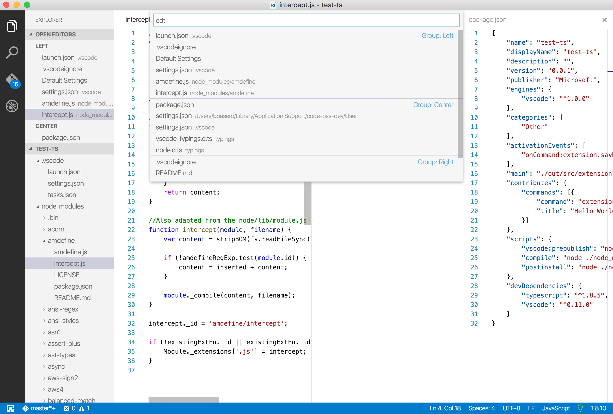
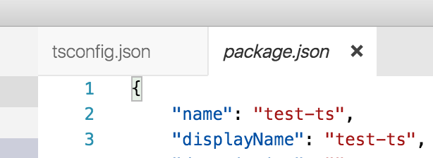
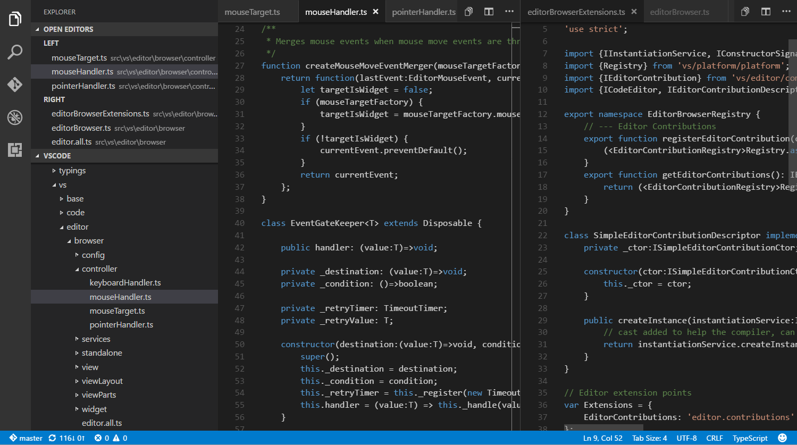
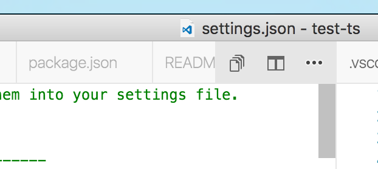
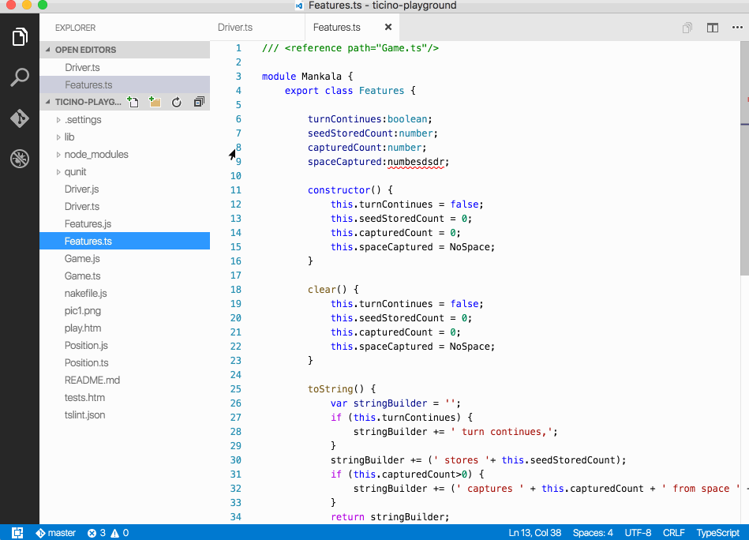

# June 2016 (version 1.3)

The June release of VS Code has some great new features, enhancements to existing features, and a set of important bug fixes.

Here are the highlights:

* **Editor**: TBD
* **Workbench**: TBD
* **Languages**: TBD
* **Debugging**: TBD
* **Extensions**: TBD

Please continue reading for more information on what's new in June.

## Editor

## Workbench

### Editor Stacks

As a preparation for enabling tabs in the workbench (more details below), we revisited how you can interact with editors in VS Code. Many users coming from other editors got confused by some of the editor behaviour in VS Code, for example:
* closing a dirty editor did not prompt for saving
* closing an editor closed the entire group without revealing the previous editor
* the editor history was showing a list of all editors ever opened
* working files view in the explorer was a confusing concept (read more on the new "opened editors" view below)

With editor stacks, these issues are all resolved: You can open up to 3 **editor groups** side by side and each group contains a **stack of editors**. Closing an editor from a group reveals the editor that was previously opened in that group until the last editor closes and the group hides. You get prompted to save in case the editor shows a resource with modifications. 

Use `kb(workbench.action.openPreviousEditorInGroup` to bring up a list of most recently used editors of a group for navigation. Press `kb(workbench.action.showAllEditors` to show a list of all open editors across all groups.

Note that the behaviour of editor stacks is independent from having tabs enabled or not. So you will benefit from these changes even if you are not a fan of seeing tabs. 

**Note:** due to the large conceptional impact of editor stacks, many command ids have been renamed and new commands introduced. Please refer to [this issue](https://github.com/Microsoft/vscode/issues/6605) that documents all of it. It also gives some guidance if you liked the previous behaviour and explains how to change keybindings to get it back.

### Preview Editors

Closely related to editor stack and tabs are **preview editors**. If you click around many files you might not want to see a tab opened for each file you open. Preview editors are helpful to reduce the number of opened editors (and tabs): An editor will open as preview if you open it e.g. by clicking in the explorer. As long as the editor stays in preview mode, other editors that open will open in the same spot as the preview editor. Basically you are reusing the editor for each file you open.

Certain actions cause a preview editor to become a normal editor. When you modify the contents of a file, the editor will be kept open. The same is true for when you double click on a file in the explorer or inside a tab or move a file to a specific editor group.

Preview editors are indicated using an italic font style.

We introdcued new settings to control the behaviour of preview editors:
* `workbench.editor.enablePreview` to globally enable or disable preview editors
* `workbench.editor.enablePreviewFromQuickOpen` to enable or disable preview editors when opened from quick open

### Tabs

With this release you can enable to show editors in tabs by configuring the new `workbench.editor.showTabs` setting. Enabling this setting will draw tabs for each opened editor in the title area above an editor. You can move tabs around via drag and drop or right click on a tab to explore some useful actions. 

In case the available space for tabs is not enough to show all, you will see tabs overflowing to the left and right. You can always use the mouse to scroll left and right across all tabs. The little overflow icon (see image below) shows enabled as soon as there are tabs outside of the visible view. Clicking on the overflow icon shows a list of all tabs opened in the group.

You can use the new `workbench.editor.openPositioning` setting to control where new editors should open. By default they open to the right of the active tab, but you can change this to open to the left, or to the beginning or end of all editors.

### Opened Editors view

The new **Opened Editors** view in the explorer is the replacement to the previous **Working Files** view.

TODO@Isidor

**Note:** Since the working files view has been deleted, please refer to [this issue](https://github.com/Microsoft/vscode/issues/6605) to get an overview of the new or changed command identifiers.

### More powerful Drag and Drop

With all the work on tabs in the editor area, we also looked at improving the drag & drop support in the editor area. We always allowed you to drop files from outside VS Code into the editor to open the files and now there is a lot more that you can do:

#### Drop to Split

Drag some files to the left or right area of an editor to open it to the side of that editor. You can either drag from the explorer or a tab if tabs are enabled.

#### Drop Feedback

Whenever you are dragging files or a tab over the editor area you are now getting drop feedback to indicate the target position of the drop. 

#### Drag from Explorer and Opened Editors view

You can now drag a file or editor from the explorer and the opened editors view to the editor space to open it at a specific location.

### Open Recent in new Window

The command **File: Open Recent** from the commmand palette makes it very easy to quickly switch between previously opened folders or files. Usually the selected file or folder would open in the running instance. In this release we added support to open into a new window if you select an entry while having <kbd>Ctrl</kbd> (<kbd>Command</kbd> on Mac) key pressed.

### Restore Fullscreen

A new setting `window.restoreFullscreen` has been added to open VS Code in fullscreen if it was previously closed in fullscreen mode.

### Problems view

Isn't it much productive to have a view that shows all problems at one place where you can navigate through and fix them, while the editor is open? With the June release, we offer such a view called **Problems view**, docked at the bottom in the tool, that shows errors, warnings and other information generated by different sources like language servers, linters and others.

A filter box is provided to search and filter among the problems shown in the view. You can either filter by type or by text, for eg: "errors" will filter for all errors. "character" will filter for problems with message containing 'character'.

You can open the Problems view using `kb(workbench.actions.view.problems)`, from the **View** | **Problems** menu, or from the **View** > **Show Problems** command in the **Command Palette**. The key binding <kbd>CTRL</kbd> | <kbd>CMD</kbd> + <kbd>SHIFT</kbd> + <kbd>M</kbd> that was used to show errors and warnings in command palette before, will now open Problems view and toggles focus between the view and the editor.

By default, Problems view scrolls and shows problems for your active file. If you don't want this automatic reveal behavior, you can disable it through a setting `problems.autoReveal`. Set `problems.autoReveal` to `false` to prevent your Problems view from changing as you switch between active files.

>**Note:** This view is just a representation of markers generated by the language servers or linters or build tasks or any external builders configured in or outside your workspace. You have to configure or customize them appropriately in order to see the expected problems.

### Integrated terminal

## Languages

## Debugging

## Extension Authoring

## Notable Bug Fixes

* [6316](https://github.com/Microsoft/vscode/issues/6316): Update should reopen all last opened folders
* [1210](https://github.com/Microsoft/vscode/issues/1210): Open file dialog should start in the directory for the current active file

These are the [closed bugs](https://github.com/Microsoft/vscode/issues?q=is%3Aissue+label%3Abug+milestone%3A%22June+2016%22+is%3Aclosed) and these are the [closed feature requests](https://github.com/Microsoft/vscode/issues?q=is%3Aissue+milestone%3A%22June+2016%22+is%3Aclosed+label%3Afeature-request) for the 1.3 update.

## Downloads

Downloads: [Windows](https://az764295.vo.msecnd.net/stable/2481a7dad82f8e8d105c5329b4b6f20e15e9b27c/VSCodeSetup-stable.exe) |
[OS X](https://az764295.vo.msecnd.net/stable/2481a7dad82f8e8d105c5329b4b6f20e15e9b27c/VSCode-darwin-stable.zip) | Linux 64-bit [.zip](https://az764295.vo.msecnd.net/stable/2481a7dad82f8e8d105c5329b4b6f20e15e9b27c/VSCode-linux-x64-stable.zip) [.deb](https://az764295.vo.msecnd.net/stable/2481a7dad82f8e8d105c5329b4b6f20e15e9b27c/vscode-amd64.deb) [.rpm](https://az764295.vo.msecnd.net/stable/2481a7dad82f8e8d105c5329b4b6f20e15e9b27c/vscode-x86_64.rpm) | Linux 32-bit [.zip](https://az764295.vo.msecnd.net/stable/2481a7dad82f8e8d105c5329b4b6f20e15e9b27c/VSCode-linux-ia32-stable.zip) [.deb](https://az764295.vo.msecnd.net/stable/2481a7dad82f8e8d105c5329b4b6f20e15e9b27c/vscode-i386.deb) [.rpm](https://az764295.vo.msecnd.net/stable/2481a7dad82f8e8d105c5329b4b6f20e15e9b27c/vscode-i386.rpm)

## Thank You

Last but certainly not least, a big *__Thank You!__* to the following folks that helped to make VS Code even better:

* [User Name (@handle)](https://github.com/handle): Some new feature TBD. [PR #TBD](https://github.com/Microsoft/vscode/pull/TBD)

