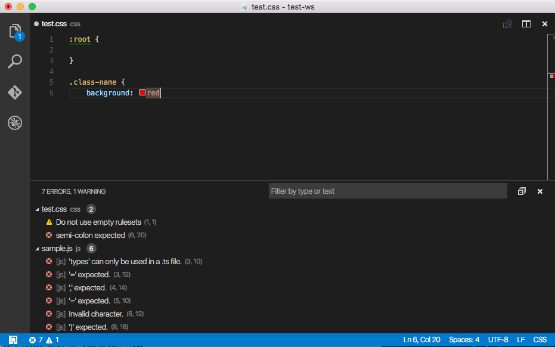

# June 2016 (version 1.3)

The June release of VS Code has some great new features, enhancements to existing features, and a set of important bug fixes.

Here are the highlights:

* **Editor**: TBD
* **Workbench**: TBD
* **Languages**: TBD
* **Debugging**: TBD
* **Extensions**: TBD

Please continue reading for more information on what's new in June.

## Editor

## Workbench

### Tabs

### Problems view

Isn't it much productive to have a view that shows all problems at one place where you can navigate through and fix them, while the editor is open? With the June release, we offer such a view called **Problems view**, docked at the bottom in the tool, that shows errors, warnings and other information generated by different sources like language servers, linters and others.

A filter box is provided to search and filter among the problems shown in the view. You can either filter by type or by text, for eg: "errors" will filter for all errors. "character" will filter for problems with message containing 'character'.

You can open the Problems view using `kb(workbench.actions.view.problems)`, from the **View** | **Problems** menu, or from the **View** > **Show Problems** command in the **Command Palette**. The key binding <kbd>CTRL</kbd> | <kbd>CMD</kbd> + <kbd>SHIFT</kbd> + <kbd>M</kbd> that was used to show errors and warnings in command palette before, will now open Problems view and toggles focus between the view and the editor.

By default, Problems view scrolls and shows problems for your active file. If you don't want this automatic reveal behavior, you can disable it through a setting `problems.autoReveal`. Set `problems.autoReveal` to `false` to prevent your Problems view from changing as you switch between active files.

>**Note:** This view is just a representation of markers generated by the language servers or linters or build tasks or any external builders configured in or outside your workspace. You have to configure or customize them appropriately in order to see the expected problems.

### Integrated terminal

## Languages

## Debugging

## Extension Authoring

## Notable Bug Fixes

* [TBD](https://github.com/Microsoft/vscode/issues/TBD): A bug fix

These are the [closed bugs](https://github.com/Microsoft/vscode/issues?q=is%3Aissue+label%3Abug+milestone%3A%22June+2016%22+is%3Aclosed) and these are the [closed feature requests](https://github.com/Microsoft/vscode/issues?q=is%3Aissue+milestone%3A%22June+2016%22+is%3Aclosed+label%3Afeature-request) for the 1.3 update.

## Downloads

Downloads: [Windows](https://az764295.vo.msecnd.net/stable/2481a7dad82f8e8d105c5329b4b6f20e15e9b27c/VSCodeSetup-stable.exe) |
[OS X](https://az764295.vo.msecnd.net/stable/2481a7dad82f8e8d105c5329b4b6f20e15e9b27c/VSCode-darwin-stable.zip) | Linux 64-bit [.zip](https://az764295.vo.msecnd.net/stable/2481a7dad82f8e8d105c5329b4b6f20e15e9b27c/VSCode-linux-x64-stable.zip) [.deb](https://az764295.vo.msecnd.net/stable/2481a7dad82f8e8d105c5329b4b6f20e15e9b27c/vscode-amd64.deb) [.rpm](https://az764295.vo.msecnd.net/stable/2481a7dad82f8e8d105c5329b4b6f20e15e9b27c/vscode-x86_64.rpm) | Linux 32-bit [.zip](https://az764295.vo.msecnd.net/stable/2481a7dad82f8e8d105c5329b4b6f20e15e9b27c/VSCode-linux-ia32-stable.zip) [.deb](https://az764295.vo.msecnd.net/stable/2481a7dad82f8e8d105c5329b4b6f20e15e9b27c/vscode-i386.deb) [.rpm](https://az764295.vo.msecnd.net/stable/2481a7dad82f8e8d105c5329b4b6f20e15e9b27c/vscode-i386.rpm)

## Thank You

Last but certainly not least, a big *__Thank You!__* to the following folks that helped to make VS Code even better:

* [User Name (@handle)](https://github.com/handle): Some new feature TBD. [PR #TBD](https://github.com/Microsoft/vscode/pull/TBD)

