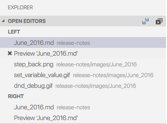
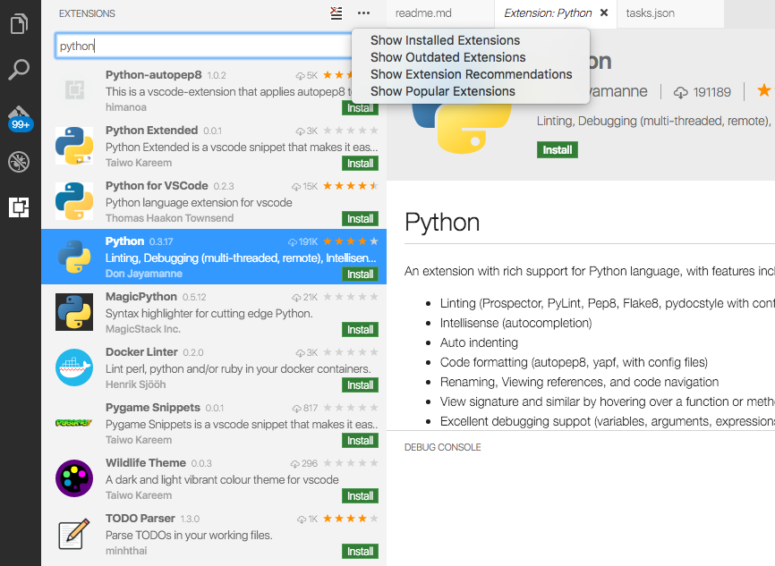
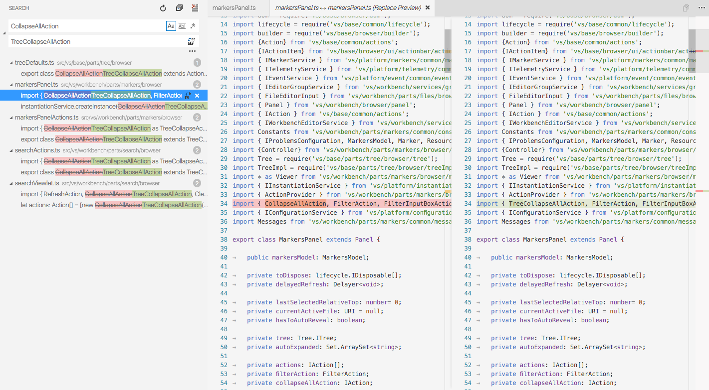
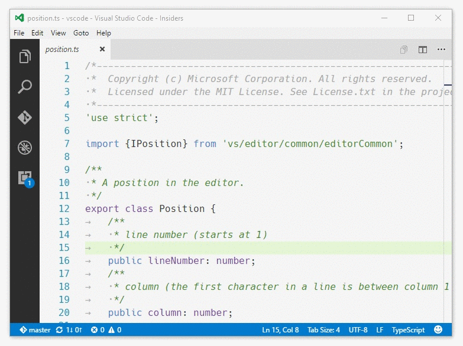
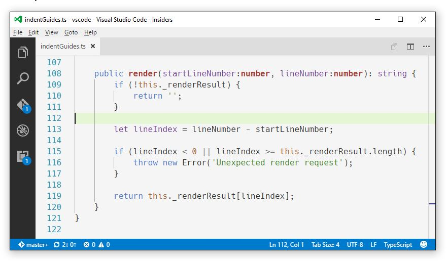
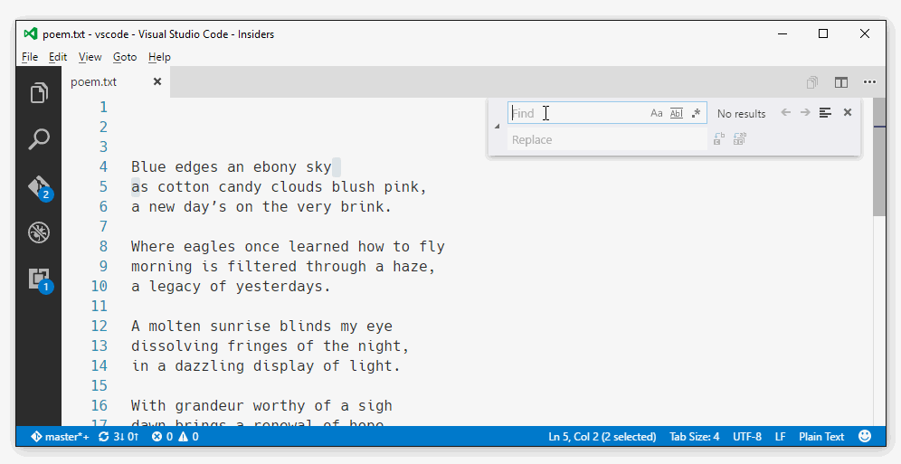
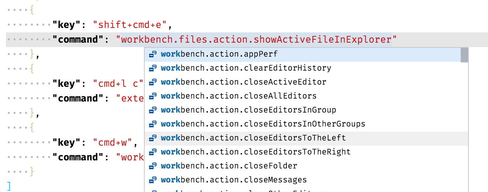
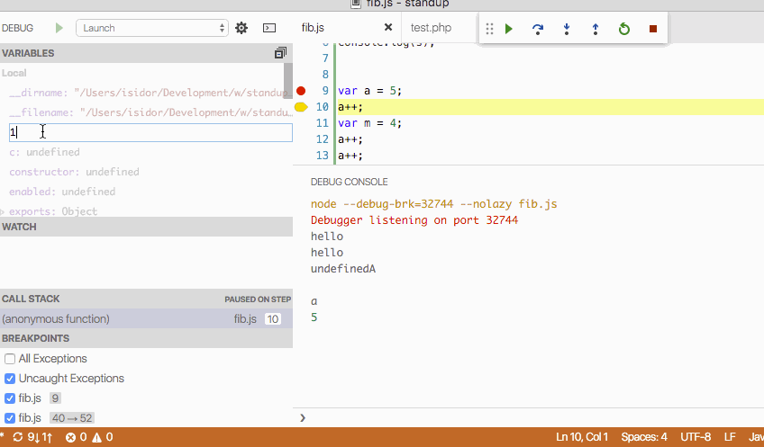
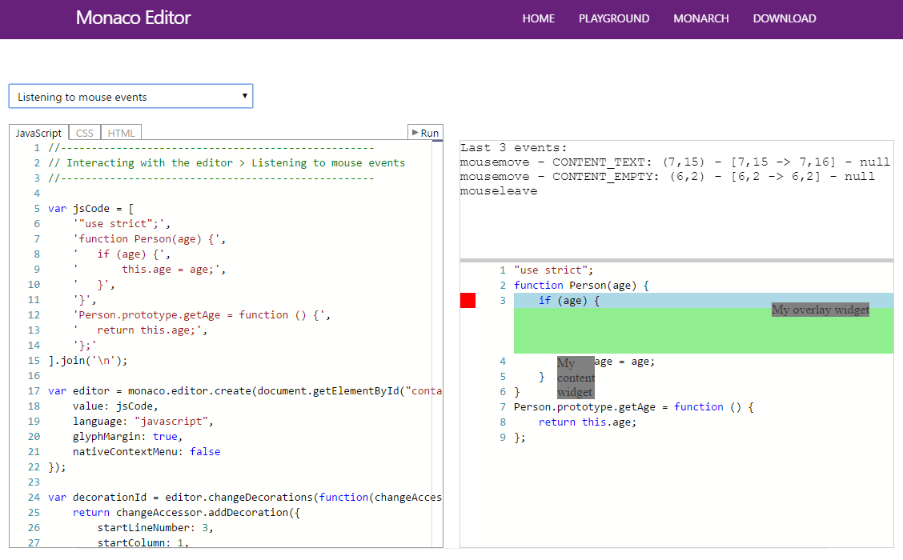

# June 2016 (version 1.3)

We're really excited about the June release of VS Code and hope you will be as well. We've made some big changes to Extension management and added Tabs (tabbed editor panes), a popular user request. Other features we think you'll find useful include global Search and Replace, improved Drag and Drop and optional indentation guides. All of this along with enhancements to existing features like the Integrated Terminal and a set of important bug fixes.

Here are the highlights:

* **Tabs**: Tabbed editor panes allow you to quickly navigate to your files and organize your workbench.
* **Extensions**: New in-product Extensions View to quickly find, install and manage your extensions.
* **Workbench**: Enhanced Drag and Drop, Preview Editors to conserve your editor panes, and multiple Integrated Terminals.
* **Editor**: Global Search and Replace, Indent Guides, Problems panel to view errors and warnings.
* **Languages**: Better, more complete Emmet support, Atom JavaScript grammar extension.
* **Debugging**: Lots of improvements including support for attaching to running Node.js processes and changing variable values during a debug session.
* **Extension Authoring**: New APIs to open non-text resources and add editor decorator attachments. The preview HTML pane now supports titles and theming.

Please continue reading for more information on what's new in June.

## Tabs

With this release, you can configure to show Tabs for open files by setting the new `workbench.editor.showTabs` setting (enabled by default). Enabling this setting will display Tabs for each opened editor in the title area above an editor. You can move Tabs around via drag and drop or right-click on a Tab to explore some useful actions.


In case when the available space for Tabs is not enough to show all files, you will see Tabs overflowing to the left and right. You can always use the mouse to scroll left and right across all tabs. The little overflow icon (see image below) shows enabled as soon as there are Tabs outside of the visible view. Clicking on the overflow icon shows a list of all Tabs opened in the group.


You can use the new `workbench.editor.openPositioning` setting to control where new editors should open. By default they open to the right of the active Tab, but you can change this to open to the left, or to the beginning or end of all editors.

### Open Editors View

The new **OPEN EDITORS** view in the Explorer is the replacement to the previous **WORKING FILES** view. The open editors view is a visual representation of the editors stacks:
* Each editor group with the editors that belong to it is shown
* Clicking on an editor will make it active and open it in the corresponding group
* Top level actions allow to close all or save all open editors
* Editor level actions allow to close or save an editor
* Context menu actions provide more refined actions
* It is possible to drag and drop editors between editor groups or from the explorer

You can hide the open editors view by setting `"explorer.openEditors.visible": 0`.

**Note:** Since the WORKING FILES view has been deleted, please refer to [this issue](https://github.com/Microsoft/vscode/issues/6605) to get an overview of the new or changed command identifiers.



### Editor Stacks

As a preparation for enabling Tabs in the workbench (more details below), we revisited how you can interact with editors in VS Code.

Many users coming from other editors were confused by some of the editor (open file) behavior in VS Code. For example:

* Closing a dirty editor (an editor with an unsaved file) did not prompt for saving.
* Closing an editor, closed the entire group without revealing the previous editor.
* The editor history showed a list of all editors ever opened and not a list of editors you opened in a group.
* WORKING FILES view in the Explorer was a confusing concept (read more on the new OPEN EDITORS view below).

With editor **stacks**, we've tried to address these issues:

* You can open up to 3 **editor groups** side by side and each group contains a **stack of editors**.
* Every time you open an editor, it is added to the top of the stack.
* Closing an editor from a group reveals the editor that was previously opened in that group until the last editor closes and the group hides.
* You get prompted to save for dirty editors.

Use `kb(workbench.action.openPreviousRecentlyUsedEditorInGroup)` to bring up a list of most recently used editors of a group for navigation. Use the **View: Show All Editors** command to show a list of all open editors across all groups.


Note that the behavior of editor stacks is independent from having Tabs enabled or not. You will benefit from these changes even if you don't want to use Tabs.

**Note:** Due to the large conceptual impact of editor stacks, many command ids have been renamed and new commands introduced. Please refer to [this issue](https://github.com/Microsoft/vscode/issues/6605) that documents the changes. It also provides guidance if you liked the previous behavior and explains how to change key bindings back to the old behavior.

## Extensions View

We have introduced a new extensions view to improve the extensions management experience. If the search box is empty by default, we show a list of installed extensions.

By clicking on the filter button, it is possible to show:

* A list of currently installed extensions
* A list of outdated extensions that can be updated
* A list of recommended extensions based on your workspace
* A list of globally popular extensions

Browsing through a list of extensions, it is possible to install, uninstall or update them. Clicking on an extension will display the detailed description in the editor area.



## Workbench

### More powerful Drag and Drop

With all the work on Tabs, we also looked at improving the drag & drop support in the editor. We always allowed you to drop files from outside VS Code into the editor to open the files and now there is a lot more that you can do:

#### Drop to Split

Drag some files to the left or right area of an editor to open it to the side of that editor. You can either drag from the Explorer or a Tab if Tabs are enabled.


#### Drop Feedback

Whenever you are dragging files or a Tab over the editor area, you now get drop feedback to indicate the target position of the drop.

#### Drag from Explorer and Opened Editors view

You can now drag a file or editor from the Explorer and the OPEN EDITORS view to the editor space to open it at a specific location.

### Preview Editors

Closely related to editor stack and Tabs are **preview editors**. If you click around many files, you might not want to see a Tab opened for each file you open. Preview editors are helpful to reduce the number of opened editors (and Tabs). An editor will open as preview if you open it by single clicking in the Explorer. As long as the editor stays in preview mode, other editors that open will open in the same location as the preview editor. Basically you are reusing the editor for each file you open.

Certain actions cause a preview editor to become a normal editor:

* When you modify the contents of a file, the editor will be kept open.
* The same is true for when you double-click on a file in the Explorer or inside a Tab or move a file to a specific editor group.

Preview editors are indicated using an italic font style.


We introduced new settings to control the behavior of preview editors:

* `workbench.editor.enablePreview` to globally enable or disable preview editors
* `workbench.editor.enablePreviewFromQuickOpen` to enable or disable preview editors when opened from the quick box/quick open.

### Problems panel

With the June release, we now offer a new **Problems** panel, docked at the bottom in the tool, that shows errors, warnings and other information generated by different sources like language servers, linters and others. In previous releases we showed the errors and warnings in the quick box. We have received the feedback from users that it is difficult to manage the errors and warnings in the quick box. The new panel makes it easy to navigate through your errors and warnings and fix them while the editor is still open. 


A filter box is provided to search and filter among the problems shown. You can either filter by type or by text, for example, 'errors' will filter for all problems of type error. 'character' will filter for problems with messages containing the word 'character'.

You can open the Problems panel using `kb(workbench.actions.view.problems)`, from the **View** | **Problems** menu, or from the **View** > **Show Problems** command in the **Command Palette**. The key binding `kb(workbench.actions.view.problems)` that was used to show errors and warnings in the quick open/quick box will now open the Problems panel.

By default, the Problems panel scrolls and shows problems for your active file. If you don't want this automatic reveal behavior, you can disable it through a setting `problems.autoReveal`. Set `problems.autoReveal` to `false` to prevent your Problems view from changing as you switch between active files.

>**Note:** This view is just a representation of markers generated by the language servers or linters or build tasks or any external builders configured in or outside your workspace. You have to configure or customize them appropriately in order to see the expected problems.

### Integrated Terminal

The integrated terminal that was introduced in v1.2.0 has seen many improvements this release, the primary one being the ability to launch and use multiple terminals at the same time. Terminal instances can be added by hitting the plus icon on the top-right of the terminal panel or by triggering the `kb(workbench.action.terminal.new)` command. This creates another entry in the dropdown list that can be used to switch between them.


Several new commands were added to aid with management of the terminal panel and its terminal instances they are:

- `kb(workbench.action.terminal.focus)`: Focus the terminal, this is like toggle but focuses the terminal instead of hides it if its visible
- `kb(workbench.action.terminal.focusNext)`: Focuses the next terminal instance
- `kb(workbench.action.terminal.focusPrevious)`: Focuses the previous termianl instance
- `kb(workbench.action.terminal.kill)`: Kills the current terminal instance

The ability to run selected text in the current terminal has been added through the `kb(workbench.action.terminal.runSelectedText)` command. To use it, select text in an editor and run the command via the command palette:


The following improvements were also added:

- Copy and paste on Linux and Windows is now available using `Ctrl+Insert` and `Shift+Insert` respectively, this is temporarily non-configurable until we can [route custom copy/paste keybindings](https://github.com/sourcelair/xterm.js/issues/118) to the xterm.js library 
- CJK characters should now use the correct width, credit for this goes to [@jerch](https://github.com/jerch) in [this PR](https://github.com/sourcelair/xterm.js/pull/144)
- Performance of the terminal has improved significantly and should no longer perform so badly when running commands that produce massive output
- `Ctrl+Left` and `Ctrl+Right` now tells the underlying shell to jump over words in the input
- Terminal cursor blinking is now enabled by default, it shares a configuration value with the editor's `editor.cursorBlinking` setting.
- A hollow cursor is shown when the terminal is not focused.
- Terminal font size and line height can be customized via settings thanks to a [PR](https://github.com/Microsoft/vscode/pull/6998) from [@kisstkondoros](https://github.com/kisstkondoros)
- Selection has been improved to now select the full line, contain no margin and also invert the text colors
  
- Arguments can be passed to the terminal shell on Linux and OS X using the `terminal.integrated.shellArgs.*` settings

In addition, the following notable bugs were fixed:

- [#8141](https://github.com/Microsoft/vscode/issues/8141): Cannot launch Electron apps from integrated terminal
- [#7911](https://github.com/Microsoft/vscode/issues/7911): Terminal lines appears to have margin
- [#7684](https://github.com/Microsoft/vscode/issues/7684): Clicking into editor does not properly take focus from Terminal view
- [#7458](https://github.com/Microsoft/vscode/issues/7458): Runaway terminalProcess processes 
- [#6738](https://github.com/Microsoft/vscode/issues/6738), [#7442](https://github.com/Microsoft/vscode/issues/7442), [#7444](https://github.com/Microsoft/vscode/issues/7444): Several issues related to resizing the terminal
- [#6743](https://github.com/Microsoft/vscode/issues/6743): Mouse wheel scrolling in integrated terminal only works on filled areas
- [#7357](https://github.com/Microsoft/vscode/issues/7357): Invoking the terminal sometimes yields an error "Cannot set property 'innerHTML' of undefined"
- [#6457](https://github.com/Microsoft/vscode/issues/6457): vim overrides the terminal color scheme

### Open Recent in new Window

The command **File: Open Recent** from the **Command Palette** makes it very easy to quickly switch between previously opened folders or files. Usually the selected file or folder would open in the running instance. In this release, we added support to open into a new window if you select an entry while having the `kbstyle(Ctrl)` (`kbstyle('Cmd')` on Mac) key pressed.

### Restore Full screen

A new setting `window.restoreFullscreen` has been added to open VS Code in full screen if it was previously closed in full screen mode.

## Editor

### Global Search and Replace

[Search and Replace](https://github.com/Microsoft/vscode/issues/1690) is one of the features that most users wanted to have. With this release, we enhanced our Search view to include Replace functionality and now you can replace text across multiple files. You can replace all files in one go or pick file by file or result by result. You can also exclude results or files and perform replace on the rest. In addition, we also provide a nice preview inside Search view and a Diff editor view showing the file before and after replace.



Replace functionality can be accessed
* In **Search View** by expanding the Search textbox
* Using `kb(workbench.action.replaceInFiles)`, from the **Edit** | **Replace in Files** menu
* Using **Replace in Files** command in the **Command Palette**

>**Note:** Since search has a limitation of showing a maximum of 2048 results, replace can currently replace that many.

### Editor Font Zooming with mouse wheel
Thanks to [@kisstkondoros](https://github.com/kisstkondoros), with [PR #6990](https://github.com/Microsoft/vscode/pull/6990), after setting `editor.mouseWheelZoom: true` it is possible to change the font size of the editors by pressing `Ctrl` and scrolling with the mouse wheel:



### Indent Guides
We have implemented one of the most upvoted feature requests for the code editor, and indent guides can now be enabled via `editor.renderIndentGuides`.



### Multiline Find

We have added support for multiline find and replace:



### Emmet

Thanks to some great support from Denis Malinochkin ([@mrmlnc](https://github.com/mrmlnc)) through Pull Requests and testing help, we are now covering many more Emmet features (Wrap with Abbreviation, Remove Tag, Update Tag, Balance, Toggle Comment, ...).

### Suggestions for command identifiers

When authoring the `keybindings.json` file, you now get completions for the available commands.



## Languages

### Extract CSS/LESS/SCSS and JSON into extensions

The CSS, LESS, SCSS language supports have been refactored to be a regular VS Code extension. As all these languages are based on the same code base, they share a language server. The language server runs in a separate node process, using the [language server protocol](https://github.com/Microsoft/language-server-protocol) to communicate with VS Code. 

### Extract Markdown into an extension

The Markdown language support has been refactored to be a regular VS Code extension. It uses the Markdown textMate grammar for syntax highlighting source and renders the markdown as HTML using the [markdown-it library](https://github.com/markdown-it/markdown-it) which implements the [CommonMark Spec](http://spec.commonmark.org/0.25/).

### Atom JavaScript grammar

As an alternative to the built-in JavaScript grammar, you can now install the [Atom JavaScript grammar](https://marketplace.visualstudio.com/items?itemName=ms-vscode.js-atom-grammar). It differs from the built-in grammar in that it creates tokens for variable and function references which, if supported by the theme, can be colorized differently.

## Debugging

### Moveable Debug Toolbar

Initiated by this [user request](https://github.com/Microsoft/vscode/issues/4580) it is now possible to drag the debug toolbar horizontally:


### Changing Variable Value

We now support changing the value of simple variables if a debug extension supports this (Node Debug is the first extension to support this):



A simple variable is a leaf in the variables tree, e.g. a variable, an object property, or an array element.

### Show Variable Type on Hover

If a debug extension supports variable types, we now show the type when hovering over the variable name.

### Step Back
If a debug extension supports _step back_ we now expose a step back action and button:


### OS specific launch configurations

Initiated by a [user request](https://github.com/Microsoft/vscode/issues/1873) it is now possible to specify OS specific configurations inside a 'launch.json':

```json
{
   "type": "node",
   "request": "launch",
   "runtimeExecutable": "mynode",
   "windows": {
     "runtimeExecutable": "mynode.exe"
   }
}
```

## Node.js Debugging

### Attach to Process

Node.js debugging now supports to attach to a Node.js process that has not been started in debug mode. This can be useful if you need to debug a production server that cannot always run in debug mode for performance reasons.

In order to attach to a Node.js process, you specify its _process id_ via a `processId` attribute in an `attach` launch configuration.

Since it is not very practical to always having to edit the launch configuration before starting a debug session, we've introduced a new type of variable that can bind to an interactive UI, e.g. to a process picker.

Here is a launch configuration that uses the `${command.PickProcess}` variable to let the user select a Node.js process before starting the debug session:

```json
{
   "type": "Attach to Process",
   "type": "node",
   "request": "attach",
   "processId": "${command.PickProcess}"
}
```

## Extension Authoring

### Add decorations before and after text

New capabilities have been added to the decoration APIs. You can now add 'attachments' before and after a decoration. Attachments can be icons as well as text content that sticks to the decorated text.

An example are the CSS color decorators attached to color values in the text:


Decoration attachments can be defined on decoration types (see ThemableDecorationInstanceRenderOptions, before & after) and fine-tuned on individual decorations (see ThemableDecorationRenderOptions, before & after).

### API tweaks

* The Uri-class now allows you derive an Uri from an existing one: `someUri.with({scheme: 'newScheme', path: 'newPath'})`
* The `previewHtml` command now allows you to provide a `title`.
* When previewing html, we expose the style of the current theme via class names of the body element. Those are `vscode-light`, `vscode-dark`, and `vscode-high-contrast`.
* Last, there is a new command `vscode.open` that allows to open non-textual resources like images.

### Debug Extension Authoring: Command Variables

VS Code supports variable substitution in launch configurations for some time. This release introduces a new type of variable that is bound to a VS Code _command_. When a debug session is started, all command variables that occur in the underlying launch configuration are first collected and then executed. Multiple occurrences of a variable do not result in multiple execution. Before the launch configuration is passed to the debug adapter, all variables are substituted with the command results.

A command is implemented and registered in an extension and its return value is used as the variable's value. The implementation of a command can range from a simple expression with no UI, to some sophisticated functionality based on the UI features available in the extension API.

An example for this functionality can be found in node-debug. Here a variable `${command.PickProcess}` is bound to a process picker command. A new 'Attach to Process' launch configuration uses the variable to let the user pick a Node.js process when running the launch configuration.

Introducing a new command variable is simple:

* Implement and register the command in your extension (not in the debug adapter).
* Add a `variables` section to your `debuggers` contribution point.
* Add one name/command-binding per variable.

  For example:

  ```json
    "debuggers": {
      ...
      "variables": {
        "RemoteHost": "askUserForRemoteHostCommand"
      },
    ...
    }
  ```
  
* The variable can now be used in any string typed value of a launch configuration as `${command.RemoteHost}`.
* To make the `RemoteHost` variable discoverable for the user consider adding it to the `configurationAttributes` or `initialConfigurations` sections of the `debuggers` contribution point.

### Debug Extension Authoring: Additions to the Debug Protocol

The debug protocol has been extended in three areas (and VS Code already provides the corresponding UI):

- **Editing variables**: If a debug adapter returns the [capability `supportsSetVariable`](https://github.com/Microsoft/vscode-debugadapter-node/blob/master/protocol/src/debugProtocol.ts#L594), VS Code supports setting the value of unstructured (leaf) variables in the Variables view by calling the [`setVariable` request](https://github.com/Microsoft/vscode-debugadapter-node/blob/master/protocol/src/debugProtocol.ts#L476) request.
- **Stepping backward**: If a debug adapter returns the [capability `supportsStepBack`](https://github.com/Microsoft/vscode-debugadapter-node/blob/master/protocol/src/debugProtocol.ts#L592), VS Code enables the UI for stepping back and will call the [`stepBack` request](https://github.com/Microsoft/vscode-debugadapter-node/blob/master/protocol/src/debugProtocol.ts#L476).
- **Show variable type on hover**: If a debug adapter returns the optional `type` attribute for the [`variable` type](https://github.com/Microsoft/vscode-debugadapter-node/blob/master/protocol/src/debugProtocol.ts#L741), VS Code will show  the value of this attribute when hovering over the variable's name.

### Creating Errors/Warnings from an Extension (Diagnostics)

With the introduction of the new `Problems` panel we started to work on support for project wide builders and linters. As a first step we eliminated the automatic clearing of problems when an document is closed. Otherwise opening and closing a document would change the problem set generated by a project wide builder, which is incorrect. Due to this change extensions like linters generating diagnostics are responsible for clearing them when a document is closed. All extension providers generating diagnostics need to adopt to this change.

In a linter that uses the `vscode-language-server` node module this can be achived as follows:

```typescript
documents.onDidClose((event) => {
	connection.sendDiagnostics({ uri: event.document.uri, diagnostics: [] });
});
```

## Monaco Editor

The Monaco Editor is now on npm! - it is VS Code's code editor extracted and packaged as a library that can be integrated in any web app to work in any modern browser. We have created a [playground](https://microsoft.github.io/monaco-editor/index.html) showcasing some of the APIs. You can get it via `npm install monaco-editor`.

All further Monaco Editor specific release notes will be available at its distribution [repository](https://github.com/Microsoft/monaco-editor/blob/master/CHANGELOG.md).



### CSS/LESS/SCSS and JSON language services are now available in the Monaco editor

Additionally, the CSS/LESS/SASS parser and language smarts code have been extracted to a separate node module [vscode-css-languageservice](https://github.com/Microsoft/vscode-css-languageservice) which is used by both the [Monaco editor](https://github.com/Microsoft/monaco-editor) as well as VS Code, bringing the same CSS editing experience to the web browser.

Same for JSON, where the language service, including the JSON schema validator, were extracted to [vscode-json-languageservice](https://github.com/Microsoft/vscode-json-languageservice) which again is shared with the [Monaco editor](https://github.com/Microsoft/monaco-editor).

## Notable Bug Fixes

The SASS mode language id has been renamed from 'sass' to 'scss'. If you have customized any linter settings for Sass, just rename the configuration keys from 'sass.' to 'scss.'.

* [6316](https://github.com/Microsoft/vscode/issues/6316): Update should reopen all last opened folders
* [1210](https://github.com/Microsoft/vscode/issues/1210): Open file dialog should start in the directory for the current active file
* [7391](https://github.com/Microsoft/vscode/issues/7391): editor becomes unresponsive all the time since last update
  * the fix improves considerably the memory footprint of all colorizers through the use of immutable linked lists for representing colorizer states in-between lines in [vscode-textmate](https://github.com/Microsoft/vscode-textmate).
* [8173](https://github.com/Microsoft/vscode/issues/8173): Noticeable delay opening a markdown file (source)
  * the implementation of a 10x faster hand-written plist parser for TextMate grammars improves the start-up time of all colorizers. We are looking into extracting this implementation to its own node module.

These are the [closed bugs](https://github.com/Microsoft/vscode/issues?q=is%3Aissue+label%3Abug+milestone%3A%22June+2016%22+is%3Aclosed) and these are the [closed feature requests](https://github.com/Microsoft/vscode/issues?q=is%3Aissue+milestone%3A%22June+2016%22+is%3Aclosed+label%3Afeature-request) for the 1.3 update.

## Downloads

Downloads: [Windows](https://az764295.vo.msecnd.net/stable/2481a7dad82f8e8d105c5329b4b6f20e15e9b27c/VSCodeSetup-stable.exe) |
[OS X](https://az764295.vo.msecnd.net/stable/2481a7dad82f8e8d105c5329b4b6f20e15e9b27c/VSCode-darwin-stable.zip) | Linux 64-bit [.zip](https://az764295.vo.msecnd.net/stable/2481a7dad82f8e8d105c5329b4b6f20e15e9b27c/VSCode-linux-x64-stable.zip) [.deb](https://az764295.vo.msecnd.net/stable/2481a7dad82f8e8d105c5329b4b6f20e15e9b27c/vscode-amd64.deb) [.rpm](https://az764295.vo.msecnd.net/stable/2481a7dad82f8e8d105c5329b4b6f20e15e9b27c/vscode-x86_64.rpm) | Linux 32-bit [.zip](https://az764295.vo.msecnd.net/stable/2481a7dad82f8e8d105c5329b4b6f20e15e9b27c/VSCode-linux-ia32-stable.zip) [.deb](https://az764295.vo.msecnd.net/stable/2481a7dad82f8e8d105c5329b4b6f20e15e9b27c/vscode-i386.deb) [.rpm](https://az764295.vo.msecnd.net/stable/2481a7dad82f8e8d105c5329b4b6f20e15e9b27c/vscode-i386.rpm)

## Thank You

Last but certainly not least, a big *__Thank You!__* to the following folks that helped to make VS Code even better:

* [Denis Malinochkin (@mrmlnc)](https://github.com/mrmlnc): Emmet - support all the features [PR #8155](https://github.com/Microsoft/vscode/pull/8155), [PR #8489](https://github.com/Microsoft/vscode/pull/8489), [PR #7926](https://github.com/Microsoft/vscode/pull/7926)
* [Sajjad Hashemian (@sijad)](https://github.com/sijad): Improve 'Open in Terminal' on OS X. [PR #6136](https://github.com/Microsoft/vscode/pull/6136)
* [Rob Lourens (roblourens)](https://github.com/roblourens): UI support for TimeTravel Debugging [PR #7734](https://github.com/Microsoft/vscode/pull/7734)
* [xzper (f111fei)](https://github.com/f111fei): Debug: Fix setConfiguration error when name is null or undefined  [PR #7636](https://github.com/Microsoft/vscode/pull/7636)
* [Thomas Stringer (tstringer)](https://github.com/tstringer): Added remove and disable all breakpoints actions to the command palette  [PR #7627](https://github.com/Microsoft/vscode/pull/7627)
* [Ed Munoz (edumunoz)](https://github.com/edumunoz): Multiple contributions [PR #7367](https://github.com/Microsoft/vscode/pull/7367), [PR #7371](https://github.com/Microsoft/vscode/pull/7371)
* [kisstkondoros (@kisstkondoros)](https://github.com/kisstkondoros): Multiple contributions [PR #6942](https://github.com/Microsoft/vscode/pull/6942), [PR 8432](https://github.com/Microsoft/vscode/pull/8432)
* [Giorgos Retsinas (@elemongw)](https://github.com/elemongw): Open empty window on 'activate' when all windows are closed (OS X) [PR #7547](https://github.com/Microsoft/vscode/pull/7547)
* [Andrew Arnott (@AArnott)](https://github.com/AArnott): Language Server Protocol - Clarifications regarding the JSON-RPC header [PR #15](https://github.com/Microsoft/language-server-protocol/pull/15)
* [Vaclav Pavlin (@vpavlin)](https://github.com/vpavlin): Language Server Protocol - Fix typos in protocol.md  [PR #20](https://github.com/Microsoft/language-server-protocol/pull/20)
* [kisstkondoros (@kisstkondoros)](https://github.com/kisstkondoros): Gutter icon background size limited [PR #6553](https://github.com/Microsoft/vscode/pull/6553)
* [kisstkondoros (@kisstkondoros)](https://github.com/kisstkondoros): Horizontal selection movement implemented [PR #6887](https://github.com/Microsoft/vscode/pull/6887)
* [kisstkondoros (@kisstkondoros)](https://github.com/kisstkondoros): Allow zooming with ctrl+mousewheel combination [PR #6990](https://github.com/Microsoft/vscode/pull/6990)
* [kisstkondoros (@kisstkondoros)](https://github.com/kisstkondoros): Add an option to display control characters [PR #7578](https://github.com/Microsoft/vscode/pull/7578)
* [Basarat Ali Syed (@basarat)](https://github.com/basarat): fix : Standalone Monaco text edit validation [PR #7864](https://github.com/Microsoft/vscode/pull/7864)
* [Christian Svensson (@csvn)](https://github.com/csvn): Added order to snippet tab stops [PR #7925](https://github.com/Microsoft/vscode/pull/7925)
* [Phill (@ph1ll)](https://github.com/ph1ll): fix 'shaddow' typo [PR #7981](https://github.com/Microsoft/vscode/pull/7981)
