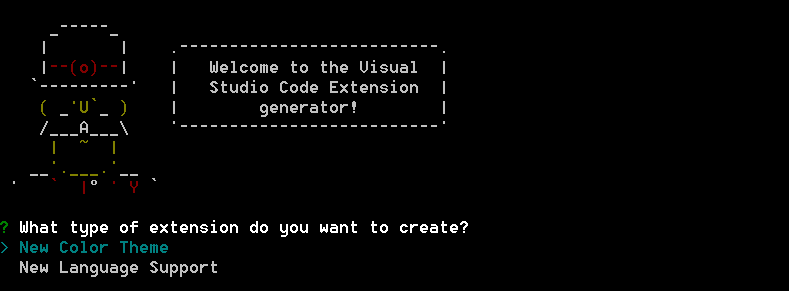
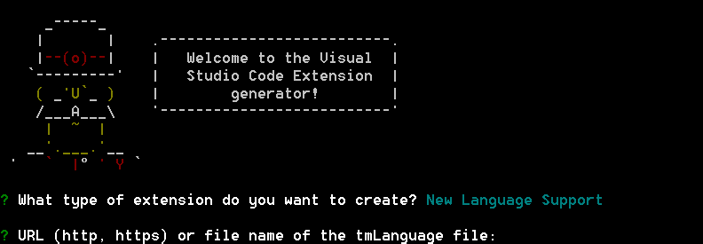
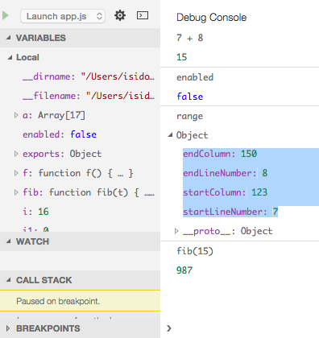
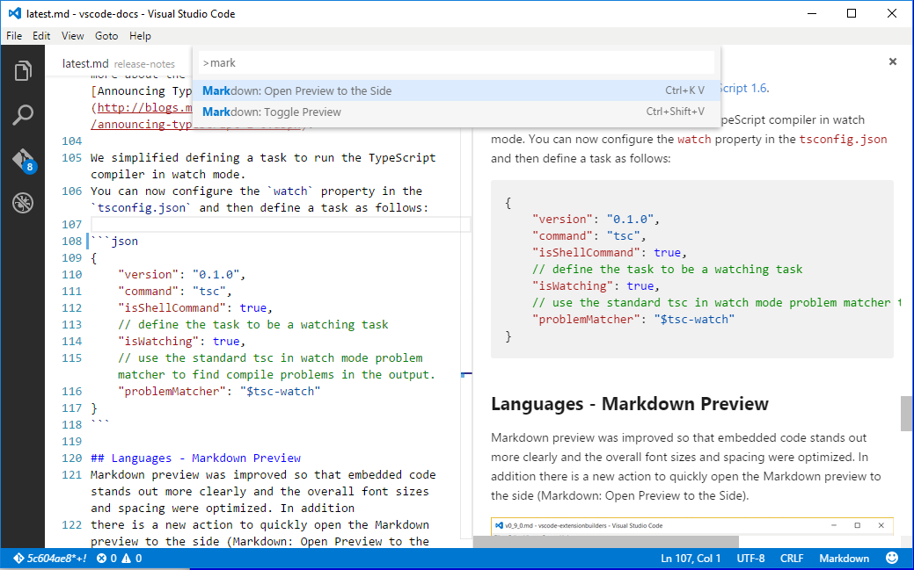
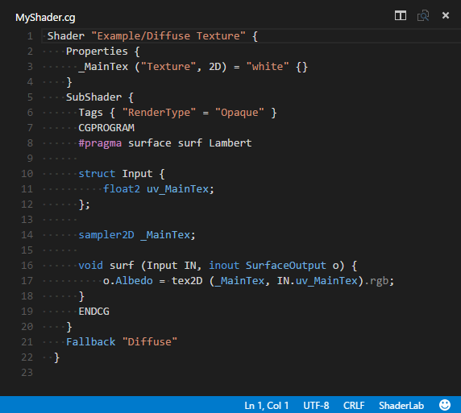

# VS Code v0.9.0 (October 2015)

Hi,

It’s that time again – our October update is ready for VS Code.

## Persistent (update to update) location for Customizations
Previously we did not have a location we respected across updates.  It's true that we did have a location for user settings but as we get closer to our final update story we added a new location.  In the future, we will (gracefully) move all user settings here.

The new location is `.vscode/extensions` under your user directory.

Depending on your platform, this folder is located here:
* **Windows** `%USERPROFILE%\.vscode\extensions`
* **Mac** `$HOME/.vscode/extensions`
* **Linux** `$HOME/.vscode/extensions`

As this location is under your user directory, the content is persisted across VS Code updates.  This is just the start and we plan to use this location more in future updates.

## Yo Code
We re-purposed the Yeoman generator we used for the VS Code Node.js sample `generator-code` and we are now using this to make creating common customizations easier.

>**Tip:** If you still want access to the sample, you can find out how on the [Node.js](/docs/runtimes/nodejs.md) page.

In this release of the generator, we have the ability to create two common customizations:

1. Additional color themes 
2. Syntax highlighters/bracket matchers

In the future, we'll add other options for rich customization of VS Code.

If you have a TextMate color theme (.tmTheme) or a TextMate language specification (.tmLanguage), you can bring them into VS Code using the 'code' Yeoman generator.

Install and run the code Yeoman generator as follows:
1. `npm install -g yo`
2. `npm install -g generator-code`
3. `yo code`



The Yeoman generator will walk you through creating your extension prompting for the required information.  Once the extension is created, copy the generator's output folder to a new folder under the .vscode/extensions folder and restart VS Code to use the new features. 

In the future you will be able to publish these extensions to an external gallery to share them with the community.

## Customization - Adding Language Colorization & Bracket Matching
Using the 'code' Yeoman generator you can add TextMate language specification files (.tmLanguage) to your VS Code installation to get syntax highlighting and bracket matching.

A good place to look for existing TextMate .tmLanguage files is on GitHub.  Search for a TextMate bundle for the language you are interested in and then navigate to the `Syntaxes` folder.  The 'code' Yeoman generator can handle either .tmLanguage or .plist files.  When prompted for the URL or file location, pass the raw path to the .tmLanguage file e.g. http://raw.githubusercontent.com/textmate/ant.tmbundle/master/Syntaxes/Ant.tmLanguage.



The generator will prompt you for other information such an extension name (this should be unique to avoid clashing with other extensions) and the language name, aliases and file extensions. 

When the generator is finished, copy the complete output folder to a new folder under .vscode\extensions.  When you restart VS Code, your new language will be visible in the language specifier dropdown and you'll get full colorization and bracket/tag matching for files matching the language's file extension.


## Customization - Adding Themes
You can also add new TextMate theme files (.tmTheme) to your VS Code installation.

[ColorSublime](http://colorsublime.com) has hundreds of existing TextMate themes to choose from.  Pick a theme you like and copy the Download link to use in the Yeoman generator e.g. http://colorsublime.com/theme/download/40781.  The 'code' generator will prompt you for the URL or file location of the .tmTheme file, the extension name as well as other information for the theme extension.


Copy the generated theme folder to a new folder under .vscode/extensions and restart VS Code.

Open the Color Theme picker theme with `kb(workbench.action.selectTheme)`and you can see your theme in the dropdown.


##Editor - Performance
The VS Code team contributed a [Pull Request](https://github.com/atom/node-oniguruma/pull/40) to [node-oniguruma](https://github.com/atom/node-oniguruma) that results in a nice performance improvement when colorizing/tokenizing. Both the Atom and VS Code IDEs profit from this improvement.

## Debugging - Performance
We improved stepping performance by loading the scopes and variables of stack frames lazily. This improvement is based on a protocol change that affects all debug adapters.

## Debugging - Pre-Launch Task
In a project's launch configurations (launch.json), you can now use the `preLaunchTask` attribute to specify a task to run before a debug session starts.

For example, with this option you could make sure that your project is built before it is launched in the debugger. If the task results in errors, an error message warns you and you can decide to either fix the errors or continue launching the debugger.

## Debugging - Debug Console
We have made many improvements to the Debug Console:
* Text selection is now supported
* Better colors for improved visibility
* Richer context menus
* Expansion of elements is preserved between sessions



## Languages - C&#35;
The status of the OmniSharp server is now using a new language status indicator in the lower right corner.


## Languages - TypeScript
We now ship with TypeScript 1.6.2.  You can learn more about the latest release of TypeScript at [Announcing TypeScript 1.6](http://blogs.msdn.com/b/typescript/archive/2015/09/16/announcing-typescript-1-6.aspx).

We simplified defining a task to run the TypeScript compiler in watch mode.
You can now configure the `watch` property in the `tsconfig.json` and then define a task as follows:

```
{
	"version": "0.1.0",
	"command": "tsc",
	"isShellCommand": true,
	// define the task to be a watching task
	"isWatching": true,
	// use the standard tsc in watch mode problem matcher to find compile problems in the output.
	"problemMatcher": "$tsc-watch"
}
```

## Languages - Markdown Preview
Markdown preview was improved so that embedded code stands out more clearly and the overall font sizes and spacing were optimized. In addition
there is a new action to quickly open the Markdown preview to the side (Markdown: Open Preview to the Side).



## Runtimes - Unity

We've added colorization for Unity shader files.




## Files - New Settings
We added two new configuration options to control how files open and folders reopen between sessions.

The `window.openInNewWindow` setting controls if files should open in a new window instead of reusing an existing VS Code instance. By default, VS Code will
open a new window, e.g. when you double-click on a file outside VS Code or open a file from the command line. Set this to `false` to reuse the last
active instance of VS Code and open files in there.

The `window.reopenFolders` setting tells VS Code how to restore the opened windows of your previous session. By default, VS Code will
reopen the last opened folder you worked on (setting: `one`). Change this setting to `none` to never reopen any folders and always start with an
empty VS Code instance. Change it to `all` to restore all folders you worked on. This will reopen all the windows with folders of your previous session.

## Notable Bug Fixes

As always we fixed many issues.

Here are a few of the notable ones from the public bug tracker:

* [18998](/Issues/Detail/18998): newly added files not honored by tsconfig.json
* [18692](/Issues/Detail/18692): Changes to tsconfig.json not updated immediately
* [19239](/Issues/Detail/19239): Detaching from Unity Results in a Unity Crash

Other issues we've fixed:

* JSON schemas support external references.
* The CSS tooling now supports CSS3 identifier escaping.
* Node.js Debugger: In 0.9.0, we focused on fixing the problems that resulted from the introduction of a new implementation of the Node.js debugger in VS Code 0.8.0.
You should no longer see empty CALL STACK, VARIABLES and WATCH views.
