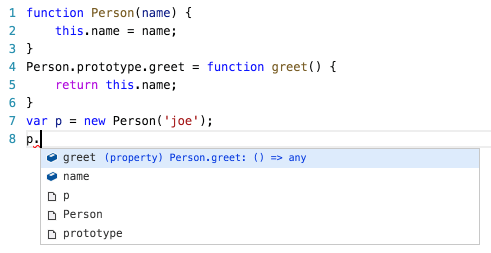
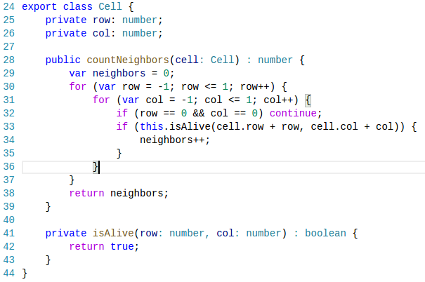
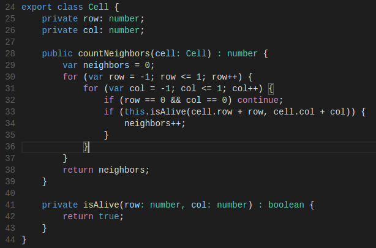
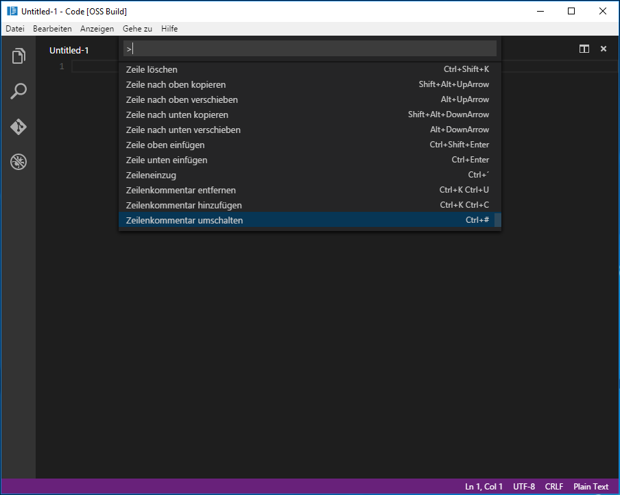
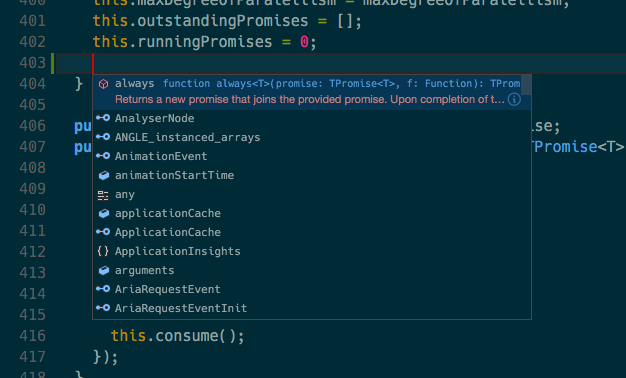
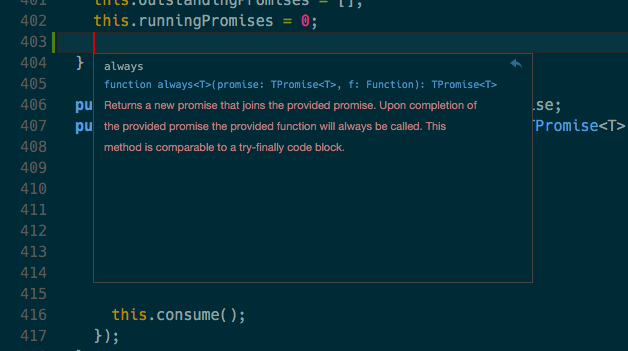
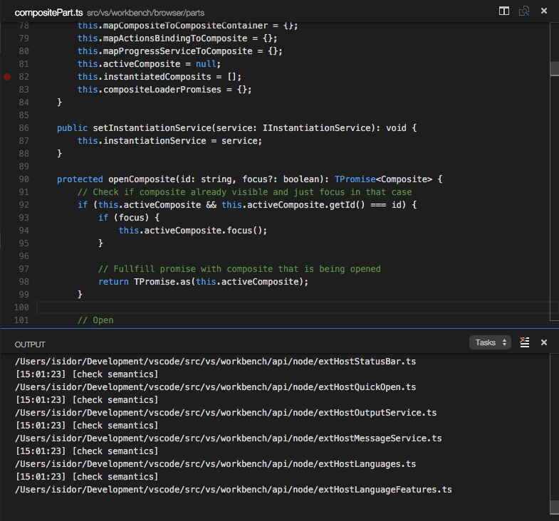
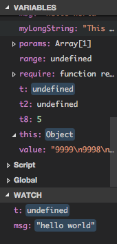
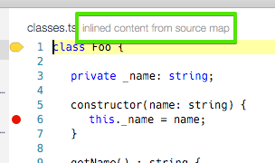
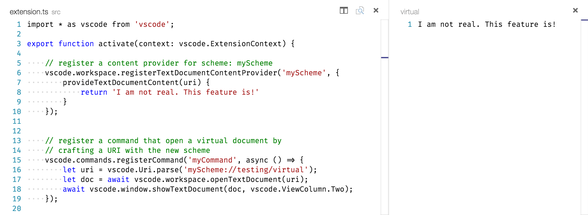

# 0.10.7 (January 2016)

Hi,

We are back from the holidays and are rolling again. We are starting to target our next important milestone for VS Code, the Build 2016 conference,
which takes place at end of March in San Francisco. The biggest item in this release is the *Salsa* preview. Salsa is a new JavaScript language service. Please enable the preview, give it a try, and let us know how it goes.

## Thank You

We have received many Pull Requests from our community that helped to make  VS Code better, a big thank you:
* [mattbladgen](https://github.com/mattblagden): Render ligatures [1510](https://github.com/Microsoft/vscode/pull/1510).
* [ivanixgames](https://github.com/ivanixgames): `kb(editor.action.toggleWordWrap)` for toggling word wrapping [1653](https://github.com/Microsoft/vscode/pull/1653).
* [krizzdewizz](https://github.com/krizzdewizz): Windows - honor comspec env variable when spawning a shell [743](https://github.com/Microsoft/vscode/pull/743).
* [EgorMatirov](https://github.com/EgorMatirov): Support Building binary on Linux ARM [1072](https://github.com/Microsoft/vscode/pull/1072).
* [mohsen1](https://github.com/mohsen1): Implement AddSelectionToAllFindMatchAction command class [1202](https://github.com/Microsoft/vscode/pull/1202).
* [dstorey](https://github.com/dstorey): Update css intellisense and css.plist [1217](https://github.com/Microsoft/vscode/pull/1217).
* [takumif](https://github.com/takumif): Add a keyboard shortcut to focus on the working files pane in the sidebar[1433](https://github.com/Microsoft/vscode/pull/1433).
* [xaverh](https://github.com/xaverh): [c++] keyword "noexcept" added [1457](https://github.com/Microsoft/vscode/pull/1457).
* [Bigous](https://github.com/Bigous): Add `kb(editor.action.insertCursorAtEndOfEachLineSelected)` for adding a cursor at the end of each selected line [1479](https://github.com/Microsoft/vscode/pull/1479).
* [bgse](https://github.com/bgse): [html] typos of angularjs attributes(directives) [1543](https://github.com/Microsoft/vscode/pull/1543).
* [markrendle](https://github.com/markrendle) and [glen-84](https://github.com/glen-84) Implement configurable cursor style [1586](https://github.com/Microsoft/vscode/pull/1586).
* [dpodder](https://github.com/dpodder): [bat] Fix batch tmGrammar [1678](https://github.com/Microsoft/vscode/pull/1678).
* [f111fei](https://github.com/f111fei) Fix 'scripts\npm install' bugs in windows7 [2118](https://github.com/Microsoft/vscode/pull/2118).
* [jkrems](https://github.com/jkrems) fixed navigation around non-basic multilingual plain characters [2071](https://github.com/Microsoft/vscode/pull/2071)

## JavaScript - Salsa Preview

The JavaScript language service in VS Code has always been powered by TypeScript. We are now migrating to a new JavaScript language service implementation with the code name [Salsa](https://github.com/Microsoft/TypeScript/issues/4789). Salsa will become available with TypeScript 1.8. For the January update, we provide a preview option of VS Code using Salsa.

### Salsa Improvements

Salsa provides several improvements over the existing JavaScript language service.

The JsDoc comment format is now understood and used to improve IntelliSense proposals and parameter hints:


You now get IntelliSense proposals for properties in 'ECMAScript 3 style classes':



IntelliSense offers both inferred proposals and the global identifiers of the project. The inferred symbols are presented first, followed by the global identifiers (with the document icon), as you can see in the image above.

There is now support for JSX:


It is now possible to have mixed TypeScript and JavaScript projects. To enable JavaScript inside a TypeScript project, you can set the `allowJs` property to `true` in the `tsconfig.json`.

The TypeScript compiler `tsc` can down-level compile JavaScript files from ES6 to another language level.

### Changes

* When using Salsa the language level is always ECMAScript 6. In the existing JavaScript language service, the default level was ES6 but there was support to define a lower level using the `target` attribute inside `jsconfig.json`. This support has been removed and the `target` attribute is now only used by `tsc` to define the target version when a JavaScript file is compiled to a lower ECMAScript version.
* The existing JavaScript language service implicitly excluded some folders from the project, see the [doc](https://code.visualstudio.com/docs/languages/javascript#_javascript-projects-jsconfigjson). This is no longer the case and you must exclude these folders explicitly in your `jsconfig.json` file.
* Salsa flags syntax errors but the JavaScript linting options `javascript.validate.lint.*` defined in the user settings are no longer supported. To get these linting options back, we recommend that you use a linter combined with a VS Code linter extension like [eslint](https://marketplace.visualstudio.com/items?itemName=dbaeumer.vscode-eslint) or [jshint](https://marketplace.visualstudio.com/items?itemName=dbaeumer.jshint).
* Salsa doesn't support the `AMD` module system, however `commonjs` is supported.

### Enabling Salsa

To enable Salsa for your workspace:

* Set the environment variable `VSCODE_TSJS`. On OS X, it is recommended you change this in your `.bash_profile` using `export VSCODE_TSJS=1`. This way the environment variable is persisted.
* Salsa requires TypeScript 1.8 but the final 1.8 release isn't available yet. Therefore, you need to install the nightly TypeScript build. You have two options:
  - install typescript locally into your workspace using `npm install typescript@next`. Code will then pick up the TypeScript version from there.
  - install typescript globally, then you can share the installation across workspaces. In this case you install it using `npm install -g typescript@next`. Then you have to tell VS Code about the install location using the `typescript.sdk` setting. Define the value of the `typescript.tsdk` setting with the path to the `lib` folder containing the `tsserver.js` file of the installed TypeScript module. 
 
The typescript nightly is a moving target and there can be issues. During our testing we have been happily using `typescript@1.9.0-dev.20160128`.

You can verify that you have Salsa enabled and you have a TypeScript version installed that supports Salsa by checking the status indicator in the Status Bar.
This shows that all is OK.


When the TypeScript version doesn't support Salsa then you see the indicator below. When you hover over the status indicator, you will see the path to the TypeScript installation that you have configured.


### Tips

* When using `commonjs`, always exclude the `node_modules` using the `exclude` property. This is due to this issue [6673](https://github.com/Microsoft/TypeScript/issues/6673).
* To get IntelliSense for React/JSX, install the typings for `react-global` using `tsd install react-global`.
* The final TypeScript 1.8 version will support JSX constructs inside `.js` files to support React Native development. Until the final version is available, you can install the `js-is-jsx` [extension](https://marketplace.visualstudio.com/items?itemName=eg2.js-is-jsx). This extension defines that `.js` files are treated like `.jsx` files and you get the JSX support inside `.js` files.
* `tsc` doesn't support `jsconfig.json` and you can tell `tsc` to use the `jsconfig.json` using `tsc -p jsconfig.json`.

## Editor

### New Default Themes

The Light and Dark themes have been in the center of attention recently as colors were added and removed again. More colors became visible with the switch to TextMate tokenizers in November. In December, we decided to remove some of the newly added colors again in order to stay compatible with the classic Visual Studio Light and Dark themes.

From the feedback in GitHub issues [1270](https://github.com/Microsoft/vscode/issues/1270), [1470](https://github.com/Microsoft/vscode/issues/1470), and others, we learned that there are fans of both the classic Visual Studio Light and Dark themes as well as the more colorful versions. So for the January release, we decided to bring the colors back with two new additional built-in themes: 'Light+' and 'Dark+'. If you installed the theme preview as an extension, you can now uninstall these again.

In addition to the 4 major colors in the Visual Studio themes (comments, strings, numbers and keywords), the 'plus' themes add colors for:

* control flow keywords
* type names
* function names
* variable and parameter names






### Keyboard Accessibility

You will find that VS Code provides an exhaustive list of commands in the Command Palette (`kb(workbench.action.showCommands)`) so that you can operate VS Code without using the mouse. However, some parts of the UI could not be operated without using the mouse. We made a pass over these locations and added support to use the `Tab` key to jump between UI controls that you can interact with. Using `Tab` or `Shift-Tab` to jump between elements with actions in the UI is a very common pattern for keyboard accessibility. In addition to that, we now also draw an indicator around the UI element once the element gains focus.

Some areas where you can now jump to using keyboard only:

* View switcher
* Header of collapsible sections in a view to expand/collapse
* Actions in views and sections
* Actions for items in the tree

This is just the beginning of our journey to become more keyboard accessible, expect more areas to follow in the future!

### Experimental screen reader support in the editor

We have added an experimental toggle that can be enabled with the `editor.experimentalScreenReader` key in the settings or for the current session with `kbstyle(Ctrl-Shift-R)`. This causes the editor to place all the current text in the opened file inside the `<textarea>` we use for user input. We have done our initial testing with NVDA on Windows and have uncovered some serious performance issues and some glitches caused by Chromium. We have also added `kbstyle(Alt-F1)` that presents a tooltip explaining how to toggle this mode on. We have also improved keyboard navigation around `kbstyle(Tab)`, specifically all read only editors no longer trap the `kbstyle(Tab)` key. Also, `kbstyle(Ctrl-M)` continues to act as a toggle for trapping `kbstyle(Tab)`.

## Localization

We also started work on localizing VS Code for different locales. We put tooling in place to externalize strings and to create language bundles. The screen shot below shows VS Code running under a German locale.



Please note that the translation effort for VS Code haven't been completed yet and it will still take a while until we ship VS Code for languages other than English.

### Ligatures for VS Code

VS Code now supports fonts with programming ligatures, like [Hasklig](https://github.com/i-tu/Hasklig) and [Fira Code](https://github.com/tonsky/FiraCode). Those fonts provide compositions for character sequences commonly used in programming, as `=>`, `>=`, `!=` etc. Enable ligatures with new `editor.fontLigatures` setting and pick a font with programming ligatures. Special thanks to [@mattblagden](https://github.com/mattblagden) for initiating this.


### Find widget improvements

The find widget got a large rehaul under the hood, making all its functions work regardless of the number of results. In other words, it is now possible to Find next, Replace, etc. well beyond the first 1000 find matches. For performance reasons, the find widget still only highlights for now the first 1000 matches. We have also improved the tab order in the widget.

The refactorings allowed us to introduce the "X of Y" indication, such that now you can tell in a glimpse how many results there are and where you are in that list.

We also added two new actions "Find Next Selection" (`kb(editor.action.nextSelectionMatchFindAction)`) and "Find Previous Selection" (`kb(editor.action.previousSelectionMatchFindAction)`) that allow you to jump to the next or previous matches without losing editor focus. Thanks to [@ajkerrigan](https://github.com/ajkerrigan) there are now keybindings for the "Replace" and "Replace all" actions.


### Input handling

We changed the way in which we do input handling in the editor. These changes will allow software such as UniKey (used for Vietnamese input) or AutoHotKey (used for keyboard automation) to work with VS Code.

### Configurable cursor style

We added a new editor option `editor.cursorStyle` that can now be set to `"block"`. Special thanks to [@markrendle](https://github.com/markrendle) for his pull request.

### Auto Save

VS Code always supported automatically saving dirty files after one second (`File | Auto Save`). We received a lot of feedback that users want more control over
when VS Code should save dirty files. The setting is now in the `settings.json` configuration file and provides more options:

* `files.autoSave`: Can be `off` to disable auto save, `afterDelay` to save files after a configured delay and `onFocusChange` to save files when focus moves out of the editor of the dirty file.
* `files.autoSaveDelay`: Configures the delay in milliseconds when `files.autoSave` is configured to `afterDelay`.
* This setting can be configured either globally for the user or per workspace through the workspace settings (`Preferences | Workspace Settings`).

**Note:** If you had auto save enabled previously, we will migrate your setting into the `settings.json` file automatically.

**Note:**: You will not see any dirty indicators in the UI if you configure auto save for 1s or below. In all other cases you will see the dirty indicators throughout the UI.

### File Picker

Some useful changes around the file picker (`kb(workbench.action.quickOpen)`) include:

* Fuzzy matching is now enabled by default and the previously introduced setting `filePicker.alternateFileNameMatching` is no longer needed.
* You can open any file (including line/column pattern at the end) that exists on disk by typing the full path or full workspace relative path even if your exclude settings hide it otherwise.

### Full Intellisense Documentation

We improved the interaction and rendering of those suggestions provided
by Intellisense which have a more complete documentation.

A blue icon will appear on the right of the suggestion's documentation.



Clicking it will display the full documentation for that suggestion. It's
also possible trigger Intellisense a second time to enter this mode
(`kb(editor.action.triggerSuggest)`).



## Workbench

### Hide the Menu Bar (Windows, Linux)

We added a new action to hide the menu bar on Windows and Linux (`View | Toggle Menu Bar`). You can still access the menu pressing the `Alt` key.

### Horizontal panel

We have introduced a horizontal panel in the workbench. To gain more horizontal space, the output and debug consoles are now shown in the horizontal panel.



## Debugging

### Rich Object Hover

We are now using a tree widget in the debug hover to allow better rich object inspection.


### Conditional Breakpoints

We now support adding conditions to breakpoints such that they will be only hit if the specified condition is true. In order for the condition to be taken into account the underlying debug adapter has to support conditional breakpoints (node does).


### Changed Variable Indication

We now indicate in the debug and watch view what variables have changed values between step events.



## Node.js Debugging

### Source Maps with Inlined Source

Node.js debugging now supports source maps with "inlined source" (in addition to "inlined source maps" which were already supported).
To avoid confusion, here is a brief explanation of these two source map options. "Inlined source" and "inlined source maps" are orthogonal features (and VS Code supports both either alone or in combination):

* *inlined source maps:* The contents of the source map does not live in a file but is a data URL at the end of the generated file.
* *inlined source:* The contents of the original source file does not live in a file but is included in the source map.

The strategy for which situations VS Code will use "inlined source" is as follows:

* VS Code always tries to locate the source on disk first.
* If it cannot find the source (e.g. because there is none in the VS Code workspace or because the paths in the source maps are broken), VS Code will use the "inlined source" if available.
* If there is no inlined source, VS Code will fall back to get the file contents from Node.js itself.

Whenever the editor contents is not loaded from the file system but comes from the debugger backend, the editor will be in read-only mode and the "origin" of the editor contents is shown in the editor title like this:



### Remote Debugging

The followings improvements enable VS Code to support remote debugging (which includes debugging into a Docker container):

* The `attach` launch configuration now supports an `address` attribute where a remote host can be specified. Please note that remote debugging is only supported on recent versions of Node.js (>= 4.x).
* The `attach` launch configuration now supports a `localRoot` and a `remoteRoot` attribute that can be used to map paths between a local VS Code project and a (remote) Node.js folder. This works even locally on the same system or across different operating systems.
VS Code uses these paths in the following way: whenever a code path needs to be converted from the remote Node.js to a local VS Code path, the `remoteRoot` path is stripped off the path and replaced by `localRoot`. For the reverse conversion the `localRoot` path is replaced by the `remoteRoot`.

### launch.json relative paths not automatically converted to absolute ones

In order to achieve consistency across our configuration files, we plan for the **February release** to no longer automatically convert certain paths from relative to absolute in `launch.json`. We recommend that for the `program`, `cwd`, `outDir`, and `runtimeExecutable` attributes, you prefix your relative paths with the `${workspaceRoot}` variable as soon as possible. To make it easier for you to find the affected paths that need this treatment, we highlight them with a green squigglies for the January release. (Please note: since we continue to automatically convert paths for the January release, your launch configurations will continue to work).

### "--nolazy" option not automatically added

In order to ensure that breakpoints are hit reliably, VS Code automatically adds the `--nolazy` option when launching Node.js. With the advent of Node.js alternatives that do not support this option (e.g. Chakra), we've removed this automatic behavior. So if you see that breakpoints are not hit reliably in Node.js, please verify that your launch config sets the `--nolazy` via the `runtimeArgs` attribute.

## Mono debugging

### Support for VS Code Debug Console

For VS Code Mono debugging support, we've added an `externalConsole` attribute, which controls whether the Mono target application is launched in an external console or in the built-in Debug Console (this is the default). Please note that the built-in Debug Console does not support keyboard input for your application.

## Extension Authoring

### API Consumption

When you write an extension for VS Code, you are developing it against a set of APIs that we define through a file called `vscode.d.ts`. You can see this file in our repository [here](https://github.com/Microsoft/vscode/blob/master/src/vs/vscode.d.ts). This file is picked up from our TypeScript and JavaScript language service to provide you with nice validation and IntelliSense while you develop your extension.

As we make changes to the VS Code API between versions, `vscode.d.ts` changes and is updated and tagged from release to release. Previously, we stored the `vscode.d.ts` file within the `vscode` npm module that all extensions automatically depend on. So in order to update to our latest API, you would just install a newer version of the `vscode` npm module in your extension by typing `npm update vscode`.

We found that this approach has many issues:

* The `vscode` npm module needs to be updated and versioned independent from VS Code versions because it contains API unrelated code (e.g. for test running)
* The `engine` field of the `package.json` in your extension should be the only place that drives the decision which API to develop against.

To solve these issues, we made the following changes:

* The `vscode.d.ts` is no longer shipping within the `vscode` npm module.
* The value of the `engine` field in your extension is used to determine which version of `vscode.d.ts` to use.
* It is still very easy to update to a newer API via basic `npm` commands.

Since this is a breaking change for existing extensions, we increased the `vscode` npm module version to `0.11.0`. We encourage all extension writers to
update their dependency to `vscode` in their `package.json` to this new version (`^0.11.x`) to benefit from future updates to tooling for extensions.

The process of installing a specific version of the API into your extension is still very simple:

* Set the minimal version of VS Code that your extension requires in the `engine` field of the `package.json`.
* Make sure your dependency to the `vscode` module is at least `0.11.0`.
* Type `npm install` from the root of your extension.
* The `vscode` module will download the appropiate version of `vscode.d.ts` based on the `engine` field you declared.
* Go back to VS Code and see how the API for the specific version you chose appears in IntelliSense and validation.

### Extension API additions

We added a few API additions that enable you to write even more awesome extensions.

Quick Pick and Input

You can now validate user input, get called when an item is focused in Quick Pick, and Quick Pick now has room for additional details. Also Quick Pick now supports [GitHub Octicons](https://octicons.github.com) like the Status Bar.

Virtual Documents

We have introduced the concept of virtual documents. These are textual documents that don't have a representation on disk, but are generated at runtime.  For example, HTML generated from Markdown or source code from debug symbols.



Combine virtual documents with the new `vscode.previewHtml` command and you can come up with some creative solutions.

New Extension APIs

* There is now support for glob-patterns when associating files with a language.
* You can determine the current editor `ViewColumn`.
* There is a new `MarkedString` to display Markdown content in various UI elements.

### Debug Protocol Changes

We have changed the debug protocol in the following (backward compatible) ways:

* *Feature negotiation*: the response of the `InitializeRequest` now returns information about the capabilities of the debug adapter. The VS Code debugger uses this information to enable or configure features which only exist for certain debug adapters.
* *New request `ConfigurationDoneRequest`*: VS Code sends this request to indicate that the configuration (e.g. registering stored breakpoints and exception options) of the debug session has finished and that debugging is about to start. For backward compatibility, VS Code will send this request only if the debug adapter returns a value of `true` for the `supportsConfigurationDoneRequest` capability.
* Additional attributes for `Source` type:
  * an optional `origin` attribute to provide additional information about the source in the debug UI.
  * an optional `adapterData` attribute that the VS Code debug UI will transparently persist for breakpoints.
* *New type `SourceBreakpoint`*: an array of `SourceBreakpoint` is an alternate means to specify the individual breakpoints for the `SetBreakpointsRequest`. The `SourceBreakpoint` allows for specifying column and condition information for a breakpoint (in addition to the line).

### Test Suite for Debug Adapters

With the January release, we've started to simplify the process of writing automated tests for a debug adapter. The basic idea is to provide a toolkit with Promise-based building blocks for individual protocol requests (e.g. `stepInRequest`) and for common request sequences (e.g. `hitBreakpoint`). These building blocks can be easily configured for a specific adapter and combined to form complex scenarios.

Here are three example Mocha tests:

```js
var dc: DebugClient = ...;

test('should run program to the end', () => {
	return Promise.all([
		dc.configurationSequence(),
		dc.launch({ program: "main.js" }),
		dc.waitForEvent('terminated')
	]);
});

test('should stop on entry', () => {
	return Promise.all([
		dc.configurationSequence(),
		dc.launch({ program: "main.js", stopOnEntry: true }),
		dc.assertStoppedLocation('entry', 1)
	]);
});

test('should set a breakpoint and stop on it', () => {
	return dc.hitBreakpoint({ program: "main.js" }, "test.js", 15);
});
```

More examples can be found in these debug adapter projects on GitHub:

* [Microsoft/vscode-node-debug](https://github.com/Microsoft/vscode-node-debug)
* [Microsoft/vscode-mock-debug](https://github.com/Microsoft/vscode-mock-debug)
* [Microsoft/vscode-mono-debug](https://github.com/Microsoft/vscode-mono-debug)

You can see the Promise-based API in [DebugClient.ts](https://github.com/Microsoft/vscode-node-debug/blob/master/src/tests/DebugClient.ts) and an initial set of tests in [adapter.test.ts](https://github.com/Microsoft/vscode-node-debug/blob/master/src/tests/adapter.test.ts). We plan to make this API available as an npm module in February.

### JSON mode is now an extension

From a user's perspective, nothing has really changed when editing JSON, but under the hood, the JSON language support has been refactored. JSON language support drives the smartness when editing JSON files, from validation based on schemes to code completion and formatting. JSON is now a regular extension, using the same [VS Code extension APIs](https://code.visualstudio.com/docs/extensionAPI/overview) as everyone else. The implementation is based on the language server infrastructure, which makes it easy to run in a separate process. Read [here](https://code.visualstudio.com/docs/extensions/example-language-server) for more on the language server.

## Notable Bug Fixes

* [69](https://github.com/Microsoft/vscode/issues/69): Proxy support for extension gallery
* [1032](https://github.com/Microsoft/vscode/issues/1032): Please don't lock the tsconfig.json file
* [1485](https://github.com/Microsoft/vscode/issues/1485): Windows 7: Deleting always fails with error message
* [1687](https://github.com/Microsoft/vscode/issues/1687): VSC 10.6 does not allow to attach debugger to running Electron app
* [1923](https://github.com/Microsoft/vscode/issues/1923): IntelliSense filtering has become slow again in huge lists
* [1962](https://github.com/Microsoft/vscode/issues/1962): Debugger fails when offline

These are the [closed bugs](https://github.com/Microsoft/vscode/issues?q=is%3Aissue+label%3Abug+milestone%3A%22Jan+2016%22+is%3Aclosed) and these are the [closed feature requests](https://github.com/Microsoft/vscode/issues?q=is%3Aissue+milestone%3A%22Jan+2016%22+is%3Aclosed+label%3Afeature-request) for the January update.

