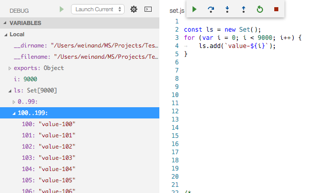
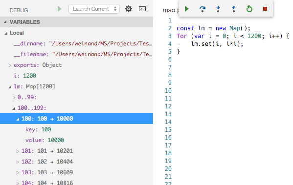
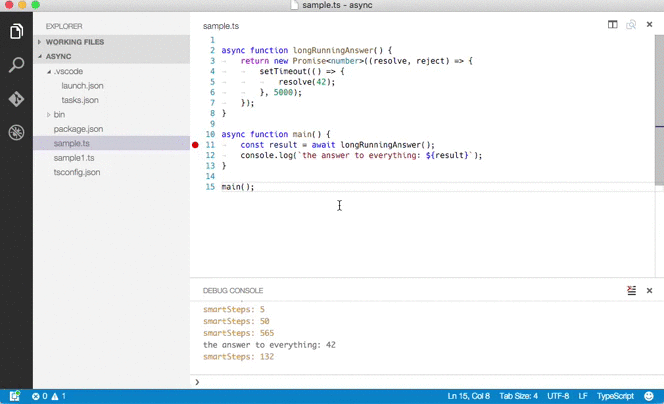

# (April 2016)

** TO DO **

## JavaScript

## Editor

## Workbench

## Debugging

### Call Stack Paging

VS Code debugging now supports arbitrarily deep call stacks. For performance reasons we only load twenty frames initially but there is now a button at the bottom for loading the next set of frames:

## Node.js Debugging

### Support for ES6 Sets, Maps, and Generators

The VS Code Node.js debugger no longer shows ES6 Sets, Maps, Promises, and Generators as undefined or empty objects.

Set and map items show a sequence number next to the item because both data structures preserve the insertion order:

Generators show its state:

### Support for property getters

Object properties with getters are no longer shown as `undefined`. A prominent example for this are the environment variables available through `process.env`.

### String truncation limit lifted

The node v8 debugger protocol truncates strings automatically to a (non configurable) 80 characters.
In the April release VS Code works around this limitation and truncates only strings with more than 10000 characters.

### Improved performance when inspecting large data structures in node.js 4.x and 5.x

Inspecting large data structures like arrays or buffers results in Node.js becoming unresponsive because the v8 debugger protocol does not provide a way to access large data structures in chunks. In node 0.12.x VS Code started to dynamically inject code into the node runtime to improve the v8 debugging protocol but this stopped working after the io.js/node.js reunion for 2.x and 3.x versions. A recent fix to Node.js made code injection work again. So if you see performance problems make sure that you are using at least Node.js version 4.3.1 of the LTS stream or version 5.6 of the stable stream.

### Automatic skipping code when stepping

We added experimental support for automatically skipping 'uninteresting code' when stepping through code in the debugger. 'Uninteresting code' is code that is generated by a transpiling process but is not covered by a source map so it does not map back to the original source. Typically this code gets into your way when stepping through code in the debugger because it makes the debugger switch between the original source code and generated code that you are not really interested in.

This experimental feature automatically steps through code not covered by a source map until it has reached a location that is covered by a source map again. To enable the feature just add the attribute `smartStep` with a value of `true` to your launch configuration.

The following screen cast shows stepping through a simple async/await snippet first with the feature disabled and then enabled:

## Extension Authoring

## Debug Adapter Development

For Node.js based debug adapter development, we've made the debug adapter test support available as an npm module [vscode-debugadapter-testsupport](https://www.npmjs.com/package/vscode-debugadapter-testsupport).

The source for this module lives in the GitHub repository [vscode-debugadapter-node](https://github.com/Microsoft/vscode-debugadapter-node).

You can find examples of how to use the module here:
* [Node Debug](https://github.com/Microsoft/vscode-node-debug/blob/master/src/tests/adapter.test.ts)
* [Mono Debug](https://github.com/Microsoft/vscode-mono-debug/blob/master/tests/adapter.test.ts)
* [Mock Debug](https://github.com/Microsoft/vscode-mock-debug/blob/master/src/tests/adapter.test.ts)

## Notable Bug Fixes

* [4426](https://github.com/Microsoft/vscode/issues/4426): Include CLI in Linux zip archive and support custom install locations

These are the [closed bugs](https://github.com/Microsoft/vscode/issues?q=is%3Aissue+label%3Abug+milestone%3A%22April+2016%22+is%3Aclosed) and these are the [closed feature requests](https://github.com/Microsoft/vscode/issues?q=is%3Aissue+milestone%3A%22April+2016%22+is%3Aclosed+label%3Afeature-request) for the XXX update.

## Thank You

Last but certainly not least, a big *__Thank You!__* to the following folks that helped to make VS Code even better:

* [Some One (@someone)](https://github.com/someone): Did something really great [XXX](https://github.com/Microsoft/vscode/pull/XXX).

