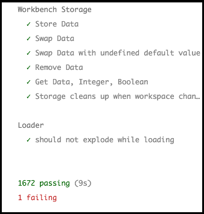
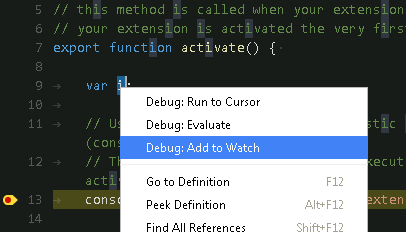
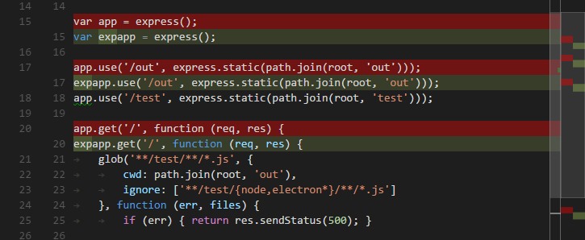

# VS Code v0.10.0 (November)

Hi,

With this release, we have a lot to share.

## Debugging - Debug Console Improvements
* Colored text output to highlight diagnostic errors and warnings
* Support file path links with line and column information for quick source code navigation.

## Debugging - Easy Variable Selection
Directly add selections to the Debug Console and Watch window with two new editor commands:
* `Debug: Evaluate` - add the text selection to the Debug Console
* `Debug: Add to Watch` - add the text selection to the Debug Watch window

## Debugging - Debug environment configuration
When you create your initial debug configuration (`launch.json`), VS Code now asks for your specific debug environment (Node.js, Mono) and creates a `launch.json` specific to that environment.  VS Code also detects the type of request ('launch' or 'attach').

## Debugging - Hover
Debug hover behavior has been improved: it is now possible to hover over object properties or variables that are not in the top stack frame.

## Debugging - Node.js
Starting with this release, we are now launching the Node.js debug target in the internal VS Code Debug Console. This eliminates the tedious management of external console windows and brings program output and the Node.js REPL closer together. Since the Debug Console does not support programs that need to read input from the console, the external console is still available and you can enable it by setting the attribute `externalConsole` to `true` in your launch configuration.

## Improved Syntax Highlighting
We updated all our syntax highlighters to emit tokens which are compatible with TextMate themes. Custom color themes now work with all languages, including HTML and CSS.

ColorSublime Batman Theme in 0.9.1:

ColorSublime Batman Theme in 0.10.0:

## Environment Variable Substitution
You can now reference environment variables directly in your `launch.json` and `task.json` files through `${env.Name}` (e.g. `${env.PATH}`).

## Language - PHP
VS Code is now using the official PHP linter (`php -l`) for PHP language diagnostics. VS Code will now stay current with PHP linter improvements.

There are two new settings to control the PHP linter:
* _php.validate.executablePath_: points to the PHP executable on disk. Set this if the PHP executable is not on the system path.
* _php.validate.run_: controls whether the validation is triggered on save (value: "onSave") or on type (value: "onType"). Default is on save.

## Languages - Workspace relative TypeScript version

If you want to use a newer version of TypeScript, you can define the `typescript.tsdk` setting pointing to a directory containing the TypeScript `tsserver.js` and the corresponding `lib.*.d.ts` files. This setting now supports relative paths so you can easily share this workspace setting with your team and use the latest TypeScript version (`npm install typescript@next`).

## New Difference View Settings
You can now set your diff view preferences with two new settings:
* `diffEditor.renderSideBySide` - Control whether to show differences in a side by side or inline view.
* `diffEditor.ignoreTrimWhitespace` - Ignore leading and trailing (trim) whitespace when showing differences.

Previously these options where available in the editor's title bar.

## Notable Bug Fixes

As always we fixed many issues.

Here are a few of the notable ones:

* Editor code completion is slow with large completion lists, e.g. 30000 suggestions.
