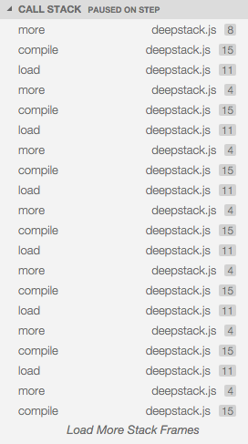
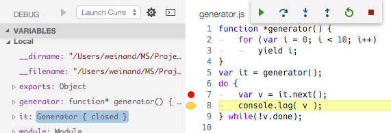

# 1.1.0 (April 2016)

The April 1.1.0 release is our first monthly release after announcing 1.0. We have been overwhelmed by the positive response to that release and the excitement in the community for VS Code and the rapidly growing ecosystem of new languages and extensions.

Keeping to our monthly release cadence, we've put together a nice selection of new features and fixes for April.  We hope you enjoy it. Our [April Iteration Plan](https://github.com/Microsoft/vscode/issues/4888) includes the remaining work in progress as well as other yet to be started work.

This release also has a number of notable bug fixes - we would love help in verification of these fixes.

* [3928](https://github.com/Microsoft/vscode/issues/3928): VS Code corrupts multi-line environment variables
* [4426](https://github.com/Microsoft/vscode/issues/4426): Include CLI in Linux zip archive and support custom install locations
* [4478](https://github.com/Microsoft/vscode/issues/4478): "Open in Terminal" not working on Fedora
* [4691](https://github.com/Microsoft/vscode/issues/4691): Command palette's camel case matching does not work for non ASCII characters
* [4679](https://github.com/Microsoft/vscode/issues/4679): Don't localize command names on the command palette
* [5260](https://github.com/Microsoft/vscode/issues/5260): Use proper font family for East Asian languages (CJK)

These are the [closed bugs](https://github.com/Microsoft/vscode/issues?q=is%3Aissue+label%3Abug+milestone%3A%22April+2016%22+is%3Aclosed) and these are the [closed feature requests](https://github.com/Microsoft/vscode/issues?q=is%3Aissue+milestone%3A%22April+2016%22+is%3Aclosed+label%3Afeature-request) for the 1.1.0 update.

## Editor

### Disable automatic revealing of files in the explorer

By default, VS Code expands folders and scrolls your active file into view in the file Explorer. If you don't want this automatic reveal behavior, you can disable it through a new setting `explorer.autoReveal`. Set `explorer.autoReveal` to `false` to prevent your Explorer view from changing as you switch between active files. There is a new action, **Show Active File in Explorer**, if you would like to explicitly display (reveal) the currently active file in the Explorer.

### Resize border (sash) double clicks

You can now double-click on some resize borders (sashes) in the workbench to quickly resize them:

* Double click on the Explorer resize border to size the sidebar to show file paths without being trimmed.
* Double clicking the resize border of other Views (Search, Git, Debug) will cause the sidebar to shrink to its minimum width.
* If you have multiple editors open, double clicking the resize border between them will resize the open editors to equal width.
* Double clicking the resize border of the side by side diff editor will resize the diffs to equal width.
* Double clicking the resize border of the lower **OUTPUT**/**DEBUG CONSOLE** panel will resize the panel to its minimum height.

### Reopen closed file command

The `workbench.files.action.reopenClosedFile` command has been added which will reopen the most recent file removed from the working files list. The default key binding for this command is `kb(workbench.files.action.reopenClosedFile)`.

>**Note:** Previously `kb(workbench.files.action.reopenClosedFile)` had been bound to the **Run: Run Test Task** command. **Run: Run Test Task** is now not bound to any default key binding.

## Debugging

### Call Stack Paging

VS Code debugging now supports arbitrarily deep call stacks. For performance reasons, we only load twenty frames initially but there is now a button at the bottom for loading the next set of frames:



## Node.js Debugging

### Support for ES6 Sets, Maps, and Generators

The VS Code Node.js debugger no longer shows ES6 Sets, Maps, Promises, and Generators as `undefined` or empty objects.

Set and map items show a sequence number next to the item because both data structures preserve the insertion order:


Generators show its state:



### Support for property getters

Object properties with getters are no longer shown as `undefined`. An example for this are the environment variables available through `process.env`.

### String truncation limit lifted

The Node.js V8 debugger protocol truncates strings automatically to a (non-configurable) 80 characters. In the April release, VS Code works around this limitation and truncates only strings with more than 10000 characters.

### Improved performance with large data structures in Node.js 4.x, 5.x

Inspecting large data structures like arrays or buffers results in Node.js becoming unresponsive because the V8 debugger protocol does not provide a way to access large data structures in chunks. In Node.js 0.12.x, VS Code started to dynamically inject code into the Node.js runtime to improve the V8 debugging protocol but this stopped working after the io.js/node.js reunion for 2.x and 3.x versions. A recent fix to Node.js made code injection work again. So if you see performance problems, make sure that you are using at least Node.js version 4.3.1 of the LTS stream or version 5.6 of the stable stream.

### Smart code stepping

We added experimental support for automatically skipping 'uninteresting code' when stepping through code in the debugger. 'Uninteresting code' is code that is generated by a transpiling process but is not covered by a source map so it does not map back to the original source. This code gets into your way when stepping through source code in the debugger because it makes the debugger switch between the original source code and generated code that you are not really interested in.

This experimental feature automatically steps through code not covered by a source map until it reaches a location that is covered by a source map again. To enable the feature, just add the attribute `smartStep` with a value of `true` to your launch configuration.

The following screen cast shows stepping through a simple async/await snippet first with the feature disabled and then enabled:


## Setup

### Portability improvements on Linux

The zip archive now included the CLI (`./bin/code`) and has been improved to support custom install locations and work when symlinked to.

### Run VS Code using sudo

VS Code can now be run using super user permissions (`sudo`) on Linux and OS X. A custom user data directory must be specified (non-existing or root-owned) to run under `sudo` due to limitations of Chromium/Electron.

```bash
sudo code --user-data-dir ~/.config/code-root-user
```

Due to the verbosity of this command, you can make put an alias in your `.bashrc` for convenience if you plan on using it frequently.

```bash
alias sudocode='sudo code --user-data-dir=~/.config/code-root-user'
```

When launching as root you can only edit root-owned files, not files owned by the user. It should not be used for general file editing.

### Launch your preferred shell

You can now specify which external shell VS Code will launch when you use commands like **Open in Command Prompt** (or **Open in Terminal** on OS X or Linux).  Set the `externalTerminal` user or workspace setting for your platform (`windowsExec`, `linuxExec`) to the executable to launch (`cmd` is the default for Windows).

For example, to set PowerShell as your external shell on Windows and Terminator on Linux, use:

```json
{
    "externalTerminal.windowsExec": "powershell",
    "externalTerminal.linuxExec": "terminator"
}
```

OS X support has not been implemented yet ([#5462](https://github.com/Microsoft/vscode/issues/5462)).

## Extension Authoring

### New command to open a folder in the same or new window

We added a new command for extension writers to open a folder in the same or new window. The command identifier is `vscode.openFolder` and it accepts two optional arguments `uri` and `newWindow`. If you omit the `uri` argument, the native file dialog is displayed for the user to select a folder.

### Custom close affordance when showing messages

The extensions API now allows you to provide a custom close affordance when showing a message using `window.show{Information|Warning|Error}Message` call. Just pass in a message item which has the `isCloseAffordance`-property set to `true`.

### Links when previewing html

When previewing html files with the `vscode.previewHtml` commands links are not interpreted in the context of VS Code. That is file-links are resolved within the editor, web-links with the default browser. Also commands are supported using the `command`-scheme. For instance, `'command:vscode.previewHtml?' + JSON.stringify("file:///some/file.html")` tells the editor to run the command `vscode.previewHtml` using arguments  from the query. Note that url-encoding applies.

## Debug Adapter Development

For Node.js based debug adapter development, we've made the debug adapter test support available as an npm module [vscode-debugadapter-testsupport](https://www.npmjs.com/package/vscode-debugadapter-testsupport).

The source for this module lives in the GitHub repository [vscode-debugadapter-node](https://github.com/Microsoft/vscode-debugadapter-node).

You can find examples of how to use the module here:

* [Node Debug](https://github.com/Microsoft/vscode-node-debug/blob/master/src/tests/adapter.test.ts)
* [Mono Debug](https://github.com/Microsoft/vscode-mono-debug/blob/master/tests/adapter.test.ts)
* [Mock Debug](https://github.com/Microsoft/vscode-mock-debug/blob/master/src/tests/adapter.test.ts)

## Electron Shell

We updated the Electron shell to 0.37.6.

## Language Server Protocol

Version 2.x of the [language server protocol](https://github.com/Microsoft/vscode-languageserver-protocol) was released together with a corresponding [client library](https://github.com/Microsoft/vscode-languageserver-node) to be used in extensions and a [server library](https://github.com/Microsoft/vscode-languageserver-node) for Node.js.

The major changes are:

- Alignment of the protocol with the VS Code extension API.
- Consistent support for language identifiers. This means that the language ID is passed to the server via the open notification.
- Support for version numbers on documents.
- Text document save notifications.
- Support for request cancellation.

## Thank You

Last but certainly not least, a big *__Thank You!__* to the following folks that helped to make VS Code even better:

* [Maxime Quandalle (@mquandalle)](https://github.com/mquandalle): Implement double-click on sashes for optimal resizing [4702](https://github.com/Microsoft/vscode/pull/4702).
* [Christian Oetterli (@krizzdewizz)](https://github.com/krizzdewizz): Honor the %COMSPEC% environment variable on Windows when spawning a shell [743](https://github.com/Microsoft/vscode/issues/743).
* [Peter Flannery (@pflannery)](https://github.com/pflannery): Add custom terminal launch settings [3495](https://github.com/Microsoft/vscode/pull/3495).
* [Xaver Hellauer (@xaverh)](https://github.com/xaverh): Add "new window" action to code.desktop [4916](https://github.com/Microsoft/vscode/pull/4916)


