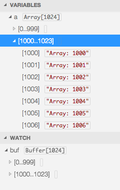
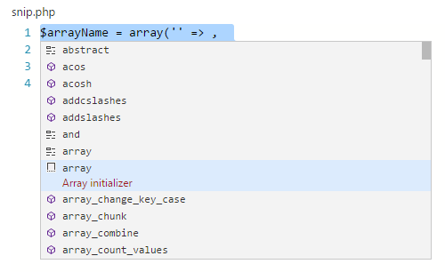
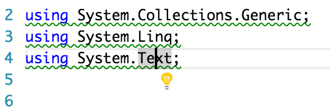
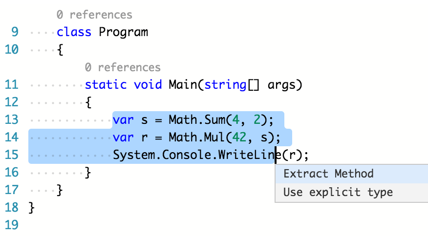

# VS Code v0.7.10 (Windows Only)

> **FIXED:** There is an issue with the 0.7.0 setup on Windows where VS Code will not properly load if you have non-ASCII characters in your installation path, normally your user name. This issue has been resolved in 0.7.10 for Windows. If you were affected by this bug please refer to the [how to update](/Docs/supporting/howtoupdate) documentation to download and install 0.7.10.

# VS Code v0.7.0 (August 2015)

Hi,

It's time to update VS Code again :)   This is a smaller update in terms of raw added features – but have no fear we are not slacking off - behind the scenes we are working hard to add plug-in support to VS Code.  Paired with this release we have also made a number of updates to our documentation.

Read on to find out what's new...


## Improved Documentation
With this release we updated almost all of our documentation to help you get more out of VS Code.

We broke down the content into four sections:
* [Overview](/Docs) - A quick summary of all the documentation including a video overview
* [Editor](/Docs/editor/codebasics) - An introduction to VS Code itself from editing all the way to debugging and tasks
* [Languages](/Docs/languages/overview) - Walkthroughs on how to get the best out of VS Code when using specific languages e.g. JavaScript
* [Runtimes](/Docs/runtimes/nodejs) - Walkthoughs on how to use VS Code with specific runtimes e.g. Node.js


>**Tip:** You can search our site via the search box in the header.


### Editor Settings and Configuration
Since VS Code was released there have been a large number of questions around how to configure and customize the product.  In part this was due to the fact we had not adequately listed out the available options in our documentation.  To help address this we've:
* Included the contents of the `settings.json` file in the [Customization topic](/Docs/editor/customization)
* Separated out [key bindings](/Docs/editor/keybindings) into their own topic area


## Debugging

### node.js: Large data stucture improvments
In previous versions of VS Code, debugging would stall (and timeout) when stepping through code that used large Arrays or Buffers. In this version the VS Code debugger treats large data structures (Arrays and Buffers) in a more scalable way and should no longer timeout. The same should be true for drilling into large data structures in the variables or watches view section.

As a consequence, the debugger now renders the contents of Arrays and Buffers in chunks.



>**Note:** These improvements require version 0.12.x of node.js (these improvments are not yet supported for io.js).


### node.js: Stable breakpoints
For performance reasons node.js parses the functions inside JavaScript files lazily on first access. As a consequence, breakpoints don't work in source code that hasn't been seen (parsed) by node.js.

Since this behavior is not ideal for debugging, VS Code now passes the `--nolazy` option to node.js automatically. This prevents the delayed parsing and ensures that breakpoints can be validated before running the code (so they should no longer 'jump').

>**Tip:** If you have to attach VS Code to an already running node process, be aware that this node.js runtime probably wasn't started with the `--nolazy` flag.


### Variable suppport in launch.json
VS Code now supports variables in the `launch.json` file in the same way as in `tasks.json` (see [Tasks](//Docs/editor/tasks#_variables-in-tasksjson)).


### Run to cursor
You can now run up to the cursor location with a new action included in the context menu.


## Tasks
We did a significant review of the [Tasks documentation](/Docs/editor/tasks) with this update and have included several examples of using tasks.

We also now support automatic detection of tasks in a `gruntfile`. This works the same as our support for the Gulp and Jake task runners (see [Tasks](/Docs/editor/tasks#_autodetecting-gulp-grunt-and-jake-tasks)).


## Markdown
We added a full overview of [how to use VS Code with Markdown files](/Docs/languages/markdown).

We now show you how to:
* leverage built-in snippets
* configure preview with custom CSS
* use autosave for live updates
* use tasks to compile to HTML

## JavaScript
In our [JavaScript documentation](/Docs/languages/javascript) we've added topics covering:
* JavaScript projects with `jsconfig.json`
* `ES6` support
* Configuring linters such as `JSHint` and `ESLint`
* Rich Editing Support
* IntelliSense

We also updated the quick fix code action. *Add /// reference for typing file* was renamed because `///` references are no longer needed to get IntelliSense from `.d.ts` files. The action is now called *Download type definition for some typing file* and it downloads the `.d.ts` file only.

We added the ability to exclude files and folders from a project via the addition of an `exclude` property in the `jsconfig.json`. This is useful when you want to exclude folders with generated JavaScript code.

```json
{
	"compilerOptions": {
		"target": "ES6"
	},
	"exclude": [
		"node_modules"
	]
}
```

Finally, one key bug we fixed in this update was unlocking the ability to work with Ember.js/ES6/AMD projects - previously VS Code would crash with these large projects.


## HTML
We improved our HTML formatter in this release and updated the [HTML documentation](/Docs/languages/html).


## JSON
We improved the JSON formatter, specifically formatting with comments and formatting ranges.

In the [JSON documentation](/Docs/languages/json) we now include examples of:
* Working with JSON comments
* IntelliSense and Schema validation
* Quick navigation
* Hovers and Toggle Values
* Configuring JSON Schemas


## CSS, Less and Sass
We updated our [CSS, Less and Sass documentation](/Docs/languages/CSS) to provide examples of how to work with CSS in VS Code.

This includes sections on:
* CSS IntelliSense
* Emmet Snippet support
* Syntax highlighting and Color preview
* Goto symbol & Hover support
* Goto declaration & Find references
* Using tasks to transpile Sass and Less into CSS
* Customizing CSS settings


## PHP
We added a set of common snippets for PHP.  To access these hit `kb(editor.action.triggerSuggest)` to get a context specific list.



## C&#35;
We have moved to the latest OmniSharp version 1.1.0.

We also added in early support for quick fixes (aka. lightbulbs) via Roslyn and NRefactory.

Quick fixes are automatically computed when you put the cursor onto a marker; they can also be requested by pressing `kb('editor.action.quickFix')`.




In the image below you can see the prompt to extract a method from the current selection:




## Dockerfile
We added a new document that covers our [Docker](/Docs/languages/dockerfile) support.

Our Docker support includes:
* Dockerfile - Hovering over instructions
* Docker-compose.yml - Hovering over keys and images, rule completion, image name completion


## Swift
We added syntax coloring and a set of common snippets.


## Groovy
We added syntax coloring and a set of common snippets.


## Notable Bug Fixes
As always we fixed many issues.

Here are a few of the notable ones from the public bug tracker:

* [17915](/Issues/Detail/17915): VS Code crashes with large emberjs/es6/amd project
* [17427](/Issues/Detail/17427): Git cannot be found if installed into a non-default location
* [17947](/Issues/Detail/17947): Open with encoding Windows 866 doesn't work
* [18094](/Issues/Detail/18094): Wrong "duplicate identifier" error in node files when using "exports"*

