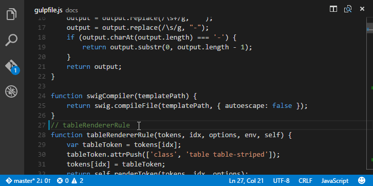
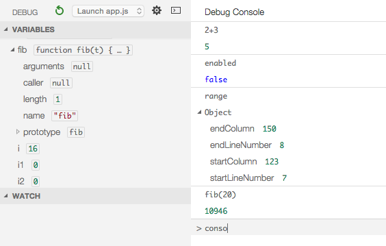

# v0.8.0 (September 2015)

Hi,

It’s that time again – our September update is ready for VS Code.

## Important Updates and Breaking Changes
Before we get into all of the exciting new stuff, there are a couple of key changes with this update that we don't want you to miss.

### New Windows Setup
We adopted a new installation and update framework for Windows based on [Inno Setup](http://www.jrsoftware.org/isinfo.php).
This fixes many Windows integration issues and streamlines the update story.

>**Note:** You will see a two stage update as a result of the change to the new installer.  First to version 0.7.20 to bootstrap the new installer and then to the 0.8.0 release version.  The new installer will prompt you during installation.  Continue through the setup dialog to install VS Code 0.8.0.

>**Tip:** You will need to close any currently open command windows to pick up the new PATH setting.

### Renamed VS Code Settings Folder
We renamed the top level `.settings` folder to `.vscode` to make it clear that this folder contains VS Code specific configurations and to avoid conflicts with other IDEs who may also use a folder named `.settings` (e.g. Eclipse).

When you update to version 0.8.0, VS Code will rename the folder to the new name and inform you if you had any files in a `.settings` folder.

## Additional Themes
VS Code is now able to apply TextMate syntax color themes (.tmTheme). We picked some themes from (http://colorsublime.com/) and made them available under `File | Preferences | Color Theme`. In one of the next releases, users will be able to extend this list with their own favorite themes.

Open the Color Theme picker with `File | Preferences | Color Theme` and use the up and down keys to change the selection and preview the themes.

## Debugging - No Mono Dependency for Node
We have ported the implementation of the Node.js debugging support from C#/Mono to TypeScript/Node.js, eliminating our Mono dependency for debugging Node.js applications on OSX and Linux.

## Debugging - Debug Console
In this release, we included a preview of the Debug Console for easy evaluation of expressions. The Debug Console can be opened using the `Open Console` action at the top of the Debug view or using the `Debug: Open Console` action in the Command Palette.

## Languages - JavaScript Linting as you Type
VS Code now provides support for [ESlint](http://eslint.org/) and [JSHint](http://jshint.com/). If enabled, the JavaScript code is validated as you type and reported problems can be navigated to and fixed inside VS Code.

To enable one of the linters do the following:

* Install the corresponding linter globally or inside the workspace folder that contains the JavaScript code to be validated. For example using the command lines: `npm install eslint --save-dev` or `npm install jshint --save-dev`, respectively.
* Enable eslint or jshint via the corresponding VS Code settings `"eslint.enable": true` or `"jshint.enable": true`, respectively.
* Optionally disable VS Code's built-in JavaScript validation via the setting `"javascript.validate.enable": false`.

Try it out by opening a JavaScript file and adding a problem that should be detected by the enabled linter. VS Code shows problems inside the editor and in the status bar.

## Languages - TypeScript 1.6 Support
>**Note:** At this time, TypeScript 1.6 should be considered experimental so proceed at your own risk. :)

VS Code uses TypeScript 1.5 in the box. If you want to use a newer version of TypeScript, you can define the `typescript.tsdk` setting. The value of this setting is the absolute path to the `lib` folder of a TypeScript installation. This folder contains the file `tsserver.js` and the corresponding `lib.*.d.ts` files. Refer to this [blog post](https://blogs.msdn.com/b/typescript/archive/2015/07/27/introducing-typescript-nightlies.aspx) for how to install the nightly builds of TypeScript.

## Languages - TSX
We now support colorizing TSX (TypeScript JSX) files. To get full language support for TSX files, you need to install the latest TypeScript 1.6 version and configure VS Code to use it with the `typescript.tsdk` setting, as described above.

To learn more about how to use TSX with TypeScript refer to the [TypeScript TSX Wiki page](https://github.com/Microsoft/TypeScript/wiki/JSX).

## Languages - JSX Colorization
We now support colorizing JSX files.

## Languages - C&#35; on Omnisharp 1.1.1
We have moved to the OmniSharp version 1.1.1 [(OmniSharp releases)](https://github.com/OmniSharp/omnisharp-roslyn/releases). This version of OmniSharp will happily work with DNX Beta7 but note that on Linux and Mac there is not yet support for using [CoreCLR](https://github.com/OmniSharp/omnisharp-roslyn/issues/294) as a development platform.

## Git - Undo Last Commit
There is a new `Undo Last Commit` action which will let you undo your previous commit, keeping the changes in the working folder.

## Tasks - echoCommand Property
A new property `echoCommand` has been added to the global and task specific sections of the `tasks.json` file. If set to `true`, the executed command is echoed to the task's output view. This is useful when you are configuring tasks and you want to see the full command VS Code is running.

## Notable Bug Fixes

As always we fixed many issues.

Here are a few of the notable ones from the public bug tracker:

* [18617](/Issues/Detail/18617): C# IntelliSense suggestions only come up after error checking, making them slow over time
* [17259](/Issues/Detail/17259): Cannot control installation location
* [18603](/Issues/Detail/18603): Duplicate icon on Windows 10
* [17159](/Issues/Detail/17159): Cannot open a file with spaces in its name from command line

