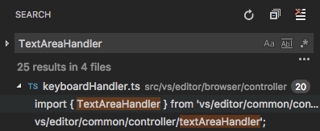
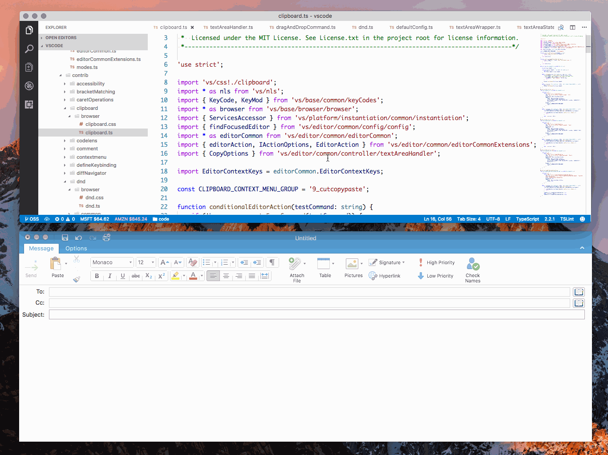
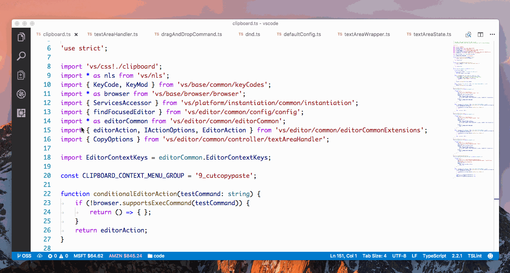
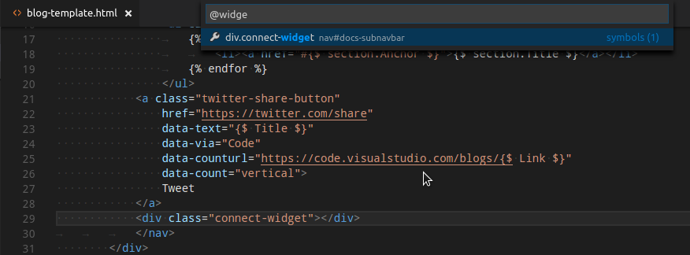
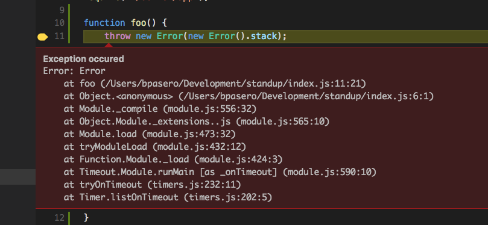
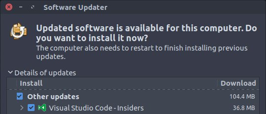

# February 2017 (version 1.10)

Welcome to the February 2017 release of Visual Studio Code. There are a number of significant updates in this version that we hope you will like, some of the key highlights include:

* **[Preview: Minimap](#preview-minimap)** - See your source code with a Minimap overview.
* **[Copy text with formatting](#copy-with-syntax-highlighting)** - Copy code examples with full syntax highlighting.
* **[Integrated Terminal Links](#links-in-the-terminal)** - Browse or open files directly from the Integrated Terminal.
* **[Share Theme settings](#theme-configurations-in-settings)** - Save Color and File Icon theme settings per user or workspace.
* **[Language specific settings](#go-make-yaml-markdown)** - Go, Make, YAML and Markdown now have custom default settings (Tab conventions, word wrap).
* **[Column breakpoints](#column-breakpoints)** - Set multiple breakpoints on the same line of source code.

The release notes are arranged in the following sections related to VS Code focus areas. Here are some further updates:

* **[Workbench](#workbench)** - Configurable window title, new tree/list key bindings.
* **[Editor](#editor)** - Manually trigger Save actions.
* **[Tasks](#task-support)** - Assign keyboard shortcuts to tasks, run tasks in separate terminals.
* **[Languages](#languages)** - Disable color preview decorators.
* **[Debugging](#debugging)** - New variable syntax.
* **[Node.js Debugging](#node-debugging)** - Moving to the Node2 debugger.
* **[Extension Authoring](#extension-authoring)** - Modal message dialogs, provide language specific settings.

## Workbench

### Configurable Explorer key bindings

By popular demand, you can now configure the key bindings for most of the commands in the File Explorer and OPEN EDITORS view.

The following commands could already be assigned prior to version 1.10 in the File Explorer:

* `explorer.newFile` - Create a new file
* `explorer.newFolder`-  Create a new folder

New commands that work in both the File Explorer and OPEN EDITORS view

* `explorer.openToSide` - Open to the side
* `copyFilePath` - Copy path of file/folder
* `revealFileInOS` - Reveal file in OS

New commands that only work in the File Explorer:

* `filesExplorer.copy` - Copy a file from the File Explorer
* `filesExplorer.paste` - Paste a file that was copied from the File Explorer
* `renameFile` - Rename a file/folder in the File Explorer
* `moveFileToTrash` - Move a file/folder to trash from the File Explorer
* `deleteFile` - Bypass trash and delete a file/folder from the File Explorer
* `filesExplorer.findInFolder` - Find inside a folder from the File Explorer

In addition to these commands, the following contexts are introduced for key bindings:

* `filesExplorerFocus` - Keyboard focus is inside the File Explorer
* `openEditorsFocus` - Keyboard focus is inside the OPEN EDITORS view
* `explorerViewletFocus` - Keyboard focus is in either the File Explorer or OPEN EDITORS view

### Configurable tree/list key bindings

We introduced new commands (see below) to make working with trees and lists in VS Code more configurable for keyboard centric users.

Here is a list of new commands that will work in every tree and list:

|Command|Keyboard shortcut|
|---|---|
|`list.focusUp`|`kbstyle(Up Arrow)` (additionally on macOS: `kbstyle(Ctrl+P)`)|
|`list.focusDown`|`kbstyle(Down Arrow)` (additionally on macOS: `kbstyle(Ctrl+N)`)|
|`list.focusFirst`|`kbstyle(Home)`|
|`list.focusLast`|`kbstyle(End)`|
|`list.focusPageDown`|`kbstyle(PageDown)`|
|`list.focusPageUp`|`kbstyle(PageUp)`|
|`list.collapse`|`kbstyle(Left Arrow)` (additionally on macOS: `kbstyle(Cmd+Up Arrow)`)|
|`list.expand`|`kbstyle(Right Arrow)`|
|`list.clear`|`kbstyle(Escape)`|
|`list.select`|`kbstyle(Enter)` (additionally on macOS: `kbstyle(Cmd+Enter)`)|
|`list.toggleExpand`|`kbstyle(Space)`|

With these new commands, we now consistently support `kbstyle(Ctrl+P)` and `kbstyle(Ctrl+N)` to navigate up and down in trees and lists on macOS.

For example, on macOS to change the command to open from the File Explorer to be `kbstyle(Enter)` (which normally brings you into rename mode), configure:

```json
{
    "key": "enter",
    "command": "list.select",
    "when": "filesExplorerFocus"
}
```

### Configurable window title

We introduced a new setting `window.title` that can be used to change the window title based on the active editor opened.

You can compose the title with the following variables (shown here for `/Users/Development/myProject/myFolder/myFile.txt`):

* `${activeEditorLong}` - /Users/Development/myProject/myFolder/myFile.txt
* `${activeEditorMedium}` - myFolder/myFile.txt
* `${activeEditorShort}` - myFile.txt
* `${rootName}` - myProject
* `${rootPath}` - /Users/Development/myProject
* `${appName}` - Visual Studio Code
* `${dirty}` - a dirty indicator if the active editor is dirty
* `${separator}` - a conditional separator (" - ") that only shows when surrounded by variables with values

The `window.title` has the following defaults:

* Windows/Linux: `${dirty}${activeEditorName}${separator}${rootName}${separator}${appName}`
* macOS: `${activeEditorName}${separator}${rootName}`

>**Note:** We no longer support `window.showFullPath` in favor of the `window.title` setting. The variable `${activeEditorLong}` will give you the full path.

### More key bindings in menus

In previous releases, you might have noticed that a menu entry might not show a keyboard shortcut even though you have a keybinding assigned. The reason was that some key bindings (for example multiple key chords) cannot be displayed as keyboard shortcuts in menus (including context menus).

As a workaround, we now show those key bindings as part of the label:


### Restore Zen Mode

Per [user request](https://github.com/Microsoft/vscode/issues/19431), we have added a `zenMode.restore` setting to control if a window should restore to Zen Mode if it was exited in Zen Mode.

### Links in the terminal

The terminal now creates links for URLs and text that looks like a path. These links will either be opened in a browser or the editor when triggered respectively.


### Run in terminal commands

In previous releases, there was the single command `workbench.action.terminal.runSelectedText` which sent text to the terminal. This would send either the selection if there was one, or the entire file if not. This caused some issues as users would accidentally run entire files, expecting them to run the current *line* if there was no selection. Running a file would also not work in some shells as the shell would interpret the text in chunks, not as a whole. To improve upon the situation, there are now two commands with distinct behaviors:

- `workbench.action.terminal.runSelectedText`: Sends the selection if there is one to the terminal, otherwise sends the current line.
- `workbench.action.terminal.runActiveFile`: Sends the *file path* of the active file to the terminal (in most shells this will execute the file).

### Contributable SCM providers

Further progress was made in February on creating a pluggable Source Control feature set for VS Code. Namely, all Git features were ported over to a [Git extension](https://github.com/Microsoft/vscode/issues/18615).

All VS Code Insiders will get this new interface and we'll use the March milestone to tune and tweak the experience. You can try this out via the `SCM: Enable Preview SCM` command, which will replace the legacy Git functionality with the experimental one (run `SCM: Disable Preview SCM` to undo).

### Theme configurations in settings

New settings have been added that define the currently active Color and File Icon theme:

```
{
  // Specifies the color theme used in the workbench.
  "workbench.colorTheme": "Default Dark+",

  // Specifies the icon theme used in the workbench.
  "workbench.iconTheme": null
}
```

By placing the options in the workspace settings, you can now have a different theme per workspace.

To change a theme, you can still use the theme selection dialog in the **Preferences** menu use the **Preferences: Color Theme** and **Preferences: File Icon Theme** commands.

### Search Results Count

We now show the total number of files and matches for a search in the Search Viewlet.



## Editor

## Preview minimap

TBD

### Save participants trigger

You can now save an editor via `kb(workbench.action.files.save)` even if the file is not dirty and save participants will be triggered. This allows you to trigger Format on Save even if the file is not dirty.

### Copy with syntax highlighting

You can now copy selected text to the clipboard with syntax highlighting. It can be very useful when you paste the content into another application, for example, Outlook, and the content pasted into the application still has a good format and correct colorization.

Technically we add a new entry for HTML content into the clipboard so even if the target application doesn't support pasting rich text, the pasting still works as charm.



Copying plain text to the clipboard is easy and straight-forward but copying text with syntax has to pay the price of rendering based on the Theme you are using, so in order to make sure this feaure doesn't lag VS Code noticeably, we turn it off if you are copying a selection which contains more than 65536 characters.

If Copy and Paste with correct format and colors is your top priority, so you can always run a new command `editor.action.clipboardCopyWithSyntaxHighlightingAction` or even bind it to `ctrl/cmd+c` then you don't need to worry if the selection length reaches the limit.

### Drag and drop selected text

You can now use the mouse to drag and drop selected text inside the editor. This feature is disabled by default and you can turn it on by set `editor.dragAndDrop` to `true`.



Please note we don't support drag-and-drop across editors or across different applications at the moment.

## Task support

### Key bindings per task

You can now bind a keyboard shortcut to any task you want.

Simply add a key binding like this:

```json
{
    "key": "ctrl+h",
    "command": "workbench.action.tasks.runTask",
    "args": "tsc"
}
```

This binds `ctrl+h` to the task named `tsc`.

### More work on Terminal Runner

As announced in the previous release, we are working on running tasks in the Integrated Terminal instead of the Output panel. In this release, we added support to compose tasks out of simpler tasks. If, for example, you have a workspace with a client and server folder and both contain a build script, you can now have one task that starts both build scripts in separate terminals.

The `tasks.json` file looks like this:

```json
{
    "version": "2.0.0",
    "tasks": [
        {
            "taskName": "Client Build",
            "command": "gulp",
            "args": ["build"],
            "isShellCommand": true,
            "options": {
                "cwd": "${workspaceRoot}/client"
            }
        },
        {
            "taskName": "Server Build",
            "command": "gulp",
            "args": ["build"],
            "isShellCommand": true,
            "options": {
                "cwd": "${workspaceRoot}/server"
            }
        },
        {
            "taskName": "Build",
            "dependsOn": ["Client Build", "Server Build"]
        }
    ]
}
```

Please note the following things:

- This support is preliminary and subject to change.
- The terminal task runner can now also be enabled by using the `"version": "2.0.0"` property.

### Facilitating Automation with `${lineNumber}` 

As asked by the [community](https://github.com/Microsoft/vscode/issues/12714), new predefined common variable `${lineNumber}` for tasks.json and launch.json was added. It resolves to the selected line in the currently opened file. Adding this variable facilitates automation (e.g. running tests) under cursor selection.

## Languages

### TypeScript

VS Code now ships with [TypeScript 2.2](https://blogs.msdn.microsoft.com/typescript/2017/02/22/announcing-typescript-2-2/). This release includes a number of [new language features](https://github.com/Microsoft/TypeScript/wiki/What's-new-in-TypeScript#typescript-22), bug fixes, and other enhancements.

TypeScript 2.2 also brings support for a number of new quick fixes, including:

* Add missing import
* Add missing property
* Add forgotten this to variable
* Remove unused declaration
* Implement inteface or abstract class

### Auto JSDoc Comments

VS Code will now provide a JSDoc comment template for JavaScript and TypeScript functions when you type `/**`:


### HTML

Document symbols are now available also for HTML, allowing you to quickly navigate to DOM nodes by id and class name.

Press `kbstyle(Ctrl+Shift+O)` to bring up the symbol in file.



Thanks to [Cody Hoover](https://github.com/hoovercj) for the contribution.

### CSS

The CSS, LESS and SCSS color preview decorators can now be disabled in the settings:

```json
  "css.colorDecorators.enable": true,
  "scss.colorDecorators.enable": true,
  "less.colorDecorators.enable": true
```

### Jade

Jade is now known as [Pug](https://github.com/pugjs/pug/issues/2184). Nothing has changed but the language label. The language id is still `jade` and the `.jade` file extension is still served.

### Vue

While [Vue.js](http://vuejs.org) files may look like HTML files, they are much more than that. For that reason, the `.vue` file extension is no longer associated with HTML by default. However we do recommend you use a Vue.js specific extension for language support and the [vetur](https://marketplace.visualstudio.com/items?itemName=octref.vetur) extension is a good choice.

### Go, Make, YAML, Markdown

These languages are now using the new support for default configuration settings per language (see Default Language specific editor settings below). For Go, Make, and YAML, the default settings configure `kbstyle(Tab)` behavior as defined by these languages. For Markdown, the default enables word wrapping and disables quick suggestions.

### Fragment Link Navigation for Markdown

Links to Markdown files that include a fragement will now try to open the file at the corresponding header:

```markdown
* [Section](#header)
* [Another file](./other_file.md#header)

# Header
...
```

This allows quickly navigating documentation directly within the VS Code editor.

## Extensions

## Debugging

### Column breakpoints

As per [popular request](https://github.com/Microsoft/vscode/issues/14784), we now support setting breakpoints on an editor column. This is particularly useful when debugging minified code which contains multiple statements on a single line. A column breakpoint can be set using `kb(editor.debug.action.toggleColumnBreakpoint)` or via the context menu during a debug session.

Note: A debug adapter backend can update the location of breakpoints during a debug session. This might cause breakpoints to move since breakpoints cannot be accepted at every possible location.


### Ability to Select and Start a Launch using Keyboard

The option to launch debug configurations using keyboard was introduced, as asked in [this request](https://github.com/Microsoft/vscode/issues/16613). It works similarly to running tasks, with an ability to launch from the Command Palette. The keyword `'debug '` or the option **Debug: Select and Start Debugging** from Command Palette is used to pull and debug any configuration from launch.json. 


### Improved Exception experience

To give a better visibility for the exceptions occuring in debugging mode, exception dialog pops up now. This was raised [here](https://github.com/OmniSharp/omnisharp-vscode/issues/1007), and becomes very practical in cases when debugging stops at some point, so that user is not aware that an exception was thrown (especially if the exception was thrown in the library code). Another motivation for it was addressing the problem of finding exception details previously, therefore these are displayed in the dialog.



### Unsaved File Debugging

It is now possible to simply debug a single file that was just created and not yet saved in VS Code. This helps with scenarios when you are opening a new file in VS Code from the command line and just want to press `kb(workbench.action.debug.start)` to start debugging.

### Debug views sizes

We have fine-tuned the default sizes of Debug views. Also once the size is changed by the user, we preserve it across different VS Code sessions.

### New variable syntax

Starting with this release, we now support the colon character ':' as a prefix separator in variable names (and we have deprecated the '.'). With this change, the new (and preferred) syntax for 'env', 'command', and 'config' variables becomes `${prefix:id}`.

This makes command variables (where the command ID itself uses '.') much more readable:

``` json
"processID": "${command:extension.node-debug.pickProcess}"
```

### Precondition based on debugger type

It is now possible to have a precondition based on the current debug type. Preconditions can be used when defining keyboard shortcuts or when registering new commands as an extension.

Here's an example of a shortcut that will only be enabled while you are debugging `node`:

```json
{ "key": "f6", "command": "workbench.action.debug.continue", "when": "debugType == 'node'" }
```

## Node Debugging

### Node2 transitioning

In this milestone, we've started to fold the two node debuggers ('node' and 'node2') into a single node debugging experience (behind the debug type 'node'). The goal of this is to detect the supported debugging protocol(s) of the targeted node runtime automatically and to select the best debugger implementation based on that protocol. We call the [new protocol](https://developer.chrome.com/devtools/docs/debugger-protocol) 'inspector' and the (now obsolete) v8-debugger protocol 'legacy'.

Starting with this release, we recommend that you only use the 'node' debug type and we've deprecated the 'node2' type ('node2' is still available but its use in launch configurations will be flagged with a deprecation warning).

Since we still want to give you control over what debugger implementation to use, we've introduced a new attribute `protocol` with the following values:

- **`auto`**: tries to automatically detect the protocol used by the targeted runtime. For configurations of request type `launch` and if no `runtimeExecutable` is specified, we try to determine the version by running node from the PATH with an `--version` argument. If the version is >= 6.9 the new 'inspector' protocol is used. For configurations of request type 'attach' we try to connect with the new protocol and if this works, we use the 'inspector' protocol. We only switch to the new inspector protocol for versions >= 6.9 because of severe problems in earlier versions.
- **`inspector`**: forces the node debugger to use the 'inspector' protocol based implementation (aka 'node2'). This is supported by node versions >= 6.3, but not (yet) by Electron.
- **`legacy`**: forces the node debugger to use the 'legacy' protocol based implementation. This is supported by node versions < v8.0).

In the future `auto` will be the default, however since the transition to the new node debugging experience hasn't been finished yet (and we were not brave enough to enable it by default), we continue to use `legacy` for the time being.

But we would like to encourage you to use `'protocol': 'auto'` in your launch configurations and provide feedback if you experience problems.

## Extension Authoring

### Modal messages

The `window.showInformationMessage` and similar API calls have been [updated to allow the use of modal message dialogs](https://github.com/Microsoft/vscode/pull/19717).

Here's an example using the `modal` parameter:

```typescript
window.showInformationMessage('Do you want to continue?', { modal: true }, 'Yes', 'No');
```

### Command palette menu

When registering commands in `package.json` they will automatically show in the command palette aka F1-list. To allow more control over that we have added the `commandPalette`-menu. That allows you to spell out the implict behaviour and allows you to define a `when`-condition controller if a command shows in the command palette or not.

The snippet below makes the 'Hello World' command only show in the command palette when something is selected in the editor:

```json
"commands": [{
    "command": "extension.sayHello",
    "title": "Hello World"
}],
"menus": {
    "commandPalette": [{
        "command": "extension.sayHello",
        "when": "editorHasSelection"
    }]
}
```

### Default language specific editor settings

With this release, extension authors can contribute default language specific editor settings using the newly introduced extension point `configurationDefaults` in `package.json`.

Following example contributes default editor settings for `markdown` language.

```json
contributes": {
    "configurationDefaults": {
        "[markdown]": {
            "editor.wrappingColumn": 0,
            "editor.quickSuggestions": false
        }
    }
}
```

### Debug Adapter Protocol

A new optional attribute `clientID` has been added to the `InitializeRequestArguments`. With this addition, a debug adapter can identify the client (frontend). We maintain a list of client IDs [here](https://github.com/Microsoft/vscode-debugadapter-node/wiki/Client-IDs).

For obtaining more information about thrown exceptions, we've introduced a new `ExceptionInfoRequest` and a corresponding type `ExceptionDetails`.

## Miscellaneous

### Official signed repositories for Linux

For Debian-based distributions, we now ship both Stable and Insiders in a signed `apt` repository that is automatically installed when you install the .deb package. This enables automatic updates using the OS's mechanism.



For Red Hat-based distributions, we ship Stable in a signed `yum` repository. You can install the repository by following [these instructions](https://github.com/Microsoft/vscode/issues/229#issuecomment-280943455).

## Notable Changes

* [1426](https://github.com/Microsoft/vscode/issues/1426): macOS: file events are not reported when using workspace path with different casing
* [12000](https://github.com/Microsoft/vscode/issues/12000): Terminals created in the background by the API will not display/retain any output until the terminal panel is initialized
* [15364](https://github.com/Microsoft/vscode/issues/15364): Make tabs smaller when workbench.editor.showTabCloseButton: false
* [16820](https://github.com/Microsoft/vscode/issues/16820): Hot Exit: Opens the same file twice in two separate windows
* [19625](https://github.com/Microsoft/vscode/issues/19625): API doesn't update settings if there are trailing commas in settings.json.
* [19526](https://github.com/Microsoft/vscode/issues/19526): Filter installed extensions.
* [19511](https://github.com/Microsoft/vscode/issues/19511): Added supported for following language specific editor settings (tabSize, insertSpaces, detectIndentation, trimAutoWhitespace).
* [10610](https://github.com/Microsoft/vscode/issues/10610): When I hit a breakpoint VS Code opens a new readonly version of the file, breakpoints not shown in gutter.
* [19840](https://github.com/Microsoft/vscode/issues/19840): IntelliSense freezes at random instances

These are the [closed bugs](https://github.com/Microsoft/vscode/issues?q=is%3Aissue+label%3Abug+milestone%3A%22February+2017%22+is%3Aclosed) and these are the [closed feature requests](https://github.com/Microsoft/vscode/issues?q=is%3Aissue+milestone%3A%22February+2017%22+is%3Aclosed+label%3Afeature-request) for the 1.10 update.

## Contributions to Extensions

Our team maintains or contributes to a number of VS Code extensions. Most notably:

* [Go](https://marketplace.visualstudio.com/items?itemName=lukehoban.Go)
* [TSLint](https://marketplace.visualstudio.com/items?itemName=eg2.tslint)
* [ESLint](https://marketplace.visualstudio.com/items?itemName=dbaeumer.vscode-eslint)
* [Docker](https://marketplace.visualstudio.com/items?itemName=PeterJausovec.vscode-docker)
* [Debugger for Chrome](https://marketplace.visualstudio.com/items?itemName=msjsdiag.debugger-for-chrome)
* [VSCodeVim](https://marketplace.visualstudio.com/items?itemName=vscodevim.vim)

## Thank You

Last but certainly not least, a big *__Thank You!__* to the following folks that helped to make VS Code even better:

Contributions to `vscode`:
* TBD

Contributions to `vscode-eslint`:

* [darkred (@darkred)](https://github.com/darkred): Move the 'Release Notes' from inside 'eslint/README.md' to a separate 'eslint/CHANGELOG.md' [PR #205](https://github.com/Microsoft/vscode-eslint/pull/205)

Contributions to `language-server-protocol`:

* [Anton Kosyakov (@akosyakov)](https://github.com/akosyakov): Remove notion of the next tag of the node implementation [PR #171](https://github.com/Microsoft/language-server-protocol/pull/171)
* [bolinfest (@bolinfest)](https://github.com/bolinfest): Contributions to `vscode-languageserver-node`: Introduce DocumentUri concept [PR #170](https://github.com/Microsoft/language-server-protocol/pull/170)
* [Olivier Thomann (@othomann)](https://github.com/othomann): Fix typos [PR #159](https://github.com/Microsoft/language-server-protocol/pull/159)

Contributions to `vscode-languageserver-node`:

* [Tobias Bieniek (@Turbo87)](https://github.com/Turbo87): Cleanup "installServerIntoExtension" script [PR #150](https://github.com/Microsoft/vscode-languageserver-node/pull/150)
* [David Greisen (@dgreisen)](https://github.com/dgreisen): MessageBuffer.append: length of string in bytes [PR #163](https://github.com/Microsoft/vscode-languageserver-node/pull/163)

Contributions to `vscode-languageserver-node-example`:

* [Leo (@clinyong)](https://github.com/clinyong): fix typo [PR #30](https://github.com/Microsoft/vscode-languageserver-node-example/pull/30)

Contributions to `vscode-html-languageservice`:

* [Cody Hoover (@hoovercj)](https://github.com/hoovercj):  Add findDocumentSymbols [PR #7](https://github.com/Microsoft/vscode-html-languageservice/pull/7)

Contributions to `vsce`:

<!-- In-product release notes styles.  Do not modify without also modifying regex in gulpfile.common.js -->
<a id="scroll-to-top" role="button" aria-label="scroll to top" onclick="scroll(0,0); event.preventDefault(); event.stopPropagation()"><span class="icon"></span></a>
<link rel="stylesheet" type="text/css" href="css/inproduct_releasenotes.css"/>