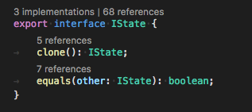

# March 2017 (version 1.11)

Welcome to the March 2017 release of Visual Studio Code. There are a number of significant updates in this version that we hope you will like, some of the key highlights include:

* **[Terminal improvements](#terminal)** - Better Integrated Terminal link support as well as new customization settings.
* **[Implementor CodeLens for TypeScript](#implementation-codelens-for-typescript)** - Quickly see who implements an interface or abstract class.
* **[Objective-C++ support](#improved-support-for-objective-c)** - Separate language mode for Objective-C++ and improved syntax highlighting.

The release notes are arranged in the following sections related to VS Code focus areas. Here are some further updates:

* **[Editor](#editor)** - TBD.
* **[Workbench](#workbench)** - TBD.
* **[Languages](#languages)** -  TypeScript 2.2.2
* **[Debugging](#debugging)** - TBD.
* **[Tasks](#task-support)** - TBD.
* **[Extension Authoring](#extension-authoring)** - TBD.

>**Tip:** Want to see new features as soon as possible? You can download the nightly Insiders [build](https://code.visualstudio.com/insiders) and try the latest updates as soon as they are available.

## Editor

## Workbench

### Terminal

**Link improvements**

The terminal links feature that was introduced last month got some more polish this version. The experience is now aligned with the editor, requiring `kbstyle(Ctrl)` or `kbstyle(Cmd)` to be held depending on your platform.

Also all links are now validated so only links that actually go somewhere will react to user action.

**Improved start experience on Windows**

Unlike on macOS and Linux with their `SHELL` environment variable, Windows doesn't really have a reliable alternative. There is `COMSPEC` but unfortunately it always defaults to the 32-bit variant of Command Prompt and it's seldom modified. To work around this, we've introduced a message when the terminal is first launched on Windows that allows users to select from a set of shells detected on the machine.

**Custom workspace shell settings**

In VS Code v1.9, we disallowed workspace settings from configuring the terminal shell as it could have potentially been exploited maliciously. We are now re-allowing this but requiring an explicit user opt-in for each workspace before the settings will be picked up.

**Warn when closing window with active terminal sessions**

The new setting `terminal.integrated.confirmOnExit` has been added that presents a confirmation dialog when the window is closing with active terminal sessions. This is disabled by default.

## Languages

### TypeScript 2.2.2

VS Code now ships with TypeScript 2.2.2. This release includes a number of important bug fixes and performance improvements. You can find a complete list of changes [here](https://github.com/Microsoft/TypeScript/milestone/40?closed=1).

### Implementation CodeLens for TypeScript

We now include a CodeLens that shows the number of implementors of interfaces and abstract classes in TypeScript code.

Clicking on the CodeLens will display a list of all implementations.

This feature is disabled by default and requires TypeScript 2.2.1+. To enable it, simply add `"typescript.implementationsCodeLens.enabled": true` to your settings.

### Simplified TypeScript server log collection

Added a new `"typescript.tsserver.log"` setting to simplify the collection of logs from the TypeScript server that powers VS Code's TypeScript and JavaScript language support. These logs can be used to debug issues with JS and TS language support, and make it easier for users to provide these logs during issue investigations.

The new logging experience is supported with TypeScript 2.2.2+. Simply set `"typescript.tsserver.log": "verbose"` and reload VS Code to enable logging to a file. Use the `"TypeScript: Open TS Server log"` command to open the log file in the editor.

### Improved support for Objective-C++

VS Code now includes an `objective-cpp` language mode for working with Objective-C++. Previously, `.mm` files were treated as regular C++. This release also improves syntax coloring of Objective-C++ files.

## Debugging

## Task Support

## Extension Authoring

## Miscellaneous

## New Commands

Key|Command|Command id
---|-------|----------
`kb(workbench.action.revertAndCloseActiveEditor)`|Revert and Close Active Editor|`workbench.action.revertAndCloseActiveEditor`

## Notable Changes

* [14286](https://github.com/Microsoft/vscode/issues/14286): Terminal.processId doesn't seem to be working on Windows 
* [22971](https://github.com/Microsoft/vscode/issues/22971): Run the terminal as a login shell by default on macOS
* [12077](https://github.com/Microsoft/vscode/issues/12077): File does not reload in editor when quickly changed externally after making modifications
* [21948](https://github.com/Microsoft/vscode/issues/21948): Auto save no longer works
* [20074](https://github.com/Microsoft/vscode/issues/20074): VSCode default language extensions override custom language extensions
* [13001](https://github.com/Microsoft/vscode/issues/13001): Keep scroll position stable when closing a tab
* [13665](https://github.com/Microsoft/vscode/issues/13665): Improve VS Code when working with network drives

These are the [closed bugs](https://github.com/Microsoft/vscode/issues?q=is%3Aissue+label%3Abug+milestone%3A%22March+2017%22+is%3Aclosed) and these are the [closed feature requests](https://github.com/Microsoft/vscode/issues?q=is%3Aissue+milestone%3A%22March+2017%22+is%3Aclosed+label%3Afeature-request) for the 1.10 update.

## Contributions to Extensions

Our team maintains or contributes to a number of VS Code extensions. Most notably:

* [Go](https://marketplace.visualstudio.com/items?itemName=lukehoban.Go)
* [TSLint](https://marketplace.visualstudio.com/items?itemName=eg2.tslint)
* [ESLint](https://marketplace.visualstudio.com/items?itemName=dbaeumer.vscode-eslint)
* [Docker](https://marketplace.visualstudio.com/items?itemName=PeterJausovec.vscode-docker)
* [Debugger for Chrome](https://marketplace.visualstudio.com/items?itemName=msjsdiag.debugger-for-chrome)
* [Mono Debug](https://marketplace.visualstudio.com/items?itemName=ms-vscode.mono-debug)
* [VSCodeVim](https://marketplace.visualstudio.com/items?itemName=vscodevim.vim)

## Thank You

Last but certainly not least, a big *__Thank You!__* to the following folks that helped to make VS Code even better:

Contributions to `vscode`:

Contributions to `vscode-eslint`:

Contributions to `language-server-protocol`:

* [Lucian Wischik (@ljw1004)](https://github.com/ljw1004): DidChange might only have new text [PR #168](https://github.com/Microsoft/language-server-protocol/pull/198)

Contributions to `vscode-languageserver-node`:

* [Guillaume Martres (@smarter)](https://github.com/smarter): client: Pass all arguments to ExecuteCommandRequest [PR #172](https://github.com/Microsoft/vscode-languageserver-node/pull/172)
* [Hyo Jeong (@asiandrummer)](https://github.com/asiandrummer): export SocketMessage reader/writer [PR #185](https://github.com/Microsoft/vscode-languageserver-node/pull/185)

Contributions to `vscode-languageserver-node-example`:

Contributions to `vscode-html-languageservice`:

<!-- In-product release notes styles.  Do not modify without also modifying regex in gulpfile.common.js -->
<a id="scroll-to-top" role="button" aria-label="scroll to top" href="#"></a>
<link rel="stylesheet" type="text/css" href="css/inproduct_releasenotes.css"/>
