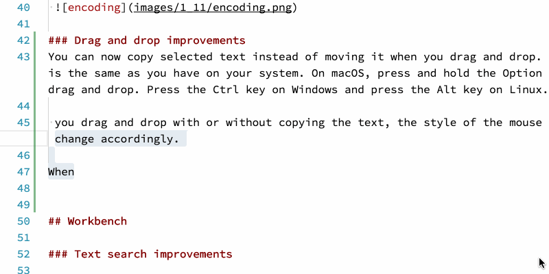
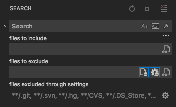
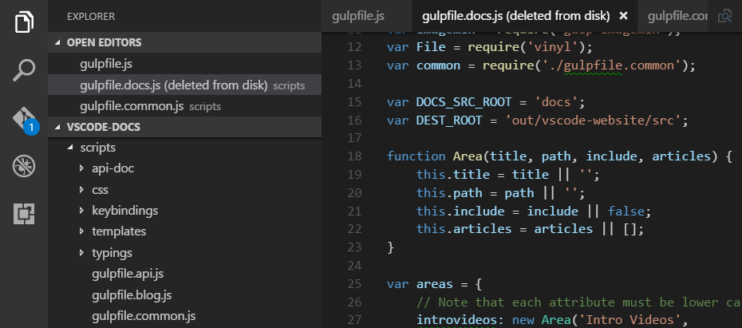
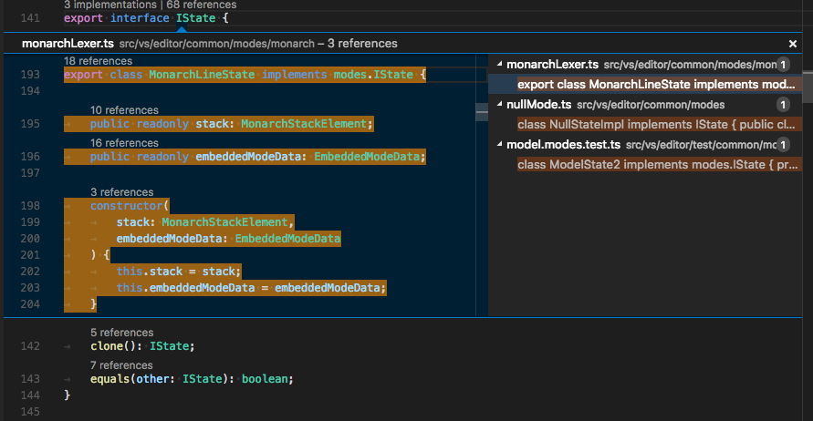

# March 2017 (version 1.11)

Welcome to the March 2017 release of Visual Studio Code. There are a number of significant updates in this version that we hope you will like, some of the key highlights include:

* **[Copy with drag and drop](#drag-and-drop-improvements)** - Choose whether to copy or cut when you drag and drop in the editor.
* **[Faster search](#text-search-improvements)** - Faster text search as well as respecting `.gitignore` files.
* **[Terminal link validation](#integrated-terminal)** - Integrated Terminal link validation and new customization settings.
* **[Implementor CodeLens for TypeScript](#implementation-codelens-for-typescript)** - Quickly see who implements an interface or abstract class.
* **[Async call stacks](#async-call-stacks)** - See async JavaScript call stacks in the debugger.

The release notes are arranged in the following sections related to VS Code focus areas. Here are some further updates:

* **[Editor](#editor)** - Better file encoding detection, set default language mode.
* **[Workbench](#workbench)** - Quickly navigate between and resize views, reveal editor if already open.
* **[Languages](#languages)** -  TypeScript 2.2.2, simplified TypeScript server log collection, Objective-C++ support.
* **[Debugging](#debugging)** - TBD.
* **[Tasks](#task-support)** - TBD.
* **[Extension Authoring](#extension-authoring)** - TBD.

>**Tip:** Want to see new features as soon as possible? You can download the nightly Insiders [build](https://code.visualstudio.com/insiders) and try the latest updates as soon as they are available.

## Editor

### Drag and drop improvements

You can now copy selected text instead of moving it when you drag and drop. The experience is the same as you have on your platform. On macOS, press and hold the `kbstyle(Option)` key while you drag and drop. Press the `kbstyle(Ctrl)` key on Windows and press the `kbstyle(Alt)` key on Linux.

When you drag and drop with or without copying the text, the style of the mouse pointer will change accordingly. You will see a `+` (plus) image when copying.

 

### Auto guess encoding of files

You can now let VS Code guess the encoding of a file automatically via the new `files.autoGuessEncoding` setting which is disabled by default. Once enabled, we will do an attempt at guessing the encoding from the file and use that information if there is a suitable encoding detected.

**Note**: there are cases where the encoding is detected wrongly or not at all. To have full control over the encoding in the workspace, use the `files.encoding` setting instead.

On top of that, if you select the encoding picker on a file to change its encoding, we will now present you the guessed encoding (if any) to the top of that list, making it very easy to pick the right encoding in case the file contents are not showing correctly and we can detect the encoding from the contents:

 

 **Note**: the encoding is guessed, and can be wrong. There is no 100% accurate solution to find the encoding from the contents of a file. The only exception is using a BOM (byte order mark) for UTF-8 or UTF-16 files.

### Set the default language for new files

A new setting `files.defaultLanguage` can be used to set the language mode for new files that are untitled and not saved yet. This setting avoids having to pick the language each time you open a new file if you are often working on the same file type.

## Workbench

### Text search improvements

Search is now powered by the excellent tool [ripgrep](https://github.com/BurntSushi/ripgrep), from Andrew Gallant, AKA [BurntSushi](https://github.com/BurntSushi) and searching should now be significantly faster. If you encounter an issue and need to revert to the previous search experience, you can set the option `"search.useRipgrep": false`.

Our ripgrep-based search can now respect `.gitignore` files as well. Enable it with the new **Use Ignore Files** button in the Search view, or by default with `"search.useIgnoreFilesByDefault": true`.

The gear icon next to it is also new, and toggles whether search will ignore the patterns specified in the `files.exclude` and `search.exclude` settings.

### New setting to keep editor open even when file is deleted

There is a new setting `workbench.editor.closeOnFileDelete` that can be set to `false` to keep editors open even if the file was deleted on disk. Editors will indicate if the file was deleted on disk with their label.

**Note**: Files that get deleted via the Explorer will still cause the editor to close.

### Join editors of two groups

A new command (`workbench.action.joinTwoGroups`) was added to join the editors of one group with the one to the left. This allows to quickly reduce the number of opened editor groups without losing any of the editors inside.

### Navigate between views

New commands have been added to navigate between the visible views of the application. For example, when focus is inside the first editor group, `workbench.action.navigateLeft` will bring you to the Side Bar. Similar, `workbench.action.navigateDown` would move focus to the panel.

### Resize a view with keyboard

New commands are available to resize the currently focused view with the keyboard. Use `workbench.action.increaseViewSize` and `workbench.action.decreaseViewSize` to change the view size in increments.

### New setting to reveal editor if opened

A new setting `workbench.editor.revealIfOpen` can be enabled to prevent opening the same file in another group if the file was already opened. One common scenario is the file picker (Quick Open): by default, it will open a file in the current active Editor Group. Changing this setting will prefer to open the file in any of the other groups in case the file is already opened there.

**Note**: There are still ways that the same editor will open in multiple groups, for example when you click the split editor action.

## Integrated Terminal

### Link improvements

The terminal links feature that was introduced last month got some more polish this version. The experience is now aligned with the editor, requiring `kbstyle(Ctrl)` or `kbstyle(Cmd)` to be held depending on your platform.

Also all links are now validated so only links that actually go somewhere will react to user action.

### Improved start experience on Windows

Unlike on macOS and Linux with their `SHELL` environment variable, Windows doesn't really have a reliable alternative. There is `COMSPEC` but unfortunately it always defaults to the 32-bit variant of Command Prompt and it's seldom modified. To work around this, we've introduced a message when the terminal is first launched on Windows that allows users to select from a set of shells detected on the machine.

### Custom workspace shell settings

In VS Code v1.9, we disallowed workspace settings from configuring the terminal shell as it could have potentially been exploited maliciously. We are now re-allowing this but requiring an explicit user opt-in for each workspace before the settings will be picked up.

### Warn when closing window with active terminal sessions

The new setting `terminal.integrated.confirmOnExit` has been added that presents a confirmation dialog when the window is closing with active terminal sessions. This is disabled by default.

### Resizing horizontally no longer discards data

Thanks to an [upstream PR](https://github.com/sourcelair/xterm.js/pull/616) from [Lucian Buzzo](https://github.com/LucianBuzzo), data is no longer discarded when resizing the terminal prompt horizontally.

## Languages

### TypeScript 2.2.2

VS Code now ships with TypeScript 2.2.2. This release includes a number of important bug fixes and performance improvements. You can find a complete list of changes [here](https://github.com/Microsoft/TypeScript/milestone/40?closed=1).

### Implementation CodeLens for TypeScript

We now include a CodeLens that shows the number of implementors of interfaces and abstract classes in TypeScript code.

Clicking on the CodeLens will display a list of all implementations.

This feature is disabled by default and requires TypeScript 2.2.1+. To enable it, simply add `"typescript.implementationsCodeLens.enabled": true` to your settings.

### Simplified TypeScript server log collection

Added a new `"typescript.tsserver.log"` setting to simplify the collection of logs from the TypeScript server that powers VS Code's TypeScript and JavaScript language support. These logs can be used to debug issues with JS and TS language support, and make it easier for users to provide these logs during issue investigations.

The new logging experience is supported with TypeScript 2.2.2+. Simply set `"typescript.tsserver.log": "verbose"` and reload VS Code to enable logging to a file. Use the `"TypeScript: Open TS Server log"` command to open the log file in the editor.

### Improved support for Objective C++

VS Code now includes an `objective-cpp` language mode for working with Objective-C++. Previously, `.mm` files were treated as regular C++. This release also improves syntax coloring of Objective-C++ files.

## Debugging

### Debug Menu

TODO@isidorn

### Column Breakpoints

TODO@isidorn

## Node Debugging

### Node2 Transitioning

TODO@roblourens

### Async call stacks

When debugging async JavaScript in Node.js or Chrome, we now show the async frames that led to the current call stack. This is currently only supported when debugging with the [inspector protocol](v1_10.md#node2-transitioning) via `"protocol": "inspector"`. It can be disabled by setting `"showAsyncStacks": false` in the launch config.

### Access Loaded Scripts

TODO@weinand

## Task Support

## Extension Authoring

### Api Improvements

* The end of line sequence a document uses (crlf or lf) is now exposed via `TextDocument#eol`. Also, the `TextEdit` allows to change eol-sequence of a document.
* We added these new completion item kinds: `Constant`, `Struct`, and `EnumMember` completing the existing `Enum`-kind.

We have

### Debug Extensions

TODO@weinand

- Exception Info Request
- Adds optional attribute source to the SourceArguments
- Made StoppedEvent's reason attribute robust against translation by introducing a new description attribute.
- Add a new optional attribute presentationHint to the StackFrame type
- Server mode for debug adapters
- Configuration UI (quick pick) for exceptions

## Miscellaneous

## New Commands

Key|Command|Command id
---|-------|----------
`kb(workbench.action.openGlobalSettings)`|Open User Settings|`openGlobalSettings`
`kb(workbench.action.revertAndCloseActiveEditor)`|Revert and Close Active Editor|`workbench.action.revertAndCloseActiveEditor`
`kb(workbench.action.joinTwoGroups)`|Join Editors of Two Groups|`workbench.action.joinTwoGroups`
`kb(workbench.action.navigateUp)`|Move to the View Part Above|`workbench.action.navigateUp`
`kb(workbench.action.navigateDown)`|Move to the View Part Below|`workbench.action.navigateDown`
`kb(workbench.action.navigateLeft)`|Move to the View Part to the Left|`workbench.action.navigateLeft`
`kb(workbench.action.navigateRight)`|Move to the View Part to the Right|`workbench.action.navigateRight`
`kb(workbench.action.increaseViewSize)`|Increase View Size|`workbench.action.increaseViewSize`
`kb(workbench.action.decreaseViewSize)`|Decrease View Size|`workbench.action.decreaseViewSize`

## Notable Changes

* [12077](https://github.com/Microsoft/vscode/issues/12077): File does not reload in editor when quickly changed externally after making modifications
* [13001](https://github.com/Microsoft/vscode/issues/13001): Keep scroll position stable when closing a tab
* [13665](https://github.com/Microsoft/vscode/issues/13665): Improve VS Code when working with network drives
* [14286](https://github.com/Microsoft/vscode/issues/14286): Terminal.processId doesn't seem to be working on Windows
* [19841](https://github.com/Microsoft/vscode/issues/19841): Node debug Step Over/Into hangs in 1.9
* [20074](https://github.com/Microsoft/vscode/issues/20074): VSCode default language extensions override custom language extensions
* [21948](https://github.com/Microsoft/vscode/issues/21948): Auto save no longer works
* [22971](https://github.com/Microsoft/vscode/issues/22971): Run the terminal as a login shell by default on macOS
* [22997](https://github.com/Microsoft/vscode/issues/22997): Execute node.js application in external terminal throws error
* [23494](https://github.com/Microsoft/vscode/issues/23494): Debugger does not work with electron v1.6.x

These are the [closed bugs](https://github.com/Microsoft/vscode/issues?q=is%3Aissue+label%3Abug+milestone%3A%22March+2017%22+is%3Aclosed) and these are the [closed feature requests](https://github.com/Microsoft/vscode/issues?q=is%3Aissue+milestone%3A%22March+2017%22+is%3Aclosed+label%3Afeature-request) for the 1.10 update.

## Contributions to Extensions

Our team maintains or contributes to a number of VS Code extensions. Most notably:

* [Go](https://marketplace.visualstudio.com/items?itemName=lukehoban.Go)
* [TSLint](https://marketplace.visualstudio.com/items?itemName=eg2.tslint)
* [ESLint](https://marketplace.visualstudio.com/items?itemName=dbaeumer.vscode-eslint)
* [Docker](https://marketplace.visualstudio.com/items?itemName=PeterJausovec.vscode-docker)
* [Debugger for Chrome](https://marketplace.visualstudio.com/items?itemName=msjsdiag.debugger-for-chrome)
* [Mono Debug](https://marketplace.visualstudio.com/items?itemName=ms-vscode.mono-debug)
* [VSCodeVim](https://marketplace.visualstudio.com/items?itemName=vscodevim.vim)

## Thank You

Last but certainly not least, a big *__Thank You!__* to the following folks that helped to make VS Code even better:

Contributions to `vscode`:

Contributions to `vscode-chrome-debug-core`:

* [Manoj Patel (@nojek)](https://github.com/nojvek)
  * Support source mapping of stack traces in the Debug Console (and exception widget) [PR #190](https://github.com/Microsoft/vscode-chrome-debug-core/pull/190)
  * Nicer error messages when a source map fails to parse [PR #188](https://github.com/Microsoft/vscode-chrome-debug-core/pull/188)
* [Daniel Lebu (@dlebu)](https://github.com/dlebu): Allowing upper case drive letters when handling script URLs. [PR #176](https://github.com/Microsoft/vscode-chrome-debug-core/pull/176)

Contributions to `vscode-eslint`:

Contributions to `language-server-protocol`:

* [Lucian Wischik (@ljw1004)](https://github.com/ljw1004): DidChange might only have new text [PR #168](https://github.com/Microsoft/language-server-protocol/pull/198)

Contributions to `vscode-languageserver-node`:

* [Guillaume Martres (@smarter)](https://github.com/smarter): client: Pass all arguments to ExecuteCommandRequest [PR #172](https://github.com/Microsoft/vscode-languageserver-node/pull/172)
* [Hyo Jeong (@asiandrummer)](https://github.com/asiandrummer): export SocketMessage reader/writer [PR #185](https://github.com/Microsoft/vscode-languageserver-node/pull/185)

Contributions to `vscode-languageserver-node-example`:

Contributions to `vscode-html-languageservice`:

<!-- In-product release notes styles.  Do not modify without also modifying regex in gulpfile.common.js -->
<a id="scroll-to-top" role="button" aria-label="scroll to top" href="#"></a>
<link rel="stylesheet" type="text/css" href="css/inproduct_releasenotes.css"/>
