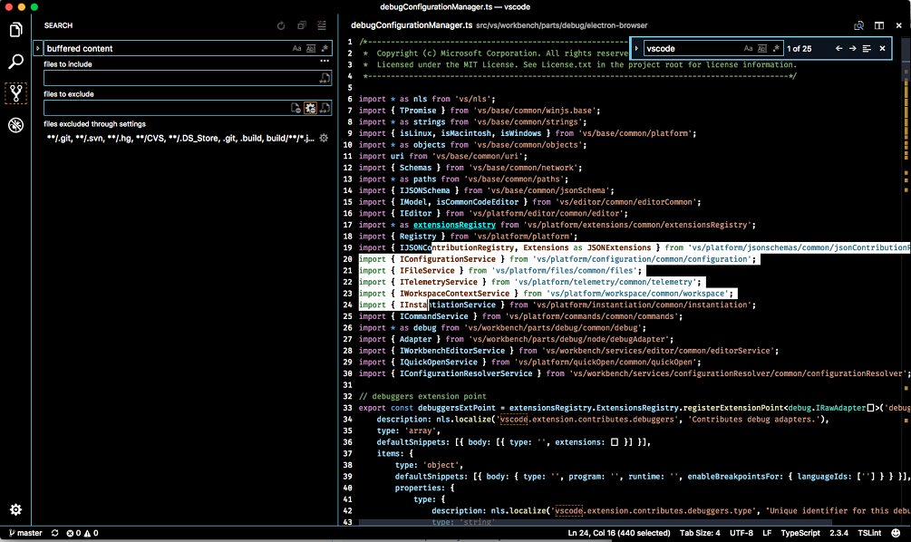
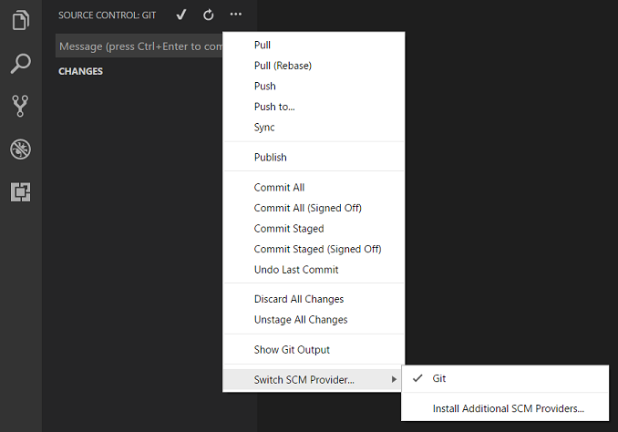
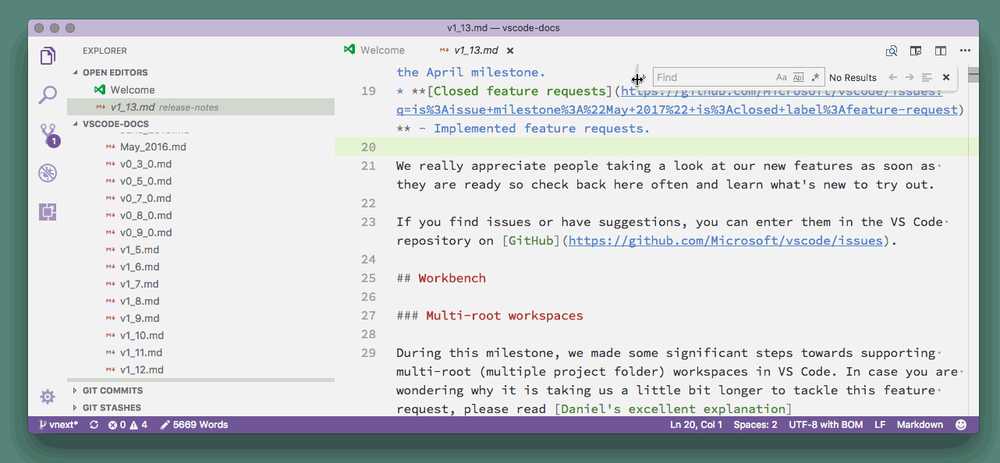
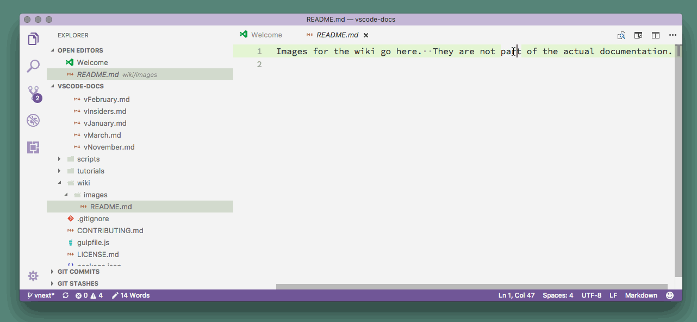
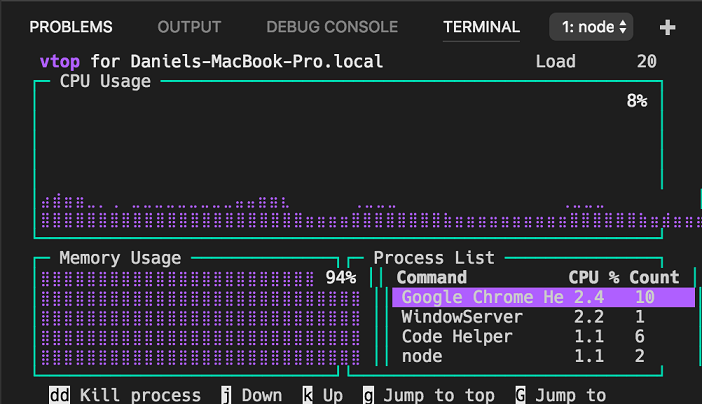
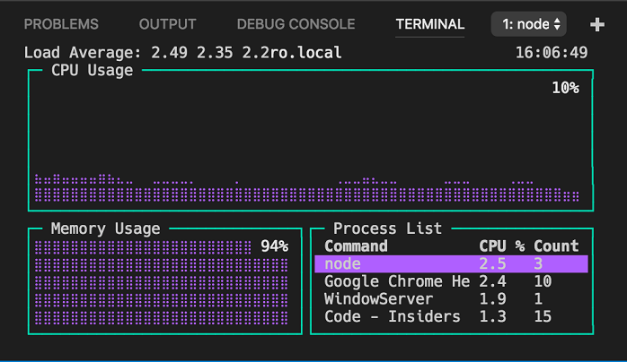
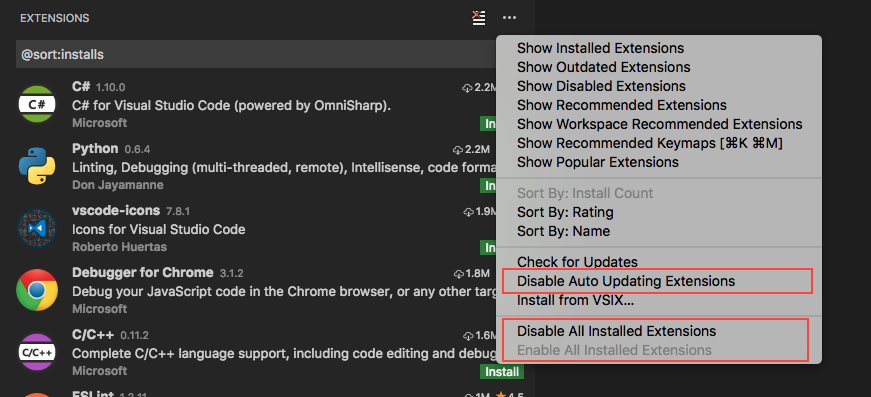
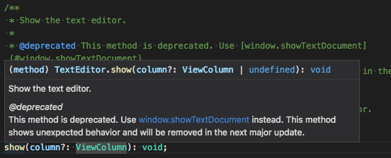
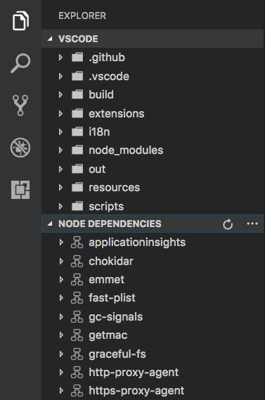

---
Order: 22
TOCTitle: May 2017
PageTitle: Visual Studio Code May 2017
MetaDescription: See what is new in the Visual Studio Code May 2017 Release (1.13)
MetaSocialImage: 1_13_release-highlights.png
---
# May 2017 (version 1.13)

## Insiders Release

Welcome to the Insiders build. These are the preliminary notes for the May 1.13 release of Visual Studio Code. As we get closer to the release date, you'll see details below about new features and important fixes.

Until the May release notes are available, you can still track our progress:

* **[May Iteration Plan](https://github.com/Microsoft/vscode/issues/26068)** - See what's planned for the milestone.
* **[Commit Log](https://github.com/Microsoft/vscode/commits/master)** - GitHub commits to the vscode open source repository.
* **[Closed bugs](https://github.com/Microsoft/vscode/issues?q=is%3Aissue+label%3Abug+milestone%3A%22May+2017%22+is%3Aclosed)** - Resolved bugs in the April milestone.
* **[Closed feature requests](https://github.com/Microsoft/vscode/issues?q=is%3Aissue+milestone%3A%22May+2017%22+is%3Aclosed+label%3Afeature-request)** - Implemented feature requests.

We really appreciate people taking a look at our new features as soon as they are ready so check back here often and learn what's new to try out.

If you find issues or have suggestions, you can enter them in the VS Code repository on [GitHub](https://github.com/Microsoft/vscode/issues).

## Workbench

### Multi-root workspaces

During this milestone, we made some significant steps towards supporting multi-root (multiple project folder) workspaces in VS Code. In case you are wondering why it is taking us a little bit longer to tackle this feature request, please read [Daniel's excellent explanation](https://github.com/Microsoft/vscode/issues/396#issuecomment-301842430).

We focused on UX and sketched up how we could provide this feature with our current architecture without introducing too many new concepts. After sharing the designs with the engineering team, we ran 2 user studies to validate our assumptions. We encourage you to watch the recordings of these studies if you are interested and provide feedback:

* group 1: [https://youtu.be/48Y6tB3DN1g](https://youtu.be/48Y6tB3DN1g)
* group 2: [https://youtu.be/kHL6Rt-dLm0](https://youtu.be/kHL6Rt-dLm0)

With the UX work behind us, we feel that we can finally start implementing this feature request. Thanks for your patience!

### Theming

We received a lot of feedback for our workbench theming support and are happy to see more and more themes adopting the workbench colors! During this milestone, we added some new colors as well as did some tweaks to existing colors.

These colors can be set by themes or by the user with the `workbench.colorCustomizations` setting.

New workbench colors introduced:

Key|Description
---|-------
`selection.background`|The background color of text selections in the workbench (for input fields or text areas). Note that this does not apply to selections within the editor and the terminal.
`input.placeholderForeground`|Input box foreground color for placeholder text.
`list.inactiveSelectionForeground`|List/Tree foreground color for the selected item when the list/tree is inactive. An active list/tree has keyboard focus, an inactive does not.
`list.hoverForeground`|List/Tree foreground when hovering over items using the mouse.
`list.focusForeground`|List/Tree foreground color for the focused item when the list/tree is active. An active list/tree has keyboard focus, an inactive does not.
`badge.foreground`|Badge foreground color. Badges are small information labels, for example, search results count.
`badge.background`|Badge background color.
`progressBar.background`|Background color of the progress bar shown for long running operations.
`sideBar.foreground`|Side Bar foreground color. The Side Bar is the container for views like Explorer and Search.
`sideBar.border`|Side Bar border color on the side separating the editor.
`sideBarSectionHeader.foreground`|Side Bar section header foreground color.
`statusBar.border`|Status Bar border color separating the Status Bar and editor. The Status Bar is at the bottom of the window.
`statusBar.debuggingForeground`|Status Bar foreground color when a program is being debugged.
`statusBar.noFolderForeground`|Status Bar foreground color when no folder is opened.
`activityBar.border`|Activity Bar border color with the Side Bar. The Activity Bar is on the far left or right and lets you switch between views of the Side Bar.
`extensionButton.prominentForeground`|Extension view button foreground color (for example **Install** button).
`extensionButton.prominentBackground`|Extension view button background color.
`extensionButton.prominentHoverBackground`|Extension view button background hover color.
`errorForeground`|Overall foreground color for error messages. This color is only used if not overridden by a component.
`tab.unfocusedActiveForeground`|Active tab foreground color in an inactive editor group.
`tab.unfocusedInactiveForeground`|Inactive tab foreground color in an inactive editor group.
`editorGroupHeader.tabsBorder`|Border color of the editor group title header when tabs are enabled. Editor groups are the containers of editors.
`welcomePage.buttonBackground`|Background color for the buttons on the Welcome page.
`welcomePage.buttonHoverBackground`|Hover background color for the buttons on the Welcome page.
`walkThrough.embeddedEditorBackground`|Background color for the embedded editors on the Interactive Playground.
`terminal.background`|The background of the Integrated Terminal's viewport.
`terminal.foreground`|The default foreground color of the Integrated Terminal.

New editor colors introduced:

Key|Description
---|-------
`editorCodeLens.foreground`|Foreground color of an editor CodeLens.
`editorBracketMatch.background`|Background color behind matching brackets.
`editorBracketMatch.border`|Color for matching brackets boxes.
`editorRuler.foreground`|Color of the editor rulers.
`editorOverviewRuler.border`|Color of the overview ruler border.
`editorWidgetBorder`|Border color of the editor widget.
`editorError.foreground`|Foreground color of error squiggles in the editor.
`editorError.border`|Border color of error squiggles in the editor.
`editorWarning.foreground`|Foreground color of warning squiggles in the editor.
`editorWarning.border`|Border color of warning squiggles in the editor.
`peekViewEditorGutter.background`|Background color of the gutter in the peek view editor.
`editorGutter.background`|Background color of the editor gutter. The gutter contains the glyph margins and the line numbers.
`editorGutter.modifiedBackground`|Editor gutter background color for lines that are modified.
`editorGutter.addedBackground`|Editor gutter background color for lines that are added.
`editorGutter.deletedBackground`|Editor gutter background color for lines that are deleted.
`merge.currentHeaderBackground`|Current header background in inline merge conflicts.
`merge.currentContentBackground`|Current content background in inline merge conflicts.
`merge.incomingHeaderBackground`|Incoming header background in inline merge conflicts.
`merge.incomingContentBackground`|Incoming content background in inline merge conflicts.
`merge.border`|Border color on headers and the splitter in inline merge conflicts.
`editorOverviewRuler.currentContentForeground`|Current overview ruler foreground for inline merge conflicts.
`editorOverviewRuler.incomingContentForeground`|Incoming overview ruler foreground for inline merge conflicts.

Existing color behavior changes:

Key|Description
---|-------
`panel.border`|Now overwrites the value of `contrastBorder`, allowing a more specific color if `contrastBorder` is set.
`tab.border`|Now overwrites the value of `contrastBorder`, allowing a more specific color if `contrastBorder` is set.
`editorGroup.border`|Now overwrites the value of `contrastBorder`, allowing a more specific color if `contrastBorder` is set.
`list.*`|All list colors can now be set even in the presence of `contrastBorder` and `contrastActiveBorder`.

### High Contrast theme

We have improved the High Contrast theme to include more token colors and to use selection and Status Bar colors for clearer contrast.



### Preserving view state for resource editors

We are now preserving the view state for resource editors when you switch between them. This comes in handy when debugging internal modules since we now preserve the scroll position and all other view data for internal module editors. However, we always clear the view state when a user closes the editor.

### Disable menu bar mnemonics

A new setting `window.enableMenuBarMnemonics` was added to disable all mnemonics (hot keys) in the menu bar (on Windows and Linux). This frees up some `kbstyle(Alt+)` keyboard shortcuts to bind to other commands.

### Install Additional SCM Providers

We have introduced a new command **Install Additional SCM Providers...** to make it easier to discover and install SCM providers from the VS Code Marketplace. The command is available under the **Switch SCM Provider...** command in the Source Control view and **SCM: Switch SCM Provider** in the **Command Palette**.



### Filenames in symbol search results

You can use workspace symbol search (`kb(workbench.action.showAllSymbols)`) to quickly find symbols in your workspace. The list of results now includes the filename of each symbol:


### Go to Implementation and Go to Type Definition added to the Go Menu

The **Go** menu now includes the **Go to Implementation** and **Go to Type Definition** commands:


## Editor

### Adding multiple cursors with Cmd + Click (OSX) or Ctrl + Click (Windows and Linux)

We have introduced a new setting, `editor.multiCursorModifier`, which can be set to `ctrlCmd` or `alt` to change the modifier key for adding multiple cursors. There's also a new menu item in the **Selection** menu to quickly toggle this setting.

The **Go To Definition** and **Open Link** gestures will also respect this setting, and adapt such that they do not conflict. e.g. When the setting is `ctrlCmd`, multiple cursors can be added with `kbstyle(Ctrl/Cmd + Click)`, and opening links or going to definition can be invoked with `kbstyle(Alt + Click)`.

With fixing [Issue #2106](https://github.com/Microsoft/vscode/issues/2106), it is now possible to also remove a cursor by using the same gesture on top of an existing selection.

### Multi-cursor Snippets

You can finally combine snippets and multiple cursors. In addition, you also now nest snippets, meaning you can add a placeholder of a snippet within another snippet and their placeholders will be merged.


### Strict Snippets

Snippets can have placeholders and variables. The snippet syntax is defined [here](https://code.visualstudio.com/docs/editor/userdefinedsnippets#_snippet-syntax) where `$1, $2...` are tabstops and `$varName1, $varName2...` are variables. Note that they can only differ by what follows the `$`-sign, numbers are tabstops and words refer to variables. Prior to this milestone, VS Code was using an internal syntax for snippets. Textmate-style snippets were rewritten to the internal syntax and there was an unfortunate bug that caused variables to be turned into tabstops. This is what we have done to ensure a smooth transition:

* When we encounter snippets that use variables we don't [know](https://code.visualstudio.com/docs/editor/userdefinedsnippets#_variables), we turn them into placeholders and warn the extension author (not the end user).
* Also, we log a telemetry event so can make issues/PRs against extensions that are using this unfortunate construct.

In the future, you can expect us to continue to support these types of snippets for a little longer. Snippets fall into two categories; those that the user created and those that come from an extension. We will be strict on extension snippets while keeping support for user created snippets.

### Folding Controls

The visibility of the folding controls next to the line numbers can now be configured by the setting `editor.showFoldingControls`:

* `mouseover`: The existing behavior where controls for non-collapsed regions are hidden unless the mouse is over the editor gutter.
* `always`: Folding controls are always shown.

### Find widget

You can now resize the Find widget horizontally. You can review the full text easily if it's longer than the original width of the Find widget.



Also you can now scroll beyond the first line when the Find widget is visible and the Find widget won't cover the matched results. We'll automatically scroll the window a little bit to make sure the matched results are not covered by the Find widget when you are navigating between them.



We introduced two settings to help you customize the Find widget behaviors:

* You can now set `editor.find.seedSearchStringFromSelection` to `false` if you don't want to seed the search string in Find widget from current editor selection.
* You can set `editor.find.autoFindInSelection` to `true` and then Find in Selection flag is turned on when multiple characters or lines of text are selected in the editor.

We also added a new command `toggleFindInSelection` (`kb(list.focusFirstChild)`) to toggle Find In Selection so you can keep your hands on the keyboard when switching all Find options.

### Merge Conflict coloring and actions

Inline merge conflicts are now colored and come with actions to accept either or both of the changes. Previously available as the popular Better Merge extension, this functionality is now built-in. Thanks to [Phil (@pprice)](https://github.com/pprice), the author of Better Merge, for the PR.


### Letter spacing

Thanks to [@hoovercj](https://github.com/hoovercj) in [PR #22979](https://github.com/Microsoft/vscode/pull/22979), there is a new editor setting, `editor.letterSpacing`, similar to the CSS letter-spacing property:


### Suggestion list and docs side by side

You can now view the docs for the suggestion item in focus side by side to the suggestion list. Once the suggestion list is triggered, press `kb(editor.action.triggerSuggest)` to view the docs for the suggestion item in focus as before. The docs will now expand to the side instead of getting overlaid on the suggest widget, enabling you to see the docs and navigate the list at the same time.

Once the docs are expanded, they stay expanded (across VS Code windows, sessions and updates) until you explicitly close them either using the close button or by pressing `kb(editor.action.triggerSuggest)` again.

For keyboard centric users, who want to navigate up and down the long docs, press `kb(editor.action.triggerSuggestionFocus)` to move the focus to the docs such that it can now recieve keyboard shortcuts for Page Up/Down actions.

For screenreader users, once the docs are expanded, navigating the suggestion list will read out the label and docs (if any) of the item in focus.

## Integrated Terminal

### Dragging files to the terminal to paste path

You can now drag files and folder from the sidebar explorer and files from your OS file manager to paste the path name into the terminal.

### Unicode character width improvements

Unicode characters in the Integrated Terminal are now sized explicitly which means that applications like [vtop](https://www.npmjs.com/package/vtop) which make extensive use of these characters should now render correctly.

Before:



After:



## Tasks

### Using the terminal with tasks version 0.1.0

You can now use tasks with the Integrated Terminal as the execution engine. To do so, add the `runner` property to the main section of the `tasks.json` file.

```ts
{
  "version": "0.1.0",
  "runner": "terminal",
  ...
}
```

If you want to switch back to the old runner remove the property or set its value to `"process"`.

### Task version 2.0.0

You can opt into task version 2.0.0 by changing the version number of `tasks.json` file to `"2.0.0"`. If you don't have a `tasks.json` and are fully relying on task autodetection, you can simply create a `tasks.json` file with the following minimal content:

```json
{
  "version": "2.0.0"
}
```

### Jake task autodetection

Jake autodetection has been implemented for the `2.0.0` version of tasks. In contrast to the `0.1.0` version of tasks, the new autodedections handle all task runners in parallel. So if a workspace has a Gulp and a Jake file, both task runners are detected and their tasks are listed in the task selection dialog when executing the `Run Task` command.

### Package.json scripts autodetection

Scripts defined inside a `package.json` file are now detected as tasks.

### Task selection dialog

The task selection dialog now separates workspace tasks from tasks defined in the `tasks.json` file. Assume a workspace with a gulp file defining a `build` and a `watch` task and a `Deploy` task defined in `task.json`. The task selection dialog looks like this:


### Configuring a detected task

When the system detects a task (for example, a build task provided through a gulp file), it usually doesn't know which problem matchers to associate with the task. You can customize the detected task inside the `tasks.json` file. To do so, press the gear icon to the right of a detected task. This will insert a section into the `tasks.json` file where you can customize the detected task.


The video above shows how to customize the gulp `build` task by adding the TypeScript problem matcher (named `$tsc`) to it and by renaming it to `My Main Build`. Executing the task `My Main Build` still executes the `build` task provided by gulp and autodetected by VS Code.

### Task API

We further enhanced and polished the task API. We left the API as proposed (see [vscode.proposed.d.ts](https://github.com/Microsoft/vscode/blob/master/src/vs/vscode.proposed.d.ts#L13)) to allow for another round of feedback from the community.

## Debugging

### Improved stepping performance

Per a [user recommendation](https://github.com/Microsoft/vscode/issues/25605) we've improved stepping performance by fetching parts of the call stack and the corresponding variables lazily, only if the user has not already requested the next "step" operation. With this change VS Code will always fetch the top frame of the stack in order to be able to show the correct source for the current location. But the rest of the stack will be updated only if the user has not continued stepping for 0.4 seconds.

This improves stepping performance considerably as you can see in the following screen recordings of the (rather large) [Typescript compiler](https://github.com/Microsoft/TypeScript).

Old behavior - Always fetch full call stack:


New behavior -Fetch rest of the call stack lazily:


### Copy All action in Debug Console

It is now possible to copy all the content from the Debug Console using the **Copy All** context menu action. More details about what motivated this change can be found [here](https://github.com/Microsoft/vscode/issues/2163).


### File Link Detection in Exception Peek UI

When an exception occurs in a code, it is a common scenario to follow through an exception stack trace to understand what led to it. We added a mechanism to detect links in a stack trace returned by the debug adapter. This allows you to jump to your code straight from the exception UI. Moreover, it also improved existing link detection in a debug console, fixing some of the user submitted bugs.


### New Setting `debug.internalConsoleOptions`

It is now possible to control the behaviour of the Debug Console using the setting `debug.internalConsoleOptions`. Previously this setting was only available in `launch.json`, however by [user request](https://github.com/Microsoft/vscode/issues/18398) it is now possible to also specify this in user and workspace settings. The setting in `launch.json` takes precedence if both are provided.

### Recipes for non-standard Debugging Scenarios

Setting up Node.js debugging can be challenging for some non-standard or complex scenarios. With this release we've started to collect recipes for these scenarios in a new [repository](https://github.com/weinand/vscode-recipes).

A first recipe covers [Debugging TypeScript in a Docker Container](https://github.com/weinand/vscode-recipes/tree/master/Docker-TypeScript).

## Node Debugging

### Local/remote path mapping now supported for "launch" configurations

To facilitate remote debugging, VS Code already supports mapping JavaScript paths between a local VS Code project and a (remote) location by means of the `localRoot` and `remoteRoot` attributes. Because remote debugging typically involves "attaching" to a remote target, the `localRoot` and `remoteRoot` attributes were only available for launch configurations of request type "attach".

Recently we've opened up launch configurations of request type "launch" to launch arbitrary programs and scripts (and not just the local Node.js target to debug). With this it has become possible to launch a remote node target (e.g. in a Docker container) and have the VS Code Node Debugger attach to it. This feature diminishes the difference between "launching" and "attaching" even further and it makes sense to support `localRoot` and `remoteRoot` attributes for launch configurations of request type "launch" as well (in addition to request type "attach").

You can find an example for this in the [Debugging TypeScript in a Docker Container](https://github.com/weinand/vscode-recipes/tree/master/Docker-TypeScript#further-simplifying-the-debugging-setup) recipe.

## Extensions

### Enable / Disable commands

There are two new commands in the **Extensions** view context menu to help quickly manage your extensions:

- Enable / Disable All Installed Extensions
- Enable / Disable Auto Updating Extensions



## Languages

### Syntax coloring for JSX/TSX components

In React JSX and TSX files, component classes are now colored differently than normal HTML elements:


### Additional JSDoc tags in hover and suggestions

JSDoc tags such as `@deprecated` and `@private` are now displayed in hover and suggestions documentation.



### Open TS Server Log reveals log folder

The **TypeScript: Open TS Server Log** command now reveals the TypeScript log directory on your operating system instead of trying to open the log file in VS Code. This is useful for collecting the additional typings installer log files generated alongside the main `tsserver.log` file.

### Markdown preview preserves scroll position

The Markdown preview, along with other webview based views such as the release notes, will now preserve the scroll position when switching between editors. Previously, navigating away from the Markdown Preview and then returning to it caused the scroll position to be reset.

### Warnings for missing Markdown preview styles

We now display a warning message if any of the stylesheets from `markdown.styles` used in the preview cannot be found.

### Markdown symbol search includes heading levels

You can quickly jump to a heading in a Markdown file using **Go to Symbol in File...** (`kb(workbench.action.gotoSymbol)`). This list now includes the heading level of each symbol, which allows you to quickly filter results by heading level.


## Extension Authoring

### Custom views

There has been a popular request to customize VS Code to show custom data views, for example a `Node Dependencies` view. With this release, you can now write extensions to VS Code contributing such views. Currently custom views are shown only in Explorer. In future, we will support displaying them in other places too.



Contributing a view is as simple as follows:

* Contribute a view using the [views](/docs/extensionAPI/extension-points.md#contributesviews) extension point.
* Register a data provider for the view using the [TreeDataProvider](/docs/extensionAPI/vscode-api.md#TreeDataProvider) API.
* Contribute actions to the view using `view/title` and `view/item/context` locations in [menus](/docs/extensionAPI/extension-points.md#contributesmenus) extension point.

You can refer to examples in our [Samples repository](https://github.com/Microsoft/vscode-extension-samples/tree/master/tree-view-sample).

### Debugger extensions

**New enum value `subtle` for the `presentationHint` attribute of type `StackFrame`**

A debug adapter can flag a stack frame with the presentation hint `subtle` in order to receive an alternative "subtle" rendering.

**Extended type for `TerminatedEvent.body.restart` attribute**

The type of the `TerminatedEvent.body.restart` attribute has been extended from `boolean` to `any`. This makes it possible to loop arbitrary data from one debug session to the next (restarted) debug session.

**`evaluateName` attribute mandatory for `Add to Watch` and `Copy Value` actions**

VS Code previously tried to implement the **Add to Watch** and **Copy Value** actions by using the data from the **VARIABLES** view and a JavaScript-biased heuristic for building expressions that can be used with the evaluate request.

Since this approach does not work for all languages, we've introduced the `evaluateName` attribute for variables some time ago. It is now mandatory for debug adapters to support the `evaluateName` attribute if they want that **Add to Watch** and **Copy Value** actions work properly.

### Glob patterns for `workspaceContains` activation event

Thanks to [@eamodio](https://github.com/eamodio), with [PR #24570](https://github.com/Microsoft/vscode/pull/24570), it is now possible to activate an extension when a folder is opened that contains at least one file that matches a glob pattern.

For example, an extension with the `package.json`:

```json
{
  ...
  "activationEvents": [
    "workspaceContains:**/.editorconfig"
  ]
}
```

will be activated when a folder is opened and any of its sub-folders contains a file named `.editorconfig`.

### Defining a language's word pattern in the language configuration file

Thanks to [@hoovercj](https://github.com/hoovercj), with [PR #22478](https://github.com/Microsoft/vscode/pull/22478), it is possible to specify a language's word pattern using `wordPattern` in the language configuration file. This used to be possible before only by invoking `vscode.languages.setLanguageConfiguration(...)`.

### Better control decorations in the editor

Thanks to [@CoenraadS](https://github.com/CoenraadS), with [PR #25776](https://github.com/Microsoft/vscode/pull/25776), it is now possible to configure the behavior of decorations when typing/editing at their edges. This can be configured with the `DecorationRenderOptions.rangeBehaviour` field.

### Reference theme colors from extensions

You can now use reference theme colors in decorators and for the Status Bar foreground. Using theme colors instead of actual color values is the preferred way as it lets themes and users customize the colors.

```typescript
  var decorationType = vscode.window.createTextEditorDecorationType({
      before: {
          contentText: "\u26A0",
          color: new vscode.ThemeColor('editorWarning.foreground')
      }
  });
```


You find the a list of all known theme colors [here](https://code.visualstudio.com/docs/getstarted/theme-color-reference).

## Accessibility

### Better NVDA support

Sometimes, when using arrow keys, some lines or characters would be repeated by NVDA (see [Issue #26730](https://github.com/Microsoft/vscode/issues/26730)). Thanks to [James Teh](https://github.com/jcsteh), one of the co-founders of NV Access, we now understand the root cause (a timeout of 30ms, which we sometimes miss). James has a [PR on NVDA](https://github.com/nvaccess/nvda/pull/7201) where he is changing the default timeout to 100ms and making it configurable. Until a new NVDA version is shipped, thanks to [Derek Riemer](https://github.com/derekriemer), there is an [NVDA plugin](https://files.derekriemer.com/globalEditorTimer-1.0.nvda-addon) that increases the timeout from 30ms to 200ms. We have also done some changes on our side to reduce the likelihood that we miss the 30ms timeout:

### "Screen Reader Detected"

We are now leveraging [Electron APIs](https://github.com/electron/electron/blob/master/docs/api/app.md#event-accessibility-support-changed-macos-windows) to react and optimize VS Code when working with a Screen Reader. Whenever Electron identifies that a Screen Reader is attached, we will display a message in the Status Bar and:

* Remove the Line Number and Column indicator from the Status Bar, as we have found updating these indicators causes a myriad of accessibility events that end up confusing screen readers.
* Disable word wrapping, as when pressing arrow down for example, screen readers expect the cursor to move to the next line and not to a column to the right on the same line.
* Mirror the current page of text in the editor synchronously to the `<textarea>` we use for input events.
* Disable certain stylistic features to increase the likelihood that we make it within the 30ms accessibility event timeout. We typically do not spend more than ~4-5ms processing the arrow keys, but with these features disabled, the time spent is reduced to ~1-2ms. The rest of the time is spent by our platform in *figuring out* what happened and emitting the correct accessibility events.

> Detecting Screen Readers is non-trivial, so, if you notice the "Screen Reader Detected" Status Bar message and do not have a screen reader attached, you can change the setting `editor.accessibilitySupport` from `"auto"` to `"off"`.

## Miscellaneous

### New crash report handling

We have improved the VS Code crash reporting. VS Code uses Electron's built-in crash reporter to capture and analyze crash data to make VS Code and Electron itself better. If VS Code crashes, a dump is collected and sent to us, though [you can always turn this off](https://code.visualstudio.com/docs/supporting/faq#_how-to-disable-crash-reporting).

This worked well, but it was a time consuming task for us to analyze and understand a crash. Microsoft has a good crash reporting service called [HockeyApp](https://hockeyapp.net/) and we now have enabled HockeyApp for crash reporting. To enable it, we had to produce our own build of Electron because the built-in crash reporter sends data in a format HockeyApp does not understand. The changes are on top of Electron 1.6.6 where the crash reporter talks to the HockeyApp service.

If you build VS Code from source, you will continue to pull in the GitHub version of Electron. We will continue collaborating with the other Electron contributors to make the crash reporting service pluggable, so that anyone can easily use HockeyApp (or any other service).

## New Commands

Key|Command|Command id
---|-------|----------
`kb(list.focusFirstChild)`|Select first child of currently selected item's parent in tree/lists|`list.focusFirstChild`
`kb(list.focusLastChild)`|Select last child of currently selected item's parent in tree/lists|`list.focusLastChild`
`kb(merge-conflict.next)`|Next Merge Conflict|`merge-conflict.next`
`kb(merge-conflict.previous)`|Previous Merge Conflict|`merge-conflict.previous`
`kb(merge-conflict.accept.selection)`|Accept Selection|`merge-conflict.accept.selection`
`kb(merge-conflict.accept.current)`|Accept Current|`merge-conflict.accept.current`
`kb(merge-conflict.accept.incoming)`|Accept Incoming|`merge-conflict.accept.incoming`
`kb(merge-conflict.accept.both)`|Accept Both|`merge-conflict.accept.both`
`kb(merge-conflict.accept.all-both)`|Accept All Both|`merge-conflict.accept.all-both`
`kb(merge-conflict.accept.all-current)`|Accept All Current|`merge-conflict.accept.all-current`
`kb(merge-conflict.accept.all-incoming)`|Accept All Incoming|`merge-conflict.accept.all-incoming`
`kb(merge-conflict.compare)`|Compare|`merge-conflict.compare`

# Contributions to Extensions

Our team maintains or contributes to a number of VS Code extensions. Most notably:

* [ESLint](https://marketplace.visualstudio.com/items?itemName=dbaeumer.vscode-eslint): Major performance improvements to lower CPU load when linting large JS files with lots of code actions (e.g. auto fix suggestions).

## Notable Changes

* [25789](https://github.com/Microsoft/vscode/issues/25789): Can't split file when dragging from Explorer
* [19644](https://github.com/Microsoft/vscode/issues/19644): Cursor does not go to the maximum line column when pressing "End" twice with word wrap enabled
* [6661](https://github.com/Microsoft/vscode/issues/6661): Ctrl+D/Cmd+D merges adjacent selections.
* [4271](https://github.com/Microsoft/vscode/issues/4271): Mac Insert Emoji Duplicates Text
* [3623](https://github.com/Microsoft/vscode/issues/3623): Match whole word does not work for not latin characters (at least for cyrillic)
* [17534](https://github.com/Microsoft/vscode/issues/17534): Search: not possible to remove individual search results in a file
* [16580](https://github.com/Microsoft/vscode/issues/16580): Unable to write to settings should offer an action to open settings
* [17609](https://github.com/Microsoft/vscode/issues/17609): Line wrapping problem in bash on ubuntu on windows
* [23484](https://github.com/Microsoft/vscode/issues/23484): "Ctrl +click to follow link" hover appears only on the last link in the terminal
* [25664](https://github.com/Microsoft/vscode/issues/25664): Terminal panel is not properly restored after restarting

## Thank You

Last but certainly not least, a big *__Thank You!__* to the following folks that helped to make VS Code even better:

Contributions to `vscode`:

* [actboy168 (@actboy168)](https://github.com/actboy168): Fix lua function colorizing error [PR #26880](https://github.com/Microsoft/vscode/pull/26880)
* [Andy (@andy-ms)](https://github.com/andy-ms):  Remove unnecessary parentheses [PR #25573](https://github.com/Microsoft/vscode/pull/25573)
* [@ashirley](https://github.com/ashirley): Add git.commitType configuration [PR #25855](https://github.com/Microsoft/vscode/pull/25855)
* [Bradley Meck (@bmeck)](https://github.com/bmeck):  Add .mjs to known JavaScript file extensions [PR #25747](https://github.com/Microsoft/vscode/pull/25747)
* [Bugra Cuhadaroglu (@BugraC)](https://github.com/BugraC):  Fix - #24242 #24550 [PR #25756](https://github.com/Microsoft/vscode/pull/25756)
* [@CoenraadS](https://github.com/CoenraadS):  Expose Stickiness API #15758 [PR #25776](https://github.com/Microsoft/vscode/pull/25776)
* [David Lechner (@dlech)](https://github.com/dlech):  Add .git/subtree-cache/ to files.watcherExclude [PR #26665](https://github.com/Microsoft/vscode/pull/26665)
* [Eric Amodio (@eamodio)](https://github.com/eamodio):  Fixes #944 - Support wildcards on activationEvents.workspaceContains [PR #24570](https://github.com/Microsoft/vscode/pull/24570)
* [Cody Hoover (@hoovercj)](https://github.com/hoovercj)
  *  Add letterSpacing to config to address #18715 [PR #22979](https://github.com/Microsoft/vscode/pull/22979)
  *  Addresses #14221 by reading wordPattern from language-configuration.json [PR #22478](https://github.com/Microsoft/vscode/pull/22478)
* [Yu-Hsin Hung (@hungys)](https://github.com/hungys):  Fix for terminal.foreground not working [PR #26788](https://github.com/Microsoft/vscode/pull/26788)
* [Ilie Halip (@ihalip)](https://github.com/ihalip)
  *  added config option git.cloneDirectory, defaulting to os.homedir() [PR #24950](https://github.com/Microsoft/vscode/pull/24950)
  *  Allow changing a SourceControlResourceGroup's label [PR #25983](https://github.com/Microsoft/vscode/pull/25983)
* [Yuki Ueda (@Ikuyadeu)](https://github.com/Ikuyadeu):  [bat] support %%(fix #26825) [PR #27325](https://github.com/Microsoft/vscode/pull/27325)
* [Jeremy Loy (@JeremyLoy)](https://github.com/JeremyLoy):  Added Services Submenu for MacOS [PR #26248](https://github.com/Microsoft/vscode/pull/26248)
* [Jan Niklas Hasse (@jhasse)](https://github.com/jhasse)
  *  Use Chromium's new system-ui font alias [PR #25570](https://github.com/Microsoft/vscode/pull/25570)
  *  Use Tahoma font as a fallback for system-ui [PR #26912](https://github.com/Microsoft/vscode/pull/26912)
* [João Portela (@jportela)](https://github.com/jportela)
  *  Preventing duplicate tab close when doing a middle click [PR #25697](https://github.com/Microsoft/vscode/pull/25697)
  *  Inserting file path on the terminal, when dragging a file to it [PR #24951](https://github.com/Microsoft/vscode/pull/24951)
* [Kaide Mu (@kdmu)](https://github.com/kdmu):  Markdown: Capture right parenthesis as part of url [PR #26449](https://github.com/Microsoft/vscode/pull/26449)
* [Maik Riechert (@letmaik)](https://github.com/letmaik)
  *  Show ahead/behind indicator while git syncing [PR #26008](https://github.com/Microsoft/vscode/pull/26008)
  *  Add git delete branch command [PR #25862](https://github.com/Microsoft/vscode/pull/25862)
* [Florent Viel (@luxifer)](https://github.com/luxifer)
  *  Fix php function highlight [PR #26543](https://github.com/Microsoft/vscode/pull/26543)
  *  Add more tests to PHP grammar [PR #26992](https://github.com/Microsoft/vscode/pull/26992)
* [@mappu](https://github.com/mappu):  extension/php: detect language via shebang [PR #26581](https://github.com/Microsoft/vscode/pull/26581)
* [Soo Jae Hwang (@misoguy)](https://github.com/misoguy):  Change behavior of home/end button [PR #21338](https://github.com/Microsoft/vscode/pull/21338)
* [Nick Snyder (@nicksnyder)](https://github.com/nicksnyder)
  *  Do not unregister themingParticipantChangeListener. [PR #27098](https://github.com/Microsoft/vscode/pull/27098)
  *  Fix typo [PR #25584](https://github.com/Microsoft/vscode/pull/25584)
  *  Make SearchWidget dependencies injectable [PR #26969](https://github.com/Microsoft/vscode/pull/26969)
* [Phil Price (@pprice)](https://github.com/pprice):  Add better merge extension [PR #27150](https://github.com/Microsoft/vscode/pull/27150)
* [Rishii7 (@rishii7)](https://github.com/rishii7):  #24653 - Adds a new user configuration `extensions.ignoreRecommendations` - which allows user to enable or disable extension recommendations [PR #25038](https://github.com/Microsoft/vscode/pull/25038)
* [Youngrok Kim (@rokoroku)](https://github.com/rokoroku):  Add feature to close TMScope inspector [PR #26980](https://github.com/Microsoft/vscode/pull/26980)
* [Mike Seese (@seesemichaelj)](https://github.com/seesemichaelj):  Issue 15613 all files committed [PR #25364](https://github.com/Microsoft/vscode/pull/25364)
* [Dan Balasescu (@smoogipooo)](https://github.com/smoogipooo): Expose status bar debugging and no-folder foreground colors. [PR #27052](https://github.com/Microsoft/vscode/pull/27052)
* [Tereza Tomcova (@the-ress)](https://github.com/the-ress):  Fixes #4370: Set default icon for file associations [PR #25497](https://github.com/Microsoft/vscode/pull/25497)
* [Fernando Tolentino (@thr0w)](https://github.com/thr0w):  Intelli-sense in extensions file [PR #26564](https://github.com/Microsoft/vscode/pull/26564)
* [MaruyamaTomoki (@tomoki1207)](https://github.com/tomoki1207):  Markdown preview support the UNC path files. [PR #26710](https://github.com/Microsoft/vscode/pull/26710)
* [Nikita Prokopov (@tonsky)](https://github.com/tonsky)
  * Detect more def* forms in Clojure syntax [PR #25546](https://github.com/Microsoft/vscode/pull/25546)
  * Capture regexp begin/end as punctuation in Clojure syntax [PR #25550](https://github.com/Microsoft/vscode/pull/25550)
* [Wagner Riffel (@wgrriffel)](https://github.com/wgrriffel):  Lua syntax extension is missing 'goto' keyword [PR #26350](https://github.com/Microsoft/vscode/pull/26350)

Contributions to `language-server-protocol`:

* [Keith (@ktec)](https://github.com/ktec): Update protocol-1-x.md [PR #244](https://github.com/Microsoft/language-server-protocol/pull/244)
* [Rainer Klute (@RainerKlute)](https://github.com/RainerKlute)
  * Various minor editorial changes [PR #242](https://github.com/Microsoft/language-server-protocol/pull/242)
  * Typo fixed [PR #239](https://github.com/Microsoft/language-server-protocol/pull/239)
* [Chen (@CXuesong)](https://github.com/CXuesong): Fix typo in summary of `interface Registration`. [PR #231](https://github.com/Microsoft/language-server-protocol/pull/231)
* [Miro Spönemann (@spoenemann)](https://github.com/spoenemann): Fixed typo in WorkspaceClientCapabilities [PR #225](https://github.com/Microsoft/language-server-protocol/pull/225)

Contributions to `vscode-languageserver-node`:

* [Vincenzo Chianese (@XVincentX)](https://github.com/XVincentX): Detect and copy npm-shirkwrap file if present [PR #193](https://github.com/Microsoft/vscode-languageserver-node/pull/193)

Contributions to `vscode-tslint`:
* [Prashant Tiwari (@prashaantt)](https://github.com/prashaantt): Fix error message [PR #207](https://github.com/Microsoft/vscode-tslint/pull/207)
* [Stewart Rand (@stewx)](https://github.com/stewx):  Typo fixes and grammar improvements in readme [PR #203](https://github.com/Microsoft/vscode-tslint/pull/203)

Contributions to `vscode-css-languageservice`:
* [Aleksandr Andrienko (@AndrienkoAleksandr)](https://github.com/AndrienkoAleksandr):  Clean up duplicate word. [PR #27](https://github.com/Microsoft/vscode-css-languageservice/pull/27)
* [Benjamin Lannon (@lannonbr)](https://github.com/lannonbr):  Update css-schema.xml to support CSS Grid [PR #28](https://github.com/Microsoft/vscode-css-languageservice/pull/28)

Contributions to `localization`:

This is second month since we opened community localization in Transifex. We now have more 200 members in the Transifex [VS Code project](https://aka.ms/vscodeloc) team. We appreciate your contributions, either by providing new translations, voting on translations, or suggesting process improvements.

Here is a snapshot of top contributors for this release. For details about the project including the contributor name list, visit the project site at [https://aka.ms/vscodeloc.](https://aka.ms/vscodeloc)

* **French:** Vincent Biret, JP Gouigoux, Julien Brochet.
* **Italian:** Aldo Donetti, Piero Azi, Luca Nardi, Giuseppe Pignataro.
* **German:** Levin Rickert, Ingo Bleile, Carsten Kneip, Christian Gräfe, Markus Weber.
* **Spanish:** Andy Gonzalez, Alberto Poblacion, José M. Aguilar, Juan Carlos Gonzalez Martin.
* **Russian:** Al Fes, Aleksey Nemiro, Orrchy, Serge Rodionov.
* **Japanese:** EbXpJ6bp, Yuichi Nukiyama, Yosuke Sano, Yuki Ueda, Takayoshi Tanaka, Tetsuya Fukuda, Takashi Kawasaki.
* **Korean:** Ian Y. Choi.
* **Chinese (Simplified):** Joel Yang, YF, Alan Tsai, 王韦煊, Jianfeng Fang, kui li.
* **Chinese (Traditional):** Alan Liu, Alan Tsai, Duran Hsieh, Wei-Ting(DM), JJJ.

We would also like to congratulate and thank the Brazilian Portuguese community localization team! Due to their effort, localization is now completed in Transifex. Translations have been integrated into the [Insiders build](https://code.visualstudio.com/insiders) for testing. Depending on the progress of validation, we hope to soon integrate the translations into the stable builds for Brazilian customers.

* **Portuguese (Brazil):** Roberto Fonseca, Bruno Sonnino, Alessandro Fragnani, Douglas Eccker, Bruno Ochotorena, Rodrigo Crespi, Anderson Santos, Felipe Caputo, Marcelo Fernandes, Roberto Nunes, Rodrigo Romano, Luan Moreno Medeiros Maciel, Ilton Sequeira.


<!-- In-product release notes styles.  Do not modify without also modifying regex in gulpfile.common.js -->
<a id="scroll-to-top" role="button" aria-label="scroll to top" href="#"><span class="icon"></span></a>
<link rel="stylesheet" type="text/css" href="css/inproduct_releasenotes.css"/>
