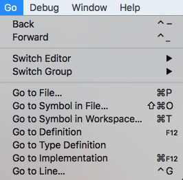
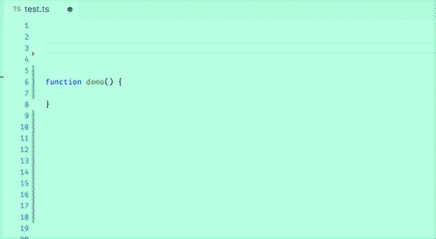
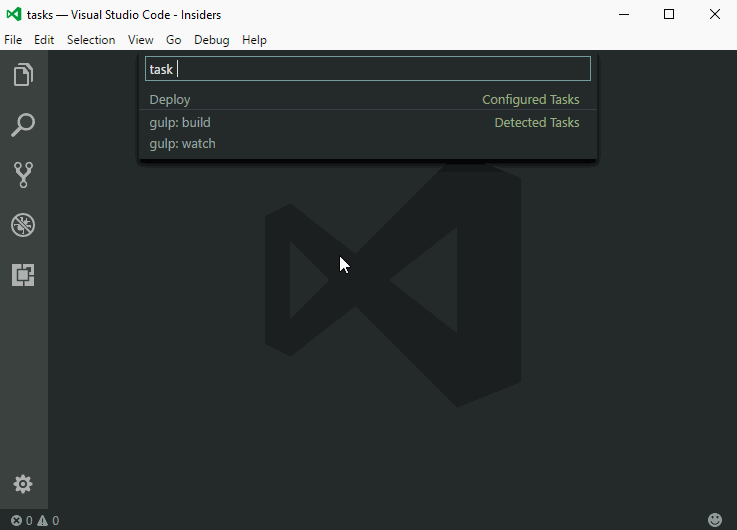
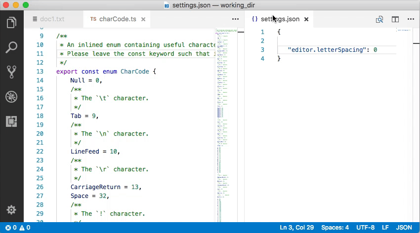
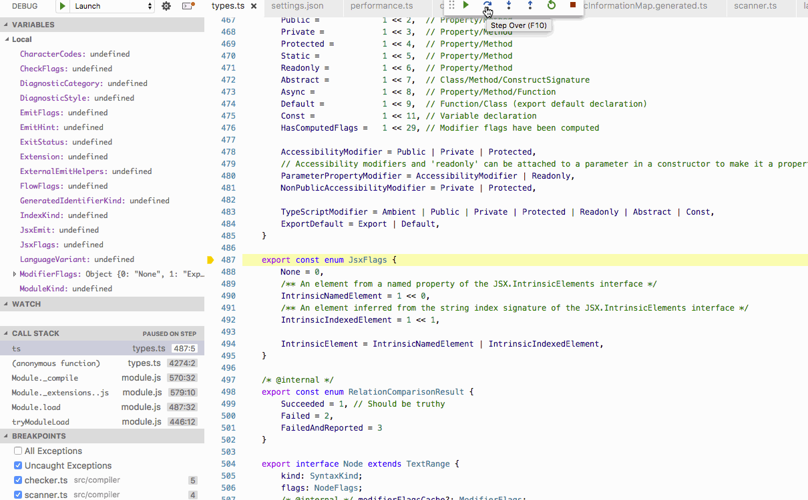
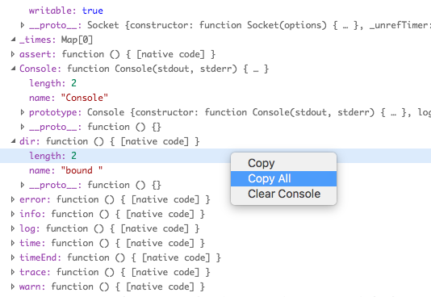

---
Order: 22
TOCTitle: May 2017
PageTitle: Visual Studio Code May 2017
MetaDescription: See what is new in the Visual Studio Code May 2017 Release (1.13)
MetaSocialImage: 1_13_release-highlights.png
---
# May 2017 (version 1.13)

## Insiders Release

Welcome to the Insiders build. These are the preliminary notes for the May 1.13 release of Visual Studio Code. As we get closer to the release date, you'll see details below about new features and important fixes.

Until the May release notes are available, you can still track our progress:

* **[May Iteration Plan](https://github.com/Microsoft/vscode/issues/26068)** - See what's planned for the milestone.
* **[Commit Log](https://github.com/Microsoft/vscode/commits/master)** - GitHub commits to the vscode open source repository.
* **[Closed bugs](https://github.com/Microsoft/vscode/issues?q=is%3Aissue+label%3Abug+milestone%3A%22May+2017%22+is%3Aclosed)** - Resolved bugs in the April milestone.
* **[Closed feature requests](https://github.com/Microsoft/vscode/issues?q=is%3Aissue+milestone%3A%22May+2017%22+is%3Aclosed+label%3Afeature-request)** - Implemented feature requests.

We really appreciate people taking a look at our new features as soon as they are ready so check back here often and learn what's new to try out.

If you find issues or have suggestions, you can enter them in the VS Code repository on [GitHub](https://github.com/Microsoft/vscode/issues).

## Workbench

### Multi Root Workspaces

During this milestone we made some significant steps towards supporting multi root workspaces in VS Code. In case you wonder why it takes us a little bit longer to tackle this feature request, please read [Daniels excellent explanation](https://github.com/Microsoft/vscode/issues/396#issuecomment-301842430).

We focused on UX and sketched up how we could provide this feature with our current architecture without introducing too many new concepts. After sharing the designs with the engineering team, we ran 2 user studies to validate our assumptions. We encourage you to watch the recordings of these studies if you are interested in this topic and to provide feedback if you have any:

* group 1: [https://youtu.be/48Y6tB3DN1g](https://youtu.be/48Y6tB3DN1g)
* group 2: [https://youtu.be/kHL6Rt-dLm0](https://youtu.be/kHL6Rt-dLm0)

With the UX work behind us we feel that we can finally start implementing this feature request. Thanks for your patience!

### Theming

We received a lot of feedback for our workbench theming support and are happy to see more and more themes adopting the workbench colors! During this milestone, we added some new colors as well as did some tweaks to existing colors.

New workbench colors introduced:

Key|Description
---|-------
`selection.background`|The background color of text selections in the workbench (for input fields or text areas). Note that this does not apply to selections within the editor and the terminal.
`input.placeholderForeground`|Input box foreground color for placeholder text.
`list.inactiveSelectionForeground`|List/Tree foreground color for the selected item when the list/tree is inactive. An active list/tree has keyboard focus, an inactive does not.
`list.hoverForeground`|List/Tree foreground when hovering over items using the mouse.
`list.focusForeground`|List/Tree foreground color for the focused item when the list/tree is active. An active list/tree has keyboard focus, an inactive does not.
`badge.foreground`|Badge foreground color. Badges are small information labels, for example, search results count.
`badge.background`|Badge background color.
`progressBar.background`|Background color of the progress bar shown for long running operations.
`sideBar.foreground`|Side Bar foreground color. The Side Bar is the container for views like Explorer and Search.
`sideBar.border`|Side Bar border color on the side separating the editor.
`sideBarSectionHeader.foreground`|Side Bar section header foreground color.
`statusBar.border`|Status Bar border color separating the Status Bar and editor. The Status Bar is at the bottom of the window.
`statusBar.debuggingForeground`|Status Bar foreground color when a program is being debugged.
`statusBar.noFolderForeground`|Status Bar foreground color when no folder is opened.
`activityBar.border`|Activity Bar border color with the Side Bar. The Activity Bar is on the far left or right and lets you switch between views of the Side Bar.
`extensionButton.prominentForeground`|Extension view button foreground color (for example **Install** button).
`extensionButton.prominentBackground`|Extension view button background color.
`extensionButton.prominentHoverBackground`|Extension view button background hover color.
`errorForeground`|Overall foreground color for error messages. This color is only used if not overridden by a component.
`tab.unfocusedActiveForeground`|Active tab foreground color in an inactive editor group.
`tab.unfocusedInactiveForeground`|Inactive tab foreground color in an inactive editor group.
`editorGroupHeader.tabsBorder`|Border color of the editor group title header when tabs are enabled. Editor groups are the containers of editors.
`welcomePage.buttonBackground`|Background color for the buttons on the Welcome page.
`welcomePage.buttonHoverBackground`|Hover background color for the buttons on the Welcome page.
`walkThrough.embeddedEditorBackground`|Background color for the embedded editors on the Interactive Playground.
`terminal.background`|The background of the Integrated Terminal's viewport.
`terminal.foreground`|The default foreground color of the Integrated Terminal.

New editor colors introduced:

Key|Description
---|-------
`editorCodeLens.foreground`|Foreground color of an editor CodeLens.
`editorBracketMatch.background`|Background color behind matching brackets.
`editorBracketMatch.border`|Color for matching brackets boxes.
`editorRuler.foreground`|Color of the editor rulers.
`editorOverviewRuler.border`|Color of the overview ruler border.
`editorWidgetBorder`|Border color of the editor widget.
`editorError.foreground`|Foreground color of error squigglies in the editor.
`editorError.border`|Border color of error squigglies in the editor.
`editorWarning.foreground`|Foreground color of warning squigglies in the editor.
`editorWarning.border`|Border color of warning squigglies in the editor.
`peekViewEditorGutter.background`|Background color of the gutter in the peek view editor.
`editorGutter.background`|Background color of the editor gutter. The gutter contains the glyph margins and the line numbers.
`editorGutter.modifiedBackground`|Editor gutter background color for lines that are modified.
`editorGutter.addedBackground`|Editor gutter background color for lines that are added.
`editorGutter.deletedBackground`|Editor gutter background color for lines that are deleted.
`merge.currentHeaderBackground`|Current header background in inline merge conflicts.
`merge.currentContentBackground`|Current content background in inline merge conflicts.
`merge.incomingHeaderBackground`|Incoming header background in inline merge conflicts.
`merge.incomingContentBackground`|Incoming content background in inline merge conflicts.
`merge.border`|Border color on headers and the splitter in inline merge conflicts.
`editorOverviewRuler.currentContentForeground`|Current overview ruler foreground for inline merge conflicts.
`editorOverviewRuler.incomingContentForeground`|Incoming overview ruler foreground for inline merge conflicts.

Existing color behavior changes:

Key|Description
---|-------
`panel.border`|Now overwrites the value of `contrastBorder`, allowing a more specific color if `contrastBorder` is set.
`tab.border`|Now overwrites the value of `contrastBorder`, allowing a more specific color if `contrastBorder` is set.
`editorGroup.border`|Now overwrites the value of `contrastBorder`, allowing a more specific color if `contrastBorder` is set.
`list.*`|All list colors can now be set even in the presence of `contrastBorder` and `contrastActiveBorder`.

### High Contrast theme

We have improved the High Contrast theme to include more token colors and to use selection and Status Bar colors for clearer contrast.


### Preserving view state for resource editors

We are now preserving the view state for resource editors when you switch between them. This comes in handy when debugging internal modules since we now preserve the scroll position and all other view data for internal module editors. However, we always clear the view state when a user closes the editor.

### Disable menu bar mnemonics

A new setting `window.enableMenuBarMnemonics` was added to disable all mnemonics (hot keys) in the menu bar (on Windows and Linux). This frees up some `kbstyle(Alt+)` keyboard shortcuts to bind to other commands.

### Install Additional SCM Providers

We have introduced a new command **Install Additional SCM Providers...** to make it easier to discover and install SCM providers from the VS Code Marketplace. The command is available under the **Switch SCM Provider...** command in the Source Control view and **SCM: Switch SCM Provider** in the **Command Palette**.


### Filenames in symbol search results

You can use workspace symbol search (`kb(workbench.action.showAllSymbols)`) to quickly find symbols in your workspace. The list of results now includes the filename of each symbol:


### Go to Implementation and Go to Type Definition added to the Go Menu

The **Go** menu now includes the **Go to Implementation** and **Go to Type Definition** commands:



## Editor

### Multicursor Snippets

You can finally combine snippets and multiple cursors. On top you also now nest snippets, that is fill-in a placeholder of a snippet with another snippet and their placeholders will be merged.



### Strict Snippets

Snippets can have placeholders and variables. The snippet-syntax is defined [here](https://code.visualstudio.com/docs/editor/userdefinedsnippets#_snippet-syntax) but in short `$1, $2...` are tabstops and `$varName1, $varName2...` are variables. Note that they can only differ by what follows the `$`-sign, numbers are tabstops and words refer to variables. Prior to this milestone VS Code was using an internal syntax for snippets. Textmate-style snippets were rewritten to the internal syntax with an unfortunate bug that caused variables to be turned into tabstops. This is what we have done to ensure a smooth transition:
* When we encounter snippets that use variables we don't [know](https://code.visualstudio.com/docs/editor/userdefinedsnippets#_variables) we turn them into placeholders and warn extension authors (not users)
* Also, we log a telemetry event so can make issues/PRs against extensions using this unfortunate construct.

For the future, expect us to support these snippets for a little longer. Snippets fall into two categories, those that users created and those an extension contributes. Expect us to be a little more strict on the latter whereas we likely keep support for the former.

## Tasks

### Using the terminal with Task version 0.1.0

You can now use tasks with the terminal as the execution engine. To do so add the `runner` property to the main section of the tasks.json file.
```ts
{
	"version": "0.1.0",
	"runner": "terminal",
	...
}
```

If you want to switch back to the old runner remove the property or set its value to `"process"`.

### Task version 2.0.0

### Opting into Task version 2.0.0

You can opt into task version 2.0.0 by changing the version number of the tasks.json file to `"2.0.0"`. If you don't have a tasks.json and are fully relying on task auto detection you can simply create a tasks.json file with the following mininmal content:
```json
{
	"version": "2.0.0"
}
```

### Jake task autodetection

Jake autodetection has been implemented for the `2.0.0` version of tasks. In contrast to the `0.1.0` version of tasks the new auto dections handles all task runners in parallel. So if a workspace has a Gulp and a Jake file both task runners are detected and their tasks are listed in when executing the `Run Task` command.

### Task selection dialog

The task selection dialog now separates workspace task from tasks defined in the tasks.json file. Assume a workspace with a gulp file defining a `build` and a `watch` task and a Deplpy task defined in the task.json file. The the task selection dialog looks like this:


### Configuring a Detected Task

When the system detects a task (for example a build task provided through a gulp file) it usually doesn't know which problem matchers to associate with the task. You can customize detected task inside the tasks.json file. To do so press the gear icon to the right of an detected task. This will insert a section into the tasks.json that lets you customize the detected task.



The screen cast above shows how to customize the gulp build task by adding the TypeScript problem matcher (named `$tsc`) to it and by renaming it to `My Main Build`. Executing the task `My Main Build` still executed the `build` task provided by gulp and auto detected by VS Code.

### Task API

We further enhanced and polished the task API. We kept it still in the proposed state (see [vscode.proposed.d.ts](https://github.com/Microsoft/vscode/blob/master/src/vs/vscode.proposed.d.ts#L13)) to allow for another round of feedback from the community.

### Adding multiple cursors with Cmd + Click (OSX) or Ctrl + Click (Windows and Linux)

We have introduced a new setting, `editor.multiCursorModifier`, which can be set to `ctrlCmd` or `alt` to change the modifier key for adding multiple cursors. There's also a new menu item in the Selection menu to aid with toggling this setting.

The Go To Definition and Open Link gestures will also respect this setting, and adapt such that they do not conflict. e.g. When the setting is `ctrlCmd`, multiple cursors can be added with Ctrl/Cmd + Click, and opening links or going to definition can be invoked with Alt + Click.

With fixing [Issue #2106](https://github.com/Microsoft/vscode/issues/2106), it is now possible to also remove a cursor by using the same gesture on top of an existing selection.

### Letter spacing

Thanks to [@hoovercj](https://github.com/hoovercj) in [PR #22979](https://github.com/Microsoft/vscode/pull/22979), there is a new editor setting, `editor.letterSpacing`:



## Debugging

### Improved stepping performance

Per a [user recommendation](https://github.com/Microsoft/vscode/issues/25605), after a debug step, we first retrieve the top stack frame and then asynchronously retrieve the rest of the stack frames and the variables. The impact of this is improved stepping performance. For comparison, here are videos showing the old and new stepping performance while debugging the large [Typescript repository](https://github.com/Microsoft/TypeScript).

Full stack when stepping:


Top stack frame with stepping:



### Copy All action in Debug Console

It is now possible to copy all the content from the Debug Console using a context menu action **Copy All**. More details about what motivated this change can be found [here](https://github.com/Microsoft/vscode/issues/2163).



### File Link Detection in Exception Peek UI
When an exception occurs in a code, it is a common scenario to follow through an exception stack trace to understand what led to it. We added mechanism to detect links in a stack trace returned by debug adapter. This allows you to jump to your code straight from the exception UI now. Moreover, it also improved existing link detection in a debug console, fixing some of the user submitted bugs.


### debug.internalConsoleOptions

It is now possible to control the behavior of the Debug Console using the setting `"debug.internalConsoleOptions"`. Previously this setting was only available in `launch.json`, however by [user request](https://github.com/Microsoft/vscode/issues/18398) it is now possible to also specify this in user and workspace settings. The setting in `launch.json` takes precedence if both are provided.

## Languages

### Syntax coloring for JSX/TSX components

In React JSX and TSX files, component classes are now colored differently than normal HTML elements:


### Additional JSDoc tags in hover and suggestions

JSDoc tags such as `@deprecated` and `@private` are now displayed in hover and suggestions documentation.


### Open TS Server Log reveals log folder

The **TypeScript: Open TS Server Log** command now reveals the TypeScript log directory on your operating system instead of trying to open the log file in VS Code. This is useful for collecting the additional typings installer log files generated alongside the main `tsserver.log` file.

### Markdown preview preserves scroll position

The Markdown preview, along with other webview based views such as the release notes, will now preserve the scroll position when switching between editors. Previously, navigating away from the Markdown Preview and then returning to it caused the scroll position to be reset.

### Warnings for missing Markdown preview styles

We now display a warning message if any of the stylesheets from `markdown.styles` used in the preview cannot be found.

### Markdown symbol search includes heading levels

You can quickly jump to a heading in a Markdown file using **Go to Symbol in File...** (`kb(workbench.action.gotoSymbol)`). This list now includes the heading level of each symbol, which allows you to quickly filter results by heading level.


## Extension Authoring

### Custom views

There has been a popular request to customize VS Code to show custom data views, for example a `Node Dependencies` view. With this release, you can now write extensions to VS Code contributing such views. Currently custom views are shown only in Explorer. In future, we will support displaying them in other places too.


Contributing a view is as simple as follows:

* Contribute a view using the [views](/docs/extensionAPI/extension-points.md#contributesviews) extension point.
* Register a provider using the [TreeDataProvider](/docs/extensionAPI/vscode-api.md#TreeDataProvider) API.
* Contribute actions to view using `view/title` and `view/item/context` locations in [menus](/docs/extensionAPI/extension-points.md#contributesmenus) extension point.

You can refer to examples in our [Samples repository](https://github.com/Microsoft/vscode-extension-samples/tree/master/tree-view-sample).

## Miscellaneous

### New Crash Report Handling

We have improved the VS Code crash reporting. VS Code uses Electron's built in crash reporter to capture and analyze crash data to make VS Code and Electron itself better. If Code crashes, a dump is collected and sent to us, [you can always turn this off](https://code.visualstudio.com/docs/supporting/faq#_how-to-disable-crash-reporting).

This worked well, but it was a time consuming task for us to analyze and understand a crash. Microsoft has a good crash reporting service called HockeyApp and we now have enabled HockeyApp for crash reporting. To enable it we had to produce our own build of Electron because the built in crash reporter is sending data in a format HockeyApp does not understand. The changes are on top of Electron 1.6.6 in how the crash reporter talks to the HockeyApp service.

If you build Code from source, you will continue to pull in the GitHub version of Electron. We will continue collaborating with the other Electron contributors to make the crash reporting service pluggable, so that anyone can easily use HockeyApp (or any other service).

## New Commands

Key|Command|Command id
---|-------|----------
`kb(list.focusFirstChild)`|Select first child of currently selected item's parent in tree/lists|`list.focusFirstChild`
`kb(list.focusLastChild)`|Select last child of currently selected item's parent in tree/lists|`list.focusLastChild`
`kb(merge-conflict.next)`|Next Merge Conflict|`merge-conflict.next`
`kb(merge-conflict.previous)`|Previous Merge Conflict|`merge-conflict.previous`
`kb(merge-conflict.accept.selection)`|Accept Selection|`merge-conflict.accept.selection`
`kb(merge-conflict.accept.current)`|Accept Current|`merge-conflict.accept.current`
`kb(merge-conflict.accept.incoming)`|Accept Incoming|`merge-conflict.accept.incoming`
`kb(merge-conflict.accept.both)`|Accept Both|`merge-conflict.accept.both`
`kb(merge-conflict.accept.all-both)`|Accept All Both|`merge-conflict.accept.all-both`
`kb(merge-conflict.accept.all-current)`|Accept All Current|`merge-conflict.accept.all-current`
`kb(merge-conflict.accept.all-incoming)`|Accept All Incoming|`merge-conflict.accept.all-incoming`
`kb(merge-conflict.compare)`|Compare|`merge-conflict.compare`

## Accessibility

### Better NVDA Support

Sometimes, when using arrow keys, some lines or characters would be repeated by NVDA (see [Issue #26730](https://github.com/Microsoft/vscode/issues/26730)). Thanks to [James Teh](https://github.com/jcsteh), one of the co-founders of NV Access, we now understand the root cause (a timeout of 30ms, which we sometimes miss). James has a [PR on NVDA](https://github.com/nvaccess/nvda/pull/7201) where he is changing the default timeout to 100ms and making it configurable. Until a new NVDA version is shipped, thanks to [Derek Riemer](https://github.com/derekriemer), there is an [NVDA plugin](https://files.derekriemer.com/globalEditorTimer-1.0.nvda-addon) that increases the timeout from 30ms to 200ms. We have also done some changes on our side to reduce the likelihood that we miss the 30ms timeout:

### "Screen Reader Detected"

We are now leveraging [Electron APIs](https://github.com/electron/electron/blob/master/docs/api/app.md#event-accessibility-support-changed-macos-windows) to react and optimize VS Code when working with a Screen Reader. Whenever Electron identifies that a Screen Reader is attached, we will display a message in the status bar and:
* remove the Line Number and Column indicator from the status bar, as we have found updating these indicators causes a myriad of accessibility events that end up confusing screen readers.
* disable word wrapping, as when pressing arrow down for example, screen readers expect for the cursor to move to the next line and not to a column to the right on the same line.
* mirror the current page of text in the editor synchronously to the `<textarea>` we use for input events.
* disable certain stylistic features to increase the likelihood that we make it within the 30ms accessibility event timeout.

> Detecting Screen Readers is a non-trivial enterprise, so, if you notice the "Screen Reader Detected" status bar message and do not have a screen reader attached, you can change the setting `editor.accessibilitySupport` from `"auto"` to `"off"`.

## Extensions

### Glob patterns for `workspaceContains` activation event

Thanks to [@eamodio](https://github.com/eamodio), with [PR #24570](https://github.com/Microsoft/vscode/pull/24570), it is now possible to activate an extension when a folder is opened that contains at least one file that matches a glob pattern.

For example, an extension with the `package.json`:

```json
{
  ...
  "activationEvents": [
    "workspaceContains:**/.editorconfig"
  ]
}
```

will be activated when a folder is opened and any of its sub-folders contains a file named `.editorconfig`.

### Defining a language's word pattern in the language configuration file

Thanks to [@hoovercj](https://github.com/hoovercj), with [PR #22478](https://github.com/Microsoft/vscode/pull/22478), it is possible to specify a language's word pattern using `wordPattern` in the language configuration file. This used to be possible before only by invoking `vscode.languages.setLanguageConfiguration(...)`.

### Better control decorations in the editor

Thanks to [@CoenraadS](https://github.com/CoenraadS), with [PR #25776](https://github.com/Microsoft/vscode/pull/25776), it is now possible to configure the behavior of decorations when typing/editing at their edges. This can be configured with the `DecorationRenderOptions.rangeBehaviour` field.

## Notable Changes

* [25789](https://github.com/Microsoft/vscode/issues/25789): Can't split file when dragging from Explorer
* [19644](https://github.com/Microsoft/vscode/issues/19644): Cursor does not go to the maximum line column when pressing "End" twice with word wrap enabled
* [6661](https://github.com/Microsoft/vscode/issues/6661): Ctrl+D/Cmd+D merges adjacent selections.
* [4271](https://github.com/Microsoft/vscode/issues/4271): Mac Insert Emoji Duplicates Text
* [3623](https://github.com/Microsoft/vscode/issues/3623): Match whole word does not work for not latin characters (at least for cyrillic)

## Thank You

Last but certainly not least, a big *__Thank You!__* to the following folks that helped to make VS Code even better:

Contributions to `vscode`:

* [João Portela (@jportela)](https://github.com/jportela): Preventing duplicate tab close when doing a middle click [PR #25697](https://github.com/Microsoft/vscode/pull/25697)
* [Dan Balasescu (@smoogipooo)](https://github.com/smoogipooo): Expose status bar debugging and no-folder foreground colors [PR #27052](https://github.com/Microsoft/vscode/pull/27052)

Contributions to `language-server-protocol`:

* [Keith (@ktec)](https://github.com/ktec): Update protocol-1-x.md [PR #244](https://github.com/Microsoft/language-server-protocol/pull/244)
* [Rainer Klute (@RainerKlute)](https://github.com/RainerKlute)
  * Various minor editorial changes [PR #242](https://github.com/Microsoft/language-server-protocol/pull/242)
  * Typo fixed [PR #239](https://github.com/Microsoft/language-server-protocol/pull/239)
* [Chen (@CXuesong)](https://github.com/CXuesong): Fix typo in summary of `interface Registration`. [PR #231](https://github.com/Microsoft/language-server-protocol/pull/231)
* [Miro Spönemann (@spoenemann)](https://github.com/spoenemann): Fixed typo in WorkspaceClientCapabilities [PR #225](https://github.com/Microsoft/language-server-protocol/pull/225)

Contributions to `vscode-languageserver-node`:

* [Vincenzo Chianese (@XVincentX)](https://github.com/XVincentX): Detect and copy npm-shirkwrap file if present [PR #193](https://github.com/Microsoft/vscode-languageserver-node/pull/193)

<!-- In-product release notes styles.  Do not modify without also modifying regex in gulpfile.common.js -->
<a id="scroll-to-top" role="button" aria-label="scroll to top" href="#"><span class="icon"></span></a>
<link rel="stylesheet" type="text/css" href="css/inproduct_releasenotes.css"/>
