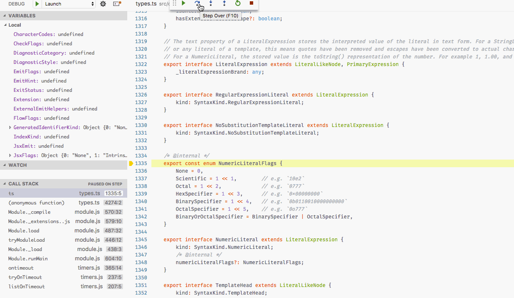
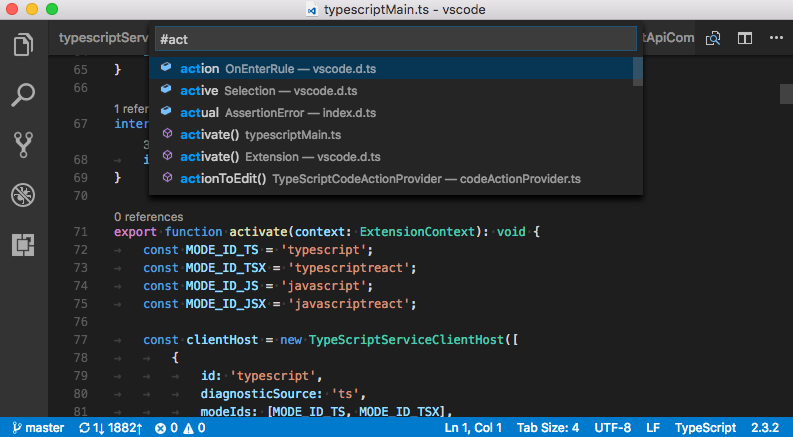
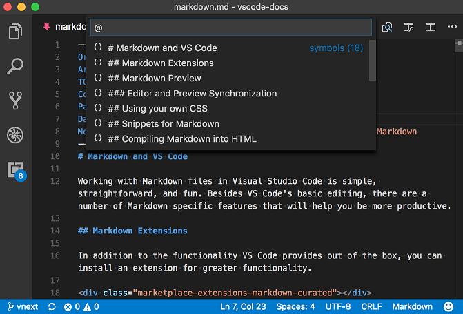

---
Order: 22
TOCTitle: May 2017
PageTitle: Visual Studio Code May 2017
MetaDescription: See what is new in the Visual Studio Code May 2017 Release (1.13)
MetaSocialImage: 1_13_release-highlights.png
---
# May 2017 (version 1.13)

## Insiders Release

Welcome to the Insiders build. These are the preliminary notes for the May 1.13 release of Visual Studio Code. As we get closer to the release date, you'll see details below about new features and important fixes.

Until the May release notes are available, you can still track our progress:

* **[May Iteration Plan](https://github.com/Microsoft/vscode/issues/26068)** - See what's planned for the milestone.
* **[Commit Log](https://github.com/Microsoft/vscode/commits/master)** - GitHub commits to the vscode open source repository.
* **[Closed bugs](https://github.com/Microsoft/vscode/issues?q=is%3Aissue+label%3Abug+milestone%3A%22May+2017%22+is%3Aclosed)** - Resolved bugs in the April milestone.
* **[Closed feature requests](https://github.com/Microsoft/vscode/issues?q=is%3Aissue+milestone%3A%22May+2017%22+is%3Aclosed+label%3Afeature-request)** - Implemented feature requests.

We really appreciate people taking a look at our new features as soon as they are ready so check back here often and learn what's new to try out.

If you find issues or have suggestions, you can enter them in the VS Code repository on [GitHub](https://github.com/Microsoft/vscode/issues).

## Workbench

### Theming

We received a lot of feedback for our workbench theming support and are happy to see more and more themes adopting the workbench colors! During this milestone, we added some new colors as well as did some tweaks to existing colors.

New workbench colors introduced:

Key|Description
---|-------
`selection.background`|The background color of text selections in the workbench (for input fields or text areas). Note that this does not apply to selections within the editor and the terminal.
`input.placeholderForeground`|Input box foreground color for placeholder text.
`list.inactiveSelectionForeground`|List/Tree foreground color for the selected item when the list/tree is inactive. An active list/tree has keyboard focus, an inactive does not.
`list.hoverForeground`|List/Tree foreground when hovering over items using the mouse.
`list.focusForeground`|List/Tree foreground color for the focused item when the list/tree is active. An active list/tree has keyboard focus, an inactive does not.
`badge.foreground`|Badge foreground color. Badges are small information labels, for example, search results count.
`badge.background`|Badge background color.
`progressBar.background`|Background color of the progress bar shown for long running operations.
`sideBar.foreground`|Side Bar foreground color. The Side Bar is the container for views like Explorer and Search.
`sideBar.border`|Side Bar border color on the side separating the editor.
`sideBarSectionHeader.foreground`|Side Bar section header foreground color.
`statusBar.border`|Status Bar border color separating the Status Bar and editor. The Status Bar is at the bottom of the window.
`statusBar.debuggingForeground`|Status Bar foreground color when a program is being debugged.
`statusBar.noFolderForeground`|Status Bar foreground color when no folder is opened.
`activityBar.border`|Activity Bar border color with the Side Bar. The Activity Bar is on the far left or right and lets you switch between views of the Side Bar.
`extensionButton.prominentForeground`|Extension view button foreground color (for example **Install** button).
`extensionButton.prominentBackground`|Extension view button background color.
`extensionButton.prominentHoverBackground`|Extension view button background hover color.
`errorForeground`|Overall foreground color for error messages. This color is only used if not overridden by a component.

New editor colors introduced:

Key|Description
---|-------
`editorCodeLens.foreground`|Foreground color of an editor CodeLens.
`editorBracketMatch.background`|Background color behind matching brackets.
`editorBracketMatch.border`|Color for matching brackets boxes.
`editorRuler.foreground`|Color of the editor rulers.
`editorOverviewRuler.border`|Color of the overview ruler border.
`editorWidgetBorder`|Border color of the editor widget.
`editorError.foreground`|Foreground color of error squigglies in the editor.
`editorError.border`|Border color of error squigglies in the editor.
`editorWarning.foreground`|Foreground color of warning squigglies in the editor.
`editorWarning.border`|Border color of warning squigglies in the editor.
`peekViewEditorGutter.background`|Background color of the gutter in the peek view editor.
`editorGutter.background`|Background color of the editor gutter. The gutter contains the glyph margins and the line numbers.
`editorGutter.modifiedBackground`|Editor gutter background color for lines that are modified.
`editorGutter.addedBackground`|Editor gutter background color for lines that are added.
`editorGutter.deletedBackground`|Editor gutter background color for lines that are deleted.
`editorGroupHeader.tabsBorder`|Border color of the editor group title header when tabs are enabled. Editor groups are the containers of editors.

Existing color behavior changes:

Key|Description
---|-------
`panel.border`|Now overwrites the value of `contrastBorder`, allowing a more specific color if `contrastBorder` is set.
`tab.border`|Now overwrites the value of `contrastBorder`, allowing a more specific color if `contrastBorder` is set.
`editorGroup.border`|Now overwrites the value of `contrastBorder`, allowing a more specific color if `contrastBorder` is set.
`list.*`|All list colors can now be set even in the presence of `contrastBorder` and `contrastActiveBorder`.

### High Contrast theme

We have improved the High Contrast theme to include more token colors and to use selection and Status Bar colors for clearer contrast.

### Preserving view state for resource editors

We are now preserving the view state for resource editors when you switch between them. This comes in handy when debugging internal modules since we now preserve the scroll position and all other view data for internal module editors. However, we always clear the view state when a user closes the editor.

### Disable menu bar mnemonics

A new setting `window.enableMenuBarMnemonics` was added to disable all mnemonics (hot keys) in the menu bar (on Windows and Linux). This frees up some `kbstyle(Alt+)` keyboard shortcuts to bind to other commands.

### Install Additional SCM Providers

We have introduced a new command **Install Additional SCM Providers...** to make it easier to discover and install SCM providers from the VS Code Marketplace.

## Debugging

### Improved stepping performance

Per a [user recommendation](https://github.com/Microsoft/vscode/issues/25605), after a debug step, we first retrieve the top stack frame and then asynchronously retrieve the rest of the stack frames and the variables. The impact of this is improved stepping performance. For comparison, here are videos showing the old and new stepping performance while debugging the large [Typescript repository](https://github.com/Microsoft/TypeScript).

Full stack when stepping:

Top stack frame with stepping:

### Copy All action in Debug Console

It is now possible to copy all the content from the Debug Console using a context menu action **Copy All**. More details about what motivated this change can be found [here](https://github.com/Microsoft/vscode/issues/2163).

### Default position of the Debug toolbar

To help with the [issue](https://github.com/Microsoft/vscode/issues/2513) of the Debug toolbar covering editor tabs, we changed the default position of the Debug toolbar from center to the utmost right. Double clicking on the drag handle will also move the Debug toolbar all the way to the right.

### debug.internalConsoleOptions

It is now possible to control the behavior of the Debug Console using the setting `"debug.internalConsoleOptions"`. Previously this setting was only available in `launch.json`, however by [user request](https://github.com/Microsoft/vscode/issues/18398) it is now possible to also specify this in user and workspace settings. The setting in `launch.json` takes precedence if both are provided.

## Languages

### Syntax coloring for JSX/TSX components

In React JSX and TSX files, component classes are now colored differently than normal HTML elements:

### TypeScript symbol search includes filename

You can use workspace symbol search (`kb(workbench.action.showAllSymbols)`) to quickly find symbols in JavaScript and TypeScript projects. The list of results now includes the filename of each symbol:

### Open TS Server Log reveals log folder

The **TypeScript: Open TS Server Log** command now reveals the TypeScript log directory on your operating system instead of trying to open the log file in VS Code. This is useful for collecting the additional typings installer log files generated alongside the main `tsserver.log` file.

### Markdown symbol search includes heading levels

You can quickly jump to a heading in a Markdown file using **Go to Symbol in File...** (`kb(workbench.action.gotoSymbol)`). This list now includes the heading level of each symbol, which allows you to quickly filter results by heading level.

## New Commands

Key|Command|Command id
---|-------|----------
`kb(list.focusFirstChild)`|Select first child of currently selected item's parent in tree/lists|`list.focusFirstChild`
`kb(list.focusLastChild)`|Select last child of currently selected item's parent in tree/lists|`list.focusLastChild`

## Notable Changes

* [25789](https://github.com/Microsoft/vscode/issues/25789): Can't split file when dragging from Explorer

## Thank You

Last but certainly not least, a big *__Thank You!__* to the following folks that helped to make VS Code even better:

Contributions to `vscode`:

* [João Portela (@jportela)](https://github.com/jportela): Preventing duplicate tab close when doing a middle click [PR #25697](https://github.com/Microsoft/vscode/pull/25697)
* [Dan Balasescu (@smoogipooo)](https://github.com/smoogipooo): Expose status bar debugging and no-folder foreground colors [PR #27052](https://github.com/Microsoft/vscode/pull/27052)

Contributions to `language-server-protocol`:

* [Keith (@ktec)](https://github.com/ktec): Update protocol-1-x.md [PR #244](https://github.com/Microsoft/language-server-protocol/pull/244)
* [Rainer Klute (@RainerKlute)](https://github.com/RainerKlute)
  * Various minor editorial changes [PR #242](https://github.com/Microsoft/language-server-protocol/pull/242)
  * Typo fixed [PR #239](https://github.com/Microsoft/language-server-protocol/pull/239)
* [Chen (@CXuesong)](https://github.com/CXuesong): Fix typo in summary of `interface Registration`. [PR #231](https://github.com/Microsoft/language-server-protocol/pull/231)
* [Miro Spönemann (@spoenemann)](https://github.com/spoenemann): Fixed typo in WorkspaceClientCapabilities [PR #225](https://github.com/Microsoft/language-server-protocol/pull/225)

Contributions to `vscode-languageserver-node`:

* [Vincenzo Chianese (@XVincentX)](https://github.com/XVincentX): Detect and copy npm-shirkwrap file if present [PR #193](https://github.com/Microsoft/vscode-languageserver-node/pull/193)

<!-- In-product release notes styles.  Do not modify without also modifying regex in gulpfile.common.js -->
<a id="scroll-to-top" role="button" aria-label="scroll to top" href="#"></a>
<link rel="stylesheet" type="text/css" href="css/inproduct_releasenotes.css"/>
