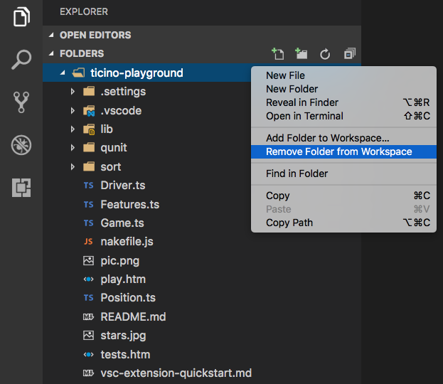
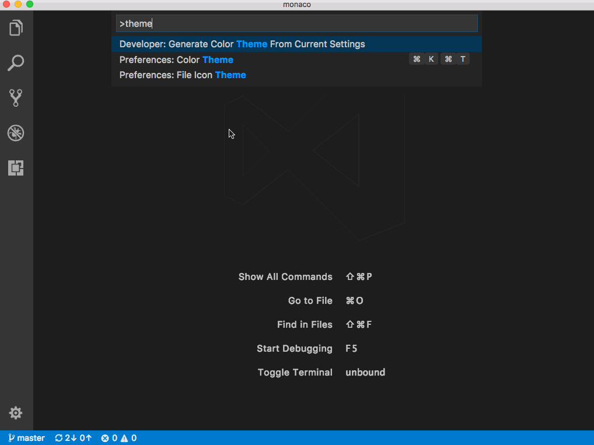
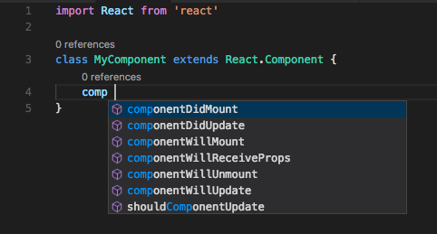
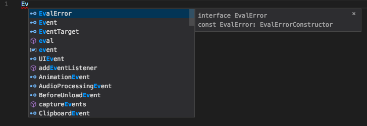

---
Order: 23
TOCTitle: June 2017
PageTitle: Visual Studio Code June 2017
MetaDescription: See what is new in the Visual Studio Code June 2017 Release (1.14)
MetaSocialImage: 1_14_release-highlights.png
---
# June 2017 (version 1.14)

## Insiders Release

Welcome to the Insiders build. These are the preliminary notes for the June 1.14 release of Visual Studio Code. As we get closer to the release date, you'll see details below about new features and important fixes.

Until the June release notes are available, you can still track our progress:

* **[June Iteration Plan](https://github.com/Microsoft/vscode/issues/28387)** - See what's planned for the milestone.
* **[Commit Log](https://github.com/Microsoft/vscode/commits/master)** - GitHub commits to the vscode open source repository.
* **[Closed bugs](https://github.com/Microsoft/vscode/issues?q=is%3Aissue+label%3Abug+milestone%3A%22June+2017%22+is%3Aclosed)** - Resolved bugs in the June milestone.
* **[Closed feature requests](https://github.com/Microsoft/vscode/issues?q=is%3Aissue+milestone%3A%22June+2017%22+is%3Aclosed+label%3Afeature-request)** - Implemented feature requests.

We really appreciate people taking a look at our new features as soon as they are ready so check back here often and learn what's new to try out.

If you find issues or have suggestions, you can enter them in the VS Code repository on [GitHub](https://github.com/Microsoft/vscode/issues).

## Changes for Extension Authors

Due to security concerns, we don't want to render user provided SVG images within VS Code. We added constraints for extensions to make it safer for users when they browse the extension Marketplace within VS Code:

- The icon provided in `package.json` may not be an SVG.
- The badges provided in the `package.json` may not be SVGs unless they are from trusted badge providers.
- Image URLs in `README.md` and `CHANGELOG.md` need to resolve to `https` URLs.
- Images in `README.md` and `CHANGELOG.md` may not be SVGs unless they are from trusted badge providers.
- Images in `README.md` and `CHANGELOG.md` may not use data URIs.

Below are the URL prefixes which identify trusted badge providers:

- `https://api.travis-ci.org/`
- `https://badge.fury.io/`
- `https://badges.frapsoft.com/`
- `https://badges.gitter.im/`
- `https://badges.greenkeeper.io/`
- `https://cdn.travis-ci.org/`
- `https://ci.appveyor.com/`
- `https://codeclimate.com/`
- `https://codecov.io/`
- `https://coveralls.io/`
- `https://david-dm.org/`
- `https://gemnasium.com/`
- `https://img.shields.io/`
- `https://isitmaintained.com/`
- `https://marketplace.visualstudio.com/`
- `https://snyk.io/`
- `https://travis-ci.com/`
- `https://travis-ci.org/`
- `https://vsmarketplacebadge.apphb.com/`
- `https://www.bithound.io/`

To help you adopt these constraints, VS Code shows linting errors in your extension's `package.json`, `README.md`, and `CHANGELOG.md` files if they are not yet compliant. Also, the `vsce` publishing tool performs compliance checks and prevents you from uploading a new version of your extensions if there are problems.

## Preview: Multi-Root Workspaces

We have been busy this milestone on the development of "[Multi-Root Workspaces](https://github.com/Microsoft/vscode/issues/396)" in VS Code (refer to our [previous release notes](https://code.visualstudio.com/updates/v1_13#_multiroot-workspaces) for the design decisions we made last sprint). The outcome of this work is what we call a "Minimum Viable Product" (MVP) to enable self-hosting on multiple root folder workspaces. The features outlined below are currently only available from our [Insiders](https://code.visualstudio.com/insiders) build and not Stable. We will need another iteration before making this feature available for all users. To try it out, grab our Insiders build from [https://code.visualstudio.com/insiders](https://code.visualstudio.com/insiders).

### File Explorer

The File Explorer can now show multiple root folders in one tree. You can easily add root folders from the **File** menu or context menu:


Once a root folder is added, the Explorer will show the new folder as root in the files tree. You can right click on any of the root folders to add more root folders or to remove it.



The File Explorer should work and behave as before. You can move files between root folders and use any of the typical file operation actions provided in the context menu and the Explorer view. Settings like `files.exclude` are supported for each root folder if configured and across all folders if configured as global user setting. 

### Search

Full text search and the **Quick Open** file picker take the additional root folders into account. When searching, results from all of the root folders will show up in the search results view:


To distinguish results with the same file name across root folders, the name of the root folder is used as prefix to the relative path in the results list. Settings like `search.exclude` are supported for each root folder if configured and across all folders if configured as global user setting. 


### Settings

With multiple root folders in one workspace, it is possible to have a `.vscode` folder in each root folder defining the settings that should apply for that folder.

A subset of settings is supported in this environment, specifically:

* `editor.*`
* `files.exclude`
* `files.trimTrailingWhitespace`
* `files.insertFinalNewLine`
* `files.encoding`
* `files.autoGuessEncoding`
* `files.watcherExclude`
* `search.exclude`

Other settings are currently not supported on a per-folder basis. We will add more settings in the future at the folder level but some settings will not be supported (for example workbench settings).

### Proposed multi-root API

Having multiple folders open in the editor requires a more powerful API. From the single root days, there is the `rootPath` API and for compatibility that will remain. We have a new and more powerful API in the pipeline. The current *proposed* API is shown below and enables you to inspect all workspace folders and sends an event when those change.

```ts
export namespace workspace {
    /**
    * List of workspace folders or `undefined` when no folder is open. The *first*
    * element in the array is equal to the [`rootPath`](#workspace.rootPath)
    */
    export let workspaceFolders: Uri[] | undefined  
    /**
     * An event that is emitted when a workspace folder is added or removed.
     */
    export const onDidChangeWorkspaceFolders: Event<WorkspaceFoldersChangeEvent>;
}
export interface WorkspaceFoldersChangeEvent {
    readonly addedFolders: Uri[];
    readonly removedFolders: Uri[];
}
```

**Note:** The API is still proposed and you will need to enable it per extension. In the `package.json` file of your extension, add the following line:

```json
"enableProposedApi": true
```

Also, copy the [`vscode.proposed.d.ts`](https://github.com/Microsoft/vscode/blob/master/src/vs/vscode.proposed.d.ts) file from our repository to your project. Including this file in your project enables type-checking and IntelliSense. 

As the API is in the proposed state, it is still being refined and breaking changes are likely to happen. For that reason, we don't support publishing extensions that use proposed APIs. However we do want extension writers, the final customers of the extension API, to help us define how the final API should look and what it should support. Don't be shy with feedback!

### Upcoming features

There is still a lot of work ahead of us to make the multi-root experience great.

These areas will get special attention in the next sprint:

* Source Control UI for multiple root folders
* Task and Debug support
* Rich languages support across root folders

## Workbench

### Command Palette improvements

We improved the **Command Palette** dropdown (`kb(workbench.action.showCommands)`) to make it more useful.

One popular request was to always restore the last typed input when reopening the **Command Palette**. Enable this behavior with the new setting `workbench.commandPalette.preserveInput`.

We also added a most recently used (MRU) list of commands that is persisted between restarts. The most recent commands executed will always show to the top. A new setting `workbench.commandPalette.history` allows you to control the number of entries to show (set it to 0 to disable this feature). With the MRU enabled, you do not need to enable `workbench.commandPalette.preserveInput` because the history will always have the last executed command selected by default when you open the **Command Palette**.



A new command **Clear Commands History** was added to quickly dismiss all the entries from the commands history.

Finally, keyboard shortcuts in the dropdown are presented in the same visual form as in the **Keyboard Shortcuts** editor.

### Restore empty windows

In VS Code, you can work with windows that have folders opened as well as empty windows. An empty window is not opened to a specific folder but can show files from disk. Up to now, we would never restore the UI state of empty windows and you would lose your carefully selected layout of opened files (even on a window reload already).

With this release, we will restore the UI state for empty windows in the same way we do it for windows with opened folders.


A new setting `window.restoreWindows` configures this behavior. The possible values are:

* `none` - to never restore any windows
* `one` - to restore the last active window (default)
* `folders` - to only restore opened folders
* `all` - to restore all windows.

With the new setting `window.restoreWindows`, we deprecated the previous setting `window.reopenFolders` and ask you to switch to the new setting. We still support the old setting for a couple of releases.

### Close unmodified files

A new command was introduced to close unmodified editors of the currently active editor group. This makes it easy to quickly dismiss tabs of editors that are not dirty. The action can be triggered not only via a keybinding (`kb(workbench.action.closeUnmodifiedEditors)`) but also from the context menu of tabs as well as the **OPEN EDITORS** view in the Explorer.


Thanks to [Soney Mathew (@soneymathew)](https://github.com/soneymathew) for providing the pull request for this feature!

### Switch window improvements

In a previous release, we added a quick picker for switching between the opened windows (via the `workbench.action.switchWindow` command). In this release, we did some tweaks to make the experience better.


You will now see icons for the currently active file or folder in the window, provided that you have enabled one of the File Icon themes.

In addition, a new command `workbench.action.quickSwitchWindow` was added to quickly switch between opened windows. Press and hold the modifier key to cycle through the list of windows and release all keys to open it.

As an example, to use this feature with the `Ctrl+R` keyboard shortcut, configure the following rule in the keybindings editor:

```json
{
    "key": "ctrl+r",
    "command": "workbench.action.quickSwitchWindow"
},
{
    "key": "ctrl+r",
    "command": "workbench.action.quickOpenNavigateNext",
    "when": "inWindowsPicker"
}
```

Press `Ctrl+R` and leave the `Ctrl` key pressed. As long as you now press the `R` key, you can navigate through the list of windows. Release all keys to focus it.


### New keybindings context per quick picker

Related to the improvements around the window picker, it is now easier and better to configure a picker with quick-pick functionality. Each time a picker opens, a specific keybinding context becomes active that you can use to assign keybindings to. For example, the window picker enables a context key `inWindowsPicker` when opened. Not only does it make quick navigate in pickers more powerful, it also fixes some annoying bugs. You can now bring up any quick picker, even if the quick picker is already showing (for example, opening the **Quick Open** file picker while the **Command Palette** is already open).

The following example demonstrates how to configure quick navigate keybindings to switch between the most recently opened folders:

As an example, to use this feature with the `Ctr+J` keyboard shortcut, configure the following rule in the keybindings editor:

```json
{
    "key": "ctrl+j",
    "command": "workbench.action.quickOpenRecent"
},
{
    "key": "ctrl+j",
    "command": "workbench.action.quickOpenNavigateNext",
    "when": "inRecentFilesPicker"
}
```

Press `Ctrl+J` and leave the `Ctrl` key pressed. As long as you now press the `J` key, you can navigate through the list of recently opened folders and files. Release all keys to open it.

## Debugging

### Recipes for nonstandard debugging scenarios

Setting up Node.js debugging can be challenging for some non-standard or complex scenarios. In May, we've started to collect recipes for these scenarios in a [recipe repository](https://github.com/weinand/vscode-recipes).

This release adds a new recipe by [Tony Sneed (@tonysneed)](https://github.com/tonysneed) for [Chrome Debugging with Angular CLI](https://github.com/weinand/vscode-recipes/blob/master/Angular-CLI).

### Debug UI improvements
**Debug hover has scroll bar for long values**

Thanks to [pull request](https://github.com/Microsoft/vscode/pull/23211) by a user now the debug hover can nicely display long string values using a scroll bar.

## Languages

### TypeScript 2.4

VS Code now ships with [TypeScript 2.4.1](https://blogs.msdn.microsoft.com/typescript/2017/06/27/announcing-typescript-2-4/). This release includes a number of new language features, bug fixes, and editor improvements. Some highlights include:

**Dynamic Import Expressions**

Support for the new ECMAScript `import` expression for lazily loading modules:

```ts
async function getZipFile(name: string, files: File[]): Promise<File> {
    const zipUtil = await import('./utils/create-zip-file');
    const zipContents = await zipUtil.getContentAsBlob(files);
    return new File(zipContents, name);
}
```

**Parent method suggestions in subclasses**

IntelliSense now displays interface and parent methods class methods in subclasses:



This is helpful for overriding parent methods or implementing interfaces.

**More relevant suggestions in JavaScript files**

In VS Code 1.13, suggestions in JavaScript files include suggestions for types:


This meant that many suggestions that are generally not useful in JavaScript were shown, such as `EvalErrorConstructor` or `EventInit`.

VS Code 1.14 better filters JavaScript suggestions to only include those you typically care about while working in plain old JavaScript:



### Easier Building of TypeScript using Tasks 2.0

Using Tasks 2.0, you can now build TypeScript projects using `kb(workbench.action.tasks.build)` without having to configuring `tasks.json`


TypeScript will pick up all `tsconfig.json` projects in your workspace for building.


### Formatting option for spaces after TypeScript type assertions

The new `typescript.format.insertSpaceAfterTypeAssertion` setting allows you to control the placement of spaces after a type assertion in TypeScript.

```ts
// Default formatting
<Foo>{ ... }

// With "typescript.format.insertSpaceAfterTypeAssertion":true
<Foo> { ... }
```

### Preview of refactoring support for JavaScript and TypeScript

VS Code 1.14 includes initial support for refactoring JavaScript and TypeScript. The first supported refactoring converts a JavaScript ES5-style function class to an ES6 class:


We plan to add additional refactorings in the future.

## Accessibility

**Lists and quick pick leverage aria-setsize and aria-posinset**

Lists such as the suggestion widget, exception list and the quick pick now set `aria-setsize` and `aria-posinset`. These lists are virtualized and as such without these aria properties the screen reader could not make a correct statement on the number of entries.


**Improved high contrast theme debugging**

We have reacted on user feedback and improved some color contrasts in debugging for High Contrast theme.

## Extension Authoring

### Debugger extensions

**New capability `supportsDelayedStackTraceLoading`**

In the May release, we improved stepping performance by fetching parts of the call stack and the corresponding variables lazily. Later we learned that not all debug extensions were prepared to return the stack in chunks which could result in a [duplicated top stack frame](https://github.com/Microsoft/vscode/issues/28808). We couldn't find a way to fix this problem in a robust way, so we decided that debug adapters should opt-in to the delayed loading of stack frames explicitly and a new capability `supportsDelayedStackTraceLoading` was introduced in the debug protocol. So if the lazy loading of stack frames was working fine in your debug extension and if you know that your debug adapter already supports both the `startFrame` and the `levels` attribute of the `stackTrace` request, you should return `true` for the `supportsDelayedStackTraceLoading` capability. This ensures that you'll continue to see the improved stepping performance in the June release.

## New Commands

Key|Command|Command id
---|-------|----------
`kb(workbench.action.closeUnmodifiedEditors)`|Close unmodified editors of the currently active editor group|`workbench.action.closeUnmodifiedEditors`
`kb(workbench.action.quickSwitchWindow)`|Quickly switch between opened windows|`workbench.action.quickSwitchWindow`
`kb(workbench.action.quickOpenRecent)`|Quickly switch between recently opened folders and files|`workbench.action.quickOpenRecent`

## Thank You

Last but certainly not least, a big *__Thank You!__* to the following folks that helped to make VS Code even better:

Contributions to `vscode-languageserver-node`:

* [Sven Efftinge (@svenefftinge)](https://github.com/svenefftinge): Only convert `undefined` argument to null [PR #216](https://github.com/Microsoft/vscode-languageserver-node/pull/216)
* [Remy Suen (@rcjsuen)](https://github.com/rcjsuen): Fix typo in README.md [PR #219](https://github.com/Microsoft/vscode-languageserver-node/pull/219)

Contributions to `vscode-recipes`:

* [Tony Sneed (@tonysneed)](https://github.com/tonysneed): Add recipe for Chrome Debugging with Angular CLI [PR #2](https://github.com/weinand/vscode-recipes/pull/2)

<!-- In-product release notes styles.  Do not modify without also modifying regex in gulpfile.common.js -->
<a id="scroll-to-top" role="button" aria-label="scroll to top" href="#"><span class="icon"></span></a>
<link rel="stylesheet" type="text/css" href="css/inproduct_releasenotes.css"/>
